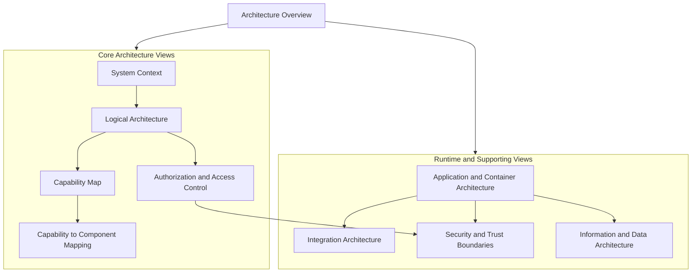

# EnterpriseGlue OSS Architecture Overview

## Purpose
This index provides the recommended reading order for the EnterpriseGlue OSS architecture document set in `local-docs/architecture`.

## Recommended Reading Order

| Order | Document | Purpose |
| --- | --- | --- |
| 1 | `01-oss-system-context.md` | Understand the product boundary, actors, and external systems |
| 2 | `02-oss-logical-architecture.md` | Understand the main logical components and responsibilities |
| 3 | `03-oss-capability-map.md` | Understand the product capability domains |
| 4 | `04-oss-capability-to-logical-component-mapping.md` | Connect capabilities to logical ownership |
| 5 | `09-oss-authorization-access-control-model.md` | Understand platform admin, project, engine, and tenant authorization boundaries |
| 6 | `05-oss-application-container-architecture.md` | Understand runtime/application deployment structure |
| 7 | `06-oss-integration-architecture.md` | Understand external integration boundaries |
| 8 | `07-oss-security-and-trust-boundaries.md` | Understand trust boundaries, protection layers, and sensitive flows |
| 9 | `08-oss-information-data-architecture.md` | Understand key information domains and persistence boundaries |

## Document Relationship Diagram

## Suggested Review Paths

### Domain Architect Path
- `01-oss-system-context.md`
- `02-oss-logical-architecture.md`
- `03-oss-capability-map.md`
- `04-oss-capability-to-logical-component-mapping.md`
- `09-oss-authorization-access-control-model.md`

### Security / Governance Review Path
- `01-oss-system-context.md`
- `09-oss-authorization-access-control-model.md`
- `07-oss-security-and-trust-boundaries.md`
- `06-oss-integration-architecture.md`

### Platform / Runtime Review Path
- `05-oss-application-container-architecture.md`
- `06-oss-integration-architecture.md`
- `08-oss-information-data-architecture.md`
- `07-oss-security-and-trust-boundaries.md`

## Core Architectural Themes
- **Host-based composition**
  - Thin frontend and backend shells delegate into host packages.

- **Modular domain capabilities**
  - Starbase, Mission Control, Engines, Git/Versioning, and Platform Admin form the main functional domains.

- **Shared platform foundation**
  - Shared config, persistence, services, schemas, and middleware live in `packages/shared`.

- **Permission-aware operational platform**
  - Authorization is expressed through platform roles, project roles, engine roles, and explicit grants.

- **Extension-ready OSS core**
  - OSS exposes extension points for enterprise composition without embedding EE-specific behavior into OSS domain modules.
