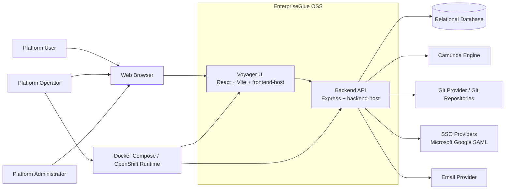

# OSS System Context Architecture

## Purpose
This document defines the **system context** for the EnterpriseGlue OSS project. It shows the platform boundary, its primary user groups, and the main external systems that interact with it.

## Scope
This view is intentionally external-facing. It does not describe internal module decomposition in detail. That is covered in the logical architecture document.

## System Context Diagram

## Primary Actors
- **Platform User**
  - Uses the web application for project work, workflow visibility, and operational tasks.

- **Platform Administrator**
  - Manages platform-level settings, user administration, authorization policies, and provider configuration.

- **Platform Operator**
  - Deploys, configures, upgrades, and runs the OSS platform in Docker-first or Kubernetes/OpenShift environments.

## System of Interest
EnterpriseGlue OSS is a self-hostable platform that combines:
- project and file management
- workflow and decision operations visibility
- engine connectivity and management
- Git-backed collaboration and versioning
- platform administration and security controls

## External Systems
- **Relational Database**
  - Primary persistence store.
  - The platform is designed for multiple database backends, with Postgres as the default and adapters for Oracle, MSSQL, MySQL, and Spanner.

- **Camunda Engine**
  - External workflow/decision engine used by Mission Control for process, task, decision, batch, and migration operations.

- **Git Provider / Git Repositories**
  - Used for repository connectivity, synchronization, and versioning-related operations.

- **SSO Providers**
  - External identity providers for Microsoft, Google, and SAML-based login flows.

- **Email Provider**
  - Used for operational email workflows such as password reset, verification, and platform-managed email delivery.

- **Optional External PII Detection / Redaction Provider**
  - Used when platform-managed PII redaction is configured to call an external provider for analysis or anonymization support.
  - Supported provider types in OSS include Presidio, Google Cloud DLP, AWS Comprehend, and Azure AI Language PII.

- **Docker Compose / OpenShift Runtime**
  - Primary operational environment for self-hosted deployment.

## Architectural Observations
- **Browser-based interaction model**
  - Users interact with the platform through the Voyager UI in the browser.

- **Backend-mediated integration model**
  - External systems are primarily integrated through the backend API, not directly from the browser.

- **Self-hosted operational model**
  - The OSS platform is designed to be run by customer or project operators rather than as a managed SaaS-only service.

- **Runtime separation**
  - The frontend and backend are separate runtime units, while remaining a cohesive product at the system boundary.

## Codebase Anchors
- `frontend/src/main.tsx`
- `packages/frontend-host/src/main.tsx`
- `backend/src/server.ts`
- `packages/backend-host/src/server.ts`
- `README.md`

## Related Documents
- `00-architecture-overview.md`
- `02-oss-logical-architecture.md`
- `05-oss-application-container-architecture.md`
- `06-oss-integration-architecture.md`
