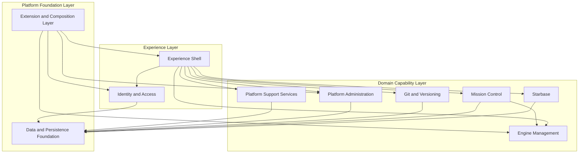

# OSS Logical Architecture

## Purpose
This document defines the **logical architecture** of the EnterpriseGlue OSS project. It focuses on the main logical components, their responsibilities, and their collaboration patterns.

## Logical Architecture Principles
- **Host-based composition**
  - The thin `frontend` and `backend` applications delegate into `@enterpriseglue/frontend-host` and `@enterpriseglue/backend-host`.

- **Feature modularity**
  - Major user-facing capabilities are grouped into feature modules such as Starbase, Mission Control, Engines, and Platform Admin.

- **Shared platform foundation**
  - Cross-cutting capabilities such as configuration, persistence, middleware, services, and contracts live in `packages/shared`.

- **Extension-ready OSS core**
  - The OSS core defines extension points so enterprise capabilities can be composed without embedding EE-specific code in OSS modules.

## Logical Architecture Diagram

## Logical Components

### 1. Experience Shell
The Experience Shell is the user-facing composition layer of the product.

**Responsibilities**
- application startup
- route definition
- layout and navigation
- protected-route composition
- feature-flag-aware UI composition
- tenant-aware navigation structure

**Codebase anchors**
- `packages/frontend-host/src/main.tsx`
- `packages/frontend-host/src/routes/index.tsx`
- `frontend/src/main.tsx`

### 2. Identity and Access
This component governs authentication, session lifecycle, role/capability checks, and external login flows.

**Responsibilities**
- login, logout, refresh, and `me` flows
- password reset and verification
- Microsoft, Google, and SAML SSO entry points
- capability-driven route protection
- platform admin and tenant-aware access decisions

**Codebase anchors**
- `packages/backend-host/src/modules/auth/`
- `packages/shared/src/middleware/auth.ts`
- `packages/shared/src/middleware/platformAuth.ts`
- `packages/frontend-host/src/contexts/AuthContext`

### 3. Starbase
Starbase is the project and artifact management domain.

**Responsibilities**
- project management
- file and folder management
- versioning-oriented project artifacts
- comments and collaboration support
- deployments and membership management

**Codebase anchors**
- `packages/backend-host/src/modules/starbase/`
- `packages/frontend-host/src/features/starbase/`

### 4. Mission Control
Mission Control is the workflow and decision operations domain.

**Responsibilities**
- process definition visibility
- process instance inspection
- task, external task, message, and job operations
- decision visibility
- batches and migrations
- operational metrics and historical detail

**Codebase anchors**
- `packages/backend-host/src/modules/mission-control/`
- `packages/frontend-host/src/features/mission-control/`

### 5. Engine Management
Engine Management handles engine connectivity, deployment targets, and engine-scoped operations.

**Responsibilities**
- engine registration and connectivity
- engine deployment endpoints
- engine configuration and management
- engine access and operational boundaries

**Codebase anchors**
- `packages/backend-host/src/modules/engines/`
- `packages/frontend-host/src/features/mission-control/engines/`

### 6. Git and Versioning
This component manages source-control connectivity and Git-backed operational flows.

**Responsibilities**
- Git OAuth callback handling
- credentials and provider setup
- clone, sync, and create-online flows
- repository-backed versioning support

**Codebase anchors**
- `packages/backend-host/src/modules/git/`
- `packages/backend-host/src/modules/versioning/`
- `packages/frontend-host/src/features/git/`
- `packages/shared/src/services/git/`

### 7. Platform Administration
Platform Administration governs platform-level configuration and control-plane features.

**Responsibilities**
- platform settings
- setup status
- SSO provider management
- authorization policy management
- audit-facing admin functions
- email configuration and templates
- PII redaction settings, scopes, and optional external provider configuration

**Codebase anchors**
- `packages/backend-host/src/modules/platform-admin/`
- `packages/backend-host/src/modules/admin/`
- `packages/frontend-host/src/features/platform-admin/`

### 8. Platform Support Services
This component groups operational support capabilities that are not a primary business domain but are essential to the product.

**Responsibilities**
- dashboard and context statistics
- notifications
- audit support
- shared operational utilities
- batch pollers and supporting background behavior
- operational payload redaction for configured scopes such as process details, history, errors, logs, and audit

**Codebase anchors**
- `packages/backend-host/src/modules/dashboard/`
- `packages/backend-host/src/modules/notifications/`
- `packages/backend-host/src/modules/audit/`
- `packages/backend-host/src/poller/`
- `packages/shared/src/services/`
- `packages/shared/src/services/pii/`

### 9. Data and Persistence Foundation
This foundation provides the validated runtime configuration, persistence model, DB abstraction, and schema lifecycle.

**Responsibilities**
- environment/config validation
- DB bootstrap and migration execution
- multi-database adapter model
- contracts, schemas, and persistence utilities
- shared middleware and platform services

**Codebase anchors**
- `packages/shared/src/config/`
- `packages/shared/src/db/`
- `packages/shared/src/schemas/`
- `packages/shared/src/services/`
- `packages/shared/src/contracts/`

### 10. Extension and Composition Layer
This layer makes the OSS host extensible while preserving a clean boundary between OSS and enterprise-specific implementations.

**Responsibilities**
- dynamic plugin loading
- route and nav extension points
- component overrides
- feature overrides
- plugin-safe composition contracts

**Codebase anchors**
- `packages/frontend-host/src/enterprise/`
- `packages/backend-host/src/enterprise/`
- `packages/enterprise-plugin-api/`

## Key Collaboration Patterns
- **UI-to-domain orchestration**
  - The Experience Shell routes users into Starbase, Mission Control, Engines, and Platform Admin flows.

- **Backend-mediated external integration**
  - External integrations are mediated by backend modules and shared services rather than directly by the frontend.

- **Shared foundation reuse**
  - All major logical components rely on the shared foundation for config, persistence, middleware, and service contracts.

- **Extension-safe composition**
  - The extension layer augments the shell and selected domains without changing the core OSS logical decomposition.

## Architectural Boundaries
- **Experience Shell is not the business domain**
  - It coordinates access to capabilities but does not own Starbase, Mission Control, or Git semantics.

- **Mission Control and Engine Management are distinct**
  - Mission Control consumes engine connectivity and engine scope, but engine governance is its own logical component.

- **Shared foundation is not a user-facing capability**
  - It supports runtime integrity and portability rather than representing a standalone product capability.
