# OSS Capability Map

## Purpose
This document defines the primary **capability map** for the EnterpriseGlue OSS project. It describes what the product does from a platform capability perspective rather than from a code/package perspective.

## Capability Map Diagram

```mermaid
flowchart TD
  Root[EnterpriseGlue OSS]

  Root --> UserGov[User and Governance Capability Groups]
  Root --> OpsDelivery[Operations and Delivery Capability Groups]
  Root --> Foundation[Platform Foundation]

  subgraph UserGov[User and Governance Capability Groups]
    direction TB
    Access[Access and Security]
    Projects[Project and Artifact Management]
    Repo[Repository and Version Control Integration]
    Governance[Platform Governance]
  end

  subgraph OpsDelivery[Operations and Delivery Capability Groups]
    direction TB
    WorkflowOps[Workflow and Decision Operations]
    EngineConn[Engine Connectivity and Management]
    Support[Operational Support]
  end

  subgraph AccessBreakdown[Access and Security]
    direction TB
    Access1[Authentication and Session Management]
    Access2[SSO Integration]
    Access3[Authorization and Capability Enforcement]
    Access4[User Account Lifecycle]
  end

  subgraph ProjectBreakdown[Project and Artifact Management]
    direction TB
    Projects1[Project Management]
    Projects2[File and Folder Management]
    Projects3[Comments and Collaboration Support]
    Projects4[Project Membership and Deployment Support]
  end

  subgraph WorkflowBreakdown[Workflow and Decision Operations]
    direction TB
    Workflow1[Process Visibility]
    Workflow2[Process Instance Analysis]
    Workflow3[Task and Job Operations]
    Workflow4[Decision Visibility]
    Workflow5[Batch and Migration Operations]
    Workflow6[Operational Metrics and History]
  end

  subgraph EngineBreakdown[Engine Connectivity and Management]
    direction TB
    Engine1[Engine Registration]
    Engine2[Engine Connectivity]
    Engine3[Engine Deployment Targeting]
    Engine4[Engine Access Governance]
  end

  subgraph RepoBreakdown[Repository and Version Control Integration]
    direction TB
    Repo1[Git Provider Connectivity]
    Repo2[Repository Clone Sync and Create]
    Repo3[Versioning Support]
  end

  subgraph GovernanceBreakdown[Platform Governance]
    direction TB
    Gov1[Platform Settings]
    Gov2[SSO Provider Administration]
    Gov3[Authorization Policy Administration]
    Gov4[Email and Setup Administration]
    Gov5[PII Redaction and Provider Configuration]
  end

  subgraph SupportBreakdown[Operational Support]
    direction TB
    Support1[Dashboard and Context Visibility]
    Support2[Notifications]
    Support3[Audit Support]
    Support4[Redacted Operational Data Views]
  end

  subgraph FoundationBreakdown[Platform Foundation]
    direction TB
    Found1[Configuration Validation]
    Found2[Database Portability]
    Found3[Schema and Migration Lifecycle]
    Found4[Extensibility and Composition]
    Found5[Deployment and Runtime Packaging]
  end

  Access --> AccessBreakdown
  Projects --> ProjectBreakdown
  WorkflowOps --> WorkflowBreakdown
  EngineConn --> EngineBreakdown
  Repo --> RepoBreakdown
  Governance --> GovernanceBreakdown
  Support --> SupportBreakdown
  Foundation --> FoundationBreakdown
```

## Capability Domains

### 1. Access and Security
Capabilities that control who can use the platform and what they can do.

**Sub-capabilities**
- authentication and session management
- SSO integration
- authorization and capability enforcement
- user account lifecycle

### 2. Project and Artifact Management
Capabilities that support project-centric work and artifact handling.

**Sub-capabilities**
- project management
- file and folder management
- comments and collaboration support
- project membership and deployment support

### 3. Workflow and Decision Operations
Capabilities that expose process, task, decision, and operational insight through Mission Control.

**Sub-capabilities**
- process visibility
- process instance analysis
- task and job operations
- decision visibility
- batch and migration operations
- operational metrics and history

### 4. Engine Connectivity and Management
Capabilities that manage connections to workflow engines and govern engine-scoped operations.

**Sub-capabilities**
- engine registration
- engine connectivity
- engine deployment targeting
- engine access governance

### 5. Repository and Version Control Integration
Capabilities that connect the platform to Git-based workflows.

**Sub-capabilities**
- Git provider connectivity
- repository clone, sync, and create flows
- versioning support

### 6. Platform Governance
Capabilities for platform-level administration and control.

**Sub-capabilities**
- platform settings
- SSO provider administration
- authorization policy administration
- email and setup administration
- PII redaction settings and external provider configuration

### 7. Operational Support
Capabilities that improve transparency and day-to-day operations.

**Sub-capabilities**
- dashboard and context visibility
- notifications
- audit support
- redacted operational data delivery for process details, history, logs, errors, and audit views

### 8. Platform Foundation
Capabilities that keep the OSS product portable, reliable, and composable.

**Sub-capabilities**
- configuration validation
- database portability
- schema and migration lifecycle
- extensibility and composition
- deployment and runtime packaging

## Architectural Notes
- **Capabilities are not packages**
  - The capability map is intentionally product-centric. It should not be read as a direct package tree.

- **Mission Control is a major capability domain**
  - It is broader than a single page or route set and includes multiple operational sub-capabilities.

- **Platform Foundation is strategic**
  - Although not directly user-facing, it is crucial to the OSS product’s portability and self-hostability.

- **Platform Governance is distinct from Access and Security**
  - Access and Security controls who can act; Platform Governance controls how the platform is configured and administered.
