# OSS Capability to Logical Component Mapping

## Purpose
This document maps the EnterpriseGlue OSS **capability domains** to the **logical components** that primarily or secondarily realize them.

## Mapping Diagram

```mermaid
flowchart TB
  subgraph CapabilityDomains[Capability Domains]
    direction TB
    Access[Access and Security]
    Projects[Project and Artifact Management]
    WorkflowOps[Workflow and Decision Operations]
    EngineConn[Engine Connectivity and Management]
    Repo[Repository and Version Control Integration]
    Governance[Platform Governance]
    Support[Operational Support]
    Foundation[Platform Foundation]
    All[All user-facing capability domains]
  end

  subgraph LogicalComponents[Logical Components]
    direction TB
    Identity[Identity and Access]
    Starbase[Starbase]
    MissionControl[Mission Control]
    Engines[Engine Management]
    GitVersioning[Git and Versioning]
    PlatformAdmin[Platform Administration]
    SupportServices[Platform Support Services]
    Data[Data and Persistence Foundation]
    Extension[Extension and Composition Layer]
    Shell[Experience Shell]
  end

  Access --> Identity
  Projects --> Starbase
  WorkflowOps --> MissionControl
  EngineConn --> Engines
  Repo --> GitVersioning
  Governance --> PlatformAdmin
  Support --> SupportServices
  Foundation --> Data
  Foundation --> Extension
  All --> Shell
```

## Component-Centric Capability View

| Logical Component | Primary Capability Ownership | Supporting Capability Contribution |
| --- | --- | --- |
| Experience Shell | User journey composition, route orchestration, navigation structure | Supports all user-facing domains by exposing capabilities through the UI |
| Identity and Access | Authentication and session management, SSO integration, authorization enforcement, account lifecycle | Supports Platform Governance, Engine Management, and all protected user-facing flows |
| Starbase | Project management, file and folder management, comments, project membership and deployment support | Supports Repository and Version Control Integration |
| Mission Control | Process visibility, process instance analysis, task and job operations, decision visibility, batch and migration operations, operational metrics and history | Depends on Engine Management and Identity and Access |
| Engine Management | Engine registration, engine connectivity, deployment targeting, engine access governance | Supports Mission Control and selected admin flows |
| Git and Versioning | Git provider connectivity, repository clone/sync/create, versioning support | Supports Starbase collaboration and deployment-oriented workflows |
| Platform Administration | Platform settings, SSO provider administration, authorization policy administration, email and setup administration | Supports Access and Security and overall platform governance |
| Platform Support Services | Dashboard/context visibility, notifications, audit support | Supports Platform Governance, Mission Control, and project operations |
| Data and Persistence Foundation | Configuration validation, database portability, schema/migration lifecycle | Supports all logical components |
| Extension and Composition Layer | Extensibility and composition | Supports shell, admin, engines, and enterprise-ready extension points |

## Capability-Domain Mapping View

| Capability Domain | Primary Logical Component | Key Supporting Components |
| --- | --- | --- |
| Access and Security | Identity and Access | Experience Shell, Platform Administration, Data and Persistence Foundation |
| Project and Artifact Management | Starbase | Experience Shell, Git and Versioning, Identity and Access, Data and Persistence Foundation |
| Workflow and Decision Operations | Mission Control | Engine Management, Experience Shell, Identity and Access, Platform Support Services, Data and Persistence Foundation |
| Engine Connectivity and Management | Engine Management | Mission Control, Platform Administration, Identity and Access, Data and Persistence Foundation |
| Repository and Version Control Integration | Git and Versioning | Starbase, Identity and Access, Data and Persistence Foundation |
| Platform Governance | Platform Administration | Identity and Access, Platform Support Services, Experience Shell, Data and Persistence Foundation |
| Operational Support | Platform Support Services | Platform Administration, Mission Control, Starbase, Data and Persistence Foundation |
| Platform Foundation | Data and Persistence Foundation and Extension and Composition Layer | All other logical components consume this foundation |

## Interpretation Guidelines
- **Primary ownership**
  - The component that carries the main business or technical responsibility for realizing the capability.

- **Supporting contribution**
  - Components that enable, expose, secure, or operationalize the capability without being the primary owner.

- **Experience Shell is an enabler**
  - It is intentionally shown as broadly supporting all user-facing capabilities because it presents and coordinates them.

- **Platform Foundation is cross-cutting**
  - It underpins the entire platform and should not be treated as a standalone end-user domain.

## Recommended Use in Architecture Review
Use this document together with:
- `02-oss-logical-architecture.md` to understand the component model
- `03-oss-capability-map.md` to understand the capability model

This document is the bridge between the two views.
