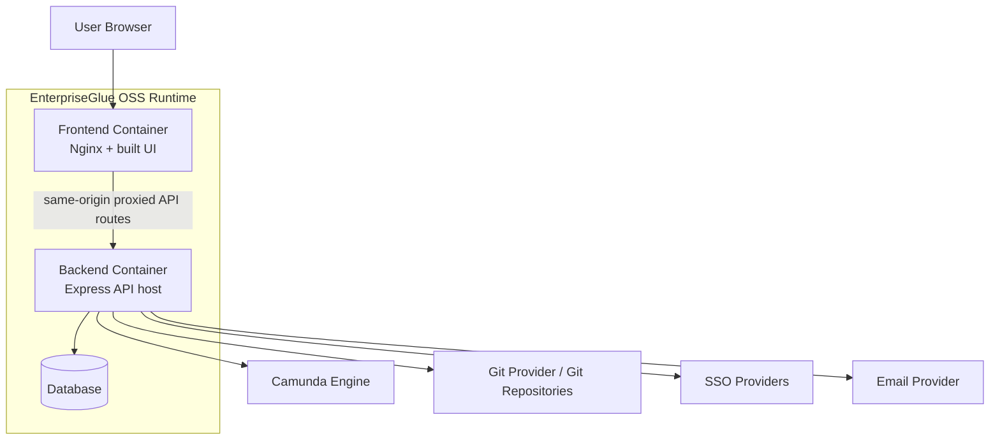

# OSS Application and Container Architecture

## Purpose
This document describes the **application/runtime architecture** of the EnterpriseGlue OSS project, with emphasis on deployable units, runtime responsibilities, and main operational connections.

## Runtime Architecture Diagram


## Main Runtime Units

### Frontend Container
**Responsibilities**
- serves the built SPA
- acts as the web entry point
- uses Nginx for same-origin reverse proxy behavior in production-style deployment
- hosts the user-facing route tree composed by `@enterpriseglue/frontend-host`

**Relevant anchors**
- `frontend/src/main.tsx`
- `packages/frontend-host/src/main.tsx`
- Docker and compose assets under `infra/docker/compose/`

### Backend Container
**Responsibilities**
- starts the Express-based API host
- loads shared config and persistence foundation
- registers domain routes
- integrates with external systems
- runs schema/bootstrap lifecycle and background pollers
- applies configurable PII redaction to selected operational payloads
- may invoke optional external PII providers when platform settings enable them

**Relevant anchors**
- `backend/src/server.ts`
- `packages/backend-host/src/server.ts`
- `packages/backend-host/src/app.ts`
- `packages/backend-host/src/routes/index.ts`

### Database
**Responsibilities**
- stores platform state and domain data
- supports migration/bootstrap lifecycle
- provides main persistence boundary for core platform features

**Supported backend types**
- Postgres
- Oracle
- MSSQL
- MySQL
- Spanner

## Deployment Topology Notes
- **Docker-first design**
  - The repo is structured primarily around Docker-based local and production-like deployment.

- **Same-origin production model**
  - The frontend is served through Nginx and proxies backend routes such as `/api`, `/starbase-api`, and `/mission-control-api`.

- **Source-build and published-image modes**
  - The platform supports both local source-built deployment and deployment from published images.

- **OpenShift support**
  - Runtime assets also exist for OpenShift/Kustomize-based deployment.

## Internal Application Composition
```mermaid
flowchart LR
  ThinFrontend[frontend thin shell] --> FrontendHost[@enterpriseglue/frontend-host]
  ThinBackend[backend thin shell] --> BackendHost[@enterpriseglue/backend-host]
  BackendHost --> Shared[@enterpriseglue/shared]
  FrontendHost --> Extension[frontend extension layer]
  BackendHost --> BackendExtension[backend extension layer]
```

## Operational Characteristics
- **Thin-shell entry points**
  - The repo-level `frontend` and `backend` packages are intentionally thin. Most application behavior lives in host packages.

- **Shared foundation reuse**
  - Backend-host depends heavily on `@enterpriseglue/shared` for configuration, DB lifecycle, services, contracts, and middleware.

- **External integration concentration**
  - Most external connectivity is concentrated in the backend container, keeping the browser-facing layer simpler and more secure.

- **Optional outbound privacy filtering**
  - The backend can call external PII analysis/redaction providers for configured scopes such as process details, history, errors, logs, and audit outputs.

## Codebase Anchors
- `package.json`
- `README.md`
- `infra/docker/compose/`
- `packages/backend-host/src/server.ts`
- `packages/shared/src/config/index.ts`
