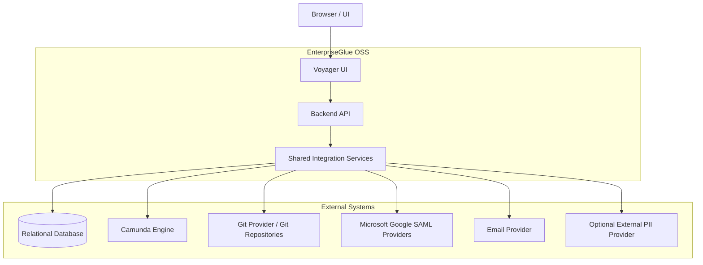

# OSS Integration Architecture

## Purpose
This document describes how EnterpriseGlue OSS integrates with external systems and where those integrations sit architecturally.

## Integration Architecture Diagram

## Integration Model
- **Backend-centric integration**
  - The OSS project primarily integrates with external systems through the backend and shared service layer.

- **UI as orchestrator, not system integrator**
  - The UI initiates flows and presents data but does not own direct system-to-system integration logic for core platform services.

- **Shared services as stabilizing layer**
  - Shared services and contracts provide a reusable boundary between domain modules and external integrations.

## Integration Domains

### 1. Database Integration
**Purpose**
- Persist platform configuration, operational state, project data, and supporting metadata.

**Architectural location**
- `packages/shared/src/db/`
- `packages/shared/src/config/index.ts`

**Notes**
- Multiple database types are supported through adapter and configuration logic.
- Persistence concerns are centralized in the shared foundation rather than duplicated across feature modules.

### 2. Camunda Integration
**Purpose**
- Provide process, task, decision, batch, and migration visibility and operations in Mission Control.

**Architectural location**
- `packages/backend-host/src/modules/mission-control/`
- `packages/shared/src/services/bpmn-engine-client.ts`
- `packages/shared/src/services/camunda/`

**Notes**
- Camunda is an external operational system, not a persistence subsystem of EnterpriseGlue itself.
- Mission Control is the main consumer of this integration.

### 3. Git Integration
**Purpose**
- Support Git provider authentication, repository connectivity, synchronization, and version-aware flows.

**Architectural location**
- `packages/backend-host/src/modules/git/`
- `packages/backend-host/src/modules/versioning/`
- `packages/shared/src/services/git/`

**Notes**
- Git integration supports Starbase and versioning-related capabilities.
- The backend owns provider and repository interaction patterns.

### 4. SSO Integration
**Purpose**
- Support external identity-provider-driven login flows.

**Architectural location**
- `packages/backend-host/src/modules/auth/`
- `packages/shared/src/services/microsoft.ts`
- `packages/shared/src/services/google.ts`
- `packages/shared/src/services/saml.ts`

**Notes**
- SSO integration is part of the Identity and Access logical component.
- Supported patterns include Microsoft, Google, and SAML.

### 5. Email Integration
**Purpose**
- Deliver platform-managed emails such as verification, password reset, and administrative notifications.

**Architectural location**
- `packages/backend-host/src/modules/admin/`
- `packages/shared/src/services/email/`
- `packages/shared/src/services/email-providers.ts`

**Notes**
- Email delivery is governed as a platform concern rather than a standalone business domain.

### 6. PII Detection and Redaction Provider Integration
**Purpose**
- Provide optional external PII detection/anonymization support for backend redaction flows.

**Architectural location**
- `packages/shared/src/services/pii/PiiRedactionService.ts`
- `packages/shared/src/services/pii/providers/regex-provider.ts`
- `packages/shared/src/services/pii/providers/`
- `packages/frontend-host/src/features/platform-admin/components/PiiRedactionSettingsSection.tsx`

**Notes**
- OSS includes built-in regex-based redaction and optional external-provider augmentation.
- Supported external provider types in OSS include Presidio, Google Cloud DLP, AWS Comprehend, and Azure AI Language PII.
- Redaction is applied to configured scopes such as `processDetails`, `history`, `logs`, `errors`, and `audit`.
- External calls are backend-mediated and subject to configured payload-size limits and provider credentials.

## Integration Responsibility Matrix

| External System | Primary Internal Owner | Main Consuming Capability Domain |
| --- | --- | --- |
| Database | Data and Persistence Foundation | All domains |
| Camunda Engine | Mission Control and shared integration services | Workflow and Decision Operations |
| Git Provider / Repositories | Git and Versioning | Repository and Version Control Integration |
| Microsoft / Google / SAML Providers | Identity and Access | Access and Security |
| Email Provider | Platform Administration and shared email services | Platform Governance |
| Optional External PII Provider | Platform Administration and shared PII redaction services | Operational Support and privacy filtering of operational data |

## Boundary Decisions
- **The browser is not the integration boundary for core enterprise systems**
  - It communicates with the backend, which then manages the external integration responsibilities.

- **Feature modules consume integration services rather than embedding raw integration concerns everywhere**
  - This keeps domain modules cleaner and makes external dependencies easier to evolve.

- **Integration ownership should remain explicit**
  - Mission Control owns Camunda-facing business behavior, while the shared services layer provides reusable technical support.
