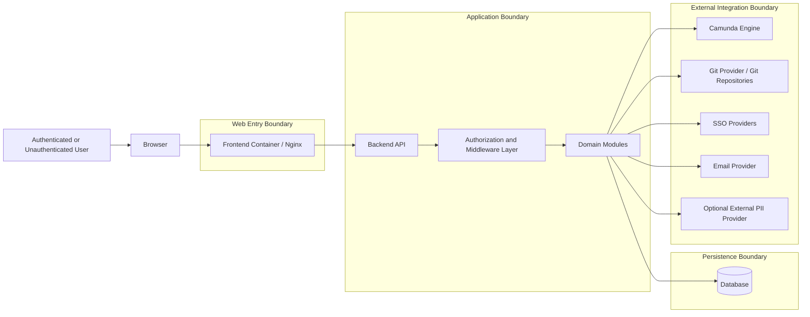
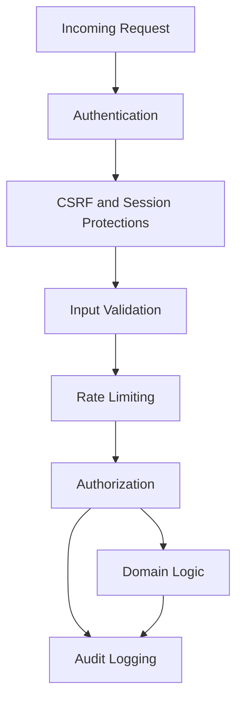

# OSS Security and Trust Boundaries

## Purpose
This document describes the main **security architecture** and **trust boundaries** of the EnterpriseGlue OSS project.

## Trust Boundary Diagram

## Primary Security Boundaries

### 1. Browser to Frontend Boundary
This is the public web entry boundary.

**Security concerns**
- session-bearing browser traffic
- CSRF exposure for cookie-authenticated requests
- route exposure and UI-level capability gating

### 2. Frontend to Backend Boundary
The frontend calls the backend API, typically using same-origin reverse-proxied routes in production-style deployment.

**Security concerns**
- authenticated API calls
- CSRF token handling
- authorization enforcement on the server, not just in UI guards

### 3. Backend Authorization Boundary
This is the most important enforcement boundary.

**Security responsibilities**
- authentication validation
- platform role checks
- project/engine membership checks
- permission-based authorization
- tenant context attachment
- rate limiting and request validation

### 4. Persistence Boundary
The backend alone owns direct persistence access.

**Security concerns**
- sensitive configuration and secrets handling
- user/account state
- audit information
- resource ownership and membership state

### 5. External Integration Boundary
The backend mediates access to external systems.

**Security concerns**
- outbound credentials and tokens
- external provider trust
- isolation of external-system failures from the browser
- privacy-sensitive outbound PII analysis when optional external redaction providers are enabled

## Security Control Layers

## Relevant Implemented Controls
- **Authentication**
  - backend-enforced authentication middleware and user context population

- **CSRF protection**
  - cookie-oriented CSRF protections are applied in the backend app layer

- **Role and permission checks**
  - platform roles, project roles, engine roles, and explicit permission grants are all part of the authorization model

- **PII redaction controls**
  - backend redaction can use built-in regex detection and optional external providers
  - scope-based redaction applies to process details, history, logs, errors, and audit data when enabled

- **Tenant context attachment**
  - OSS attaches a default tenant context for compatibility with unified tenant routing

- **Rate limiting**
  - global API rate limiting is applied on core route prefixes

- **Audit logging**
  - important access decisions and governance operations are logged

## Pipeline and Supply-Chain Security Controls
- **GitHub CodeQL code scanning**
  - The OSS repo runs GitHub CodeQL analysis on pull requests to `main`, pushes to `main`, merge groups, and on a scheduled cadence.
  - The workflow analyzes both GitHub Actions definitions and the JavaScript/TypeScript codebase using `security-extended` queries.

- **Trivy image scanning in PR CI**
  - The CI pipeline builds backend and frontend images from the pull request source and scans both images with Trivy.
  - This acts as a blocking security gate in PR validation with a zero-tolerance posture across reported severities unless findings are explicitly handled via `.trivyignore`.

- **Trivy scanning for published images**
  - After image publication, the pipeline also scans the published backend and frontend image references.
  - This extends the supply-chain check from PR-time images to the released/published image outputs.

- **Nightly Trivy drift scanning**
  - A scheduled nightly workflow scans the latest published images from GHCR for newly disclosed CVEs.
  - This helps detect vulnerability drift after release, when new CVEs are published against already-built images.
  - The nightly workflow can open or update a tracking issue instead of only failing a single CI run.

- **Artifact and summary publication**
  - Security scan artifacts and summaries are published by the workflows so findings can be reviewed and triaged outside the raw runner logs.

- **External complementary scanning**
  - In addition to the repo-native GitHub pipeline controls, external codebase scanning may also be run with Snyk.
  - In the current OSS repo, Snyk is not represented as a built-in GitHub workflow or checked-in CI integration; it should therefore be treated as an external complementary security control rather than a native pipeline step.

## Sensitive Areas
- **Platform administration routes**
  - settings, governance actions, user management, and policy tooling

- **Mission Control mutation routes**
  - process modifications, direct actions, retries, migrations, and operational mutations

- **Git and repository operations**
  - sync/push/pull/connection-related flows

- **SSO and provider configuration**
  - these represent identity trust establishment points

- **Operational payloads that may contain PII**
  - process details, historic data, job/incidents payloads, error content, and audit output may be subject to redaction controls

## OSS-Specific Boundary Notes
- **Single-tenant OSS stub behavior**
  - OSS uses EE-compatible tenant-scoped routing but resolves to a default tenant context in practice.

- **Platform admin is powerful but not a universal route bypass**
  - In permission-based checks, platform admin resolves to allow-all.
  - In some route middleware using explicit project/engine membership checks, platform admin does not automatically bypass resource-role enforcement unless the route itself uses permission/governance flows.

- **Frontend capability checks improve UX, not authority**
  - The frontend uses capabilities to show/hide admin and Mission Control affordances, but backend checks remain authoritative.

## Related Documents
- `06-oss-integration-architecture.md`
- `09-oss-authorization-access-control-model.md`
- `05-oss-application-container-architecture.md`
