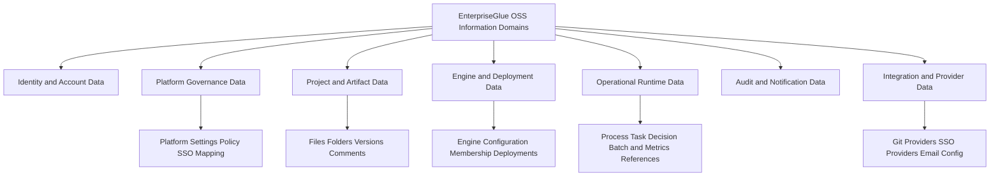
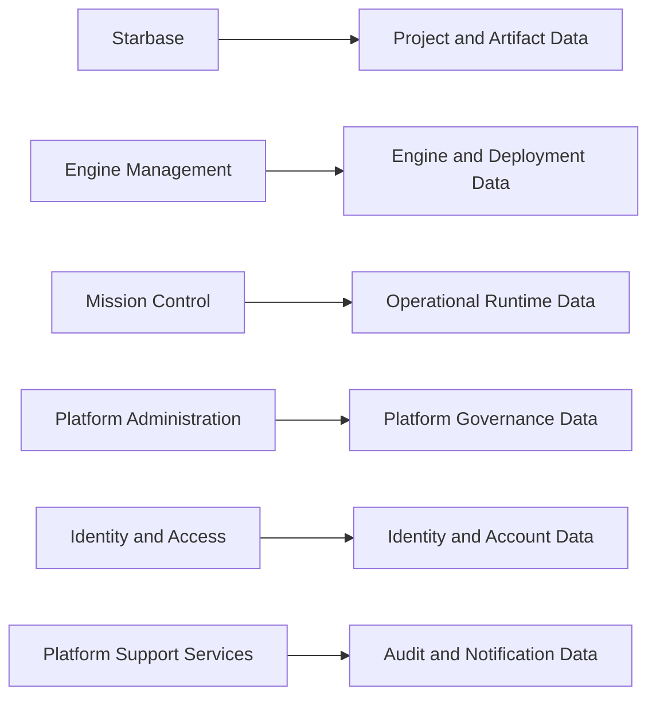

# OSS Information and Data Architecture

## Purpose
This document describes the main **information domains**, **data ownership boundaries**, and **persistence structure** in the EnterpriseGlue OSS project.

## Information Domain Diagram

## Main Information Domains

### 1. Identity and Account Data
**Examples**
- users
- platform roles
- account state
- email verification and password-reset-related state
- capability-bearing user profile data

**Primary owners**
- Identity and Access
- Platform Administration

### 2. Platform Governance Data
**Examples**
- platform settings
- authorization policies
- SSO claims mappings
- environment tags
- setup/governance metadata
- PII redaction settings and scope configuration
- external PII provider configuration metadata

**Primary owners**
- Platform Administration
- Data and Persistence Foundation

### 3. Project and Artifact Data
**Examples**
- projects
- project membership
- files and folders
- versions/checkpoints
- comments
- deployment-related project metadata

**Primary owners**
- Starbase

### 4. Engine and Deployment Data
**Examples**
- engines
- engine ownership and delegate relationships
- engine members
- environment-tag associations
- engine deployment records

**Primary owners**
- Engine Management
- Mission Control for operational consumption

### 5. Operational Runtime Data
**Examples**
- operational references used to connect to external workflow state
- process, instance, decision, task, batch, and migration-related application records
- runtime support metadata

**Primary owners**
- Mission Control

**Important note**
- Not all workflow state is native EnterpriseGlue data. A meaningful portion is retrieved from the external Camunda engine at runtime.
- Operational runtime data can be redacted before delivery when PII filtering is enabled for the relevant scope.

### 6. Audit and Notification Data
**Examples**
- audit log entries
- authorization audit entries
- notifications and operational support records

**Primary owners**
- Platform Support Services
- Platform Administration

### 7. Integration and Provider Data
**Examples**
- Git provider configuration
- Git repository linkage
- SSO provider configuration
- email provider configuration
- external PII provider endpoint/auth/project/region configuration

**Primary owners**
- Git and Versioning
- Platform Administration

## Data Ownership Model

## Persistence Characteristics
- **Database-backed core platform state**
  - Core platform data is stored in the relational database.

- **External runtime augmentation**
  - Mission Control relies on external engine data in addition to locally persisted data.

- **Shared DB abstraction**
  - The data model is mediated through the shared DB layer, adapters, entities, and migration lifecycle.

- **Multi-database portability**
  - The OSS platform is intentionally portable across several supported DB backends.

## Schema and Persistence Notes
- The shared platform foundation is responsible for:
  - config validation
  - schema creation and migration lifecycle
  - data-source setup
  - database-specific adapter behavior

- Enterprise-related schema separation exists as part of the broader design, but OSS core data remains centered on the main application persistence model.

## Data Sensitivity Notes
- **High sensitivity**
  - user identities
  - auth-related state
  - provider configuration
  - security/governance settings

- **Medium sensitivity**
  - project artifacts
  - engine definitions and connectivity metadata
  - deployment metadata

- **Operational sensitivity**
  - audit logs
  - permission/policy audit data
  - integration metadata
  - process/history/error payloads that may contain PII and therefore require redaction controls

## Related Documents
- `05-oss-application-container-architecture.md`
- `06-oss-integration-architecture.md`
- `09-oss-authorization-access-control-model.md`
