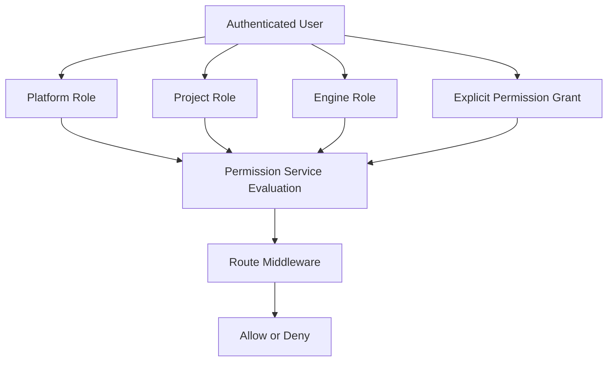
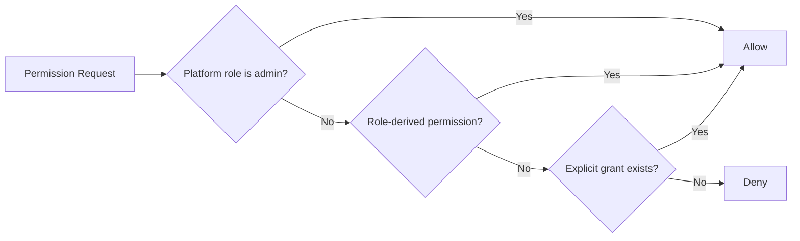
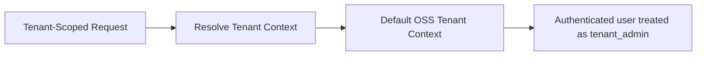
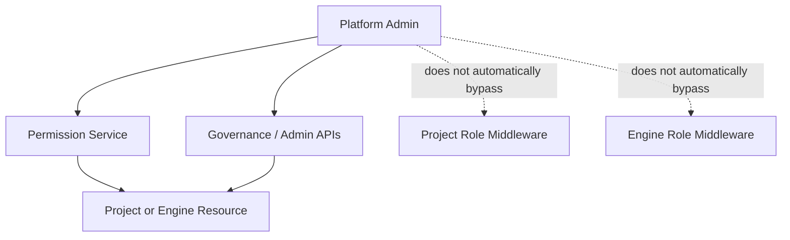

# OSS Authorization and Access Control Model

## Purpose
This document explains the **authorization model** of the EnterpriseGlue OSS project, with specific focus on:
- platform roles
- project roles
- engine roles
- permission evaluation
- platform admin powers and boundaries
- OSS single-tenant behavior

## Authorization Model Overview

## Authorization Building Blocks

### 1. Platform Roles
Defined platform roles are:
- `admin`
- `developer`
- `user`

### 2. Project Roles
Defined project roles are:
- `owner`
- `delegate`
- `developer`
- `editor`
- `viewer`

### 3. Engine Roles
Defined engine roles are:
- `owner`
- `delegate`
- `operator`
- `deployer`

### 4. Explicit Permission Grants
In addition to role-derived permissions, explicit permission grants may be stored and evaluated. These grants are **additive**.

## Permission Resolution Order
The permission service evaluates access in this order:
1. platform admin short-circuit
2. implicit role-derived permissions
3. explicit permission grants

## Platform Role Model

### Platform Admin
Platform admin is the strongest platform-level role.

**Platform admin is allowed to**
- manage users
- view audit logs
- manage platform settings
- manage SSO provider configuration
- manage branding/email/platform settings where governed by `SETTINGS_MANAGE`
- manage PII redaction settings and optional external provider configuration through platform settings
- access governance routes that reassign project/engine ownership and delegates
- manage authorization policies and SSO claims mappings in the authz admin APIs
- evaluate permission checks with allow-all behavior inside the permission service

**Important boundary**
Platform admin is **not** automatically a project owner/delegate or engine owner/delegate everywhere. If a route uses direct project/engine membership middleware rather than permission evaluation, platform admin may still need explicit project/engine role membership or a dedicated governance/admin route.

### Platform Developer
Platform developer has limited implicit platform permissions.

**Observed implicit permission**
- `platform:user:view`

### Platform User
Default least-privileged platform role.

## Project Authorization Model

### Project Role Semantics
- `owner`
  - strongest project role
  - can manage settings, members, files, versions, Git integration, and deploy
  - can delete the project

- `delegate`
  - near-owner project management role
  - can manage settings, members, files, versions, Git integration, and deploy
  - cannot implicitly delete the project

- `developer`
  - active contributor role
  - can create/edit/delete files, create/restore versions, push/pull Git, and deploy

- `editor`
  - content editor role
  - can create/edit/view files and create versions
  - does **not** get deploy by default

- `viewer`
  - read-oriented project role
  - can view files and members

### Project Role Groups in Code
- **Manage roles**
  - `owner`, `delegate`

- **Edit roles**
  - `owner`, `delegate`, `developer`, `editor`

- **Deploy roles**
  - `owner`, `delegate`, `developer`

- **View roles**
  - `owner`, `delegate`, `developer`, `editor`, `viewer`

### Project Membership Nuance
Project membership supports multi-role storage internally, but an effective role is still computed for many checks.

### Project Owner Nuance
If the user is the project `ownerId`, the service grants implicit owner membership even without an explicit membership row.

## Engine Authorization Model

### Engine Role Semantics
- `owner`
  - strongest engine role
  - can edit/delete/activate engine, manage members, deploy, and perform Mission Control mutation actions

- `delegate`
  - near-owner engine management role
  - can edit/activate engine, manage members, deploy, and perform Mission Control mutation actions

- `operator`
  - operational engine role
  - can view engine membership, deploy, start/cancel/modify processes, view/delete/retry instances, and edit variables

- `deployer`
  - narrow deployment-focused role
  - primarily intended for deployment visibility and deployment actions

### Engine Role Groups in Code
- **Engine manage roles**
  - `owner`, `delegate`

- **Mission Control / engine view roles**
  - `owner`, `delegate`, `operator`

- **Engine member roles**
  - `owner`, `delegate`, `operator`, `deployer`

### Engine Ownership Nuance
Engine ownership and delegation are partly modeled directly on the engine record (`ownerId`, `delegateId`) and partly via membership rows.

## What Controls Mission Control Access
Mission Control visibility in the frontend is not based on platform admin alone.

A user gets `canViewMissionControl` when they have at least one engine with a Mission Control viewing role:
- engine owner
- engine delegate
- engine member with role `operator`

This means:
- a platform admin without engine access is **not automatically** a Mission Control user by default
- Mission Control is fundamentally engine-access-driven

## Frontend Capability Model
The frontend consumes derived capabilities such as:
- `canManageUsers`
- `canViewAuditLogs`
- `canManagePlatformSettings`
- `canViewMissionControl`
- `canManageProject`
- `canManageEngine`
- `canInviteProjectMembers`
- `canInviteEngineMembers`

These capabilities improve navigation and UX gating, but backend authorization remains authoritative.

## Important Implementation Nuances
- **Global capabilities are not resource-scoped authority**
  - Capabilities such as `canManageProject` and `canManageEngine` are coarse-grained frontend-facing signals.
  - Actual access to a specific project or engine is still decided by backend project membership, engine membership, permission scope, and route middleware.

- **Project and engine middleware often checks membership directly**
  - Several routes use direct project-role or engine-role middleware instead of only relying on the permission service.
  - That is why platform admin does not automatically behave like a project owner or engine owner everywhere.

- **Engine `deployer` is narrower than the raw permission map may suggest**
  - The permission catalog gives `deployer` deployment-oriented permissions.
  - However, current Mission Control runtime middleware such as `requireEngineDeployer` resolves to `owner`, `delegate`, or `operator` role checks for important engine mutation flows.
  - In practice, this means the existence of the `deployer` role in the permission model does not guarantee access to all engine write paths.

## OSS Tenant Model

In OSS:
- unified tenant-style routes exist for compatibility with EE
- the tenant middleware resolves requests to a default tenant context
- authenticated users are effectively treated as `tenant_admin` in OSS tenant middleware
- real multi-tenant authorization is an EE concern

## Platform Admin vs Resource Owner Boundary

## Practical Interpretation
- **Use platform admin for governance and platform control-plane actions**
  - users, settings, policies, provider management, governance reassignment

- **Use project roles for project-scoped work**
  - files, versions, membership, deploy-from-project behaviors

- **Use engine roles for engine-scoped operational work**
  - Mission Control access, deploy-to-engine, and workflow runtime operations

- **Do not assume admin implies domain ownership everywhere**
  - whether admin can act depends on whether the route is permission-based or direct role/membership-based

## Recommended Architecture Reading Links
- `02-oss-logical-architecture.md`
- `04-oss-capability-to-logical-component-mapping.md`
- `07-oss-security-and-trust-boundaries.md`
