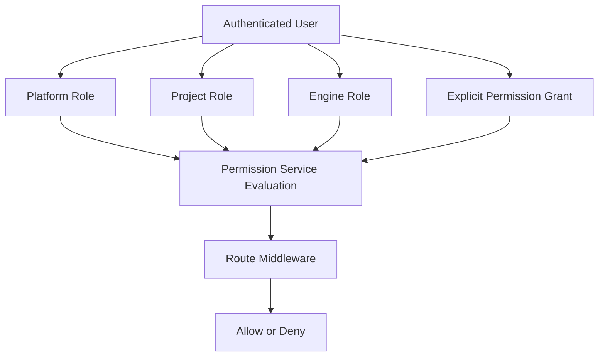
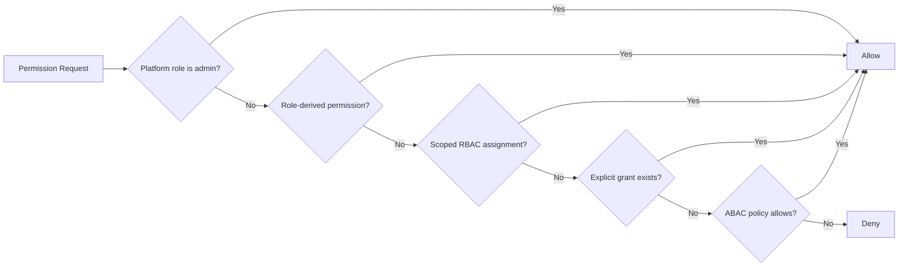
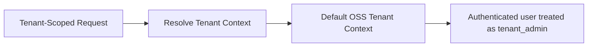
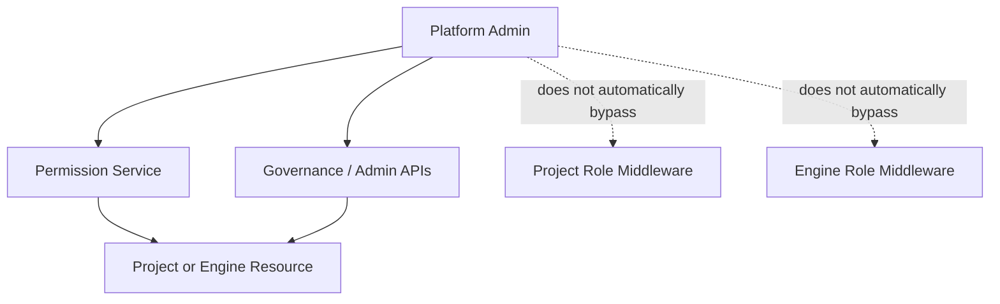

# OSS Authorization and Access Control Model

## Purpose
This document explains the **authorization model** of the EnterpriseGlue OSS project, with specific focus on:
- platform roles
- project roles
- engine roles
- permission evaluation
- platform admin powers and boundaries
- OSS single-tenant behavior

## Implementation Status

This checklist tracks the RBAC, SSO engine assignment, and external engine registration implementation on `feat/sso-engine-assignments`.

### AI Agent Progress Tracker

Use this compact tracker as the implementation handoff for the authorization model. The detailed checklists below preserve the full historical implementation trail.

Status legend:

- [x] ✅ Done
- [ ] ⬜ Todo
- [ ] ⏸ Deferred

### Current Worktree Progress

- [x] ✅ Access Control has been modularized for audit, SSO diagnostics/snapshots, Effective Access, policy inspection, role-assignment results, and shared assignment-source presentation.
- [x] ✅ Role Assignment form state, principal/scope transitions, static options, role eligibility, submission checks, and runtime-resource queries now live in `pages/access-control/assignmentFormOptions.ts`; the remaining JSX-only component move is tracked in the detailed implementation plan.
- [x] ✅ Assignment ownership is consistently labeled as Manual, SSO-managed, identity-provider-managed, configuration-managed, API-managed, or system-managed. Only manual and locally overridable config assignments are removable.
- [x] ✅ Focused frontend coverage verifies source ownership guards, principal/scope transitions, submission eligibility, Effective Access, principal/resource inspection, and Engine Set rendering.

Detailed completion evidence and the authoritative remaining checklist are maintained in [JSON-Driven Authorization And Engine Registration](11-json-driven-authz-and-engine-registration.md).

> **Historical tracker notice:** The unchecked implementation lists below are
> preserved as the original planning record for this branch; they are not a
> current statement of delivered capability. The authoritative current status
> is [Authorization Program Status and Next Delivery Work](15-authorization-program-status.md),
> and the detailed implementation record is
> [JSON-Driven Authorization And Engine Registration](11-json-driven-authz-and-engine-registration.md).
> In particular, configuration bundles, shared resource-aware authorization,
> provider-neutral OIDC/SAML/LDAP, deployment reconciliation, and the focused
> role editor have since been implemented and tested.

Historical architecture snapshot:

- [x] ✅ RBAC persistence, permission catalog, system roles, custom roles, custom permissions, and allow-only custom role semantics.
- [x] ✅ Principal-scoped assignments for users, groups, API clients, and service accounts with evaluator support and Effective Access explanations.
- [x] ✅ SSO group mappings, SSO engine assignment mappings, SSO snapshots, and engine/project access-authority transition controls.
- [x] ✅ Engine Sets, project-engine targets, deployment eligibility, external engine systems, external engine registration, and source-owned field enforcement.
- [x] ✅ OpenAPI authz metadata, strict route inventory guard, backend route migration, and mounted frontend action inventory.
- [x] ✅ Mission Control-Starbase bridge decisions and mounted Mission Control authorization coverage.
- [x] ✅ Bridge action inventory is wired through the shared authoritative bridge API client. The browser delegates composite project, engine, target, and lineage decisions to the backend before navigation.
- [ ] ⬜ Phase 0 clean-contract alignment: canonical principal assignments, removal of legacy authorization fallbacks/writes, provider-neutral external identities, provider-id-bound login, secure secret resolution, source ownership metadata, one-row project-target ownership, and module decomposition.
- [ ] ⬜ JSON config bundles for roles, groups, engines, Engine Sets, runtime resource sets, assignments, SSO mappings, and project-engine targets.
- [ ] ⬜ Config bundle APIs, OpenAPI schemas, preview/apply/export/run history, CI/CD apply support, and source ownership/drift diagnostics.
- [x] ✅ Target operator guides exist for authorization/engine configuration and deployment/CI-CD operationalization, with explicit notices that planned interfaces are not executable yet.
- [ ] ⬜ Update env templates, Compose/OpenShift manifests, deployment scripts, startup/readiness, rollback, security, troubleshooting, and executable operator examples with the config runtime implementation.
- [ ] ⬜ Central shared-engine runtime resource model, runtime resource set materialization, and Mission Control/dashboard authorized-subset filtering.
- [ ] ⬜ Provider-neutral OIDC/SAML/LDAP identity adapters, normalized entitlement-to-group mappings, and shared sync diagnostics.
- [ ] ⬜ Reusable identity adapter contract suite, protocol-faithful mock OIDC/SAML/LDAP services, and full config/login/reconciliation tests.
- [ ] ⬜ Per-engine `runtimeAccessScope` for distributed `engine_wide` and central `resource_aware` behavior.
- [ ] ⬜ Proxy/direct deployment ingestion with pipeline receipts, engine metadata reconciliation, and verified lineage quality.
- [ ] ⬜ Carbon role library and focused single-role editor replacing the horizontally scrolling permission matrix.
- [x] ✅ `engineRuntimeAuthorizationMode` defaults to `enterpriseglue_authoritative`; the narrow `mirrored_engine_backstop` mode is gated by a retained successful Camunda 7 or Operaton backstop receipt.
- [x] ✅ First-class customer-managed sidecar engine connection mode with policy-controlled endpoint authentication, normal RBAC/runtime enforcement, UI/config/OpenAPI fields, transport tests, and bounded mirrored-backstop propagation. EnterpriseGlue never receives the customer's downstream peer token.
- [ ] ⏸ EnterpriseGlue-issued sidecar action tokens, sidecar principals/heartbeats/inventory, and `engine_native_authority` import mode. The narrow Camunda/Operaton mirrored backstop is implemented separately.

### Historical Remaining Work (Superseded)

As of 2026-07-12, the RBAC foundation, principal-scoped assignments, custom roles/permissions, SSO engine assignments, SSO access snapshots, access-authority transition controls, Engine Sets, project-engine targets, external engine registration, Mission Control-Starbase bridge decisions, OpenAPI authz metadata, strict route inventory guards, and mounted frontend action inventory are substantially implemented.

The remaining relevant work is:

- [ ] ⬜ Complete the Phase 0 alignment gate before enabling config apply or `resource_aware` central engines: normalize principal assignments and role uniqueness, remove legacy authorization sources, add external identity links and exact provider routing, secure all engine/identity secrets, add deterministic config ownership, and split the largest authz modules by domain.
- [ ] ⬜ JSON-driven configuration bundles for roles, groups, engines, Engine Sets, runtime resource sets, scoped assignments, SSO mappings, and project-engine targets.
- [ ] ⬜ Config bundle preview/apply/export/run-history APIs, OpenAPI schemas, route inventory metadata, and CI/CD apply support.
- [ ] ⬜ Config bundle operationalization across shared env validation, Docker Compose dev/prod/images/self-host, OpenShift/Kustomize, migrations/startup ordering, fail-closed readiness, secret mounts, observability, and rollback.
- [ ] ⬜ Config source ownership and drift diagnostics, including managed-by-config badges and guarded UI edit behavior.
- [ ] ⬜ Central shared-engine runtime resource model: `engine_runtime_resource`, `engine_runtime_resource_set`, runtime inventory, materialization lineage, and effective-access explanations.
- [ ] ⬜ Generalize current SSO-specific providers, mappings, normalized identities, and sync diagnostics into one OIDC/SAML/LDAP identity abstraction.
- [ ] ⬜ Extend the planned JSON config bundle interface for identity provider/mapping/sync policy objects and verify it with deterministic mock identity services.
- [ ] ⬜ Add `runtimeAccessScope` and deployment integration fields to engine persistence, schemas, OpenAPI, services, config, audit, and existing Engine UI.
- [ ] ⬜ Extend engine deployment/artifact persistence for direct discovery, optional project lineage, receipt provenance, and complete/reported/discovered/inferred lineage quality.
- [ ] ⬜ Replace Access Control's role-column matrix with a role list plus one-role-at-a-time grouped permission editor and responsive overflow tests.
- [x] ✅ Mission Control and dashboard filtering by authorized process/decision/runtime resource subsets inside central shared engines.
- [ ] ⬜ `engineRuntimeAuthorizationMode` setting with `enterpriseglue_authoritative` enabled for v1 and later engine-native modes explicitly unsupported until future milestones.
- [x] ✅ Add `connectionMode = customer_sidecar` to engine persistence, shared schemas, OpenAPI, manual/external/config registration, connection resolution, Engine UI, mock-sidecar tests, and the bounded mirrored-backstop path. EnterpriseGlue never receives the customer's downstream peer token.
- [ ] ⬜ Optional cleanup: reusable composite/branch guard extraction, optional approval workflow semantics if approvals become deployment gates, optional live SAML/OIDC/Google provider diagnostics, and broader reusable diagnostic-link/field-level guard patterns.

Deferred and not part of the current v1 implementation path:

- [ ] ⏸ EnterpriseGlue-issued sidecar action-token protocol and dedicated sidecar inventory/heartbeat APIs. Customer-managed sidecar transport is not deferred.
- [x] ✅ Narrow Camunda 7/Operaton engine-native permission mirroring (`mirrored_engine_backstop`): exact mapped-group process/decision `READ`, hash-bound sync, ownership-only rollback, read-only tracked-ID drift receipts, source-owned configuration-bundle mappings with opaque secret references, and direct or customer-sidecar transport. Direct-identity certification remains follow-up work.
- [ ] ⏸ Engine-native permission import/authority (`engine_native_authority`).

### Clean Target Versus Transitional Compatibility

The completed checklist below records what exists in this worktree, including compatibility bridges added during the staged RBAC migration. It is not the final clean architecture contract.

Before the next feature phase, the implementation must converge on these rules:

- [ ] ⬜ Authorization reads only canonical scoped role assignments, group inheritance, explicit grants, policies, and contextual checks. Legacy platform-role, project-member, engine-member, owner, and delegate fields must not grant access.
- [ ] ⬜ Product commands, invitations, bootstrap, SSO, API, and config flows write the same principal-scoped assignment model; owner/delegate fields remain optional governance metadata only.
- [ ] ⬜ Role assignments require `tenantId`, `principalType`, `principalId`, `roleId`, `scopeType`, `scopeId`, `source`, and optional `sourceRef`; no assignment path copies a non-user principal id into a legacy `userId` column.
- [ ] ⬜ Custom role keys are tenant-scoped, while immutable system role ids remain globally deterministic.
- [ ] ⬜ External account linking uses provider-neutral external identities keyed by EnterpriseGlue tenant, provider, and provider subject. Login snapshots remain diagnostics and entitlement evidence, not account links.
- [ ] ⬜ Login, callback, mapping, reconciliation, and diagnostics bind to an exact identity-provider id. Multiple providers of the same protocol must work without first-provider selection or hard-coded provider ids.
- [ ] ⬜ Identity mappings converge on provider-neutral claims-to-groups behavior. Scoped role assignments are made to internal groups; direct platform/engine SSO mappings are transitional migration inputs, not parallel permanent authorization models.
- [ ] ⬜ EnterpriseGlue tenant ids and external directory tenant/domain ids use distinct fields and meanings.
- [ ] ⬜ Identity-provider and engine secrets use authenticated encryption or external secret references through one `SecretResolver`; base64 marking and plaintext runtime credential use are not acceptable config inputs.
- [ ] ⬜ Exactly one effective project-engine target exists for a project/engine pair. Config adoption of a manual row requires previewed skip, conflict, or explicit ownership transfer.
- [ ] ⬜ Engine deployment lineage supports direct discovery with nullable project/file lineage and explicit quality. Mission Control-Starbase bridge authorization never relies on a file-key-only or inferred match.
- [ ] ⬜ Runtime resource visibility is filtered by backend services and live resource resolvers. Frontend permission snapshots remain coarse and are never expanded into a high-cardinality runtime authorization cache.

These alignment items are prerequisites for the JSON/config and central-engine phases documented in [JSON-Driven Authorization, Identity Mapping, And Engine Registration](./11-json-driven-authz-and-engine-registration.md).

### Customer Sidecar Boundary

Customer-managed sidecars do not change the EnterpriseGlue authorization model. EnterpriseGlue still evaluates the user or machine principal, engine/runtime resource, project-engine target, deployment mode, policy, and contextual requirements before making any outbound call.

For v1, model the sidecar as the registered engine endpoint with `connectionMode = customer_sidecar`. The customer-owned sidecar injects its peer-to-peer token or local service identity on the downstream engine hop. That downstream credential is outside EnterpriseGlue configuration, persistence, OpenAPI, UI, logs, audit payloads, and support diagnostics.

The EnterpriseGlue-to-sidecar hop may use a private credentialless endpoint only when platform policy explicitly permits it. Prefer mTLS, API-key references, or OAuth client credentials where supported. A credentialless direct-engine endpoint must be rejected.

Do not require a sidecar principal, heartbeat, inventory, JWKS, nonce store, or EnterpriseGlue-issued action token for this v1 transport. Those belong to a separate optional cooperating-sidecar protocol and remain deferred.

### RBAC Foundation
- [x] ✅ Add RBAC persistence entities for `permissions`, `roles`, `role_permissions`, and `role_assignments`.
- [x] ✅ Add database migrations for RBAC tables across the shared migration entry points.
- [x] ✅ Seed a deterministic permission catalog from the current platform, project, and engine authorization model.
- [x] ✅ Add granular platform user-management permissions for view, create, update, deactivate, delete, permanent delete, and unlock operations while preserving legacy `platform:user:*` permissions.
- [x] ✅ Add granular project member-management permissions for user search/lookup, invitation, direct add, role update, member removal, and deploy-grant management while preserving the legacy `project:members:manage` umbrella permission.
- [x] ✅ Add granular project delegate-management and ownership-transfer permissions while preserving owner-only default behavior.
- [x] ✅ Add granular engine member, environment, and project-access permissions for lookup, invitation, direct add, role update, removal, environment set/lock, and access-request view/approve/deny/revoke while preserving the legacy `engine:members:manage` and `engine:edit` umbrella permissions.
- [x] ✅ Add granular engine delegate-management and ownership-transfer permissions while preserving owner-only default behavior.
- [x] ✅ Add elevated `platform:audit:unredacted-view` permission for opt-in unredacted audit payload reads while keeping normal audit responses redacted.
- [x] ✅ Enforce granular user-management permissions on backend `/api/users` routes while preserving the legacy `platform:user:manage` umbrella permission.
- [x] ✅ Migrate invitation creation checks to platform users-create/user-manage, project member-manage, and engine member-manage permission fallbacks while preserving legacy admin/owner/delegate behavior.
- [x] ✅ Migrate setup-complete admin route to `platform:settings:manage` permission evaluation while preserving platform-admin behavior.
- [x] ✅ Complete live backend route-guard audit for remaining direct platform-admin checks; remaining live module uses are compatibility short-circuits or dashboard context display state, not standalone route gates.
- [x] ✅ Seed backward-compatible system roles for platform, project, and engine scopes.
- [x] ✅ Seed non-assignable `system.platform.developer` compatibility role for legacy `users.platformRole = developer` records.
- [x] ✅ Keep system roles read-only while making them assignable where appropriate.
- [x] ✅ Support platform-admin-defined custom roles with same-scope permission selection.
- [x] ✅ Enforce custom roles as allow-only permission bundles; deny-style role inputs are rejected and explicit denies stay in the ABAC/policy layer.
- [x] ✅ Support platform-admin-defined custom permissions under scope-specific `:custom:` permission keys.
- [x] ✅ Support archiving custom roles without deleting historical assignment rows.
- [x] ✅ Support manual scoped role assignments for platform, project, and engine resources.
- [x] ✅ Preserve legacy platform role, project membership, engine ownership, delegate, and membership behavior.
- [x] ✅ Derive legacy memberships dynamically instead of backfilling them into `role_assignments`.
- [x] ✅ Evaluate access from legacy roles, scoped RBAC role assignments, explicit grants, and existing ABAC policies.
- [x] ✅ Include allow/deny explanation output for effective-access inspection.
- [x] ✅ Allow backend Starbase member-management routes to authorize from scoped `project:members:view` and `project:members:manage` permissions while preserving legacy project membership behavior.
- [x] ✅ Migrate Starbase project member search/lookup, invitation, direct add, role update, remove, and deploy-grant routes to operation-specific project member permissions while preserving legacy owner/delegate and `project:members:manage` behavior.
- [x] ✅ Add permission-service fallback support to shared project authorization middleware so migrated routes can preserve legacy roles while accepting scoped project permissions.
- [x] ✅ Add permission-service fallback support to shared file authorization middleware and migrate direct Starbase file, folder, version, and comment entry points to scoped project file/version permissions while preserving legacy access behavior.
- [x] ✅ Migrate Starbase engine-deployment read routes to scoped project file-view permission fallbacks while preserving legacy project and engine visibility behavior.
- [x] ✅ Migrate Mission Control process/decision edit-target resolution to scoped project file-view and file-edit permission fallbacks while preserving legacy project membership behavior.
- [x] ✅ Add route-specific engine permission fallback support to shared engine authorization middleware while preserving legacy engine role behavior.
- [x] ✅ Migrate Mission Control process-instance and process/decision definition routes to route-specific engine permission fallbacks for view, start, instance delete, and variable edit checks.
- [x] ✅ Migrate Mission Control batch, direct operation, modification, message/signal, metrics, and extended-history routes to route-specific engine permission fallbacks.
- [x] ✅ Migrate Mission Control jobs, tasks, external-task, and migration routes to route-specific engine permission fallbacks.
- [x] ✅ Migrate Starbase direct engine deployment and process-definition diagram routes to route-specific engine deploy/deploy-view permission fallbacks.
- [x] ✅ Migrate engine deployment passthrough list/read/delete routes to scoped engine deploy-view/deploy permission fallbacks.
- [x] ✅ Allow scoped `engine:edit` permission to receive unredacted engine auth fields in Mission Control engine list/detail reads while preserving redaction for view-only access.
- [x] ✅ Migrate engine member lookup, invitation, direct add, role update, removal, environment set/lock, and project access-request routes to operation-specific engine permissions while preserving legacy owner/delegate, `engine:members:manage`, and `engine:edit` behavior.
- [x] ✅ Migrate engine delegate assignment and ownership transfer routes to scoped `engine:delegate:manage` and `engine:ownership:transfer` permissions while preserving legacy owner behavior.
- [x] ✅ Migrate the legacy aggregate Mission Control router to route-specific engine permission fallbacks.
- [x] ✅ Migrate VCS/checkpoint routes to scoped project file-view, version-create, and version-restore permission fallbacks while preserving legacy project role behavior.
- [x] ✅ Migrate Git deployment and lock routes to scoped project deploy, file-view, file-edit, version-restore, and project-settings permission fallbacks while preserving legacy project role behavior.
- [x] ✅ Migrate Git repository and project-connection routes to scoped project file-view and Git-connect permission fallbacks while preserving legacy project role behavior.
- [x] ✅ Migrate Git sync status, push/pull, and sync repository-list routes to scoped project Git-pull, Git-push, and file-view permission fallbacks while preserving legacy project role behavior.
- [x] ✅ Migrate engine access-request creation to scoped project settings permission fallback while preserving legacy owner/delegate project behavior.
- [x] ✅ Migrate shared deployment authorization middleware to scoped project `project:deploy` and engine `engine:deploy` permission fallbacks while preserving legacy project deploy roles, explicit deploy grants, and engine deploy roles.
- [x] ✅ Migrate Starbase import-from-engine eligibility to scoped `engine:deploy:view` permission fallback while preserving legacy engine member-role behavior.
- [x] ✅ Add permission-service fallback support to the shared generic authorization middleware for platform, project, and engine permission checks while preserving legacy role behavior.
- [x] ✅ Migrate Dashboard context visibility to effective platform, project, and engine permission snapshots while preserving legacy project and engine visibility fallbacks.
- [x] ✅ Migrate Platform Admin authz read/manage routes from direct platform-admin checks to route-specific platform permissions for roles, custom permissions, policies, identity mappings, identity-provider diagnostics, external engine registration, effective-access evaluation, and authz audit reads while preserving platform-admin behavior.

### Identity Mapping Access
- [x] ✅ Provider-neutral identity entitlement mappings reconcile users into internal groups; normal scoped role assignments grant project, engine, Engine Set, runtime-resource, and Runtime Resource Set access from those groups.
- [x] ✅ `POST /api/identity/mappings/provision-access` creates a mapping, an optional internal group, and an optional scoped assignment atomically.
- [x] ✅ Legacy direct SSO role/engine assignment mappings, their selector system, access snapshots, and transition-cleanup controls are retired. There are no customer SSO rows to convert; manual, API, system, and canonical identity-mapping assignments remain independent.

### External Engine Registration
- [x] ✅ Add engine metadata for `externalId`, labels, registration source, and external update timestamp.
- [x] ✅ Add database migration for external engine registration metadata.
- [x] ✅ Add separate `external_engine_registrations` table and migration while retaining engine metadata columns for backward-compatible API responses.
- [x] ✅ Add API client persistence for external machine clients.
- [x] ✅ Add scoped API client token creation, rotation, revocation, and authentication.
- [x] ✅ Add idempotent `POST /engines-api/external/engines` registration/upsert endpoint.
- [x] ✅ Require `engine:register` API client scope for external engine registration.
- [x] ✅ Support optional connection testing during external registration with recorded health returned in the response.
- [x] ✅ Record audit log entries for external engine registration create/update.
- [x] ✅ Preserve existing user-created engine registration at `POST /engines-api/engines`.
- [x] ✅ Include labels and external metadata in engine create/update/read schemas.
- [x] ✅ Expose external engine IDs and labels as read-only registration metadata; scoped access is granted through normal engine or Engine Set assignments.
- [x] ✅ Warn before manually editing externally registered engines because future external registrations may overwrite those fields.
- [x] ✅ Expose a platform-admin registered-engine inventory for externally registered engines from `external_engine_registrations`, with legacy engine-column fallback.
- [x] ✅ Expose per-engine external registration audit history.
- [x] ✅ Add SSRF-oriented validation for external registration URLs, blocking embedded credentials and local, metadata, private, link-local, multicast, or reserved address literals.
- [x] ✅ Freeze external engine registration scope for this milestone; do not add secret ingestion or credential rotation here.

### APIs and Schemas
- [x] ✅ Add `GET /api/authz/permissions`.
- [x] ✅ Add `POST /api/authz/permissions` for custom permission creation.
- [x] ✅ Add `GET /api/authz/roles`.
- [x] ✅ Add `GET /api/authz/me/permissions` for current-user effective platform, project, and engine permissions.
- [x] ✅ Add custom-role create/update/archive APIs.
- [x] ✅ Add role-assignment list/create/delete APIs.
- [x] ✅ Add API client list/create/rotate/revoke APIs for external engine registration clients.
- [x] ✅ Add `GET /api/authz/external-engines`.
- [x] ✅ Add `GET /api/authz/external-engines/:id/audit`.
- [x] ✅ Add `POST /api/authz/evaluate`.
- [x] ✅ Add identity-entitlement mapping CRUD, evaluation, and atomic provision-access APIs.
- [x] ✅ Add bridge decision APIs: `POST /api/mission-control/bridge/starbase-edit/evaluate` and `POST /api/starbase/bridge/mission-control/evaluate`.
- [x] ✅ Update Zod schemas for new authz, RBAC, identity-mapping, and engine-registration payloads.
- [x] ✅ Update OpenAPI registration for identity-mapping, authz, and external-engine endpoints.
- [x] ✅ Update OpenAPI authz schemas to expose tenant-aware role, assignment, policy, audit, and identity-mapping payloads.
- [x] ✅ Update OpenAPI registration for audit redaction controls and the elevated unredacted audit permission behavior.
- [x] ✅ Add OpenAPI and route-inventory authz metadata for SSO snapshot, transition cleanup, and Mission Control-Starbase bridge routes.

### Platform Admin UI
- [x] ✅ Add Platform Admin Access Control route at `/admin/access-control`.
- [x] ✅ Add Access Control entry to the Platform Admin home page.
- [x] ✅ Add Roles tab with system/custom roles and permission counts.
- [x] ✅ Add search and scope filtering to the Roles tab.
- [x] ✅ Add duplicate-system-role action that opens a custom role draft with copied permissions.
- [x] ✅ Add custom-role create/edit/archive UI.
- [x] ✅ Require explicit acknowledgement before saving custom roles with sensitive permissions.
- [x] ✅ Add Permissions tab with grouped permission catalog.
- [x] ✅ Add custom permission creation from the Permissions tab.
- [x] ✅ Add dangerous-permission warnings, quick filters, and dependency hints to the Permissions tab.
- [x] ✅ Classify operation-specific member/project-access permissions as access-control risks and engine environment permissions as sensitive operations in the Access Control Permissions tab.
- [x] ✅ Add Assignments tab for manual scoped role assignment and removal.
- [x] ✅ Add Effective Access tab for user/resource/permission evaluation.
- [x] ✅ Add Identity Mappings controls for provider entitlement, internal group, and optional scoped access provisioning.
- [x] ✅ Add identity-provider synchronization diagnostics without treating diagnostics as authorization grants.
- [x] ✅ Add External Registration tab for API client creation, rotation, and revocation.
- [x] ✅ Add registered external-engine inventory and registration audit drilldown to the External Registration tab.
- [x] ✅ Support normal role-assignment scopes for engines, Engine Sets, runtime resources, and Runtime Resource Sets in the UI.
- [x] ✅ Gate admin navigation from current-user platform permission snapshots while preserving legacy capability fallback.
- [x] ✅ Gate EE extension navigation and menu capability requirements from current-user permission snapshots while preserving legacy `UserCapabilities` and deprecated admin role fallback behavior.
- [x] ✅ Tighten remaining frontend admin capability cleanup for route guards, setup checks, admin header affordances, and profile role display by using current-user permission snapshots with legacy capability fallback.
- [x] ✅ Centralize frontend legacy `UserCapabilities` fallback in the shared permission helper so route guards, app shell navigation, Mission Control sidebars, page gates, and extension gates no longer read `user.capabilities` directly.
- [x] ✅ Gate Mission Control route/menu visibility from engine-scoped permission snapshots while preserving legacy capability fallback.
- [x] ✅ Gate User Management create, edit, unlock, deactivate, and permanent-delete UI actions with operation-specific user permissions while preserving `platform:user:manage` fallback.
- [x] ✅ Gate the Audit Log unredacted PII toggle with `platform:audit:unredacted-view`; normal audit viewing still requires `platform:audit:view`.
- [x] ✅ Gate Starbase project detail actions with project-scoped permissions for file view/create/edit/delete, member view/manage, project settings, Git connection, and deploy, while preserving legacy project role fallback.
- [x] ✅ Gate Starbase project member modal add, invite reissue, role edit, deploy-grant, and remove actions with operation-specific project member permissions while preserving `project:members:manage` fallback.
- [x] ✅ Migrate Starbase project rename/delete/engine-access and folder project-level read/create/import/download entry points to shared project middleware permission fallbacks.
- [x] ✅ Migrate direct Starbase file, folder, version, and comment route checks to scoped project file/version permission fallbacks.
- [x] ✅ Migrate Starbase engine-deployment list, file deployment, file history, and latest-deployment read checks to scoped project file-view permission fallbacks.
- [x] ✅ Migrate Mission Control process/decision edit-target checks to scoped project file-view/file-edit permission fallbacks for Starbase edit links.
- [x] ✅ Migrate shared engine middleware and Mission Control process-instance/process-definition/decision-definition checks to route-specific engine permission fallbacks.
- [x] ✅ Migrate Mission Control batch, direct operation, modification, message/signal, metrics, and extended-history checks to route-specific engine permission fallbacks.
- [x] ✅ Migrate Mission Control jobs, tasks, external-task, and migration checks to route-specific engine permission fallbacks.
- [x] ✅ Migrate Starbase direct engine deployment and process-definition diagram checks to route-specific engine deploy/deploy-view permission fallbacks.
- [x] ✅ Migrate engine deployment passthrough list/read/delete checks to scoped engine deploy-view/deploy permission fallbacks.
- [x] ✅ Migrate the legacy aggregate Mission Control router checks to route-specific engine permission fallbacks.
- [x] ✅ Migrate VCS/checkpoint commit, publish, history, status, snapshot, and restore route checks to scoped project file/version permission fallbacks.
- [x] ✅ Migrate Git deployment history, commit history, deploy, rollback, lock acquire/list/events, and manager unlock checks to scoped project permission fallbacks.
- [x] ✅ Migrate Git repository list/detail/delete and project-connection read/manage checks to scoped project permission fallbacks.
- [x] ✅ Migrate Git sync status, push/pull, and repository listing checks to scoped project permission fallbacks.
- [x] ✅ Migrate engine access-request creation checks to scoped project settings permission fallback.
- [x] ✅ Migrate tenant, project, and engine invitation creation checks to scoped platform/project/engine permission fallbacks.
- [x] ✅ Remove direct legacy platform-admin helper dependency from the Platform Admin authz route; access checks now flow through `permissionService` so legacy admin roles, custom roles, and explicit grants share the same evaluator path.
- [x] ✅ Derive Dashboard platform-admin visibility flags from current-user platform permission snapshots instead of synchronous legacy platform-role helpers.
- [x] ✅ Migrate project member search/lookup, invitation, direct add, role update, removal, and deploy-grant checks to explicit scoped project member permissions.
- [x] ✅ Migrate project delegate assignment, delegate promotion, and ownership transfer checks to explicit scoped project permissions.
- [x] ✅ Migrate setup-complete checks to platform settings permission evaluation.
- [x] ✅ Gate Engines page edit, delete, test-connection, and member row actions with engine-scoped permission snapshots while preserving legacy owner/delegate/operator fallbacks.
- [x] ✅ Gate Engine members modal add, invite reissue, role update, removal, delegate removal, and project access-request actions with operation-specific engine permissions while preserving `engine:members:manage` fallback.
- [x] ✅ Distinguish manual, SSO-managed, and transition access in Engine members and Project members modal flows; SSO-managed rows are shown as source-managed and not directly removable.
- [x] ✅ Disable normal manual project member management when `projectAccessAuthority = sso_managed` while allowing transition mode to show manual and source-managed access together.
- [x] ✅ Gate online project import-from-engine options with engine-scoped `engine:deploy:view` permission snapshots while preserving legacy engine role fallback.
- [x] ✅ Gate Git versions deployment-history UI with engine-scoped `engine:deploy:view` permission snapshots while preserving legacy engine role fallback.
- [x] ✅ Gate Mission Control-to-Starbase and Starbase-to-Mission-Control bridge actions through backend composite bridge decisions, surfacing denial reasons without hiding the current side's content.
- [x] ✅ Gate Dashboard user, process, and metrics panels with platform and engine permission snapshots while preserving Dashboard context compatibility fallbacks.
- [x] ✅ Allow Mission Control engine list/detail responses to expose auth fields to scoped engine editors while preserving redaction for view-only roles.
- [x] ✅ Migrate engine member lookup, invitation, add, update, remove, environment set/lock, and project access-request checks to explicit scoped engine permissions.
- [x] ✅ Migrate engine delegate assignment and ownership transfer checks to explicit scoped engine permissions.
- [x] ✅ Add assignable custom-role controls to project and engine member-management flows, creating/removing manual scoped role assignments without touching SSO-managed assignments.
- [x] ✅ Keep the existing SSO Role Mappings page separate and unchanged for platform-role provisioning.

### Compatibility and Verification
- [x] ✅ Add service tests for seeded permissions, system roles, role assignment evaluation, and explanation output.
- [x] ✅ Add service and route tests for custom permission creation and custom-role use of persisted custom permissions.
- [x] ✅ Add compatibility tests for existing platform, project, engine, and explicit grant behavior.
- [x] ✅ Add SSO sync tests for matching claims, removed claims, manual assignment preservation, restricted roles, missing targets, deletion, and label/external selectors.
- [x] ✅ Add SSO assignment tests for active custom engine role targets and non-engine custom role rejection.
- [x] ✅ Add route tests for authz read/evaluate APIs and SSO assignment mapping CRUD/test endpoints.
- [x] ✅ Add authz route tests for scoped resource-manager custom-role assignment list/create/delete APIs.
- [x] ✅ Add backend Starbase member route tests for scoped project member view/manage permissions and operation-specific member search, invite, add, role-update, remove, and deploy-grant permissions.
- [x] ✅ Add shared project authorization middleware tests for scoped permission fallback behavior.
- [x] ✅ Add backend Starbase file, folder, version, and shared file-authorization middleware tests for scoped project file/version permissions.
- [x] ✅ Add backend Starbase engine-deployment route tests for scoped project file-view permission fallback behavior.
- [x] ✅ Add backend Mission Control process/decision edit-target route tests for scoped project file-view/file-edit permission fallback behavior.
- [x] ✅ Add shared engine authorization middleware tests for route-specific scoped engine permission fallback behavior.
- [x] ✅ Run backend Mission Control batch, direct operation, modification, message/signal, metrics, and extended-history route tests after adding route-specific engine permission fallbacks.
- [x] ✅ Run backend Mission Control jobs, tasks, external-task, and migration route tests after adding route-specific engine permission fallbacks.
- [x] ✅ Add backend Starbase direct deployment route tests for scoped engine deploy/deploy-view permission fallback behavior.
- [x] ✅ Add backend engine deployment passthrough route tests for scoped engine deploy-view/deploy permission fallback behavior.
- [x] ✅ Run backend legacy aggregate Mission Control route tests after adding route-specific engine permission fallbacks.
- [x] ✅ Add backend VCS route tests for scoped project file-view permission fallback behavior.
- [x] ✅ Add backend Git deployment and lock route tests for scoped project permission fallback behavior.
- [x] ✅ Add backend Git repository and project-connection route tests for scoped project permission fallback behavior.
- [x] ✅ Add backend Git sync route tests for scoped project Git-pull permission fallback behavior.
- [x] ✅ Add backend engine-management route tests for scoped project settings permission fallback on engine access requests.
- [x] ✅ Add engine route tests for external registration and external metadata handling.
- [x] ✅ Add backend route coverage for optional external registration connection testing.
- [x] ✅ Add backend audit route coverage for elevated unredacted PII permission checks.
- [x] ✅ Add service and route tests for API client creation, scoped authentication, rotation, revocation, and external registration enforcement.
- [x] ✅ Add authz route tests for registered-engine inventory and external registration audit reads.
- [x] ✅ Add authz route tests proving route-specific platform permissions can access Platform Admin authz APIs without the legacy platform-admin role.
- [x] ✅ Add frontend hook and Access Control rendering/validation tests, including registered engines and audit drilldown.
- [x] ✅ Add frontend coverage for Access Control role search and scope filtering.
- [x] ✅ Add frontend coverage for duplicating a system role into a custom role draft.
- [x] ✅ Add frontend coverage for sensitive custom-role permission acknowledgement.
- [x] ✅ Add frontend coverage for permission risk classification, quick-filter groups, and dependency hints.
- [x] ✅ Add frontend coverage for granular member/project-access risk classification and engine member permission implications.
- [x] ✅ Add frontend coverage for SSO assignment diagnostics.
- [x] ✅ Add current-user permissions route, service, and frontend API tests.
- [x] ✅ Add frontend tests for current-user permission loading and permission-aware admin route guards.
- [x] ✅ Add frontend tests for permission-aware EE extension navigation and menu capability gates.
- [x] ✅ Add frontend tests for permission-backed generic admin route access and setup checks.
- [x] ✅ Add tests for granular User Management action gating.
- [x] ✅ Add frontend tests for the Audit Log unredacted PII toggle visibility and request behavior.
- [x] ✅ Add frontend tests for project member add/edit assignable custom-role controls.
- [x] ✅ Add frontend tests for operation-specific project member modal action gating and add/invite submit validation.
- [x] ✅ Add frontend tests for import-from-engine eligibility through scoped `engine:deploy:view` permission fallback.
- [x] ✅ Add backend user route tests for granular view, create, update, deactivate, unlock, and permanent-delete permissions.
- [x] ✅ Add backend invitation route tests for scoped platform users-create, project member-manage, and engine member-manage permission fallback behavior.
- [x] ✅ Add backend tests proving custom project permissions can authorize delegate assignment, delegate promotion, and ownership transfer.
- [x] ✅ Add backend setup-status route tests for scoped platform settings permission fallback behavior.
- [x] ✅ Add tests for Starbase project action gating with scoped project permissions.
- [x] ✅ Add tests for Engines page action gating with scoped engine permissions and legacy role fallback.
- [x] ✅ Add frontend tests for operation-specific Engine members modal action gating.
- [x] ✅ Add frontend tests for SSO-managed engine/project member rows, transition-mode controls, Access Control SSO snapshots, and Starbase bridge denial UX.
- [x] ✅ Split the broad Platform Admin Access Control frontend suite into stable helper, roles/permissions, groups, resources/policies, SSO, and external-registration suites with shared mocks and full combined verification.
- [x] ✅ Add backend authz route tests for SSO snapshot reads, transition cleanup preview/apply, and Mission Control-Starbase bridge allow/deny decisions.
- [x] ✅ Add backend tests for scoped engine import and deploy middleware permission fallbacks.
- [x] ✅ Add shared generic authorization middleware tests for platform, project, and engine permission fallback behavior.
- [x] ✅ Add frontend tests for Git versions deployment-history visibility through scoped `engine:deploy:view` permission fallback.
- [x] ✅ Add backend and frontend Dashboard tests for permission-derived visibility.
- [x] ✅ Add Mission Control engine route tests for scoped `engine:edit` unredacted list/detail responses.
- [x] ✅ Add frontend coverage for externally registered engine edit-warning detection.
- [x] ✅ Add focused backend tests proving custom engine role permissions can authorize engine updates and member management.
- [x] ✅ Add backend tests proving custom engine permissions can authorize delegate assignment and ownership transfer.
- [x] ✅ Add backend tests proving operation-specific custom engine permissions can authorize member lookup, invite, add, update, remove, environment set/lock, and project access-request operations.
- [x] ✅ Add EngineService tests proving custom engine role assignments are included in accessible engine reads.
- [x] ✅ Add service tests for custom-role, manual assignment, and SSO-managed assignment audit records.
- [x] ✅ Run targeted shared, backend, and frontend verification.
- [x] ✅ Bump touched published packages: `@enterpriseglue/shared`, `@enterpriseglue/backend-host`, and `@enterpriseglue/frontend-host`.

### Explicit Non-Goals and Future Hardening
- [x] ✅ Backfill legacy project and engine memberships into `role_assignments` as synchronized `source = "legacy"` rows. These rows are for admin visibility and migration continuity; live legacy membership tables remain the compatibility source of truth for authorization, and `source = "legacy"` rows are excluded from the RBAC assignment grant path.
- [x] ✅ Allow SSO assignment of engine owner or delegate roles through guarded platform settings. Accountable owner/delegate metadata remains optional governance metadata and is not mutated by SSO.
- [x] ✅ Convert remaining shared legacy route middleware surfaces to permission-service-first evaluation when a route supplies a scoped permission, with legacy membership and role checks retained only as compatibility fallback. Shared helper names remain for route compatibility.
- [x] ✅ Add custom permission creation. Custom permissions are persisted in the permission catalog and can be assigned to same-scope custom roles.
- [x] ✅ Add optional assignable custom role selection to project and engine member-management flows if member dialogs should create scoped custom-role assignments directly.
- [x] ✅ Add audit records for custom-role, manual assignment, and SSO-managed assignment add/remove mutations.
- [x] ✅ Codify `system.engine.deployer` as deployment-focused only, with no Mission Control runtime mutation permissions.
- [x] ✅ Defer additional external engine registration expansion, including raw secret payloads and credential rotation endpoints.
- [x] ✅ Add OSS-compatible tenant scope hooks for RBAC roles, role assignments, SSO engine assignment mappings, explicit grants, ABAC policies, and authz audit logs. Tenant-scoped evaluation includes matching-tenant rows plus legacy null-tenant rows for backward compatibility.
- [x] ✅ Keep tenant-aware OpenAPI contracts aligned with those OSS-compatible tenant scope hooks.
- [x] ✅ Implement EE tenant membership, tenant-admin, and super-admin resolution in the EE plugin. OSS preserves enterprise-resolved tenant context and calls the EE post-auth resolver when registered; OSS continues to use the default tenant compatibility behavior without the plugin.

### Recommended Open Decisions
- [x] ✅ Keep `system.engine.deployer` deployment-focused instead of granting broader Mission Control mutation access. This avoids privilege expansion for existing deployer users; teams that need operational mutations should assign `system.engine.operator` or a custom engine role with explicit process/job permissions.
- [x] ✅ Keep external engine registration free of raw secrets in this milestone. Current decision: skip additional external engine registration work for now; use existing/manual credential attachment and revisit any dedicated secret-rotation endpoint in a later change.
- [x] ✅ Keep custom roles allow-only and express denies through ABAC/policy rules. This preserves additive RBAC semantics and avoids surprising existing role assignments with deny precedence conflicts.

## Authorization Model Overview

```mermaid
flowchart TD
  User[Authenticated User]
  PlatformRole[Platform Role]
  ProjectRole[Project Role]
  EngineRole[Engine Role]
  ExplicitGrant[Explicit Permission Grant]
  PermissionCheck[Permission Service Evaluation]
  RouteGuard[Route Middleware]
  Decision[Allow or Deny]

  User --> PlatformRole
  User --> ProjectRole
  User --> EngineRole
  User --> ExplicitGrant

  PlatformRole --> PermissionCheck
  ProjectRole --> PermissionCheck
  EngineRole --> PermissionCheck
  ExplicitGrant --> PermissionCheck

  PermissionCheck --> RouteGuard
  RouteGuard --> Decision
```

## Authorization Building Blocks

### 1. Platform Roles
Defined platform roles are:
- `admin`
- `developer`
- `user`

### 2. Project Roles
Defined project roles are:
- `owner`
- `delegate`
- `developer`
- `editor`
- `viewer`

### 3. Engine Roles
Defined engine roles are:
- `owner`
- `delegate`
- `operator`
- `deployer`

### 4. Explicit Permission Grants
In addition to role-derived permissions, explicit permission grants may be stored and evaluated. These grants are **additive**.

### 5. RBAC System and Custom Roles
The RBAC foundation stores a deterministic permission catalog and role catalog in:
- `permissions`
- `roles`
- `role_permissions`
- `role_assignments`

Seeded system roles preserve the current model:
- platform: `system.platform.admin`, `system.platform.developer`, `system.platform.user`
- project: `system.project.owner`, `system.project.delegate`, `system.project.developer`, `system.project.editor`, `system.project.viewer`
- engine: `system.engine.owner`, `system.engine.delegate`, `system.engine.operator`, `system.engine.deployer`

Platform admins can create custom roles for a single scope (`platform`, `project`, or `engine`) and choose permissions from that same scope. System roles remain read-only. Custom roles can be archived, which makes them non-assignable and removes them from effective permission evaluation without deleting historical assignment records.

### 6. Scoped Role Assignments
`role_assignments` adds scoped authorization without rewriting the legacy membership tables:
- platform roles are assigned at platform scope
- project roles require a project resource ID
- engine roles require an engine resource ID

Assignments are source-aware:
- `manual` assignments are created and removed by platform admins
- `sso` assignments are managed by SSO engine assignment sync
- legacy project/engine memberships are still derived dynamically and are not backfilled into `role_assignments`

## Permission Resolution Order
The permission service evaluates access in this order:
1. legacy role fields and memberships, including the platform admin short-circuit
2. seeded or custom scoped `role_assignments`
3. explicit permission grants
4. existing ABAC policy evaluation

```mermaid
flowchart LR
  Start[Permission Request] --> Admin{Platform role is admin?}
  Admin -->|Yes| Allow[Allow]
  Admin -->|No| Role{Role-derived permission?}
  Role -->|Yes| Allow
  Role -->|No| Assignment{Scoped RBAC assignment?}
  Assignment -->|Yes| Allow
  Assignment -->|No| Grant{Explicit grant exists?}
  Grant -->|Yes| Allow
  Grant -->|No| Policy{ABAC policy allows?}
  Policy -->|Yes| Allow
  Policy -->|No| Deny[Deny]
```

## Platform Role Model

### Platform Admin
Platform admin is the strongest platform-level role.

**Platform admin is allowed to**
- manage users
- view audit logs
- manage platform settings
- manage SSO provider configuration
- manage branding/email/platform settings where governed by `SETTINGS_MANAGE`
- manage PII redaction settings and optional external provider configuration through platform settings
- access governance routes that reassign project/engine ownership and delegates
- manage authorization policies and SSO claims mappings in the authz admin APIs
- evaluate permission checks with allow-all behavior inside the permission service

**Important boundary**
Platform admin is **not** automatically a project owner/delegate or engine owner/delegate everywhere. If a route uses direct project/engine membership middleware rather than permission evaluation, platform admin may still need explicit project/engine role membership or a dedicated governance/admin route.

### Platform Developer
Platform developer is a compatibility role for older installs or integrations that may still contain `users.platformRole = developer`. It is seeded as `system.platform.developer`, but it is not manually assignable in the RBAC UI.

**Observed implicit permission**
- `platform:user:view`

### Platform User
Default least-privileged platform role.

## Project Authorization Model

### Project Role Semantics
- `owner`
  - strongest project role
  - can manage settings, members, files, versions, Git integration, and deploy
  - can delete the project

- `delegate`
  - near-owner project management role
  - can manage settings, members, files, versions, Git integration, and deploy
  - cannot implicitly delete the project

- `developer`
  - active contributor role
  - can create/edit/delete files, create/restore versions, push/pull Git, and deploy

- `editor`
  - content editor role
  - can create/edit/view files and create versions
  - does **not** get deploy by default

- `viewer`
  - read-oriented project role
  - can view files and members

### Project Role Groups in Code
- **Manage roles**
  - `owner`, `delegate`

- **Edit roles**
  - `owner`, `delegate`, `developer`, `editor`

- **Deploy roles**
  - `owner`, `delegate`, `developer`

- **View roles**
  - `owner`, `delegate`, `developer`, `editor`, `viewer`

### Project Membership Nuance
Project membership supports multi-role storage internally, but an effective role is still computed for many checks.

### Project Owner Nuance
If the user is the project `ownerId`, the service grants implicit owner membership even without an explicit membership row.

## Engine Authorization Model

### Engine Role Semantics
- `owner`
  - strongest engine role
  - can edit/delete/activate engine, manage members, deploy, and perform Mission Control mutation actions

- `delegate`
  - near-owner engine management role
  - can edit/activate engine, manage members, deploy, and perform Mission Control mutation actions

- `operator`
  - operational engine role
  - can view engine membership, deploy, start/cancel/modify processes, view/delete/retry instances, and edit variables

- `deployer`
  - narrow deployment-focused role
  - receives only `engine:deploy` and `engine:deploy:view`
  - Mission Control runtime mutations belong to `operator` or an explicit custom engine role

### Engine Role Groups in Code
- **Engine manage roles**
  - `owner`, `delegate`

- **Mission Control / engine view roles**
  - `owner`, `delegate`, `operator`

- **Engine member roles**
  - `owner`, `delegate`, `operator`, `deployer`

### Engine Ownership Nuance
Engine ownership and delegation are partly modeled directly on the engine record (`ownerId`, `delegateId`) and partly via membership rows.

## What Controls Mission Control Access
Mission Control visibility in the frontend is not based on platform admin alone.

A user gets `canViewMissionControl` when they have at least one engine with a Mission Control viewing role:
- engine owner
- engine delegate
- engine member with role `operator`

This means:
- a platform admin without engine access is **not automatically** a Mission Control user by default
- Mission Control is fundamentally engine-access-driven
- engine-scoped RBAC assignments are considered alongside legacy engine owner/delegate/member records

## Identity Mapping Access Model
External identity entitlements are mapped to internal groups through `IdentityEntitlementMapping`. Normal scoped role assignments then grant engine access to those groups; the mapping never writes legacy engine-member rows or replaces manual, API, system, or configuration-managed assignments.

Supported assignment scopes are the normal authorization scopes: an exact engine, Engine Set, exact runtime resource, or Runtime Resource Set. High-risk owner/delegate and sensitive-permission guardrails apply to the normal role-assignment workflow.

## External Engine Registration
External systems can register or update engines through `POST /engines-api/external/engines` using a scoped API client bearer token. The API client must have the `engine:register` scope. The endpoint is idempotent by `externalId`:
- first registration creates the engine and stores `externalId`, labels, `registrationSource = "external_api"`, and `externalUpdatedAt`
- later registrations with the same `externalId` update the existing engine metadata and connection fields
- existing user-created engine registration remains available at `POST /engines-api/engines`
- each external create/update writes an audit log entry with the API client ID
- external registration rejects high-risk URL targets, including embedded credentials, localhost/service-name hosts, metadata hosts, and local/private/link-local/reserved IP literals

Platform admins can inspect registered external engines with `GET /api/authz/external-engines` and drill into registration history with `GET /api/authz/external-engines/:id/audit`. These read APIs expose registration metadata, labels, and audit details without returning engine credentials.

No additional external engine registration expansion is planned for this milestone. In particular, registration payloads remain secret-free; credential attachment or rotation should stay manual or move to a later dedicated endpoint with stricter scopes and audit controls.

Engine labels are stored as normalized key/value metadata and are used by SSO engine assignment mappings when `targetSelectorType = "engine_label"`. `targetSelectorType = "external_engine_id"` resolves the SSO assignment to the current engine with the matching `externalId`. If a mapping matches an SSO claim but no externally registered engine currently resolves, no assignment is created; authoritative sync still removes stale SSO-managed assignments for that mapping.

## Platform Admin Access Control UI
Platform admins can use `/admin/access-control` for:
- viewing system and custom roles
- creating, editing, and archiving custom roles
- viewing the grouped permission catalog
- assigning roles manually to platform, project, or engine scopes
- evaluating effective access for a user/resource/permission tuple
- managing SSO engine assignment mappings
- targeting SSO engine assignments by internal engine ID, all engines, external engine ID, or engine label
- managing external engine registration API clients and one-time tokens
- viewing externally registered engines and their registration audit history

The existing SSO Role Mappings page remains the platform-role provisioning UI and is intentionally separate from engine assignment mapping.

## Frontend Capability Model
The frontend consumes derived capabilities such as:
- `canManageUsers`
- `canViewAuditLogs`
- `canManagePlatformSettings`
- `canViewMissionControl`
- `canManageProject`
- `canManageEngine`
- `canInviteProjectMembers`
- `canInviteEngineMembers`

These capabilities improve navigation and UX gating, but backend authorization remains authoritative.

The RBAC capability migration now has `GET /api/authz/me/permissions`, exposed through the frontend auth service, auth context, and authorization hook layer. It returns the current user's effective platform permissions plus per-project and per-engine permission snapshots. Admin route guards, admin header navigation, EE extension navigation/menu capability gates, User Management entry access and row actions, Audit Log entry access, Dashboard panels, Starbase project detail actions, Engines page row actions, Git versions deployment-history visibility, and Mission Control route/menu visibility can now authorize from scoped permission snapshots while preserving existing `UserCapabilities`, legacy project roles, legacy engine roles, Dashboard context booleans, and `platform:user:manage` as backward-compatible fallbacks. Direct frontend `UserCapabilities` reads are centralized in the shared permission helper so remaining legacy capability support is explicit compatibility code rather than scattered route/page logic. Backend Platform Admin authz APIs now use route-specific platform permissions for roles, policies, SSO mappings, SSO engine assignments, external engine registration, effective-access evaluation, and authz audit reads while preserving platform-admin behavior through the permission evaluator rather than route-local legacy admin short-circuits. Backend user-management routes now enforce the same granular user permissions with `platform:user:manage` retained as an umbrella fallback, and migrated Dashboard, Starbase, VCS/checkpoint, and Git deployment/lock/repository/project-connection/sync routes accept scoped platform, project file, version, member, settings, Git-connect, Git-pull, Git-push, deploy, engine instance/deploy-view, and delete permissions alongside legacy project and engine visibility behavior. Starbase project member search/lookup, invitation, direct add, role update, removal, and editor deploy-grant checks now accept operation-specific member permissions with `project:members:manage` retained as an umbrella fallback. Engine member lookup, invitation, direct add, role update, removal, environment set/lock, and project access-request checks now accept operation-specific engine permissions with `engine:members:manage` and `engine:edit` retained as compatibility fallbacks. Starbase engine-deployment reads now use the same scoped file-view fallback while still filtering results by the user's visible engines, Starbase direct deployment reads/deletes and engine deployment passthrough routes now use engine deploy-view/deploy permissions, Mission Control engine list/detail reads now expose auth fields to scoped engine editors while preserving redaction for view-only access, Mission Control process/decision edit-target resolution now uses scoped file-view/file-edit permissions for Starbase edit links, process-instance/process-definition/decision-definition, batch/direct/modify/message/metrics/history, jobs/tasks/external-task/migration, and legacy aggregate routes now pass route-specific engine permissions through shared engine middleware, shared generic authorization middleware can now accept platform/project/engine permission fallbacks, and engine access requests now accept scoped project settings permission in addition to legacy owner/delegate project roles.

The Project Members deploy-grant state is evaluator-backed: the member list reports `deployAllowed` as `boolean` only when the target passes canonical `project:files:edit`; otherwise it is `null`. The frontend uses that server decision rather than a legacy `ProjectMember.role` label, while the mutation repeats the same permission check authoritatively.

## Latest Verification
The full-suite results below are from June 13, 2026. The authorization route, backend drift, frontend drift, frontend coverage, navigation parity, and test-coverage guards were rechecked on July 12, 2026 during the end-to-end documentation audit:
- `corepack pnpm run typecheck` passes.
- `corepack pnpm run test:unit` passes: backend 261 files / 1207 tests, frontend 281 files / 1257 tests.
- `corepack pnpm run guard:authz-route-inventory` passes with 397/397 authenticated routes covered, 361 action-registered, 36 exempt, and 0 remaining.
- `corepack pnpm run guard:backend-authz` passes.
- `corepack pnpm run guard:authz-test-coverage` passes with 142/195 action ids directly referenced and 96/96 high/critical audited critical-category actions directly covered.
- `corepack pnpm run guard:frontend-authz` passes.
- `corepack pnpm run guard:frontend-authz-coverage` passes with 166/169 registered UI action ids referenced; `engine.instances.mutate` and both bridge evaluation action ids remain migration inventory rather than guard failures.
- `corepack pnpm run guard:frontend-authz-nav-parity` passes.
- `corepack pnpm run guard:published-package-versions` passes; the guard reported no changed files against its base calculation.
- Focused frontend verification for SSO settings, Access Control split suites, Mission Control retry/filter behavior, Starbase project/member actions, engine pages, and execution-trail row actions passes.
- PR creation is intentionally deferred until manual UI testing is completed.

As of May 31, 2026:
- `corepack pnpm run typecheck` passes.
- `corepack pnpm run test:unit` passes: backend 243 files / 854 tests, frontend 266 files / 1062 tests.
- `corepack pnpm --filter ./backend run verify` passes.
- `corepack pnpm --filter @enterpriseglue/shared run build`, `@enterpriseglue/backend-host run build`, and `@enterpriseglue/frontend-host run build` pass.
- `corepack pnpm run guard:published-package-versions` passes; the guard reported no changed files against its base calculation.
- No dedicated OpenAPI generation/check script is exposed in package scripts; OpenAPI/Zod coverage is currently validated through TypeScript build and route/schema tests.
- `corepack pnpm run test:integration` passes against an isolated temporary PostgreSQL database on the already-running local `eg-ee-e2e-pg` container: 23 files / 79 tests passed, 1 file / 1 test skipped.
- Browser-based E2E smoke was run against this worktree's local backend/frontend on `8788`/`5174` after installing the missing Playwright Chromium cache. `corepack pnpm run test:e2e:smoke` passes: 22 tests passed.
- Authenticated browser validation for `/t/default/admin/access-control` passes on the `8788`/`5174` worktree stack with a DB-backed platform-admin user. The Access Control page loads and the Roles, Permissions, Identity Mappings, Effective Access, and External Registration tabs render.
- Focused follow-up verification for permission-service-first middleware and synchronized legacy assignment backfill passes: `corepack pnpm --filter webmodeler-backend exec vitest --run __tests__/shared/middleware/projectAuth.test.ts __tests__/shared/middleware/engineAuth.test.ts __tests__/shared/middleware/authorize.test.ts __tests__/shared/services/platform-admin/permissions.test.ts __tests__/shared/services/platform-admin/engineService.test.ts __tests__/shared/services/platform-admin/projectMemberService.test.ts --config vitest.config.ts`.
- Focused route verification for legacy assignment sync call sites passes: `corepack pnpm --filter webmodeler-backend exec vitest --run __tests__/modules/starbase/routes/projects.test.ts __tests__/modules/mission-control/engines/routes.test.ts __tests__/modules/git/routes/clone.test.ts --config vitest.config.ts`.
- Follow-up package builds pass: `corepack pnpm --filter ./packages/shared run build` and `corepack pnpm --filter @enterpriseglue/backend-host run build`.

## Important Implementation Nuances
- **Global capabilities are not resource-scoped authority**
  - Capabilities such as `canManageProject` and `canManageEngine` are coarse-grained frontend-facing signals.
  - Actual access to a specific project or engine is still decided by backend project membership, engine membership, permission scope, and route middleware.

- **Shared project and engine middleware is permission-service-first**
  - Route helpers with scoped permission options evaluate through `permissionService` first, then fall back to legacy membership/role checks for backward compatibility.
  - Legacy helper names remain intentionally so existing route signatures and downstream imports do not churn.

- **Engine `deployer` is deployment-only by design**
  - The permission catalog gives `deployer` only deployment visibility and deployment action permissions.
  - Current Mission Control runtime middleware accepts owner, delegate, or operator for important runtime mutation flows.
  - Teams that need narrower operational access should use an explicit custom engine role rather than widening the system deployer role.

## Tenant Scope and Engine Topology

Tenant is a first-class assignment scope between platform and project/engine
resources. A tenant assignment may inherit only to:

- projects whose persisted tenant matches the authenticated tenant;
- dedicated engines owned by that tenant; and
- active shared-engine runtime resources resolved to that tenant.

The inheritance classifier includes all project permissions and only runtime-safe
engine actions. It excludes platform actions, engine connection/lifecycle/secrets,
engine membership and project-access approval, delegation, ownership, and
environment administration.

For shared engines, a tenant or exact runtime-resource assignment may authorize a
resolved resource. A broad shared-engine or Engine Set assignment is not accepted
as runtime authority. Unmapped, conflicting, stale, null-tenant, and
sibling-tenant resources fail before an upstream engine call.

Platform Access Control administrators create and assign tenant roles. Tenant
roles do not implicitly grant RBAC delegation. Effective Access reports the
sanitized mapping ID/version and topology used by a runtime decision.

See [Engine Tenancy Data Model](../reference/engine-tenancy-data-model.md) for
the exact permission boundary, persistence invariants, and executable evidence.

## OSS Tenant Model

```mermaid
flowchart LR
  Request[Tenant-Scoped Request] --> Resolve[Resolve Tenant Context]
  Resolve --> Default[Default OSS Tenant Context]
  Default --> TenantRole[Authenticated user treated as tenant_admin]
```

In OSS:
- unified tenant-style routes exist for compatibility with EE
- the tenant middleware resolves requests to a default tenant context
- RBAC and ABAC persistence now carry optional `tenant_id` scope hooks for EE
- dedicated engine provisioning persists the canonical default tenant when no
  explicit request tenant is present
- tenant-role inheritance requires an exact tenant-owned target; null tenant is
  not a default-tenant authorization signal
- real tenant membership, tenant-admin, and super-admin semantics are resolved by the EE plugin through a post-auth tenant authorization hook

## Platform Admin vs Resource Owner Boundary

```mermaid
flowchart TD
  Admin[Platform Admin]
  Governance[Governance / Admin APIs]
  PermissionSvc[Permission Service]
  ProjectGuard[Project Role Middleware]
  EngineGuard[Engine Role Middleware]
  Resource[Project or Engine Resource]

  Admin --> PermissionSvc
  Admin --> Governance
  PermissionSvc --> Resource
  Governance --> Resource
  Admin -.does not automatically bypass.-> ProjectGuard
  Admin -.does not automatically bypass.-> EngineGuard
```

## Practical Interpretation
- **Use platform admin for governance and platform control-plane actions**
  - users, settings, policies, provider management, governance reassignment

- **Use project roles for project-scoped work**
  - files, versions, membership, deploy-from-project behaviors

- **Use engine roles for engine-scoped operational work**
  - Mission Control access, deploy-to-engine, and workflow runtime operations

- **Do not assume admin implies domain ownership everywhere**
  - whether admin can act depends on whether the route is permission-based or direct role/membership-based

## Recommended Architecture Reading Links
- `02-oss-logical-architecture.md`
- `04-oss-capability-to-logical-component-mapping.md`
- `07-oss-security-and-trust-boundaries.md`
