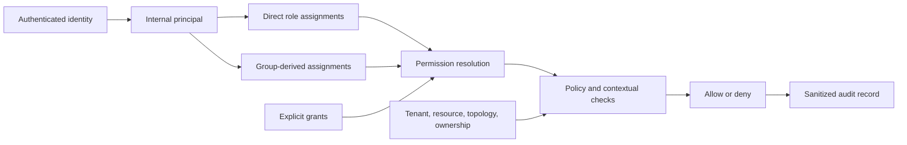
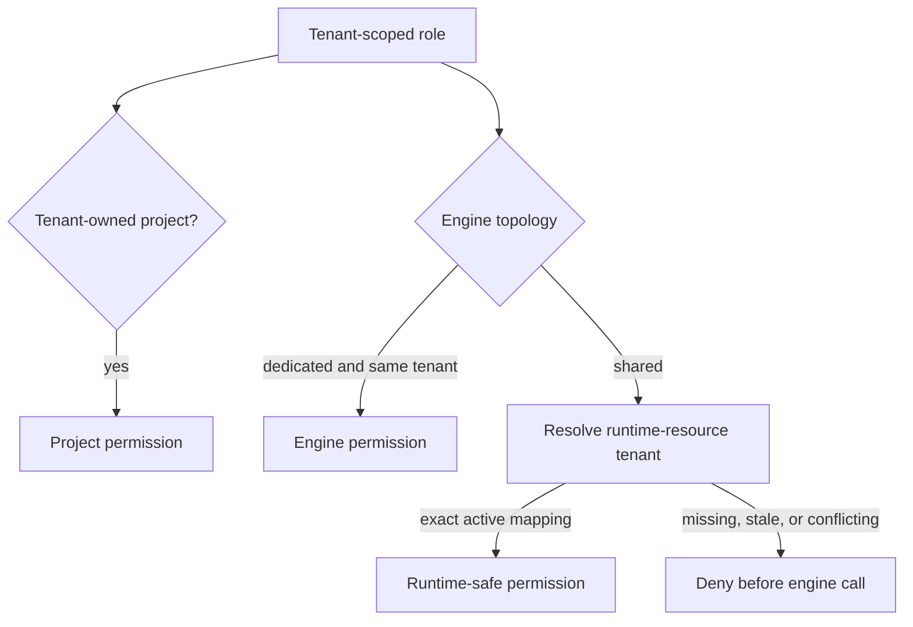

# OSS Authorization and Access Control Model

## Purpose

This document describes the authorization architecture implemented by
EnterpriseGlue OSS. It covers principals, scoped roles, permissions, policy
evaluation, tenant boundaries, engine topology, identity reconciliation, and
the separation between frontend capability hints and backend authority.

Implementation progress, product priorities, UX reviews, and release-program
checklists are maintained outside the source repository. Executable contracts
and current operator procedures are linked at the end of this document.

## Authorization flow

```mermaid
flowchart LR
  Identity[Authenticated identity] --> Principal[Internal principal]
  Principal --> Direct[Direct role assignments]
  Principal --> Groups[Group-derived assignments]
  Direct --> Permissions[Permission resolution]
  Groups --> Permissions
  Grants[Explicit grants] --> Permissions
  Permissions --> Policy[Policy and contextual checks]
  Context[Tenant, resource, topology, ownership] --> Policy
  Policy --> Decision[Allow or deny]
  Decision --> Audit[Sanitized audit record]
```

Authentication establishes identity. It never authorizes a resource action by
itself. The backend resolves the internal principal and evaluates the action,
scope, tenant, target resource, assignment source, and applicable policy on
every protected request.

## Principals and assignments

Scoped role assignments support users, groups, API clients, and service
accounts. An assignment identifies the tenant, principal, role, scope, source,
and optional source reference. Assignment sources distinguish manual,
configuration-managed, identity-provider-managed, API-managed, and system
ownership. Source ownership determines which control plane may change or
remove the row; it does not create another authorization path.

System roles provide stable platform, project, engine, and tenant semantics.
Custom roles are tenant-scoped allow-only permission bundles. Deny behavior is
expressed through policy and contextual checks so a custom role cannot
silently override a stricter safety rule.

## Resource scopes

| Scope | Typical responsibility | Examples |
| --- | --- | --- |
| Platform | Global control-plane administration | users, settings, identity providers, policies |
| Tenant | Tenant-owned resources and runtime-safe inheritance | tenant projects, dedicated engines, mapped shared-engine resources |
| Project | Design-time collaboration and deployment preparation | files, versions, members, project-engine targets |
| Engine | Engine lifecycle and runtime operations | deployments, instances, jobs, incidents, tasks |
| Runtime resource | Fine-grained access inside a shared engine | process, decision, or resolved tenant resource |

Platform administration is not an unconditional bypass for project or engine
authorization. A route must request a defined platform permission or evaluate
the applicable resource scope. Project ownership and engine ownership remain
resource-scoped responsibilities.

## Decision order

The permission service combines applicable system roles, custom roles,
group-derived assignments, explicit grants, and compatibility inputs. It then
applies deny and contextual policy. The effective result is fail-closed:

1. Resolve the authenticated principal and tenant context.
2. Resolve the requested action to a catalogued permission.
3. Resolve the target scope and resource.
4. Reject missing, conflicting, stale, or cross-tenant context.
5. Collect direct and inherited allow inputs.
6. Apply policy, topology, ownership, and request-context constraints.
7. Return allow only when a complete applicable path remains.
8. Record the decision with sensitive fields redacted by default.

Legacy project, engine, and platform membership fields remain compatibility
inputs where a migrated route explicitly supports them. New control planes use
the canonical assignment and permission model.

## Tenant and engine topology

Tenant scope sits between platform and project/engine resources. A tenant
assignment may inherit only to resources whose persisted or resolved tenant
matches the authenticated tenant.

```mermaid
flowchart TD
  TenantRole[Tenant-scoped role] --> Project{Tenant-owned project?}
  TenantRole --> Engine{Engine topology}
  Project -->|yes| ProjectAccess[Project permission]
  Engine -->|dedicated and same tenant| Dedicated[Engine permission]
  Engine -->|shared| Resolve[Resolve runtime-resource tenant]
  Resolve -->|exact active mapping| Runtime[Runtime-safe permission]
  Resolve -->|missing, stale, or conflicting| Deny[Deny before engine call]
```

Dedicated engines have one tenant owner. Shared engines must use
resource-aware authorization and versioned runtime-resource mappings. A broad
engine or Engine Set assignment is not runtime authority for shared resources.
Unmapped, conflicting, stale, null-tenant, and sibling-tenant resources are
rejected before an upstream engine call.

OSS exposes tenant-compatible contracts and uses its canonical default tenant
when an explicit tenant is not required. Null tenant state is not treated as
authorization for an existing engine or shared runtime resource.

## Identity-provider reconciliation

OIDC, SAML, and LDAP inputs are normalized to provider-specific external
identities and internal groups. Provider claims are reconciliation inputs, not
runtime permissions. Sign-in and scheduled reconciliation update owned group
memberships and assignment lineage; runtime authorization reads the canonical
internal model.

Manual and identity-provider-managed access can coexist during an explicit
transition. Managed rows remain visible but cannot be removed by a manual UI
operation. Effective Access explains the contributing role, group, source,
tenant, and resource mapping without exposing credentials or raw identity
tokens.

## Engine and project configuration ownership

Portal actions, JSON configuration bundles, external registration APIs, and
identity synchronization write the same persistence model. Each object carries
source ownership so preview/apply can distinguish create, adopt, update, skip,
and conflict outcomes.

Configuration apply is hash-bound and previewed. Source-owned fields reject
uncoordinated portal writes. Engine onboarding, project-engine targets, access
authority, and runtime authorization mode are independent controls; changing
one does not silently change the others.

Customer-managed sidecars are registered engine endpoints. EnterpriseGlue
authorizes the user or machine principal before making the outbound call. The
sidecar injects its downstream engine credential on the customer-controlled
hop; that credential is never stored in EnterpriseGlue configuration,
persistence, OpenAPI, UI, logs, audit payloads, or support diagnostics.

## Engine-native authorization compatibility

`enterpriseglue_authoritative` is the normal runtime mode. The bounded
`mirrored_engine_backstop` mode may translate an approved subset of mapped
group process/decision read grants to Camunda 7 or Operaton. Mirroring is
hash-bound, ownership-aware, reversible, and covered by drift receipts. It is
a compatibility backstop, not a second source of EnterpriseGlue authority.

Importing arbitrary engine-native grants as authoritative EnterpriseGlue
assignments is not part of the OSS authorization contract.

## Frontend capability boundary

The frontend consumes effective capability snapshots to hide unavailable
navigation and actions. These are user-experience hints only. Every protected
backend route repeats authorization using the current principal, resource, and
context.

Mounted plugin actions follow the same rule: the host exposes only declared
plugin slots and capability-filtered context, while backend plugin APIs enforce
host permissions independently. A frontend contribution cannot grant itself
authority.

## Public contracts

The supported technical contract includes:

- permission catalog, roles, assignments, groups, and policy schemas;
- `GET /api/authz/me/permissions` capability snapshots;
- effective-access and sanitized decision explanation APIs;
- JSON bundle preview, hash-bound apply, export, and apply history;
- engine registration, topology, tenant mapping, and transition APIs;
- OpenAPI route metadata and strict route-inventory validation; and
- sanitized authorization and configuration audit events.

API and configuration consumers should use published schemas rather than
database tables. Persistence migrations and compatibility fields may change
while the supported API and schema contract remains versioned.

## Security invariants

- Backend authorization is authoritative; frontend state never grants access.
- Missing or ambiguous tenant/resource context fails closed.
- Shared-engine runtime access requires an exact active resource mapping.
- Secret values use the supported secret-resolution path and are excluded from
  export, logs, audit payloads, and support evidence.
- Assignment ownership is enforced across UI, API, configuration, and identity
  synchronization.
- Audit reads are redacted unless the caller has the explicit unredacted audit
  permission.
- External sidecar peer credentials remain outside EnterpriseGlue.
- Engine-native mirroring cannot expand beyond the approved translation
  contract.

## Executable verification

Authorization and engine-tenancy verification is anchored in machine-readable
route, action, functional-coverage, database-matrix, and browser contracts.
Retained release evidence records the exact commit and rejects stale,
incomplete, or cross-commit qualification.

Use these maintained technical documents:

- [Access Governance and Headless Configuration API](../reference/access-governance-and-headless-api.md)
- [Engine Tenancy Data Model](../reference/engine-tenancy-data-model.md)
- [Engine Tenancy and Provisioning API](../reference/engine-tenancy-and-provisioning-api.md)
- [Configure Authorization, Identity, and Engines](../how-to/configure-authorization-and-engines.md)
- [Deploy Authorization Configuration](../how-to/deploy-authorization-config.md)
- [Configure Dedicated and Shared Engine Tenancy](../how-to/configure-engine-tenancy.md)
- [Test Engine Tenancy and Fine-Grained Access Control](../development/testing-engine-tenancy-and-access-control.md)
- [Camunda 7 Native Grant Migration](../development/camunda7-native-grant-migration.md)
