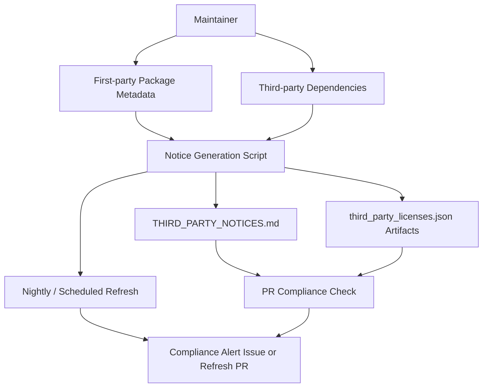

# OSS License Compliance and Third-Party Management

## Purpose
This document describes how EnterpriseGlue OSS manages first-party licensing, third-party license notice generation, and compliance controls intended to keep exposed OSS artifacts aligned with `Apache-2.0` and to flag third-party dependency risks that may be incompatible with Apache-2.0 distribution.

## Licensing Control Objectives
- keep exposed first-party OSS artifacts consistently declared as `Apache-2.0`
- maintain a generated inventory of third-party runtime dependencies and their license metadata
- detect third-party licenses that may require review for Apache-2.0-compatible distribution
- enforce notice freshness and compatibility review in CI rather than relying only on manual checks

## License Compliance Architecture Diagram

## First-Party Licensing Model
### Base project license
- The repository root `LICENSE` file declares the Apache License 2.0.
- The project intent for exposed OSS artifacts is that distributed first-party packages and applications are declared as `Apache-2.0`.

### Exposed package metadata
**Relevant first-party package declarations**
- `backend/package.json`
- `frontend/package.json`
- `packages/backend-host/package.json`
- `packages/frontend-host/package.json`
- `packages/shared/package.json`
- `packages/enterprise-plugin-api/package.json`

**Architectural note**
- Package-level `license` metadata matters because package managers, scanners, and downstream consumers will inspect those package manifests directly.
- Root licensing alone is not sufficient if exposed package manifests declare a different license string.

## Third-Party Notice Generation Model
### Generated artifacts
The compliance model generates and maintains:
- `THIRD_PARTY_NOTICES.md`
- `third_party_licenses.json`
- workspace-specific `third_party_licenses.json` artifacts for backend, frontend, and packages

### Generation entry points
**Primary commands**
- `pnpm run licenses:update`
- `pnpm run licenses:check`
- `bash ./scripts/update-third-party-notices.sh`
- `bash ./scripts/update-third-party-notices.sh --check --strict`

**Key implementation files**
- `scripts/update-third-party-notices.sh`
- `scripts/generate-third-party-notices.mjs`
- `scripts/generate-third-party-notices.test.mjs`

### What the generator does
- traverses root and workspace runtime dependency trees
- normalizes license metadata from package manifests and, when needed, from embedded license texts
- aggregates dependency license data across backend, frontend, and published packages
- writes machine-readable JSON artifacts and the human-readable `THIRD_PARTY_NOTICES.md`
- excludes first-party workspace packages from the third-party notice inventory so the notice file remains focused on external dependencies

## Apache-2.0 Compatibility Review Controls
### Compatibility signals that trigger review
The generator flags dependencies for review when it encounters:
- copyleft-style licenses such as GPL, AGPL, or LGPL
- dual-license expressions that include a copyleft option alongside a permissive option
- unknown or unresolvable license metadata

### Strict failure mode
- `scripts/update-third-party-notices.sh --strict` enables strict compatibility enforcement.
- Internally, this sets `EG_FAIL_ON_LICENSE_INCOMPATIBLE=true` for the generator.
- In strict mode, potential Apache-2.0 incompatibility indicators cause a non-zero exit code so the check can fail in CI.

### Review outputs
The generated `THIRD_PARTY_NOTICES.md` can include dedicated review sections for:
- dual-licensed dependencies with copyleft options
- copyleft-flagged dependencies
- unknown-license dependencies

**Current operational signal**
- When these review sections are absent, the current generated notice set is not flagging a known review-required third-party incompatibility at generation time.

## CI and Automation Controls
### Pull request verification
The repo includes a dedicated workflow:
- `.github/workflows/third-party-notices.yml`

On pull requests affecting dependency or notice-related inputs, it:
- installs dependencies
- runs `bash ./scripts/update-third-party-notices.sh --check --strict`
- fails if committed notice artifacts are stale
- fails if potential Apache-2.0 incompatibility indicators are detected in strict mode
- uploads a verification log artifact for review

### Scheduled refresh and compliance monitoring
The same workflow also runs on a schedule and on manual dispatch.

In scheduled/manual mode it:
- refreshes generated notice artifacts with strict compatibility checks
- creates or updates a compliance alert issue if the refresh fails
- closes the alert issue when the refresh succeeds again
- creates an automated pull request with refreshed notice artifacts when the refresh succeeds and files change

## Architectural Boundaries and Responsibilities
### Maintainers and reviewers
- choose dependencies and approve dependency changes
- interpret flagged license-review findings
- decide whether a dependency is acceptable for Apache-2.0-aligned distribution

### Generation scripts
- provide repeatable, deterministic notice generation and compatibility signaling
- do not replace legal review, but reduce the risk of unnoticed drift or stale attribution data

### CI workflows
- enforce freshness and review gates early in pull requests
- provide ongoing scheduled detection of notice drift or compatibility issues

## Control Limitations
- License compatibility is inferred from package metadata and available license texts; it is not a substitute for formal legal review.
- Strict mode is intentionally conservative, especially for copyleft-style detections and ambiguous license expressions.
- The control model is strongest for dependencies represented in the npm dependency graph and associated installed package metadata.

## Related Documents
- `00-architecture-overview.md`
- `07-oss-security-and-trust-boundaries.md`
- `08-oss-information-data-architecture.md`
