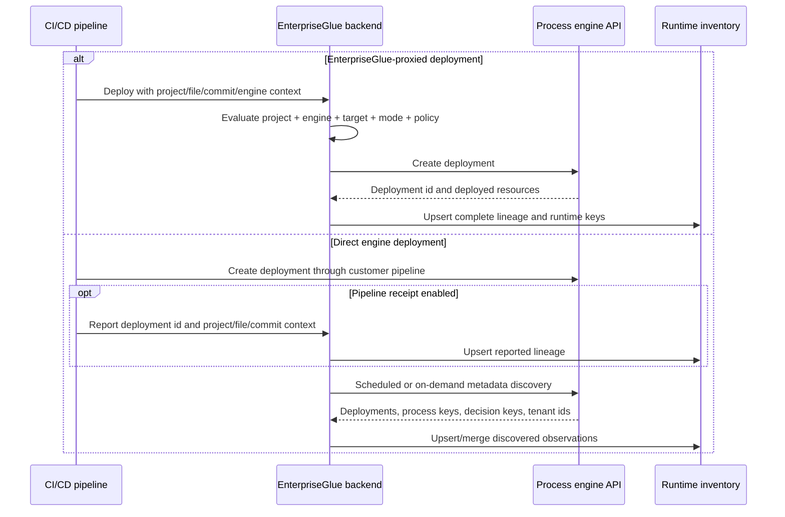
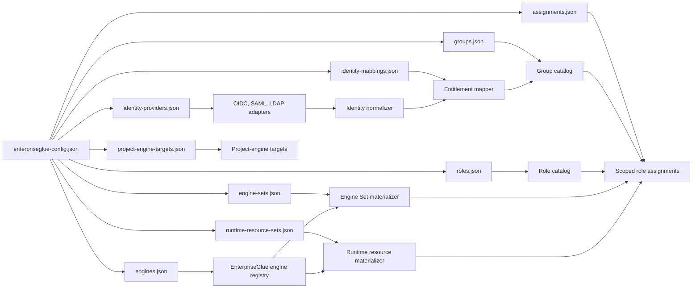
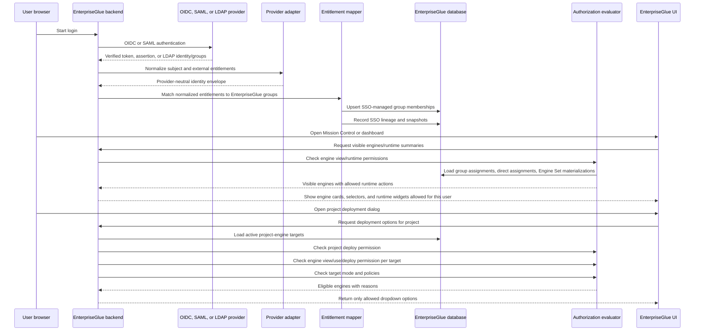
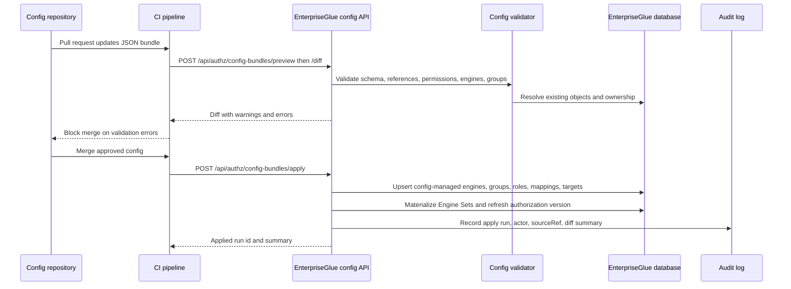
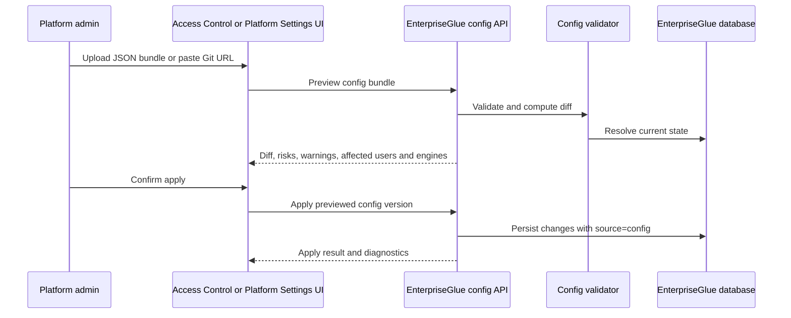

# JSON-Driven Authorization and Engine Registration Plan

Last updated: 2026-07-12

## Purpose

This document defines the target design and implementation plan for customer-managed JSON configuration of:

- EnterpriseGlue custom roles and permission bundles.
- EnterpriseGlue internal groups.
- Provider-neutral OIDC, SAML, and LDAP entitlement mappings into EnterpriseGlue groups.
- Per-engine and per-Engine Set role assignments.
- Runtime resource-level role assignments for customers using one shared central process engine.
- Engine registration using JSON that matches the current EnterpriseGlue engine UI and APIs.
- Project-to-engine deployment targets used by deployment dropdowns and Mission Control/Starbase navigation.

The design keeps the runtime authorization model simple:

```text
verified external identity -> normalized entitlement -> EnterpriseGlue group -> scoped role assignment -> permission -> policy/context decision
```

JSON files are a provisioning source. Runtime authorization must use persisted EnterpriseGlue records and the authorization evaluator, not raw JSON or raw JWT claims.

## AI Agent Progress Tracker

Use this tracker as the next-phase implementation handoff. The sections below contain the design detail and examples for each todo item.

Status legend:

- [x] ✅ Done
- [ ] ⬜ Todo
- [ ] ⏸ Deferred

Current config-as-code status:

- [x] ✅ RBAC foundation prerequisites exist: principal-scoped assignments, groups, custom roles, custom permissions, Engine Sets, project-engine targets, SSO mappings, SSO snapshots, external engine registration, and OpenAPI route inventory.
- [x] ✅ Design decisions are documented for JSON bundle shape, role/group mapping, custom roles, engine registration, engine metadata, project-engine targets, and dropdown/runtime filtering expectations.
- [x] ✅ Central shared-engine strategy is documented with `enterpriseglue_authoritative` as v1 and engine-native modes deferred.
- [x] ✅ Provider-neutral identity normalization, distributed-versus-central runtime scoping, dual deployment ingestion, and the focused v1 runtime resource boundary are documented.
- [x] ✅ Target operator guides now cover platform configuration and deployment/CI-CD operationalization without presenting unimplemented interfaces as currently available.
- [ ] ⬜ Complete the end-to-end alignment gate: clean principal assignments, external identity links, provider-id-bound login, secure secrets, config ownership fields, project-target ownership, runtime assignment semantics, and legacy authorization removal.
- [x] ✅ Implement shared JSON config bundle schemas, strict canonical validation, deterministic config keys, SHA-256 bundle hashing, and hash-bound persistence for the currently supported object families.
- [x] ✅ Implement provider-neutral identity adapters and entitlement mappings for OIDC, SAML, and LDAP.
- [x] ✅ Implement deterministic identity adapter contract tests across OIDC, SAML, LDAP, and adapter lookup dispatch.
- [x] ✅ Add Playwright smoke coverage for the administrator Identity Providers flow and complete the direct-LDAP form surface, including bounded directory enumeration and scheduled reconciliation controls.
- [ ] ⬜ Implement containerized protocol-faithful mock OIDC, SAML, and LDAP services for browser end-to-end testing. The in-process contract harness now exercises OIDC discovery/PKCE/JWKS, SAML attributes, and LDAP bind/group semantics.
- [x] ✅ Expose side-effect-free strict config-bundle preview at `POST /api/authz/config-bundles/preview`, protected by `platform.authz.roles.manage`, with OpenAPI and route-inventory coverage.
- [x] ✅ Persist custom-role source ownership (`system`, `manual`, `config`, `api`, or `automation`) and stable source references for the future bundle compiler.
- [x] ✅ Validate cross-file bundle references for roles, permissions, groups, identity providers, engines, Engine Sets, runtime resource sets, assignments, and project-engine targets before future persisted-reference resolution.
- [x] ✅ Expand copied custom-role templates during preview, including same-scope validation and cycle detection; apply persists the expanded permission list.
- [x] ✅ Add `POST /api/authz/config-bundles/diff` for side-effect-free persisted role/group/engine/Engine Set/Runtime Resource Set/identity-provider/identity-mapping/project-engine-target/scoped-assignment create, update, no-op, conflict, and authoritative-archive previews. It returns deterministic warnings and acknowledgement ids for destructive authoritative removals, broad Engine Sets, and broad identity mappings; apply recomputes and enforces those acknowledgements. It also reports non-PII current-group membership impact counts and flags identity-mapping changes whose external impact cannot be counted locally.
- [x] ✅ Add hash-bound `POST /api/authz/config-bundles/apply` for roles, groups, engines, Engine Sets, Runtime Resource Sets, scoped group assignments, provider-neutral identity providers/mappings, and project-engine targets. It runs one transaction, writes audit rows, rejects stale previews and ownership conflicts, refuses unsupported object families rather than ignoring them, and source-cleans derived memberships when an authoritative config mapping is changed or disabled.
- [x] ✅ Persist engine config provenance (`configKey`, source reference/hash, ownership mode, last applied time) plus `runtimeAccessScope`, `deploymentIntegration`, and `connectionMode` with backward-compatible defaults.
- [x] ✅ Persist provider-neutral identity-provider keys and source references so entitlement mappings resolve configured providers safely; config-bundle creation/update/archive is supported.
- [x] ✅ Implement config preview, diff, hash-bound apply, source-owned export, run history, audit, and rollback-safe ownership semantics. Apply runs are idempotent, source-scoped, and preserve manual/API/identity-provider/system-owned records.
- [x] ✅ Implement UI and CI/CD workflows for config bundle upload/import/export/apply and managed-by-config drift diagnostics. Platform Settings provides preview, secret preflight, diff acknowledgements, apply, export, and run details; `scripts/config-bundle.mjs` and the protected `config-bundle` GitHub workflow use the same APIs.
- [x] ✅ Update deployment scripts, Compose/OpenShift manifests, environment templates, readiness, rollback, security, troubleshooting, and operator docs for the config runtime. The bundle and secret mounts remain separate and read-only.
- [x] ✅ Implement central-engine runtime resource inventory, runtime resource sets, materialization, and authorization filtering for Mission Control/dashboard reads. The remaining route-family audit is tracked separately below.
- [x] ✅ Persist and expose the v1 `engineRuntimeAuthorizationMode`; all settings and bundle schemas reject unsupported modes and normalize missing legacy values to `enterpriseglue_authoritative`. Runtime-resource route filtering remains a later phase.
- [x] ✅ Implement first-class `customer_sidecar` engine connection mode, endpoint-auth policy, shared connection resolution, UI/config/OpenAPI fields, and mock-sidecar transport tests. The shared diagnostics remain enum-only and keep endpoint URLs and credentials out of responses; the downstream peer token remains outside EnterpriseGlue.
- [ ] ⏸ Defer EnterpriseGlue-issued sidecar action-token integration, sidecar principals/heartbeats/inventory, mirrored engine backstop, and engine-native authority/import modes.

## Core Decisions

- [x] ✅ Keep default system roles immutable and use them as stable templates and platform defaults.
- [x] ✅ Allow customers to create editable custom roles with allow-only permissions.
- [x] ✅ Normalize external Entra/OIDC/SAML claims into EnterpriseGlue groups before assigning permissions.
- [x] ✅ Normalize OIDC, SAML, and LDAP identities into one provider-neutral identity envelope before mapping entitlements to EnterpriseGlue groups.
- [x] ✅ Support users having different roles on different engines through scoped role assignments.
- [x] ✅ Default distributed engines to engine-wide runtime access and allow central engines to opt into resource-aware runtime filtering without changing the authorization authority mode.
- [x] ✅ Support EnterpriseGlue-proxied deployment and direct engine deployment with optional pipeline receipts plus mandatory metadata reconciliation.
- [x] ✅ Keep v1 runtime assignment scopes focused on engine, runtime tenant, process definition key, decision definition key, and runtime resource set.
- [x] ✅ Keep production configuration bundles separate from test-only identity fixtures while validating both through shared provider and mapping contracts.
- [x] ✅ Support central shared engines by adding runtime resource scopes below the engine, for example process definition key and decision definition key.
- [x] ✅ Make `enterpriseglue_authoritative` the v1 runtime authorization mode and keep engine-native mirroring/import as later explicit modes.
- [x] ✅ Keep engine registration separate from engine authorization, then combine them in dropdown and deployment eligibility APIs.
- [x] ✅ Keep runtime authorization based on database records and evaluator decisions, not direct JSON reads.
- [x] ✅ Add config-bundle preview, diff, hash-bound apply, server-side export, apply-run history, and ZIP-to-envelope import endpoints. The same ZIP adapter is available to the UI, CI CLI, and bootstrap path.
- [x] ✅ Add UI and CI/CD workflows for managing config bundles.
- [x] ✅ Add config-managed source ownership and drift diagnostics for imported objects. Config-locked and config-warn states are surfaced in the relevant access-control and role-management views.
- [x] ✅ Add a Role Library with a fixed-width role list and focused single-role grouped permission editor. The legacy matrix remains available in Access Control for compatibility until it can be removed.
- [ ] ⬜ Add customer-managed sidecar transport to the existing engine configuration and runtime connection paths without creating a parallel authorization model.
- [x] ✅ Close the frontend action inventory gap: bridge evaluation actions are referenced by the shared authoritative bridge client, while the aggregate `engine.instances.mutate` action is explicitly API-only because concrete runtime mutation actions own mounted UI controls.

## Relationship To Implemented RBAC Foundation

This document describes the next implementation phase after the RBAC foundation. It assumes the following are already available from the current `feat/sso-engine-assignments` worktree:

- [x] ✅ Principal-scoped role assignments for users, groups, API clients, and service accounts.
- [x] ✅ Custom roles, custom permissions, allow-only role semantics, role assignment APIs, and Effective Access explanations.
- [x] ✅ SSO group mappings, SSO engine assignment mappings, SSO access snapshots, access-authority transition controls, and high-risk mapping guardrails.
- [x] ✅ Engine Sets, project-engine targets, deployment eligibility, external engine systems, external engine registration, lifecycle/decommission behavior, capability drift diagnostics, and source-owned field enforcement.
- [x] ✅ Scope external-engine inventory, audit reads, lifecycle operations, and reconciliation to the associated engine tenant; negative route coverage proves a foreign engine is neither visible nor decommissioned.
- [x] ✅ Shared action registry, OpenAPI `x-enterpriseglue-authz`, strict backend route inventory guard, strict frontend action inventory guard, and mounted frontend action gating.

The remaining work in this document is not to rebuild those foundations. It is to add:

- [ ] ⬜ A Phase 0 contract normalization pass where the implemented compatibility model conflicts with the clean target model.
- [x] ✅ Configuration-as-code import/export/preview/apply flows on top of the existing RBAC and engine registry services.
- [x] ✅ Config source ownership and drift handling for the supported imported objects. Remaining ownership extensions are kept explicitly scoped in the source-ownership checklist.
- [x] ✅ Central-engine runtime resource scopes below an engine, with Mission Control/dashboard filtering by process and decision resource subsets.
- [x] ✅ `engineRuntimeAuthorizationMode` v1 enforcement with `enterpriseglue_authoritative` as the only active mode.

## Current Platform Capabilities To Reuse

- [x] ✅ Engine records already support `name`, `baseUrl`, `type`, `externalId`, labels, auth fields, version, environment tag, lifecycle/source metadata, and tenant scope.
- [x] ✅ Manual engine creation remains available at `POST /engines-api/engines`.
- [x] ✅ API-based external engine upsert exists at `POST /engines-api/external/engines`.
- [x] ✅ Engine list reads are filtered through `engineService.getUserEngines(...)` and authorization visible-collection checks.
- [x] ✅ Engine Sets support `all`, exact `engine_ids`, and label selectors with materialized membership.
- [x] ✅ Project-engine targets support active/disabled/archive state and deployment mode flags for manual, CI, API, and import.
- [x] ✅ SSO assignment mapping and SSO access snapshot services already support engine-scoped SSO-derived access.
- [x] ✅ Effective access evaluation can explain why a user has or lacks access.
- [ ] ⬜ Mission Control authorization is still mostly engine-scoped. Shared central engines require resource-level scopes and collection filtering before different projects can safely share one runtime engine.

## End-To-End Alignment Audit

The 2026-07-12 codebase review found that the implemented RBAC foundation is a useful starting point, but the following contracts must be normalized before config-as-code and central-engine authorization can be safely layered on top.

| Priority | Current code reality | Target alignment |
| --- | --- | --- |
| P0 | `role_assignments` still requires legacy `user_id`; its uniqueness constraint uses user/resource/source-mapping compatibility fields rather than principal/scope/source lineage. | Make `principal_type`, `principal_id`, `role_id`, `scope_type`, `scope_id`, `source`, and `source_ref` the canonical non-null uniqueness contract. Remove user/resource aliases from new writes and evaluation. |
| P0 | Legacy platform admin, project/member, engine/member, owner/delegate fallbacks still grant permissions and sync into RBAC. | Keep accountable owner metadata, but remove legacy authorization grants and `syncLegacyRoleAssignments` after greenfield seeding and UI/API migration. All authorization must come from scoped assignments and policies. |
| P0 | Provider-neutral OIDC, SAML, direct LDAP, and the legacy Microsoft/Google compatibility routes bind a selected persisted provider through login and reconciliation. | Retire Microsoft/Google compatibility routes only after provider-neutral replacements pass parity. |
- [x] ✅ Align the legacy Google compatibility flow with the shared SSO state and post-provisioning contract: tenant and return-path context now survive the OAuth start/callback round trip, and successful provisioning invokes the shared reconciliation hook. Google provisioning now also writes provider-neutral normalized identity and group-membership lineage inside the user transaction; generic OIDC remains the target replacement for the legacy Google endpoint.
- [x] ✅ Add a provider-neutral migration assistant for persisted legacy Microsoft, Google, and generic OIDC provider records plus environment-configured Microsoft and Google fallback settings. It produces a disabled direct-OIDC draft using only non-secret metadata, references existing environment secrets by `env://` name when applicable, requires callback/mapping/cutover steps, audits draft generation, and never decrypts or exposes legacy ciphertext. Final compatibility-route retirement remains pending.
- [x] ✅ Add a non-mutating migration-readiness check for a provider-neutral target. It verifies the matching direct login protocol, enabled state, secret-reference availability, and active identity-mapping blockers without revealing secret values.
- [x] ✅ Add an audited guarded cutover for persisted legacy Microsoft, Google, OIDC, and SAML provider records. `POST /api/identity/providers/legacy-cutover` rechecks readiness within the provider update transaction and disables only the selected legacy database record. Environment-based legacy authentication remains deployment-owned and is deliberately rejected by this endpoint.
- [x] ✅ Surface provider-neutral migration readiness from the Identity Providers row-action menu with Carbon success/warning status and concise blocker reasons. The UI deliberately contains no automatic archive action.
- [x] ✅ Document the controlled legacy-provider transition: prepare a disabled draft, configure only secret references and group mappings, validate readiness and a representative sign-in, then perform manual cutover with break-glass rollback available.
- [x] ✅ Extend the non-secret migration assistant to legacy SAML records. It creates a disabled direct-SAML draft with copied non-secret HTTPS endpoints and an explicit signing-certificate reference placeholder; legacy certificate ciphertext is never copied, decrypted, or returned.
| P0 | `User` has provider-specific Entra/Google columns but no general external identity link. Normalized identity snapshots are diagnostics, not a safe account-link model. | Add `external_identities` with unique tenant/provider/subject -> user linkage. Keep entitlement snapshots separate. Remove provider-specific user identity columns from the target model. |
| P0 | Provider `tenant_id` represents an external directory tenant while authorization entities use `tenant_id` as the EnterpriseGlue tenant boundary. | Split `tenantId` for EnterpriseGlue scope from `directoryTenantId`/issuer-specific configuration. Never overload the same field. |
| P0 | SSO provider secrets use reversible base64 marking and engine `password_enc` is consumed as plaintext by runtime clients. | Add one secret resolver/encryption boundary for UI, JSON config, and runtime. Production APIs store encrypted local values or opaque external refs; they never persist resolved plaintext. |
| P0 | Runtime permissions are engine-scoped and `requireAction(...)` authorizes only the engine before handlers fetch whole collections or instance details. | Add runtime-resource resolvers and a filtering service that performs query pushdown or bounded post-filtering and resolves instance/detail lineage before response or mutation. |
| P0 | The engine selector filters hard-coded legacy roles (`owner`, `delegate`, `operator`), excluding custom/runtime-resource viewers. | Return permission-derived engine visibility/capabilities from the backend and remove role-name filtering from selectors, Dashboard, and engine pages. |
| P0 | `project_engine_targets` enforces one row per project/engine pair, while some prose implies multiple source rows can coexist for the same pair. | Keep one effective target per pair. Config apply must skip, conflict, or explicitly transfer ownership of an existing manual row; it must never create competing mode flags. |
| P0 | Deployment and artifact rows require project lineage; direct engine discovery cannot satisfy it. The current edit-target resolver can fall back to file-key matching. | Make project/file lineage nullable, store lineage quality, and disallow bridge navigation from guessed file-key matches. Only complete or validated reported lineage can open the cross-product bridge. |
| P1 | Roles, permissions, providers, mappings, engines, and targets do not share complete config source/hash/apply metadata. | Add object-level config ownership fields and deterministic keys before bundle apply. Use explicit ownership transfer for manual objects. |
| P1 | `AccessControl.tsx`, the action registry, OpenAPI registry, and authz router are already very large monoliths. | Split them into domain modules before adding identity, config, and runtime-resource surfaces; preserve aggregate exports and route guards. |
| P1 | Current-user permission snapshots contain platform/project/engine permissions only. | Keep snapshots coarse. Do not add every process/decision key; runtime collections are backend-filtered and return row/action decisions where needed. |

### Locked Alignment Decisions

- [x] ✅ Keep one effective project-engine target per project/engine pair.
- [x] ✅ Keep runtime permissions in the engine permission namespace and allow an engine-scoped role to be assigned to an engine, Engine Set, exact runtime resource, or runtime resource set.
- [x] ✅ Model runtime tenant as a runtime resource kind, not a third top-level assignment resource type.
- [x] ✅ Keep navigation permission snapshots coarse; runtime-resource visibility is server-filtered.
- [x] ✅ Complete group-first default access: provider-neutral mappings can use `exists` to target an internal group. Legacy provider `defaultRole` is read-only for migration/cutover compatibility and is no longer used by the legacy SAML authorization path.
- [x] ✅ Treat the current SSO platform-role and direct-engine mapping models as migration inputs, not parallel target models. Product wizards may create a managed internal group plus scoped assignment, but runtime lineage stays entitlement -> group -> assignment.
- [x] ✅ Require exact provider-id-bound login and reconciliation for every protocol. Microsoft/Google compatibility routes now bind selected provider configuration, callback state, account-link promotion, normalized identity, mapping, diagnostics, hook context, and audit to the same record; provider-API reconciliation remains a separate pending capability.
- [x] ✅ Require a real secret resolver/encryption service before config bundle apply can handle provider or engine credentials.
- [x] ✅ Make the Phase 0 alignment gate a prerequisite for Phase 1 config schemas and runtime-resource persistence.

## Recommended Config Bundle

Support both a folder bundle and a single-file bundle. Folder bundles are better for enterprise GitOps review.

```text
enterpriseglue-config/
  enterpriseglue-config.json
  engines.json
  engine-sets.json
  runtime-resource-sets.json
  roles.json
  groups.json
  assignments.json
  identity-providers.json
  identity-mappings.json
  project-engine-targets.json

test/identity-mocks/
  subjects.json
  oidc-provider.json
  saml-provider.json
  ldap-directory.json
  scenarios.json
```

Files under `test/identity-mocks/` are test-harness inputs and must never be accepted as production config-bundle imports. They may reference the same provider keys, external subject ids, entitlement ids, and internal group keys so contract tests exercise the production schemas.

The root manifest imports the other files and defines apply mode.

```json
{
  "apiVersion": "enterpriseglue.ai/v1alpha1",
  "kind": "EnterpriseGlueConfigBundle",
  "metadata": {
    "key": "acme-prod-authz",
    "description": "Production authorization and engine inventory",
    "owner": "iam-platform-team"
  },
  "tenantKey": "default",
  "mode": "authoritative",
  "settings": {
    "engineAccessAuthority": "sso_managed",
    "projectAccessAuthority": "manual",
    "engineOnboardingMode": "external_only",
    "projectEngineTargetMode": "hybrid",
    "engineRuntimeAuthorizationMode": "enterpriseglue_authoritative"
  },
  "imports": [
    "./engines.json",
    "./engine-sets.json",
    "./runtime-resource-sets.json",
    "./roles.json",
    "./groups.json",
    "./assignments.json",
    "./identity-providers.json",
    "./identity-mappings.json",
    "./project-engine-targets.json"
  ]
}
```

### Platform Settings In The Bundle

The `settings` block controls who owns engine inventory, project-to-engine relationships, and human access assignments. These settings are platform-wide defaults and should be applied with the same preview/diff discipline as roles, groups, and engines.

```json
"settings": {
  "engineAccessAuthority": "sso_managed",
  "projectAccessAuthority": "manual",
  "engineOnboardingMode": "external_only",
  "projectEngineTargetMode": "hybrid",
  "engineRuntimeAuthorizationMode": "enterpriseglue_authoritative"
}
```

#### `engineAccessAuthority`

Controls how engine access assignments are managed in the UI and cleanup workflows. It does not change the evaluator formula: EnterpriseGlue still evaluates all valid role assignments and policies.

| Value | Meaning | UI behavior | Typical use |
| --- | --- | --- | --- |
| `manual` | Manual engine access is the primary operating mode. | Admins can add, update, and remove manual engine access. SSO-derived rows may be visible for diagnostics if mappings exist. | Standalone installs or early setup before SSO is authoritative. |
| `transition_to_sso` | Manual and SSO-derived engine access coexist while the customer moves to SSO. | UI shows both manual and SSO rows, highlights duplicates, and enables explicit cleanup preview/apply for duplicate manual rows. | Migration from manually managed access to Entra/OIDC/SAML managed access. |
| `sso_managed` | SSO is the intended authority for engine access. | SSO-owned rows are source-owned and not directly removable in normal member management. Manual rows may remain for break-glass or explicitly selected exceptions. | Enterprise deployments where engine access is governed by identity provider claims and config. |

Important rules:

- `sso_managed` must not delete manual access automatically.
- Cleanup of duplicate manual access must go through explicit transition cleanup preview/apply.
- SSO-derived access rows should show lineage to the claim, mapping, group, role, and engine or Engine Set.

#### `projectAccessAuthority`

Controls how project membership/access is managed. Project access can remain manual even when engine access is SSO-managed.

| Value | Meaning | UI behavior | Typical use |
| --- | --- | --- | --- |
| `manual` | Project access is owned by project owners, delegates, or platform admins. | Project member dialogs allow manual add/update/remove according to permissions. | Most teams where projects are created and staffed inside EnterpriseGlue. |
| `transition_to_sso` | Manual and SSO-derived project access coexist during migration. | UI can show both sources and support duplicate diagnostics when SSO project mappings are introduced. | Customers gradually moving project access to IdP groups. |
| `sso_managed` | SSO/config is the intended project access authority. | SSO-owned rows are not normally removable in project member UI; manual controls are restricted to manual exceptions. | Enterprises where project access is centrally governed. |

For the near-term roadmap, engine access is the stronger SSO use case. Project access may intentionally stay `manual` because many customers want project teams to be managed locally while engine access is governed centrally.

#### `engineOnboardingMode`

Controls how engines enter the EnterpriseGlue engine registry.

| Value | Meaning | UI/API behavior | Typical use |
| --- | --- | --- | --- |
| `manual_allowed` | Manual UI registration and external/API registration are both allowed. | Platform admins can create engines in the UI; external API/config can also register engines. | Default mode and easiest local setup. |
| `external_only` | Engine lifecycle is owned by config or external systems. | Manual create/delete actions are hidden or rejected; config/API registration is the expected path. | GitOps/IaC-owned engine inventory. |
| `hybrid` | Manual engines and external/config-owned engines coexist. | UI allows manual engines while preserving source-owned fields on external/config-managed engines. | Migration phase or mixed ownership by environment/domain. |

In `external_only`, manual edits to config-owned or externally registered engine fields should be blocked unless the field is explicitly manual-owned. This prevents UI drift from the customer's source of truth.

#### `projectEngineTargetMode`

Controls how project-to-engine deployment target relationships are managed. These targets decide whether an engine is eligible for a project's deployment dropdown after permissions pass.

| Value | Meaning | UI/API behavior | Typical use |
| --- | --- | --- | --- |
| `manual_allowed` | Project owners/admins can manage deployment targets locally. | Manual target add/update/remove is available according to permissions; source-owned targets stay protected. | Default local/project-led deployment setup. |
| `external_only` | Project-engine target relationships are owned by config or external systems. | Manual target changes and legacy sync are blocked; only source-owned targets count for eligibility. | Enterprises where deployment topology is governed centrally. |
| `hybrid` | Manual and source-owned targets coexist. | UI can manage manual targets while config/external targets remain source-owned. | Recommended when projects stay local but some engine connectivity is centrally governed. |

#### `engineRuntimeAuthorizationMode`

Controls how EnterpriseGlue and engine-native authorization interact for runtime artifacts such as process definitions, decision definitions, instances, jobs, incidents, variables, batches, migrations, and history. This setting is separate from engine access authority. `engineAccessAuthority` decides how users get EnterpriseGlue roles on engines. `engineRuntimeAuthorizationMode` decides whether EnterpriseGlue alone, EnterpriseGlue plus a mirrored engine backstop, or the engine itself is the source of runtime resource authorization.

| Value | Meaning | Product behavior | Roadmap |
| --- | --- | --- | --- |
| `enterpriseglue_authoritative` | EnterpriseGlue is the source of truth for product authorization. Engine-native permissions are not edited as a separate product model. | EnterpriseGlue evaluates scoped roles, runtime resource sets, policies, project-engine targets, and route context. The backend may call the engine with a configured service identity, customer sidecar, or gateway identity. | Implement in v1. This is the default and recommended mode. |
| `mirrored_engine_backstop` | EnterpriseGlue remains the source of truth, but selected EnterpriseGlue runtime permissions are mirrored to the engine where technically possible. | Admins still edit EnterpriseGlue roles/groups/resource sets. Engine-native authorization is shown as sync/backstop status, not as a second permission editor. Engine denial after EnterpriseGlue allow is surfaced as `engine_backstop_denied`. | Later phase after v1, mainly for customers who expose Camunda directly or require native engine defense-in-depth. |
| `engine_native_authority` | The engine's native authorization model is treated as the runtime source of truth and EnterpriseGlue reflects or imports it. | EnterpriseGlue would need to read/sync engine-native users, groups, permissions, tenants, and resource ids, then map them back to UI decisions and diagnostics. | Defer. This is complex and should not block v1 because it conflicts with EnterpriseGlue project, Starbase, SSO, config, and policy concepts. |

Conflict rule:

```text
enterpriseglue_authoritative:
  final decision = EnterpriseGlue evaluator decision

mirrored_engine_backstop:
  final product decision = EnterpriseGlue evaluator decision
  execution can still fail closed if the engine backstop denies the call

engine_native_authority:
  final decision requires imported engine-native authorization plus EnterpriseGlue context checks
```

The UI should not expose two independent permission matrices for the same action. Product admins should configure EnterpriseGlue roles, groups, runtime resource sets, and policies. If a later engine-native mode is enabled, the UI should show engine sync/backstop diagnostics next to the EnterpriseGlue decision.

Visibility and dropdown implications:

For general engine surfaces such as Mission Control, engine overview pages, engine selectors, and dashboard engine widgets, project access is not required. The user should see an engine when they have an engine-scoped permission that grants visibility.

```text
engine exists and is active
+ user has engine view/runtime permission on the engine or a matching Engine Set
+ policy/context checks pass
= engine appears in Mission Control, engine lists, and dashboard engine views
```

For project deployment dropdowns and project-specific engine options, project access and project-engine target eligibility are also required.

```text
engine visible to user
+ user has project deploy permission
+ user has engine deploy/use permission
+ active project-engine target exists
+ requested deployment mode is allowed
= engine appears in the deployment dropdown
```

#### Example Combination

This example:

```json
"settings": {
  "engineAccessAuthority": "sso_managed",
  "projectAccessAuthority": "manual",
  "engineOnboardingMode": "external_only",
  "projectEngineTargetMode": "hybrid",
  "engineRuntimeAuthorizationMode": "enterpriseglue_authoritative"
}
```

means:

- Engines are registered by JSON/API/external systems, not manually in the UI.
- Engine access comes from SSO/config-managed group mappings.
- Project membership remains managed inside EnterpriseGlue.
- Project-to-engine deployment targets can be centrally configured, but manual project targets may also exist where permitted.
- Runtime resource authorization is decided by EnterpriseGlue, including central-engine process/decision resource sets and route-level checks.

This is a good fit for customers who want centralized control over runtime engines while still allowing teams to manage project collaboration locally.

### Apply Modes

| Mode | Behavior |
| --- | --- |
| `additive` | Create or update config-managed objects but never remove stale config-managed records. |
| `authoritative` | Create/update desired config-managed records and archive or remove stale records owned by this config bundle. |
| `preview_only` | Validate and diff only. Used by CI pull requests and UI review. |

Authoritative mode must only touch records with `source = "config"` and matching `sourceRef`. It must not remove manual, API, SSO, or system records. Legacy authorization rows must be removed or migrated during Phase 0 and are not valid config inputs.

### JSON Configuration Interface Status And Extension

The JSON bundle is partially implemented. The platform exposes strict schemas, canonical hashing, side-effect-free preview/diff, and hash-bound apply for config-owned roles, groups, engines, Engine Sets, runtime resource sets, group assignments, project-engine targets, provider-neutral identity providers, and identity mappings. Server-side export/history, Platform Settings bundle UI, protocol-specific provider connection testing, aggregate current-membership impact analysis, and stored-snapshot reconciliation preview are implemented. The reconciliation preview is exact for current normalized snapshots, reports no PII, and explicitly warns that it does not query the external provider.

The implementation must provide one bundle compiler over the same domain services used by the UI. JSON apply must not write authorization tables directly or maintain a second business-rule implementation.

The production bundle now needs these object families:

| File/object family | Existing domain foundation | Required bundle extension |
| --- | --- | --- |
| `roles.json` and permissions | Custom role/permission CRUD and role source lineage exist | Implemented: template expansion, source-ownership enforcement, permission diff, and sensitive-risk validation. |
| `groups.json` | Internal group CRUD exists | Implemented: config ownership and stable references from identity mappings and assignments. |
| `identity-providers.json` | Provider-neutral OIDC/SAML/LDAP persistence, config apply, direct-login adapters, secret resolution, and connection testing exist | Add provider-API reconciliation beyond LDAP and migrate legacy Microsoft/Google login. |
| `identity-mappings.json` | SSO group mappings exist | Compile normalized external entitlements to internal groups independent of protocol. |
| `engines.json` | Manual/external engine APIs exist | Implemented: `runtimeAccessScope`, deployment integration, `connectionMode`, source ownership, config-safe secret references, and fail-closed customer-sidecar endpoint policy. |
| `engine-sets.json` | Engine Set CRUD/materialization exists | Implemented: deterministic config keys and previewed selector materialization. |
| `runtime-resource-sets.json` | Runtime inventory, sets, and materialization exist | Implemented: tenant/process/decision selectors, lineage, and broad-grant warnings. |
| `assignments.json` | Principal-scoped role assignment CRUD exists | Implemented: stable references to groups, roles, engines, Engine Sets, and runtime resource sets. |
| `project-engine-targets.json` | Target CRUD/eligibility exists | Implemented: config ownership and deployment-mode validation; explicit ownership transfer behavior remains tracked below. |

Apply order is deterministic:

```text
validate and canonicalize all files
-> resolve secret references without revealing values
-> providers, permissions, roles, groups
-> engines and Engine Sets
-> runtime resource sets and inventory references
-> scoped assignments
-> identity mappings
-> project-engine targets
-> materialization/reconciliation jobs
-> authorization version invalidation and audit
```

Interface requirements:

- [x] ✅ Accept a single JSON envelope or a folder-style ZIP containing `bundle.json` plus declared imported JSON files. ZIP content is converted to the same envelope before normal validation, diff, or apply.
- [x] ✅ Reject undeclared files, path traversal, duplicate object keys, unknown schema versions, plaintext secrets, and test-only fixture files. ZIP ingestion accepts only declared production JSON files and detects duplicate object keys before parsing; schemas reject unknown API versions/imports, fixture paths, and plaintext secret fields.
- [x] ✅ Extend config-bundle preview, diff, and secret-preflight validation errors with object keys when derivable, error severity, and deterministic remediation guidance for UI and CI/CD consumers.
- [x] ✅ Make the current schema preview side-effect free; provider connectivity checks are explicit optional operations, never implicit network calls during schema validation.
- [x] ✅ Bind apply to the exact canonical preview hash and reject stale previews.
- [ ] ⬜ Execute domain writes through existing role/group/engine/assignment/mapping/target services or shared lower-level commands used by both UI and bundle apply.
- [x] ✅ Let apply select reconciliation behavior: `none`, `preview`, or asynchronous `apply`; never block a large config transaction on a full directory scan. `none`, read-only stored-snapshot `preview`, and bounded post-transaction `apply` are implemented. Required source-scoped cleanup for changed mappings remains transactional. Truncated apply pages persist provider/cursor tasks and an explicitly enabled leased worker resumes them with retry backoff; run details expose the task lifecycle.
- [x] ✅ Export source-owned production objects without secret values and without test fixture data.
- [x] ✅ Roles and groups now persist ownership/provenance (`ownershipMode`, source hash, last applied time, drift status). `config_locked` remains read-only; `config_warn` permits local role/group edits and marks them drifted; config apply restores `in_sync` state. Assignment, Engine Set, and project-engine target ownership controls remain pending.
- [x] ✅ Add config bundle API version and normalized object fingerprints to apply-run and affected-object lineage. Apply runs persist the manifest API version plus the full canonical bundle hash; config-owned roles, groups, engines, Engine Sets, runtime-resource sets, assignments, project-engine targets, identity providers, and entitlement mappings persist normalized per-object fingerprints in `sourceHash`.

## Engine JSON Design

Engine config must mirror the current engine UI and route schema. Do not make future-only fields part of the default v1 customer example.

### Supported V1 Fields

| JSON field | Current EnterpriseGlue field | Notes |
| --- | --- | --- |
| `key` | config reference only | Stable config key used by other JSON files. Stored in config ownership metadata, not necessarily exposed as engine id. |
| `name` | `engines.name` | Required. |
| `type` | `engines.type` | `ion`, `operaton`, or `camunda7`. |
| `baseUrl` | `engines.base_url` | Required. Same validation as engine UI/API. |
| `externalId` | `engines.external_id` | Recommended for config-managed engines. Must be unique. |
| `labels` | `engines.labels_json` | Operational metadata used by Engine Sets, SSO selectors, filtering, diagnostics, and dropdown eligibility. |
| `auth.type` | `engines.auth_type` | `none`, `basic`, `bearer`, or `oauth2-client-credentials`. |
| `auth.username` | `engines.username` | Basic username or OAuth2 client id. |
| `auth.passwordRef` | `engines.password_enc` | Resolved by importer from secret source. Never store plaintext in Git. |
| `auth.tokenRef` | `engines.password_enc` | Bearer token reference. |
| `auth.tokenUrl` | `engines.oauth_token_url` | OAuth2 client credentials only. |
| `auth.scopes` | `engines.oauth_scopes` | OAuth2 client credentials only. |
| `auth.audience` | `engines.oauth_audience` | OAuth2 client credentials only. |
| `version` | `engines.version` | Optional. May be refreshed by health/version checks. |
| `environmentTagId` | `engines.environment_tag_id` | Optional existing environment tag id. |
| `runtimeAccessScope` | new `engines.runtime_access_scope` | `engine_wide` for the normal distributed-engine case; `resource_aware` for central/shared engines. Defaults to `engine_wide`. |
| `deploymentIntegration` | new engine deployment integration settings | v1 exposes `enterpriseglue_proxy` or `direct_engine`: proxy mode permits EnterpriseGlue deployment; direct mode rejects proxy deployment and accepts pipeline receipts. The independent multi-flag ingestion settings remain later work. |

### Distributed And Central Engine Runtime Scopes

Most EnterpriseGlue installations use distributed engines where one project or team owns one engine. These engines should remain simple. A smaller number of customers use a central engine shared by many teams and require filtering below the engine.

`runtimeAccessScope` controls granularity and is independent from `engineRuntimeAuthorizationMode`, which controls authority.

| Value | Intended topology | Authorization behavior | UI behavior |
| --- | --- | --- | --- |
| `engine_wide` | Default distributed engine, normally one project/team per engine | Engine-scoped runtime roles authorize runtime resources. Runtime-resource assignments are rejected to avoid misleading configuration. | Existing engine and Mission Control flows remain simple; no runtime-resource administration is shown. |
| `resource_aware` | Central/shared engine with multiple teams, projects, tenants, or domains | Engine metadata access and runtime-resource access are separate. Broad engine runtime roles remain possible for central administrators; normal teams receive tenant/process/decision resource-set assignments. | Engine appears when the user has broad runtime access or at least one visible runtime resource. Lists and counts are filtered to the authorized subset. |

There is deliberately no third `mixed` value. A `resource_aware` engine already supports both broad engine assignments and narrow resource-set assignments. Config preview must warn when a broad engine grant shadows a narrow resource-set grant for the same principal.

- [x] ✅ Add `RuntimeAccessScopeSchema = z.enum(['engine_wide', 'resource_aware'])` with `engine_wide` as the default.
- [x] ✅ Persist `engines.runtime_access_scope` and expose it through manual, external, config, list, and detail engine contracts. Dedicated engine-management OpenAPI completion remains tracked below.
- [x] ✅ Reject exact runtime-resource and runtime-resource-set assignments unless the containing engine uses `resource_aware` runtime access. Assignment normalization preserves the requested runtime scope type.
- [x] ✅ Reject changing a `resource_aware` engine back to `engine_wide` while exact runtime-resource or runtime-resource-set role assignments still target that engine.
- [x] ✅ Require authorized-subset filtering for every runtime collection and count on `resource_aware` engines. Definition, instance, task, external-task, job, history, and compatibility collections split requests by allowed resource key and bound each engine page to 100 rows; aggregate task, process-instance, and migration preview counts fail closed because engine count responses cannot be locally post-filtered; local batch records are filtered by persisted resource lineage and use bounded deterministic pagination. Metrics deliberately remain engine-wide and fail closed for resource-only grants.
- [x] ✅ Return and display an allow-only overlap warning from runtime-scoped assignment creation when active direct, inherited-group, or materialized Engine Set grants already supply the same permission. Access Control supports exact runtime-resource and runtime-resource-set assignment scopes for human principals, with engine-first inventory/set selectors instead of opaque IDs. The assignment remains additive; legacy-role and policy overlap diagnostics remain future work.

### Dual Deployment Ingestion

Deployment execution and deployment metadata ingestion are separate concerns. An engine may enable both EnterpriseGlue-proxied deployment and direct Camunda/Operaton API deployment.

The current v1 UI/API deliberately uses a smaller mutually exclusive `deploymentIntegration` enum. This prevents accidental use of EnterpriseGlue proxy deployment against an engine that the customer has declared pipeline-owned. The multi-flag model below remains the target when direct metadata discovery and independent reconciliation scheduling are implemented.

```json
"deploymentIntegration": {
  "proxyEnabled": true,
  "directApiEnabled": true,
  "pipelineReceiptEnabled": true,
  "metadataDiscoveryEnabled": true,
  "deploymentDiscoveryEnabled": true,
  "reconciliationIntervalSeconds": 300
}
```



Rules:

- `proxyEnabled` allows an authorized human or machine principal to deploy through EnterpriseGlue after project, engine, target-mode, policy, and capability checks pass.
- `directApiEnabled` documents that customer pipelines may deploy directly to the process engine. It does not grant EnterpriseGlue deployment permission.
- `pipelineReceiptEnabled` enables a machine-authenticated callback that records project, file, commit, tenant, deployment, process, and decision lineage after a direct deployment.
- `metadataDiscoveryEnabled` controls the scheduled process/decision metadata lane. It defaults to enabled for proxy and direct deployment paths; administrators can disable that lane through the Engine Detail or JSON configuration while retaining explicit manual reconciliation and independently scheduled deployment discovery.
- `deploymentDiscoveryEnabled` independently controls whether reconciliation ingests engine-observed deployment history. Runtime process/decision inventory can continue while this switch is disabled.
- Existing project-engine target flags still decide whether `manual`, `ci`, `api`, and `import` use is eligible. Deployment integration settings do not replace target eligibility.

Persist one deployment record per `engineId + engineDeploymentId` and merge richer observations into that record. Record lineage quality as:

| Quality | Meaning | Product use |
| --- | --- | --- |
| `complete` | EnterpriseGlue proxied the deployment and captured project/file/commit lineage. | Full audit and Mission Control-Starbase bridge. |
| `reported` | A trusted pipeline receipt supplied verified lineage after direct deployment. | Full bridge when referenced project/file/version still resolves. |
| `discovered` | Engine reconciliation found the deployment and runtime keys but no project/file origin. | Runtime authorization and inventory only. |
| `inferred` | Project/file origin was matched through a configured naming or metadata convention. | Diagnostics by default; bridge only after validation policy allows it. |

- [x] ✅ Extend `EngineDeployment` with ingestion source, lineage quality, reporting principal, reconciliation timestamps, nullable project lineage, canonical lineage JSON, and a unique engine/deployment identity. Proxy deployments record `complete` lineage and receipt processing never downgrades that quality.
- [x] ✅ Make `EngineDeploymentArtifact.projectId` nullable for engine-discovered artifacts and preserve process/decision key, version, tenant, and resource-name metadata.
- [x] ✅ Add `POST /engines-api/external/engines/:engineId/deployment-receipts`: machine-authenticated, API-target-eligible, idempotent receipt ingestion that persists sanitized pipeline lineage, reports process/decision metadata into the runtime inventory, and creates or enriches the canonical `EngineDeployment` history with `reported` lineage.
- [x] ✅ Add scheduled and on-demand deployment/runtime inventory reconciliation. The permission-gated on-demand endpoint and disabled-by-default `RUNTIME_INVENTORY_RECONCILIATION_INTERVAL_MS` poller refresh active resource-aware runtime inventory, deactivate only definitions absent from successful engine listings, and ingest engine-observed deployment records/artifacts as `discovered` lineage without guessing project or file ownership.
- [x] ✅ Never infer project/file lineage solely from a process key. Engine discovery writes `discovered` records with nullable project/file lineage only; no configured inference convention exists yet, so `inferred` is never produced by runtime or deployment reconciliation.
- [x] ✅ Require `complete` or validated `reported` lineage for Mission Control-Starbase edit navigation. Server-side process, decision, and shared edit-target resolution reject `discovered`/`inferred` history; `reported` mappings also require a resolved versioned project file.

### Engine Labels As Metadata

For v1, engine metadata such as country, domain, environment, region, and business unit should be represented as labels because labels already exist in the current engine model and are used by Engine Set materialization and SSO assignment selectors.

Recommended label keys:

| Label key | Example | Usage |
| --- | --- | --- |
| `country` | `nl`, `de`, `us` | Filter engines by country and create country-specific Engine Sets. |
| `domain` | `payments`, `claims`, `kyc` | Group engines by business or process domain. |
| `environment` | `dev`, `test`, `acc`, `prod` | Environment filtering and deployment policy. |
| `region` | `eu`, `us`, `apac` | Regional access and operations views. |
| `businessUnit` | `finance`, `operations` | Business ownership and dashboards. |
| `criticality` | `low`, `medium`, `high` | Policy and operational risk views. |
| `dataClassification` | `public`, `internal`, `confidential` | Future policy and audit views. |

Example:

```json
{
  "key": "engine-prod-nl-payments-1",
  "name": "Production NL Payments Engine 1",
  "type": "operaton",
  "baseUrl": "https://operaton-prod-nl-payments-1.example.com/engine-rest",
  "externalId": "operaton-prod-nl-payments-1",
  "labels": {
    "country": "nl",
    "domain": "payments",
    "environment": "prod",
    "region": "eu",
    "businessUnit": "finance",
    "criticality": "high"
  },
  "auth": {
    "type": "basic",
    "username": "engine-reader",
    "passwordRef": "EG_ENGINE_PROD_NL_PAYMENTS_1_PASSWORD"
  }
}
```

Do not introduce a separate `metadata` object for v1 unless the field is truly display-only and must not affect selectors or access. If display-only metadata becomes necessary later, add a dedicated `metadata_json` or `engine_metadata` model with a clear rule that only `labels` participate in selectors and authorization-adjacent decisions.

### Customer Sidecar And No EnterpriseGlue-Managed Credentials

Some customers run a sidecar or gateway in front of the process engine. In that model EnterpriseGlue should not store or send engine credentials. EnterpriseGlue still authorizes the user, project, engine, and action; the sidecar owns downstream authentication to the engine, for example with a peer-to-peer token, mTLS, or customer-owned service identity.

Keep two integration patterns separate:

| Pattern | V1 status | Authorization authority | EnterpriseGlue-to-sidecar hop | Sidecar-to-engine hop |
| --- | --- | --- | --- | --- |
| Customer-managed transport sidecar | Include in the engine connection/config work | EnterpriseGlue | Normal configured endpoint transport; `none` is allowed only for an explicitly declared private sidecar endpoint | Customer owns the peer-to-peer token, mTLS identity, or service credential; EnterpriseGlue never receives it |
| EnterpriseGlue action-token sidecar protocol | Deferred | EnterpriseGlue, with sidecar enforcement of the signed decision | EnterpriseGlue sends a short-lived, audience/action/resource-bound token | Customer sidecar exchanges or combines it with its local engine credential |

The first pattern does not require a sidecar entity, sidecar role, heartbeat API, JWKS exchange, or EnterpriseGlue-issued action token. From EnterpriseGlue's perspective it is an engine endpoint with customer-managed downstream authentication. The second pattern is a future defense-in-depth protocol and must not be a prerequisite for customer-managed sidecar connectivity.

The v1 JSON shape should use the existing engine auth model:

```json
{
  "key": "engine-prod-nl-payments-sidecar",
  "name": "Production NL Payments Engine via Sidecar",
  "type": "operaton",
  "baseUrl": "https://payments-engine-sidecar.internal/engine-rest",
  "externalId": "operaton-prod-nl-payments",
  "connectionMode": "customer_sidecar",
  "labels": {
    "country": "nl",
    "domain": "payments",
    "environment": "prod",
    "region": "eu",
    "authOwner": "customer"
  },
  "auth": {
    "type": "none"
  }
}
```

This must be described as **no EnterpriseGlue-managed engine credentials**, not as no authorization.

`connectionMode` must be a first-class engine/config field, not only a label. Allowing `auth.type = "none"` without an explicit connection mode would make a directly reachable unauthenticated engine indistinguishable from an intentional customer-sidecar setup.

Runtime flow:

```text
EnterpriseGlue user action
-> EnterpriseGlue checks project permission, engine permission, project-engine target, mode, and policies
-> EnterpriseGlue resolves the engine connection and calls the configured sidecar baseUrl using the configured endpoint transport
-> Customer sidecar authenticates to the engine with its own peer-to-peer token or service identity
-> Engine executes the request
-> EnterpriseGlue records audit lineage for the user, project, engine, action, and target
```

Security requirements:

- [x] ✅ `auth.type = "none"` never bypasses EnterpriseGlue RBAC or deployment eligibility checks. Credentialless sidecars use the normal composite authorization middleware, and denied requests are proven not to reach the outbound transport.
- [x] ✅ `auth.type = "none"` is valid only when `connectionMode = "customer_sidecar"` and the platform policy explicitly permits credentialless private-sidecar endpoints.
- [ ] ⬜ `baseUrl` should point to the customer sidecar or gateway, not a public unauthenticated engine endpoint.
- [ ] ⬜ Sidecar endpoints should be private and network-restricted. Prefer mTLS, API-key references, or OAuth client credentials for the EnterpriseGlue-to-sidecar hop when the customer endpoint supports them.
- [ ] ⬜ The downstream peer-to-peer token and its rotation lifecycle remain customer-owned and must never appear in config bundles, engine APIs, logs, audits, UI fields, or support diagnostics.
- [ ] ⬜ EnterpriseGlue audit must still record the effective user, action, project, engine, and request lineage.
- [x] ✅ Health checks and version reads work through the same shared connection resolver for sidecar endpoints.
- [x] ✅ UI labels customer-sidecar endpoint authentication as `Customer-managed engine authentication` and makes clear that EnterpriseGlue authorization remains active.
- [x] ✅ Config preview rejects `auth.type = "none"` unless the first-class `connectionMode` is `customer_sidecar` and the relevant platform policy allows it; secret preflight, diff, apply, and bootstrap use the same policy context.
- [x] ✅ SSRF controls, allowed protocols/hosts, TLS verification, redirect handling, timeouts, and response-size limits apply equally to direct engine and sidecar endpoints. Production outbound engine and OAuth token traffic requires HTTPS and a configured exact/wildcard host allowlist; redirects are rejected, certificates use normal runtime verification, requests are bounded by timeout, and response bodies are capped before decoding.
- [x] ✅ A transport failure or sidecar denial fails closed and is distinguishable from an EnterpriseGlue authorization denial: transport failures return sanitized `ENGINE_TRANSPORT_UNAVAILABLE` diagnostics, while an upstream rejection returns sanitized `ENGINE_OPERATION_REJECTED` diagnostics.

Future optional expanded connection schema, if the flattened v1 fields become insufficient:

```json
{
  "connection": {
    "mode": "customer_sidecar",
    "authOwner": "customer",
    "description": "Customer sidecar injects peer-to-peer engine token"
  },
  "auth": {
    "type": "none"
  }
}
```

For v1, add the first-class flattened `connectionMode` field to the existing engine UI/API/config contracts and continue using the existing `auth` shape for the EnterpriseGlue-to-endpoint hop. Do not add a sidecar inventory or action-token subsystem until the second integration pattern is selected.

UI impact:

- [x] ✅ Engine create/edit and JSON preview show `Direct engine` or `Customer sidecar/gateway` as the connection path.
- [x] ✅ Selecting customer sidecar changes credential copy to customer-managed endpoint authentication and allows the policy-controlled no-credential option.
- [x] ✅ Engine detail shows `Customer-managed engine authentication`; it never implies that EnterpriseGlue authorization is disabled.
- [x] ✅ Connection tests identify the failing hop as `EnterpriseGlue -> sidecar`; they expose a sanitized `upstreamHop` diagnostic and never request or display the customer's downstream peer token.
- [ ] ⬜ Effective Access, Mission Control, deployment eligibility, Dashboard filtering, and bridge decisions behave identically for direct and sidecar-backed engines.

Required tests:

- [ ] ⬜ Mock sidecar forwards successful metadata/runtime responses while injecting an opaque customer-owned downstream token that EnterpriseGlue cannot observe.
- [x] ✅ Direct engine plus `auth.type = "none"` is rejected by the shared engine and config-bundle schemas.
- [x] ✅ Customer-sidecar plus disallowed credentialless policy is rejected.
- [x] ✅ EnterpriseGlue authorization denial prevents any sidecar request; the composite deployment eligibility test proves the outbound transport is not invoked.
- [ ] ⬜ Sidecar timeout, TLS failure, malformed response, and downstream denial fail closed with transport-specific diagnostics and sanitized audit data.
- [ ] ⬜ No config export, OpenAPI response, UI model, log, or audit event contains the downstream peer token.

### Example Engines

```json
{
  "engines": [
    {
      "key": "engine-prod-eu-1",
      "name": "Production EU Engine 1",
      "type": "operaton",
      "baseUrl": "https://operaton-prod-eu-1.example.com/engine-rest",
      "externalId": "operaton-prod-eu-1",
      "labels": {
        "environment": "prod",
        "region": "eu",
        "country": "nl",
        "domain": "payments",
        "businessUnit": "finance"
      },
      "auth": {
        "type": "basic",
        "username": "engine-reader",
        "passwordRef": "EG_ENGINE_PROD_EU_1_PASSWORD"
      },
      "version": null,
      "environmentTagId": null
    },
    {
      "key": "engine-dev-eu-1",
      "name": "Development EU Engine 1",
      "type": "operaton",
      "baseUrl": "https://operaton-dev-eu-1.example.com/engine-rest",
      "externalId": "operaton-dev-eu-1",
      "labels": {
        "environment": "dev",
        "region": "eu",
        "country": "nl",
        "domain": "payments"
      },
      "auth": {
        "type": "bearer",
        "tokenRef": "EG_ENGINE_DEV_EU_1_BEARER_TOKEN"
      }
    }
  ]
}
```

OAuth2 client credentials keep the current public configuration shape, but secret references must resolve through the new secret boundary rather than being copied as plaintext into the current password field:

```json
{
  "key": "engine-prod-us-1",
  "name": "Production US Engine 1",
  "type": "operaton",
  "baseUrl": "https://operaton-prod-us-1.example.com/engine-rest",
  "externalId": "operaton-prod-us-1",
  "labels": {
    "environment": "prod",
    "region": "us",
    "country": "us",
    "domain": "claims"
  },
  "auth": {
    "type": "oauth2-client-credentials",
    "username": "enterpriseglue-engine-client",
    "passwordRef": "EG_ENGINE_PROD_US_1_CLIENT_SECRET",
    "tokenUrl": "https://login.microsoftonline.com/<tenant-id>/oauth2/v2.0/token",
    "scopes": "api://operaton-prod-us/.default",
    "audience": "api://operaton-prod-us"
  }
}
```

### Secret References

- [x] ✅ Add one `SecretResolver` contract shared by config preflight/apply storage, identity providers, engine clients, and connection tests.
- [x] ✅ Support `encrypted_local` and `external_ref` storage modes; persist ciphertext or opaque reference metadata, never the resolved plaintext.
- [x] ✅ Replace current SSO provider base64 writes with authenticated AES-GCM encryption through the shared `SecretResolver`.
- [x] ✅ Replace direct runtime consumption of `Engine.passwordEnc` with secret resolution/decryption at the engine-client boundary for BPMN client, deployment, health, and Mission Control engine calls.
- [x] ✅ Add importer secret-ref availability validation for environment variables and approved file references without returning values.
- [ ] ⬜ Add optional Kubernetes Secret, Docker secret, and Vault adapters later.
- [x] ✅ Reject plaintext secret fields by default. Config-bundle engine authentication accepts only opaque secret references, and preview diagnostics do not echo rejected literal credential values.
- [ ] ⬜ Audit secret reference identifiers and change events, but never resolved values; unredacted-audit permission does not reveal credentials.
- [ ] ⬜ Keep reveal-once semantics for any generated API client credentials.
- [ ] ⬜ Add tests proving API responses, logs, audit, config diffs, mock-provider failures, and engine errors never expose resolved secrets.

## Roles, Groups, And Per-Engine Assignments

EnterpriseGlue should not map Entra claims directly to individual permissions as the primary model. Claims should map to EnterpriseGlue groups. Groups receive scoped EnterpriseGlue roles.

```text
Entra claim -> EnterpriseGlue group -> role assignment on engine or Engine Set -> permissions
```

### Roles

Customers can define editable custom roles through JSON. A custom role is a named allow-only bundle of permissions for one scope. The role can then be assigned to groups, users, API clients, service accounts, engines, Engine Sets, projects, or platform scope depending on the role scope.

The preferred form is explicit and deterministic:

```json
{
  "roles": [
    {
      "key": "custom.engine.viewer",
      "name": "Engine Viewer",
      "scope": "engine",
      "description": "Can inspect runtime state but cannot mutate engine state.",
      "permissions": [
        "engine:view",
        "engine:runtime:process-definitions:view",
        "engine:runtime:process-instances:view"
      ]
    },
    {
      "key": "custom.engine.admin",
      "name": "Engine Admin",
      "scope": "engine",
      "description": "Can administer engine runtime operations and deployments.",
      "permissions": [
        "engine:view",
        "engine:edit",
        "engine:deploy",
        "engine:members:view",
        "engine:runtime:process-definitions:view",
        "engine:runtime:process-instances:view",
        "engine:runtime:process-instances:modify",
        "engine:runtime:batches:manage"
      ]
    }
  ]
}
```

The importer should create or update these as `kind = "custom"`, `isEditable = true`, `isAssignable = true`, `source = "config"`, and `sourceRef = "<bundle key>"`. The persisted role permission rows should contain the explicit permission list after validation.

Customers may also define a custom role by duplicating a seeded system role as an authoring shortcut. This is not runtime inheritance. The preview/apply service expands the referenced system role into an explicit custom permission list and stores the result on the custom role.

```json
{
  "roles": [
    {
      "key": "custom.engine.prod-operator",
      "name": "Production Engine Operator",
      "scope": "engine",
      "description": "Starts from the default engine operator and adds deployment visibility.",
      "copyFromRoleKey": "system.engine.operator",
      "addPermissions": [
        "engine:deploy:view"
      ],
      "removePermissions": [
        "engine:runtime:batches:manage"
      ]
    }
  ]
}
```

Preview must show the expanded permission list:

```json
{
  "roleKey": "custom.engine.prod-operator",
  "copyFromRoleKey": "system.engine.operator",
  "expandedPermissions": [
    "engine:view",
    "engine:deploy:view",
    "engine:runtime:process-definitions:view",
    "engine:runtime:process-instances:view"
  ],
  "removedPermissions": [
    "engine:runtime:batches:manage"
  ],
  "warnings": []
}
```

For regulated customers, explicit `permissions` is the safest style because it is fully reproducible across EnterpriseGlue upgrades. `copyFromRoleKey` is useful for maintainability, but an upgrade that changes the referenced system role can change the next preview. The preview diff must make that visible before apply.

Runtime resource-scoped roles are separate from broad engine roles. Use them when a central engine hosts artifacts for multiple projects or business domains.

```json
{
  "roles": [
    {
      "key": "custom.runtime.process.viewer",
      "name": "Runtime Process Viewer",
      "scope": "engine_runtime_resource",
      "description": "Can inspect selected process definitions and their instances on a shared engine.",
      "permissions": [
        "engine:runtime:process-definitions:view",
        "engine:runtime:process-instances:view",
        "engine:runtime:variables:view"
      ]
    },
    {
      "key": "custom.runtime.process.operator",
      "name": "Runtime Process Operator",
      "scope": "engine_runtime_resource",
      "description": "Can operate selected process definitions and instances on a shared engine.",
      "permissions": [
        "engine:runtime:process-definitions:view",
        "engine:runtime:process-definitions:start",
        "engine:runtime:process-instances:view",
        "engine:runtime:process-instances:modify",
        "engine:runtime:jobs:retry",
        "engine:runtime:incidents:view"
      ]
    },
    {
      "key": "custom.runtime.decision.viewer",
      "name": "Runtime Decision Viewer",
      "scope": "engine_runtime_resource",
      "description": "Can inspect selected decision definitions on a shared engine.",
      "permissions": [
        "engine:runtime:decisions:view"
      ]
    }
  ]
}
```

Rules:

- [x] ✅ Config may create and update only `custom.*` roles.
- [x] ✅ Config may reference immutable system roles such as `system.platform.admin` or `system.engine.operator`.
- [x] ✅ Config may not mutate system role permissions.
- [x] ✅ Role permissions must match role scope.
- [x] ✅ Custom roles remain allow-only. Denies and context restrictions stay in policies.
- [x] ✅ A role must use either explicit `permissions` or `copyFromRoleKey`; using both is rejected unless the schema explicitly allows `copyFromRoleKey` plus `addPermissions` and `removePermissions`.
- [x] ✅ `copyFromRoleKey` must reference an existing same-scope role.
- [x] ✅ `addPermissions` and `removePermissions` must reference same-scope permissions.
- [x] ✅ Import preview displays the final expanded permission list and baseline role fingerprint for `copyFromRoleKey`.
- [x] ✅ Apply stores expanded permissions, not runtime role inheritance.
- [x] ✅ Export prefers explicit `permissions`; copied-template lineage remains preview metadata rather than a runtime authorization dependency.

### Role Lifecycle And UI Behavior

Config-managed custom roles are editable custom roles from the RBAC model, but the product should prevent accidental drift from Git-managed configuration.

| Role type | Editable in UI | Editable by JSON | Notes |
| --- | --- | --- | --- |
| `system.*` role | No | No | Stable default roles and templates. Can be referenced or duplicated into custom roles. |
| `custom.*` manual role | Yes | No, unless imported with matching key and source policy allows claiming | Created and managed in Access Control UI. |
| `custom.*` config role | Configurable | Yes | Recommended UI behavior is read-only with `Managed by config` badge, or editable-with-drift-warning in hybrid mode. |

Recommended role ownership modes:

- `config_locked`: UI shows config-managed role permissions read-only and directs admins to update JSON.
- `config_warn`: UI allows edits but marks the role as drifted until the next config apply resolves or accepts the drift.
- `manual`: UI owns the role; config import cannot overwrite it unless a platform admin explicitly transfers ownership.

Role diff should include:

- created custom roles
- permission additions
- permission removals
- description/name changes
- assignability changes if supported later
- archive operations for config-owned roles removed from an authoritative bundle
- affected groups, users, engines, Engine Sets, and project-engine targets

### Groups

```json
{
  "groups": [
    {
      "key": "group.prod-engine-viewers",
      "name": "Production Engine Viewers",
      "description": "Users who can inspect production engines."
    },
    {
      "key": "group.prod-engine-admins",
      "name": "Production Engine Admins",
      "description": "Users who can administer production engines."
    }
  ]
}
```

### Engine Sets

Engine Sets keep config small when many engines share labels.

```json
{
  "engineSets": [
    {
      "key": "engines.prod-eu",
      "name": "Production EU Engines",
      "selector": {
        "mode": "labels",
        "labels": {
          "environment": "prod",
          "region": "eu"
        },
        "labelMatch": "all"
      }
    },
    {
      "key": "engines.all-dev",
      "name": "All Development Engines",
      "selector": {
        "mode": "labels",
        "labels": {
          "environment": "dev"
        },
        "labelMatch": "all"
      }
    }
  ]
}
```

### Scoped Assignments

Users can be viewer on one engine and admin on another engine because assignments are scoped.

```json
{
  "assignments": [
    {
      "principal": {
        "type": "group",
        "key": "group.prod-engine-viewers"
      },
      "roleKey": "custom.engine.viewer",
      "scope": {
        "type": "engine",
        "engineKey": "engine-prod-eu-1"
      }
    },
    {
      "principal": {
        "type": "group",
        "key": "group.prod-engine-admins"
      },
      "roleKey": "custom.engine.admin",
      "scope": {
        "type": "engine_set",
        "engineSetKey": "engines.prod-eu"
      }
    }
  ]
}
```

Effective permissions are additive. If a user receives viewer and admin on the same engine, the user receives the union of permissions. Denies must be expressed through ABAC policies.

## Provider-Neutral Identity And Entitlement Mapping

Authentication protocol details must stop at a provider adapter. The authorization mapper should consume one normalized identity envelope regardless of whether authentication came from OIDC, SAML, or LDAP.

```ts
interface NormalizedExternalIdentity {
  providerKey: string;
  providerType: 'oidc' | 'saml' | 'ldap';
  subjectId: string;
  username?: string;
  email?: string;
  entitlements: Array<{
    type: 'group' | 'role' | 'scope' | 'attribute';
    externalId: string;
    displayName?: string;
    value?: string;
  }>;
  observedAt: number;
}
```

Provider adapters normalize native values as follows:

| Provider input | Normalized entitlement | Notes |
| --- | --- | --- |
| OIDC `groups` claim | `type = group`, object id as `externalId` | Preferred for existing Entra security groups. |
| OIDC `roles` claim | `type = role`, app-role value or id as `externalId` | Preferred for coarse application personas. |
| OIDC `scp` claim | One `type = scope` entry per delegated scope | Primarily for API clients, not normal human group membership. |
| SAML group attribute | `type = group`, stable attribute value as `externalId` | Attribute name remains provider configuration, not mapping logic. |
| LDAP `memberOf` or group search | `type = group`, immutable directory id or normalized group DN | Prefer `entryUUID`, `objectGUID`, or equivalent immutable id when available. |

The mapping layer only matches normalized entitlements and targets EnterpriseGlue groups. Direct external-entitlement-to-permission mappings are not supported in the default product flow.

```json
{
  "identityMappings": [
    {
      "key": "entra-prod-engine-viewer",
      "providerKey": "entra-prod",
      "source": {
        "type": "role",
        "externalId": "EnterpriseGlue.ProdEngineViewer",
        "operator": "exact"
      },
      "targetGroupKey": "group.prod-engine-viewers",
      "syncMode": "authoritative"
    },
    {
      "key": "turkiye-payments-team",
      "providerKey": "turkiye-ldap",
      "source": {
        "type": "group",
        "externalId": "CN=PaymentsTeam,OU=SecurityGroups,DC=customer,DC=local",
        "operator": "exact"
      },
      "targetGroupKey": "group.tr.payments",
      "syncMode": "authoritative"
    }
  ]
}
```

### Provider Configuration

Provider configuration belongs in `identity-providers.json`. Secret values are always references.

```json
{
  "identityProviders": [
    {
      "key": "turkiye-ldap",
      "type": "ldap",
      "enabled": true,
      "authenticationMode": "direct",
      "sync": {
        "triggers": ["login", "scheduled", "manual"],
        "intervalSeconds": 900,
        "requiredForLogin": true,
        "incompleteEntitlements": "fail_closed"
      },
      "ldap": {
        "url": "ldaps://directory.customer.local:636",
        "bindDn": "CN=EnterpriseGlue,OU=ServiceAccounts,DC=customer,DC=local",
        "bindPasswordRef": "EG_LDAP_BIND_PASSWORD",
        "userBaseDn": "OU=Users,DC=customer,DC=local",
        "userSearchFilter": "(sAMAccountName={{username}})",
        "groupBaseDn": "OU=SecurityGroups,DC=customer,DC=local",
        "groupIdAttribute": "entryUUID",
        "membershipMode": "memberOf"
      }
    }
  ]
}
```

Common provider fields:

| Field | Purpose |
| --- | --- |
| `key`, `type`, `enabled` | Stable reference, adapter selection, and lifecycle. |
| `authenticationMode` | `direct` when EnterpriseGlue authenticates against the provider, or `claims_only` when another login layer supplies verified identity facts. |
| `allowVerifiedEmailLinking` | Defaults to `false`. When enabled for one provider, a newly observed, verified external subject may link to one existing local account with the same email. Disable it after a standalone-to-SSO transition or when account links are pre-provisioned. |
| `sync.triggers` | Any supported combination of `login`, `scheduled`, and `manual`. |
| `sync.intervalSeconds` | Scheduled reconciliation interval with platform minimum/maximum validation. |
| `sync.requiredForLogin` | When true, login fails closed if authoritative normalization/reconciliation cannot complete. |
| `sync.incompleteEntitlements` | `fail_closed` or `preserve_previous`; `fail_closed` is required for authoritative high-risk mappings. |

Protocol-specific fields remain inside their adapter block:

| Provider type | Required configuration examples |
| --- | --- |
| OIDC | `issuerUrl`, `clientId`, `clientSecretRef`, callback, scopes, claim/userinfo/group-fetch settings, expected issuer/audience. |
| SAML | Entity ID, callback/ACS, IdP SSO URL, signing-certificate reference, optional metadata URL/XML reference, signature algorithm, and NameID/email/group attribute names. |

SAML signatures are restricted to SHA-256 or SHA-512. SHA-1 is rejected by the JSON schema, provider-neutral and legacy provider APIs, both runtime clients, and the administration forms. A migration upgrades legacy persisted SAML provider request-signing configuration to SHA-256 rather than preserving a weak algorithm.
| LDAP | LDAPS URL, bind DN/password ref, user/group bases and filters, immutable id attributes, membership mode, paging, nested-group policy, TLS trust ref. |

The bundle schema must reject protocol fields outside the selected adapter block and must never return resolved secret values during preview, export, diagnostics, or test-connection responses.

LDAP may be used in either of two ways:

- Direct LDAP authentication and group resolution through an EnterpriseGlue LDAP adapter.
- Indirectly through an OIDC or SAML provider that already authenticates against LDAP and emits stable group claims. In this case no direct LDAP connection is needed.

### Mapping And Synchronization Rules

- [x] ✅ Add `IdentityProviderAdapter.normalizeIdentity(...)` with OIDC, SAML, and LDAP implementations.
- [x] ✅ Add shared provider-neutral normalized identity and entitlement contract types with deterministic OIDC, SAML, and LDAP claim-envelope adapters. Protocol authentication, directory retrieval, and reconciliation remain in progress.
- [ ] ⬜ Match exact immutable external ids by default; display-name and regex matching require preview warnings and explicit platform enablement.
- [ ] ⬜ Persist external subject, entitlement, provider, mapping, sync-run, and last-seen lineage without exposing raw token or directory payloads to normal users.
- [ ] ⬜ Create group memberships with provider-managed source lineage and remove only rows owned by the same provider and mapping during authoritative sync.
- [x] ✅ Add provider-neutral entitlement reconciliation that creates `identity_provider` group memberships with mapping lineage and removes only the exact mapping-owned row in authoritative mode.
- [x] ✅ Preserve manual, API, automation, and other-provider memberships during identity reconciliation and provider archival. Provider archival removes only rows with `source = "identity_provider"` and lineage for that provider's mappings.
- [x] ✅ Run direct LDAP synchronization at login, through an audited manual provider action, and through the bounded scheduled reconciliation poller. The provider interval is enforced by checkpoint leases; OIDC/SAML provider-API synchronization remains pending.
- [x] ✅ Invoke provider-neutral entitlement-to-group reconciliation from the normalized identity provisioning path, so direct OIDC, SAML, and LDAP logins synchronize mapped memberships immediately. LDAP transport and scheduled reconciliation remain in progress.
- [x] ✅ Make verified-email account linking an explicit, provider-scoped setting that defaults to disabled. A new external subject cannot claim an existing local account unless its provider enables the setting; missing linked users and conflicting verified-email changes fail closed.
- [x] ✅ Make an existing `(tenant, provider, subject)` external-identity link immutable. Refreshes may update seen metadata, but cannot reassign the subject to another user.
- [x] ✅ Add a bounded replay of sanitized normalized identity snapshots for selected providers, exposed as audited `POST /api/identity/providers/:key/replay-memberships` and invoked after config-managed mapping changes. It never contacts the provider, reports truncation/failures in the config-apply receipt, and lets mapping changes repair known provider-managed memberships without waiting for another login.
- [x] ✅ Fail provider-neutral login closed when authoritative entitlement normalization or persistence fails. OIDC group-overage markers (`hasgroups`, group-overage flags, or `_claim_names.groups`) are rejected before any user, entitlement snapshot, or membership write; v1 does not silently preserve stale browser-login access for an incomplete claim set.
- [x] ✅ Keep additive and authoritative modes per mapping. Each provider-neutral mapping persists its selected mode; additive reconciliation never removes an unmatched membership, while authoritative reconciliation removes only the exact provider-and-mapping-owned row. Snapshot previews report the same planned removals without writing state.
- [x] ✅ Keep `scope` entitlements restricted to API/machine use. New human identity mappings, mapping previews, provisioning, and configuration bundles reject scopes; the UI presents scopes as machine/API-only, and reconciliation removes any legacy scope-derived human membership regardless of its previous sync mode.

Supported mapping operators for v1 are `exact`, `contains`, and `exists`. Prefix and regex operators remain advanced and must use the existing high-risk preview and platform-setting guardrails.

### Persistence Evolution

The provider-neutral model should evolve the existing SSO-specific persistence instead of adding a parallel authorization path:

| Current concept | Target concept | Required change |
| --- | --- | --- |
| `SsoProvider` | `IdentityProvider` | Add `ldap`; separate protocol-specific configuration from common provider identity. |

- [x] ✅ Add the tenant-scoped provider-neutral `IdentityProvider` persistence entity, adapter registration, and migration with protocol, authentication mode, directory tenant, secret-reference configuration, sync configuration, and config-ownership fields. Service, API, UI, and bundle lifecycle migration remain pending.
- [x] ✅ Extend atomic identity-mapping provisioning to create/reuse a group and assign either platform-scoped access or engine/runtime-scoped access in the same transaction. Platform assignments use the canonical null scope ID; all non-platform targets still require an explicit resource ID.
| `SsoNormalizedIdentity` | `ExternalIdentitySnapshot` | Store normalized entitlements and source fingerprint, not protocol-specific claim assumptions. |
| `SsoGroupMapping` | `IdentityEntitlementMapping` | Replace claim-only matcher fields with normalized entitlement type, external id, and guarded operator. |
| `SsoSyncRun` / `SsoSyncEvent` | `IdentitySyncRun` / `IdentitySyncEvent` | Reuse diagnostics for login, scheduled LDAP, and provider API reconciliation. |
| `AuthzGroupMembership.source = sso` | provider-managed membership source | Store provider id and mapping id explicitly; naming may remain storage-compatible during the code migration. |

Because there are no production migrations to preserve, implementation may rename or replace these tables. It must still migrate all application code in one milestone so OIDC/SAML behavior does not temporarily diverge from LDAP behavior.

### Identity Mapping Convergence

The current code has separate platform-role, group, and engine-assignment mapping entities/services. The target model keeps one authorization lineage:

```text
external entitlement
-> identity mapping
-> internal group membership
-> normal scoped role assignment
-> permission
```

- [x] ✅ Make `IdentityEntitlementMapping.targetGroupId` the persisted target for normal mappings.
- [x] ✅ Add provider-neutral `IdentityEntitlementMapping` persistence with entitlement type, exact/contains/exists operator, target group, sync mode, provider, tenant, and deterministic matcher contract. Group membership reconciliation remains in progress.
- [x] ✅ Represent “all authenticated users” as an `exists` mapping to a configured internal group; legacy SAML provisioning no longer reads provider `defaultRole` when resolving authorization. Existing `defaultRole` values remain read-only migration inputs until their provider-neutral cutover is complete.
- [x] ✅ Add the provider-neutral `authenticated` entitlement emitted only after the adapter validates a subject. It is available through API/OpenAPI/config-bundle mapping schemas and can be mapped with the normal exact/exists mapping evaluator to an internal default group. The guarded provider-default conversion UI is complete; legacy `defaultRole` removal remains pending.
- [x] ✅ Add guarded `POST /api/sso/providers/:id/migrate-default-role` plus the SSO Provider row action/modal. It selects an existing global provider-neutral provider and creates or reuses an audited `authenticated -> authenticated-users|platform-administrators` mapping. Administrator defaults require the existing high-risk acknowledgement; conversion never disables the legacy fallback and takes effect only after the selected provider-neutral login path is tested and cut over.
- [x] ✅ Require the exact active authoritative authenticated-identity mapping to the legacy provider's default system group before provider-neutral cutover can disable the legacy login path. A merely unrelated active identity mapping no longer satisfies cutover readiness.
- [ ] ⬜ Implement the dedicated SSO/Identity Engine Assignment wizard. The Identity Mappings form already selects or creates an internal group and atomically creates a normal group role assignment at engine, Engine Set, exact runtime-resource, or Runtime Resource Set scope; the guided multi-step UX remains pending.
- [x] ✅ Add the first engine-access bridge from Identity Mappings: an administrator can select an existing group or create a new internal group with a stable key, then grant an engine role to that group for one engine, an Engine Set, an exact runtime resource, or a Runtime Resource Set through the standard role-assignment API. A single transactional end-to-end wizard remains part of the broader milestone.
- [x] ✅ Add transactional provisioning at `POST /api/identity/mappings/provision-access`. It creates the provider-neutral mapping, either an existing or a new internal group, and the scoped group assignment in one database transaction, under mapping, group, and role-management action checks. The Identity Mappings create flow adopts it for engine, Engine Set, exact runtime-resource, and Runtime Resource Set scopes.
- [x] ✅ Run provider-neutral identity mappings once during normalized-identity upsert, inside the same user/identity/group/assignment transaction. Upsert returns the provider-managed membership counts so Microsoft, SAML, and Google login diagnostics include them without a duplicate synchronization pass. Legacy SSO group and direct assignment synchronizers still run for their existing contracts.
- [x] ✅ Ensure every current SSO provisioning transaction (provider-neutral OIDC/LDAP/SAML plus Microsoft, Google, and legacy SAML) idempotently creates the source-managed global `authenticated-users` membership. The seeded group carries the non-privileged platform-user assignment, provisioning diagnostics count a newly created baseline membership, and the transaction fails rather than leaving a provisioned SSO user without this group-backed baseline. Provider `defaultRole` mutation and local-account baseline migration remain separate retirement work.
- [x] ✅ Ensure normal local-user creation, pending/invited-user creation, and bootstrap local-admin creation write the same global `authenticated-users` membership in their user-creation transaction. New legacy-admin users also receive the system `platform-administrators` membership, while the legacy `User.platformRole` field remains for compatibility until evaluator and session retirement gates pass.
- [x] ✅ Reconcile the global `authenticated-users` baseline during initial-data seeding, after system groups are present. The idempotent backfill scans only active accounts, inserts only missing source-managed baseline memberships, and records a summary audit event; it never alters elevated, manual, API, or provider-derived access.
- [x] ✅ Reconcile legacy active `User.platformRole = admin` accounts into a distinct source-managed `platform-administrators` membership during initial-data seeding. Local user create, invite, bootstrap, promotion, demotion, and reactivation flows now synchronize this compatibility membership immediately; demotion removes only that legacy-derived row and cannot remove a manual administrator-group assignment.
- [x] ✅ Mirror the resulting legacy platform-role decision from Microsoft, Google, and legacy SAML provisioning into the same source-managed administrator group on every login. A resolved user role removes only the stale legacy-derived administrator membership; legacy SAML provider `defaultRole` is no longer an authorization input, while legacy claim evaluation remains enabled until its explicit provider-neutral conversion and retirement gate is complete.
- [x] ✅ Add a safe legacy SSO group-mapping conversion path. `POST /api/authz/sso-group-mappings/:id/migrate-provider-neutral` converts group/role mappings using `equals`, `contains`, or `exists`, exact email-domain mappings, and exact custom claims only when the selected provider allowlists the claim key. It retains the source mapping for verification and is idempotent. Wildcard, negated, regex, and unallowlisted custom mappings require deliberate redesign rather than lossy conversion. Access Control now exposes the guarded group-replacement action in the existing Group mappings table.
- [x] ✅ Add the equivalent safe legacy platform-role mapping conversion path. `POST /api/authz/sso-mappings/:id/migrate-provider-neutral` converts only active global group/role mappings using `equals`, `contains`, or `exists` into a global provider-bound identity mapping plus a `system.platform.admin` or `system.platform.user` group assignment. It preserves the source mapping, reuses an equivalent active mapping on retry, and refuses tenant-scoped or lossy conversions. The existing SSO Role Mappings table exposes the guarded conversion with provider and group-key inputs, so administrators can perform and verify the replacement without a raw API call.
- [x] ✅ Add the exact-engine safe subset for legacy direct SSO engine assignments. `POST /api/authz/sso-assignment-mappings/:id/migrate-provider-neutral` converts active group/role mappings with `equals`, `contains`, or `exists`, exact email-domain mappings, and exact custom claims only when the selected provider allowlists the claim key into a tenant-matched provider-neutral identity mapping plus a normal group engine-role assignment. It retains the source mapping and refuses dynamic selectors, unallowlisted custom claims, negated/regex operators, and disabled high-risk grants until they are deliberately redesigned through Engine Sets and group assignments. Access Control exposes the guarded conversion on exact-engine rows and disables it with a reason for dynamic selectors.
- [x] ✅ Add `GET /api/authz/legacy-mapping-coverage` as the pre-retirement diagnostic. It identifies provider-neutral replacement candidates by supported claim shape, internal group, scoped role, and exact-engine target. The checker recognizes group/role `equals`/`contains`/`exists`, exact email-domain attributes, and exact custom attributes only when the candidate provider allowlists the claim key; it labels unsupported broad, negated, regex, or unallowlisted shapes as manual redesign work. New guarded conversions write transactional audit lineage to the exact replacement identity mapping, which the checker prefers over shape matching. Candidate status deliberately still requires representative sign-in/access verification and is not an automatic evaluator-retirement decision; historical legacy rows without that lineage retain the conservative shape-based fallback. Identity Mappings renders this read-only readiness table with candidate, missing, and redesign counts.
- [x] ✅ Add `POST /api/authz/legacy-mapping-coverage/:id/verify` for auditable representative verification. It accepts only a current candidate plus a required test note, records the verifier and timestamp in the authorization audit log, and does not disable or alter the legacy evaluator.
- [x] ✅ Add `GET /api/authz/legacy-mapping-retirement-readiness` as the fail-closed evaluator-retirement gate. It is ready only when every active legacy mapping has a current replacement candidate and matching recorded verification; unsupported mappings, missing candidates, missing evidence, and stale evidence remain explicit blockers.
- [x] ✅ Add `POST /api/authz/legacy-mapping-retirement/disable` as the explicit retirement operation. It requires the exact `RETIRE_LEGACY_MAPPINGS` confirmation token, rechecks the fail-closed readiness gate, disables rather than deletes only the legacy mappings owned by the requested authorization scope, and records an audit entry with the existing per-mapping Active control as the rollback path. Tenant-scoped retirement fails closed when globally scoped platform-role mappings are present; it never reports a partial success for mappings it cannot own.
- [x] ✅ Add the separate global-scope retirement operation at `POST /api/authz/legacy-mapping-retirement/disable-global`. It requires both platform-role and group-mapping management actions plus the distinct `RETIRE_GLOBAL_LEGACY_MAPPINGS` confirmation token before it can disable globally scoped legacy mappings.
- [ ] ⬜ Migrate or remove `SsoClaimsMapping` and `SsoAssignmentMapping`; do not retain three runtime mapping evaluators.
- [x] ✅ Preserve the high-risk all-engine, regex, owner/delegate, and sensitive-permission guardrails on the resulting mapping plus group assignment workflow. Automatic conversion refuses dynamic all-engine selectors and regex rules; it rechecks the selected platform settings before creating an exact-engine replacement, including owner/delegate and sensitive custom-role controls. Regression coverage verifies a disabled owner-role setting blocks conversion before either the identity mapping or scoped group assignment is written.
- [x] ✅ Store provider-neutral mapping, legacy SSO-group mapping, group membership, assignment, and materialization ids in Effective Access explanation lineage so the extra indirection remains understandable. Effective Access and By Principal render provider-neutral mapping details and correlate their audit entries. Legacy direct SSO assignment migration remains separate.

### Current Authorization Migration Status And Next Steps

The platform now has a group-backed baseline for new and existing active users, including local, invited, bootstrap, provider-neutral, Microsoft, Google, and legacy SAML accounts. Legacy `User.platformRole` remains compatibility data. Legacy SSO claim evaluation writes a provider-scoped `source = sso` membership to `platform-administrators`; it no longer overwrites the persisted role column. Existing local legacy administrators retain their separate `source = system` compatibility membership until explicit retirement, so an SSO provider cannot revoke local administration.

Implement the remaining work in this order:

- [x] ✅ Replace legacy provider `defaultRole` with an explicit provider-neutral default internal-group mapping. A default user grant uses the existing `authenticated-users` group; a default administrator grant uses an explicit, auditable provider mapping to `platform-administrators` with the existing high-risk safeguards. Migration readiness now accepts the selected legacy provider and requires its exact authenticated default mapping before enabling cutover.
- [x] ✅ Complete provider-neutral conversion coverage for safe legacy SSO mapping shapes. Exact legacy email-domain rules convert to a sanitized `attribute` entitlement (`email_domain:<domain>`), emitted consistently by OIDC, SAML, LDAP, and test adapters; raw email addresses are not used as an entitlement. Identity providers have a bounded `authorizationAttributeKeys` allowlist, configurable in JSON bundles and the Identity Provider form. Only allowlisted scalar or multi-value attributes are retained in normalized identity snapshots and emitted as deterministic `attribute:<key>:<value>` entitlements. Exact custom-claim platform-role, group, and exact-engine assignment mappings therefore convert only after the selected provider allowlists that claim name, and retirement coverage recognizes both safe attribute forms. The SSO Role Mappings and Access Control replacement dialogs block or report the remaining unsupported rules before mutation. Negated, regex, wildcard, broad-selector, and unallowlisted mappings intentionally remain manual redesign work using groups, Engine Sets, and normal assignments.
- [ ] ⬜ Run representative mapping conversion, Effective Access verification, and scoped/global retirement in a deployed environment. Record verification evidence before disabling any legacy mapping evaluator.
- [ ] ⬜ Change session and middleware contracts to use authenticated principal and tenant identity with evaluator decisions. New access, refresh, and onboarding JWTs carry only `principalType = user` and `principalId`; access and refresh validation, plus versioned onboarding-token validation, normalize pre-existing tokens and reject mismatched user principals before any authorization work. Versioned onboarding tokens additionally require an active user and matching persisted session version, while pre-refactor onboarding tokens without that field remain compatible. Optional authentication attaches a user only after the same active-user and session-version validation, otherwise continuing anonymously. The legacy interfaces middleware export now reuses that canonical implementation rather than maintaining a weaker copy. New tokens no longer emit `platformRole`, while older tokens remain parseable and their legacy claim has no authorization effect. Authenticated profile, local-login, onboarding, and direct-LDAP login payloads now expose a consistent response-only `session` context (`principal.type`, `principal.id`, and request-derived `tenant.id`), documented in OpenAPI; the tenant scope is deliberately not embedded in reusable JWTs. Their temporary compatible `platformRole` display value is now projected from active canonical Platform Administrators membership through one narrow read helper, not the persisted user column. Tenant-aware evaluator decisions and removal of persisted response/migration data remain outstanding until all protected route families have parity tests.
- [x] ✅ Stop elevated platform-role mutations in SSO and invitation flows. Microsoft, Google, and legacy SAML provisioning keep `User.platformRole` unchanged for existing users and create new users with only the schema's `user` compatibility default; their resolved legacy claim role is synchronized through a provider-scoped SSO administrator-group membership. Invitation-created accounts likewise use only the non-privileged `user` compatibility default and receive resource access through the canonical baseline and requested scoped membership flows. Source-scoped compatibility memberships remain until explicit retirement.
- [ ] ⬜ Remove legacy evaluator grants and direct legacy membership/owner/delegate fallbacks after all route families, collection visibility, and UI action guards pass their parity gates.

### External Identity Linking

`ExternalIdentitySnapshot` is not the login-account link. Add a separate link record:

```text
ExternalIdentity
  tenantId
  providerId
  subjectId
  userId
  status
  linkedAt
  lastAuthenticatedAt
```

- [x] ✅ Enforce unique `(tenantId, providerId, subjectId)` through the collision-safe canonical external-identity key and allow one user to link multiple providers. The persistence constraint prevents duplicate links across database engines, and the upsert service re-reads after a competing first-login insert so it either updates the same user's link or fails closed when the subject belongs to another user.
- [ ] ⬜ Link by verified email only when the provider and platform policy permit it; ambiguous or conflicting email matches fail closed and require admin resolution. Provider-scoped opt-in and conflict rejection are implemented; admin resolution workflow remains pending.
- [x] ✅ Keep local credentials independent so an approved break-glass account remains usable when external providers fail. Verified-email linking preserves an existing local account's authentication provider and password; while SSO is enforced, the local-login exception requires an active canonical Platform Administrator membership.
- [x] ✅ Unlink one provider identity without damaging unrelated access. The provider/subject link and normalized snapshot become fail-closed tombstones, only memberships sourced from that provider's mappings are removed, and only that user's refresh sessions from that provider are revoked. Other provider links, local credentials, and manual access remain intact.
- [x] ✅ Provider deactivation removes provider-managed memberships and marks provider identity records as disabled without deleting manual, API, automation, or other-provider access.
- [x] ✅ Add provider-scoped refresh-session lineage and revocation for provider-neutral OIDC, SAML, and LDAP sessions. Provider archival revokes only refresh sessions issued by that provider; existing access JWTs remain valid only until their short normal expiry.
- [x] ✅ Add immediate access-JWT revocation for a deactivated or unlinked provider: persisted session versions are embedded in access/refresh JWTs, checked by runtime middleware, and advanced transactionally by unlink and provider archive paths. Middleware and lifecycle contracts verify stale access JWT rejection.
- [x] ✅ Provider archive/deactivation also advances the linked users’ session versions after marking links disabled and revoking provider refresh tokens, immediately invalidating their access JWTs.
- [x] ✅ Add immediate unlink-driven session invalidation: JWT access and refresh tokens carry a persisted user session version, authentication requires an exact match, and `ExternalIdentity.unlink` increments the version in the same transaction as provider refresh-token revocation.
- [x] ✅ Persist only allowlisted normalized identity attributes and entitlement ids; raw JWTs, SAML assertions, LDAP responses, unrestricted claims, and unrelated profile attributes are not stored in identity snapshots. SAML and legacy OAuth callback errors are logged and redirected only as allowlisted reason codes, never as raw parser, assertion, or provider text. Groups, roles, and scopes are normalized deterministically for reconciliation.

## Project-Engine Targets

Engine access alone should not make an engine appear in a project deployment dropdown. The project must also be connected to the engine through a project-engine target.

```json
{
  "projectEngineTargets": [
    {
      "key": "payments-prod-eu",
      "projectRef": {
        "id": "project-uuid-payments"
      },
      "engineRef": {
        "engineKey": "engine-prod-eu-1"
      },
      "status": "active",
      "source": "external",
      "modes": {
        "manual": true,
        "ci": true,
        "api": false,
        "import": true
      }
    }
  ]
}
```

For v1, `projectRef.id` is realistic because project keys are not yet a complete config-owned concept. If we later add project JSON config, `projectRef.key` should become the preferred reference.

For a pipeline-only central engine such as the Türkiye reference case, keep the target active for CI/API while explicitly disabling manual deployment:

```json
{
  "key": "turkiye-payments-central-prod",
  "projectRef": { "id": "project-uuid-tr-payments" },
  "engineRef": { "engineKey": "engine-tr-central-prod" },
  "status": "active",
  "source": "config",
  "modes": {
    "manual": false,
    "ci": true,
    "api": true,
    "import": false
  }
}
```

No human directory group should receive `project:deployment:create` or `engine:deployment:create` for this target. The pipeline API client/service account receives those permissions at the exact project and engine scopes.

### Project-Engine Target Ownership Rule

The current database and evaluator use one effective target per `(tenantId, projectId, engineId)`. Keep that invariant.

- [x] ✅ `hybrid` means manually owned and config/external-owned targets may coexist across different project/engine pairs, not as competing rows for the same pair.
- [x] ✅ If config preview finds a manual row for the desired pair, return `ownership_conflict` by default.
- [x] ✅ Allow an explicit hash-previewed `transferOwnership` instruction with a required reason. Apply converts the one existing row and records its previous source/source reference, actor, reason, and bundle hash in audit lineage. Requests with that instruction require both normal config-bundle access and `platform.project-engine-targets.manage` (including API-client RBAC evaluation).
- [x] ✅ If a manual apply chooses `skip`, preserve the manual row and report the desired object as unapplied drift through the default ownership conflict.
- [x] ✅ Authoritative removal archives only rows owned by the same bundle/sourceRef; it never removes or weakens a manual target.
- [x] ✅ Target mode flags are updated atomically on the one effective row so deployment eligibility never sees two contradictory mode sets.

## Config Perspective



## Runtime Flow



## Config Deployment Flow

### CI/CD Pipeline



### UI Import



## Engine Visibility And Deployment Dropdown Decisions

General engine visibility and project deployment eligibility are related but not the same decision.

### Mission Control, Engine Lists, And Dashboard Visibility

Mission Control and dashboard surfaces should show engines based on engine-scoped access. A user does not need access to a project to see an engine where they have an engine role.

| Check | Required condition |
| --- | --- |
| Engine registry | Engine exists, belongs to tenant, and lifecycle is active. |
| Engine permission | User has `engine:view`, runtime read, operate, deploy-view, or another surface-specific engine permission on the engine or a materialized Engine Set. |
| Policy/context | ABAC policies and contextual checks do not deny the read. |
| Surface action | The UI shows only actions allowed by the user's engine permissions. |

Examples:

- A user with `custom.engine.viewer` on Engine A should see Engine A in Mission Control and dashboard engine widgets.
- A user with `custom.engine.admin` on Engine B should see Engine B plus additional admin/runtime actions.
- If the same user has no project access, project deployment dropdowns may still be empty even though Mission Control shows the engine.

### Project Deployment Dropdowns

When a user opens a deployment dropdown for a project, EnterpriseGlue should call one backend eligibility API. The API must return only engines where all checks pass.

| Check | Required condition |
| --- | --- |
| Engine registry | Engine exists, belongs to tenant, and lifecycle is active. |
| Project target | Active project-engine target exists for the project and engine. |
| Project permission | User has project deploy permission on the project. |
| Engine permission | User has engine use/deploy permission on the engine or a materialized Engine Set. |
| Mode | Requested mode is allowed by the project-engine target. |
| Policy/context | ABAC policies and contextual checks do not deny the action. |
| Secrets/connectivity | Engine auth config exists when required; health warnings may be shown but should not grant access. |

This means a user can see Engine A in Mission Control as a viewer and Engine B as an admin if their groups assign different roles on those scopes. The same user will only see engines in a project deployment dropdown when they also have the required project permission and an active project-engine target exists.

## Central Engine Runtime Resource Scoping

Some Camunda 7 Enterprise customers use one central process engine where many projects deploy their processes, decisions, and operations. In that model, engine-level authorization is too coarse. A user may need to see the central engine in Mission Control but only see the process definitions, decision definitions, instances, variables, jobs, incidents, and batches that belong to their project or business domain.

### Camunda 7 Pattern To Learn From

Camunda 7 models authorization as permissions granted to a user or group for a resource and a resource id. Built-in resource ids include process definition key, process instance id, decision definition key, decision requirements definition key, deployment id, task id, batch id, tenant id, and filter id. Camunda also supports additional process definition permissions such as read task, update task, create instance, read instance, update instance, retry job, suspend, update variables, migrate instance, delete instance, read history, and delete history.

Camunda's tenant model is another related pattern. One process engine can serve multiple tenants by storing tenant identifiers on deployments and propagated runtime data, but Camunda notes that not every API is transparently tenant-separated and that custom access checking may still be needed for exposed APIs.

EnterpriseGlue should use the same useful idea, resource-level authorization inside a shared engine, but not copy Camunda's revoke-heavy model. Revokes are expensive for high-cardinality resources such as tasks and process instances. Our clean model should stay allow-only for roles and use ABAC policies for deny/context restrictions.

The Türkiye reference case confirms the first practical boundary: LDAP/IDM security groups receive process-related `Read`, `Migrate`, and `Delete` capabilities on a central engine, tenant ids and decision definitions are expected to be restricted, and no human group receives deployment permission. The exact Camunda authorization export remains a follow-up input, so v1 should model the stable primary scopes without reproducing every Camunda resource-id type.

### Authority Mode Roadmap

The central-engine roadmap should avoid duplicate permission controls. EnterpriseGlue owns the product-level permission model in v1. Engine-native authorization can be integrated later as a backstop or imported authority only when a customer has a strong operational reason.

| Mode | V1 status | What EnterpriseGlue owns | What the engine owns | Admin UI model |
| --- | --- | --- | --- | --- |
| `enterpriseglue_authoritative` | Build first. Default. | Roles, groups, scoped assignments, runtime resource sets, policies, route checks, Mission Control filtering, dashboard filtering, Starbase bridge checks, audit, and explanations. | Engine executes requests using the configured integration identity, gateway, or sidecar path. Engine-native authorization is not edited as a product model. | One EnterpriseGlue permission matrix and resource-set model. |
| `mirrored_engine_backstop` | Design after v1. | EnterpriseGlue remains the source of truth and pushes selected resource grants to the engine. | Engine enforces a mirrored subset where the engine can represent the same resource ids and identities. | EnterpriseGlue editor plus read-only sync/backstop diagnostics. No separate engine permission editor. |
| `engine_native_authority` | Defer. | EnterpriseGlue adds UI diagnostics, project/Starbase context checks, and route guards around imported engine permissions. | Engine-native users, groups, permissions, tenants, and resource ids are treated as runtime authority. | Read/import/diagnose first. Full editing is a separate product decision. |

V1 implementation boundary:

- [x] ✅ Implement `enterpriseglue_authoritative` only. It is the persisted default and the only accepted runtime authorization mode in v1.
- [x] ✅ Persist `engineRuntimeAuthorizationMode` so the product contract is clear, while rejecting `mirrored_engine_backstop` and `engine_native_authority` until their milestones exist. Platform settings and session-contract tests cover the accepted mode.
- [x] ✅ Do not build duplicate Camunda permission editors in Access Control. The Role Library manages EnterpriseGlue roles and runtime-resource assignments only.
- [x] ✅ Do not synchronize EnterpriseGlue permissions into Camunda in v1. EnterpriseGlue evaluates access before the integration identity invokes the engine.
- [x] ✅ If the engine rejects a call despite EnterpriseGlue allowing it, surface an operational `ENGINE_OPERATION_REJECTED` error with sanitized diagnostics rather than granting by fallback.
- [x] ✅ If EnterpriseGlue denies a request, never call the engine even if engine-native permissions might allow it. Runtime route tests cover denial before engine service invocation.

### EnterpriseGlue Target Model

Add first-class runtime resource scopes below an engine:

```text
engine
  -> engine_runtime_resource_set
    -> engine_runtime_resource
```

Runtime resources are discovered from deployment lineage and runtime engine queries, then materialized into EnterpriseGlue records for efficient filtering and explainability.

Runtime permissions remain **engine-scoped permissions**. A role containing `engine:runtime:*` permissions has `role.scope = engine`, but its assignment may target `engine`, `engine_set`, `engine_runtime_resource`, or `engine_runtime_resource_set`. This extends the existing Engine Set assignment exception and avoids cloning the same role for every runtime resource kind.

| Scope | Stable identity | Typical resource kinds | Assignment use |
| --- | --- | --- | --- |
| `engine` | `engineId` | Whole runtime engine | Broad runtime operator/admin roles. |
| `engine_runtime_resource` | `engineId + resourceKind + resourceKey + optional engineTenantId` | `runtime_tenant`, `process_definition`, `decision_definition`, and deployment lineage | Exact access to one stable runtime artifact. |
| `engine_runtime_resource_set` | Selector fingerprint plus materialized members | Process or decision keys by exact list, prefix, label, project lineage, deployment source, or tenant id | Scalable customer group mapping for central engines. |

### Resource Scope Boundary

Central-engine authorization should be fine-grained around stable runtime artifacts. It should not create normal assignment rows for every short-lived engine object.

| Resource scope | Put in v1 scope? | Why |
| --- | --- | --- |
| `engine` | Yes | Needed for broad engine visibility, settings, health, connection diagnostics, and whole-engine operator/admin roles. |
| `runtime_tenant` resource kind | Yes | Persisted as `engine_runtime_resource(kind = runtime_tenant)`. A tenant-scoped assignment applies only inside the selected engine. |
| `engine_runtime_resource_set` | Yes | Primary customer-facing grouping for process keys, decision keys, project lineage, deployment lineage, labels, prefixes, and exact lists. |
| `engine_process_definition` | Yes | Primary process runtime resource. Access normally applies to all versions of a process definition key unless a policy narrows it. |
| `engine_decision_definition` | Yes | Primary decision runtime resource. Access normally applies to all versions of a decision definition key unless a policy narrows it. |
| `engine_deployment` | Inventory/lineage only in v1 | Store for reconciliation, diagnostics, and selectors. Do not expose deployment id as a normal human assignment scope because it changes frequently. |
| `engine_process_instance` | Inherited, not direct assignment in v1 | Resolve instance id to process definition key, runtime tenant, deployment, and project lineage, then evaluate inherited access. |
| `engine_job` and `engine_incident` | Inherited, not direct assignment in v1 | Resolve to process definition or deployment lineage before retry, view, or remediation actions. |
| `engine_batch` and `engine_migration` | Composite | Evaluate all affected definitions/instances before creating a batch or migration. Return partial-denial diagnostics. |
| `engine_variable` | Action plus inherited scope | Use `variables:view` and `variables:update` on the inherited process/task scope. Add variable-name or data-classification policy later. |
| `engine_history` | Action plus inherited scope | Use separate history permissions inherited from process or decision scope because history access can expose sensitive data. |

Recommended persisted fields for `engine_runtime_resources`:

| Field | Purpose |
| --- | --- |
| `tenantId` | EnterpriseGlue tenant boundary. |
| `engineId` | Parent engine. |
| `resourceKind` | `process_definition`, `decision_definition`, `deployment`, `case_definition`, or later `process_instance`. |
| `resourceKey` | Stable engine key, such as Camunda process definition key or decision definition key. |
| `resourceVersion` | Optional runtime version for diagnostics; access should usually apply to all versions of a key. |
| `engineTenantId` | Optional process-engine tenant id where the runtime supports tenant identifiers. |
| `deploymentId` | Runtime deployment id when known. |
| `sourceProjectId` | Starbase project that deployed or owns the artifact when lineage exists. |
| `sourceFileId` | Starbase file/model that produced the runtime artifact when lineage exists. |
| `labelsJson` | Optional labels copied from deployment metadata or config. |
| `lastDiscoveredAt` | Last successful inventory refresh. |
| `source` and `sourceRef` | `runtime_discovery`, `deployment_lineage`, `config`, or `api` ownership lineage. |

V1 should avoid direct per-process-instance assignments because instance ids are high-cardinality and short-lived. Instance access should normally inherit from the process definition key, decision key, tenant id, deployment lineage, or project lineage. Instance-specific checks can exist as contextual requirements for dangerous mutations.

V1 assignment scopes are therefore intentionally limited to:

- [ ] ⬜ Whole engine for the normal distributed-engine topology.
- [ ] ⬜ Runtime tenant within one `resource_aware` engine.
- [ ] ⬜ Process definition key, applying to all versions unless a policy narrows it.
- [ ] ⬜ Decision definition key, applying to all versions unless a policy narrows it.
- [ ] ⬜ Materialized runtime resource set containing tenant, process, or decision resources.

Tasks, process instances, variables, jobs, incidents, history, batches, and migrations inherit these scopes. They are not independent assignment targets in v1.

### JSON Config Example

Add `runtime-resource-sets.json` to describe central-engine partitions:

```json
{
  "runtimeResourceSets": [
    {
      "key": "runtime.payments.processes.prod",
      "name": "Payments production process definitions",
      "engineRef": {
        "engineKey": "engine-prod-central-1"
      },
      "resourceKind": "process_definition",
      "selector": {
        "mode": "keys",
        "keys": [
          "payment-approval",
          "payment-reconciliation",
          "refund-handling"
        ]
      }
    },
    {
      "key": "runtime.claims.decisions.prod",
      "name": "Claims production decisions",
      "engineRef": {
        "engineKey": "engine-prod-central-1"
      },
      "resourceKind": "decision_definition",
      "selector": {
        "mode": "prefix",
        "prefix": "claims-"
      }
    },
    {
      "key": "runtime.payments.project-lineage.prod",
      "name": "Runtime artifacts deployed by Payments project",
      "engineRef": {
        "engineKey": "engine-prod-central-1"
      },
      "resourceKind": "process_definition",
      "selector": {
        "mode": "project_lineage",
        "projectRef": {
          "id": "project-uuid-payments"
        }
      }
    }
  ]
}
```

Assignments can then target a runtime resource set instead of the whole engine:

```json
{
  "assignments": [
    {
      "principal": {
        "type": "group",
        "key": "group.payments-ops"
      },
      "roleKey": "custom.runtime.process.operator",
      "scope": {
        "type": "engine_runtime_resource_set",
        "runtimeResourceSetKey": "runtime.payments.processes.prod"
      }
    }
  ]
}
```

### Runtime Permission Catalog Impact

Keep broad engine-scoped permissions for customers who want simple engine-level administration. Add the ability to evaluate the same runtime action family at runtime-resource scope.

Recommended fine-grained runtime actions:

| Action family | Example permission ids | Resource resolver |
| --- | --- | --- |
| Process definition read | `engine:runtime:process-definitions:view` | `engineRuntimeResource.byProcessDefinitionKey` |
| Process start | `engine:runtime:process-definitions:start` | `engineRuntimeResource.byProcessDefinitionKey` |
| Process instance read | `engine:runtime:process-instances:view` | Resolve instance to process definition key and optional runtime tenant id. |
| Process instance mutate | `engine:runtime:process-instances:modify`, `engine:runtime:process-instances:suspend`, `engine:runtime:process-instances:delete` | Resolve instance to inherited definition/deployment scope plus contextual checks. |
| Variables | `engine:runtime:variables:view`, `engine:runtime:variables:update` | Resolve process/task instance to inherited resource scope; field-level redaction still applies. |
| Jobs/incidents | `engine:runtime:jobs:retry`, `engine:runtime:incidents:view` | Resolve job/incident to process definition key where available. |
| Decisions | `engine:runtime:decisions:view`, `engine:runtime:decisions:evaluate` | `engineRuntimeResource.byDecisionDefinitionKey`. |
| Batches/migrations | `engine:runtime:batches:manage`, `engine:runtime:migrations:execute` | Require all affected runtime resources to pass, or return partial denial. |

The initial catalog should make the common central-engine capabilities explicit without creating one permission per engine endpoint:

| Customer capability | Initial permission family | Notes |
| --- | --- | --- |
| Read process runtime | `engine:runtime:process-definitions:view`, `engine:runtime:process-instances:view`, `engine:runtime:history:view`, `engine:runtime:variables:view` | Roles may bundle these as a process reader while the evaluator still redacts fields independently. |
| Migrate process instances | `engine:runtime:migrations:execute` | Migration preview and validation actions may map to this permission initially; split planning from execution only when a concrete workflow needs it. |
| Delete process instances | `engine:runtime:process-instances:delete` | History deletion stays separate and is not implied. |
| Read decisions | `engine:runtime:decisions:view` | Evaluation remains a separate permission if exposed. |
| Deploy | `engine:deployment:create` | For the Türkiye pattern, assign only to API clients/service accounts and never to human directory groups. |

Evaluator lookup order for runtime actions:

1. Exact assignment on the runtime resource.
2. Assignment through a materialized runtime resource set.
3. Broad assignment on the parent engine, if the role intentionally grants whole-engine runtime access.
4. Engine Set assignment on the parent engine, if the role intentionally grants whole-engine runtime access.
5. Policy and contextual checks.

### Backend Route Impact

Mission Control collection endpoints must filter by runtime-resource authorization, not just by engine authorization.

| Endpoint shape | Required behavior |
| --- | --- |
| Process definitions list | Return only definitions whose key is allowed, unless the user has broad engine runtime read. Prefer pushing allowed keys/tenant ids into the engine query. |
| Process definition detail/start | Resolve `engineId + processDefinitionKey` or definition id to the runtime resource before allowing read/start. |
| Process instances list | Filter by allowed process definition keys, runtime tenant ids, or deployment/project lineage. Avoid fetching all central-engine instances and filtering in memory for large engines. |
| Process instance detail/mutation | Resolve the instance to its process definition key and deployment lineage, then evaluate the requested action. |
| Decisions list/evaluate | Filter and evaluate by decision definition key. |
| Batches and migrations | Evaluate every selected process definition or instance group. Return partial-denial reasons before creating a batch. |
| Dashboard/runtime summaries | Counts must be computed from the authorized subset, not the whole central engine. |

Add one shared `RuntimeAuthorizationFilterService` used by every Mission Control and dashboard route:

```ts
interface RuntimeAuthorizationFilterService {
  getEngineVisibility(principal: PrincipalRef): Promise<VisibleEngineDecision[]>;
  buildCollectionFilter(input: RuntimeCollectionAuthzInput): Promise<RuntimeCollectionFilter>;
  resolveAndEvaluate(input: RuntimeObjectAuthzInput): Promise<RuntimeObjectDecision>;
  evaluateComposite(input: RuntimeCompositeAuthzInput): Promise<RuntimeCompositeDecision>;
}
```

- [x] ✅ For `engine_wide`, use the existing engine-permission fast path without runtime materialization; the runtime action middleware evaluates the engine permission directly and only resolves runtime inventory for a non-broad `resource_aware` request.
- [x] ✅ For `resource_aware`, push allowed keys/tenant ids into the engine query when the engine API supports it. Every Camunda-7-compatible definition, runtime-instance, task, job, external-task (including fetch-and-lock), and history collection now runs one bounded query per authorized stable key with the matching `tenantIdIn` and/or `withoutTenantId` constraint; local key, tenant, and lineage verification remains authoritative if an upstream engine ignores a filter. Locally tracked batch lineage stays outside the upstream collection API.
- [x] ✅ Add engine-adapter query capability metadata for process keys, decision keys, tenant filters, instance lineage, history, jobs, incidents, batches, and counts. The Camunda-7-compatible adapter contract now declares each dimension explicitly (including `batches: false`, because batch lineage is retained locally), external engine registrations persist the reported map, and reconciliation reports each omitted or contradictory query capability alongside operation mismatches.
- [x] ✅ Permit bounded post-filtering only with an explicit result/page cap; otherwise fail closed with `runtime_filter_not_supported` rather than fetching an unbounded central-engine collection. Resource-aware jobs, job definitions, external-task queries, and fetch-and-lock use a server-enforced 100-item bound; jobs/job definitions also push process-definition keys into engine queries.
- [x] ✅ Resolve detail/mutation objects live from the engine or verified inventory before evaluation; runtime definition guards fetch the object by id or key, resolve its authoritative process/decision lineage, require an active tenant-visible inventory row, and then evaluate that resource rather than trusting a client-supplied key.
- [x] ✅ For batch/migration requests, resolve and evaluate every affected stable parent resource before invoking the engine. Instance-selection guards fetch each selected instance and its process-definition lineage; migration guards resolve both source and target definitions and validate any selected instances against the resolved source.
- [ ] ⬜ Return sanitized per-row action decisions only for rows already visible to the principal. Process-instance collections and details now opt into `includeActionDecisions=true`; after runtime-resource filtering and redaction, they attach only generic allowed/unavailable decisions. Collections cover retry, suspension, termination, and source-definition migration; details additionally cover modification and variable updates. Batch lists and details now return their own suspension, cancel, and record-delete decisions and fail closed when any is absent; multi-resource batch rows remain visible only when every stored lineage key is authorized. Process, batch, and decision collections plus their read-only modal subqueries call live filtered routes rather than treating the runtime-resource-free navigation snapshot as a collection denial. The process-instance table, bulk-selection/retry-modal eligibility, and detail controls now require the returned row decision and treat a missing decision as unavailable instead of falling back to that incomplete snapshot; process and decision detail history, variables, execution, and decision-I/O subpanels go directly to their live guarded routes. The definition-specific process-start modal, edit-target lookups, and migration plan/preview/validation/execution requests likewise go to their live, runtime-resource-guarded routes rather than being suppressed by that incomplete snapshot. Bulk actions report partial denials before a batch is opened. Extend the same pattern to the remaining runtime row surfaces.
- [x] ✅ Keep `GET /api/authz/me/permissions` limited to platform, project, and engine navigation snapshots; the route explicitly serializes only platform, project, and engine permissions and regression coverage proves runtime-resource keys and tenant lineage cannot enter the client snapshot.
- [x] ✅ Keep runtime visibility evaluation cacheless on the server: each authorization check rereads active runtime inventory and current assignments/materializations from persistence, so deployment, discovery, receipt, tenant/key, assignment, role, mapping, policy, and engine lifecycle changes are observed on the next request without a stale server-side filter cache. Regression coverage calls consecutive visibility evaluations against changed inventory and proves the second result is not reused from the first. Frontend mutations invalidate their scoped React Query keys; those UI caches never authorize a backend operation.

### UI Impact

Mission Control must distinguish engine visibility from runtime resource visibility:

```text
user can see central engine
+ user has at least one broad engine runtime permission or one visible runtime resource inside it
= engine appears in Mission Control and dashboard engine selectors

selected engine
+ allowed process definition keys / decision keys / runtime tenant ids
= only matching rows, counters, actions, and detail links are visible
```

Required UI changes:

- [x] ✅ Mission Control engine dropdown/API shows central engines when the user has either broad engine access or at least one allowed runtime resource in the engine. Runtime-resource and Runtime Resource Set assignments contribute their containing engine to evaluator discovery; the engine list no longer starts from legacy membership rows.
- [x] ✅ Replace `EngineSelector.tsx` hard-coded owner/delegate/operator filtering with the backend `engine.visibleCollection` result. The selector also resets a stale selected engine when backend visibility changes; runtime capability fields remain an incremental enhancement.
- [x] ✅ Replace Git project-import engine role filtering with scoped deployment-read and `project.import.preview` action decisions. The source-engine selector displays only the authorized engine name, not a legacy role label.
- [x] ✅ Replace `ProjectDetail` membership-role authorization fallbacks with scoped project permission and action decisions for files, members, settings, Git, deployment targets, ownership controls, and manual deployment. Deployment now requires `project.deploy.create` (or its scoped permission) and a manually eligible target returned by the backend.
- [x] ✅ Replace `ProjectOverview` engine-access request role fallback with `project-engine-target.access.request` and scoped project-settings decisions; its modal loading state now follows the engine-access data rather than membership lookup state.
- [x] ✅ Replace `ProjectOverview` row and bulk-action membership-role fallbacks with scoped project permission and action decisions. Bulk partial-denial diagnostics retain their pending-membership behavior without treating legacy member roles as grants.
- [x] ✅ Replace Starbase Editor membership-role fallbacks with scoped file, version, Git-lock, and deployment decisions. The deploy control now requires both project deploy access and a manually eligible project-engine target; write-lock acquisition waits for the authorization snapshot rather than legacy membership data.
- [x] ✅ Process, decision, instance, incident, job, batch, and migration lists show only authorized runtime resources. Shared runtime collection/definition middleware resolves broad engine access or bounded runtime-resource keys; instance-inherited jobs/incidents and batch metadata remain constrained to those authorized process definitions.
- [x] ✅ Dashboard engine and process widgets use authorized subsets: runtime-resource-visible engines enable dashboard process/metrics surfaces, engine discovery is evaluator-derived, and process counts come from the runtime-filtered process-instance endpoint. Project/file aggregate cleanup remains separate.
- [x] ✅ Remove Dashboard legacy-role visibility fallbacks and project-member-only counts. Dashboard context now derives engine/process/deployment/metric visibility from evaluator snapshots and runtime-resource filtering; the deprecated owner/delegate response arrays remain empty for compatibility.
- [x] ✅ Bulk actions show partial-denial diagnostics when selected rows span allowed and denied resources. Process-instance list rows now receive server-evaluated runtime action decisions; selected-row eligibility summarizes the first generic denial, disables the unsafe bulk operation, and provides the existing Effective Access diagnostic link before a batch mutation is opened.
- [x] ✅ Engine Detail > Access now adds a `Runtime resource access` section for resource-aware engines. It shows sanitized process/decision inventory, active and inactive resource sets with selectors and source references, and—when the principal also has assignment-read access—exact direct resource/set grants with their target and assignment lineage. The new engine-filtered assignment query is platform-authorized and never lets a scoped engine manager enumerate runtime grants.
- [x] ✅ Access Control Effective Access supports `engine_runtime_resource` with engine, resource kind, definition key, and optional runtime tenant inputs. The backend resolves the selector against active tenant-owned runtime inventory before evaluating; it never trusts a frontend-supplied inventory ID.
- [x] ✅ Config import preview now shows each Runtime Resource Set's bounded currently-materialized process/decision keys, planned additions/removals, and unmatched selector terms. This diagnostic is included even for a no-op set so reviewers can verify the existing materialization before applying an otherwise unchanged bundle.

### Deployment And Starbase Bridge Impact

Project-to-engine targets still decide whether a project may deploy to a central engine. Runtime resource authorization decides what the user can see or operate after deployment.

Deployment flow:

```text
project deploy permission
+ active project-engine target
+ engine deploy/use permission
+ deployment mode is allowed
+ policy/context passes
= user may deploy

successful deployment
-> record deployment lineage projectId/fileId/engineId/processDefinitionKey/decisionDefinitionKey/deploymentId
-> materialize or refresh runtime resources and runtime resource sets
-> refresh authorization version
```

Mission Control -> Starbase and Starbase -> Mission Control bridge decisions must include runtime resource checks:

- Opening a process instance or process definition from Mission Control into Starbase requires runtime resource read plus project file read/edit and matching deployment lineage.
- Opening a Starbase file into Mission Control requires project file read plus runtime resource read on the deployed process or decision key.
- If the user can see the project but not the runtime resource, hide or disable the bridge button with a reason.
- If the user can see the runtime resource but not the project file, show the runtime artifact but do not offer edit-in-Starbase.
- The current `file-key-match` fallback is diagnostic only in the target model and must never authorize bridge navigation. A process/decision key collision across projects is not verified deployment lineage.

### OpenAPI And Route Inventory Impact

Every migrated Mission Control route must declare whether it authorizes against `engine`, `engine_runtime_resource`, or a composite scope.

Required new route inventory fields for runtime routes:

| Field | Meaning |
| --- | --- |
| `runtimeResourceKind` | Process definition, decision definition, deployment, instance-inherited, batch, or migration. |
| `runtimeResourceResolver` | How the route resolves keys from ids, query params, body payload, or engine response. |
| `collectionFilterMode` | Pushdown filter, bounded post-filter, or denied until indexed filtering exists. |
| `lineageRequired` | Whether project/deployment lineage is required for the action. |
| `partialDenialMode` | Deny whole request, return per-row omissions, or return per-item denial reasons. |

## Source Ownership And Drift

Every imported object should carry source metadata:

```text
source = "config"
sourceRef = "<bundle key>"
sourceHash = "<stable hash of normalized config object>"
lastAppliedAt
lastAppliedBy
```

Rules:

- [x] ✅ UI must show a `Managed by config` badge for config-owned engines, roles, groups, mappings, targets, and Engine Sets.
- [x] ✅ UI edits to config-owned fields are disabled for `config_locked` ownership or explicitly show the `config_warn` drift mode.
- [x] ✅ CI/CD/API config apply reconciles drift according to bundle mode: additive bundles preserve absent config-owned rows, authoritative bundles preview and acknowledgement-gate removal of only same-bundle config-owned rows, and both `config_locked` and `config_warn` objects are restored to the reviewed desired state with `driftStatus = in_sync`. The apply service is shared by UI and CI callers, so these rules do not diverge by caller surface.
- [x] ✅ Manual edits are preserved by config apply unless ownership is explicitly transferred; authoritative removal is restricted to matching config-owned source lineage and is previewed before apply.
- [x] ✅ Config apply records per-object audit entries plus one transaction-bound apply-run audit summary. The summary records stable object keys, operation, safe before/after state, and bounded change counts; it deliberately omits submitted config payloads and secret-reference fields/values. Tests cover a password-reference engine apply and assert that neither the reference nor `passwordRef` reaches the audit record.

## Schema, Persistence, And File Impact

The implementation should extend existing packages rather than introduce an authorization subsystem beside the current one.

### Shared Contracts And Registry

- [ ] ⬜ Add provider-neutral identity, entitlement, mapping, synchronization, runtime-scope, deployment-receipt, lineage-quality, runtime-resource, and config-bundle Zod schemas under `packages/shared/src/schemas/platform-admin/`.
- [ ] ⬜ Extend `packages/shared/src/schemas/platform-admin/authz.ts` with identity mapping, external identity diagnostics, runtime resource, runtime resource set, and effective-access input/output schemas. Identity-mapping request/response/provisioning, runtime-resource/resource-set, effective-access (including its runtime route validator), SSO synchronization, provider lifecycle, connection, membership replay/preview, and migration readiness/cutover contracts are now canonical.
- [x] ✅ Extend `packages/shared/src/schemas/platform-admin/engine-management.ts` with `runtimeAccessScope`, `deploymentIntegration`, `connectionMode`, and a sanitized endpoint-auth response summary. `/engines-api/my-engines` now whitelists this contract instead of serializing the raw Engine entity; tests prove password references and OAuth endpoint fields are absent while configuration-state booleans remain available.
- [x] ✅ Extend `packages/shared/src/schemas/mission-control/engine.ts`, shared common engine contracts, BPMN engine client types, and external registration schemas so manual, runtime, external, and config paths share the same `connectionMode` contract. Manual and external request schemas now drive both runtime validation and OpenAPI; config registration reuses the same enum, and external inventory exposes the normalized mode.
- [x] ✅ Extend `packages/shared/src/schemas/platform-admin/platform-settings.ts` with `engineRuntimeAuthorizationMode`; `runtimeAccessScope` remains per engine rather than platform-wide.
- [x] ✅ `permission-actions.ts` models `engine_runtime_resource` and `engine_runtime_resource_set` as assignment target types while runtime request actions resolve live definition lineage through their containing engine. Identity-mapping, configuration-bundle, and deployment-receipt actions are registered with concrete resolvers. The maintained `test:action-registry` lane validates these contracts and the strict OpenAPI/action-route inventory.
- [x] ✅ Engine-role permissions remain scoped to `engine`, while assignment targets may be an engine, Engine Set, exact runtime resource, or runtime resource set. Assignment normalization persists the authoritative target in `scopeType`/`scopeId`, leaves removable legacy resource aliases unset, validates resource-aware engines for runtime targets, and warns when a broad grant shadows the bounded grant. Permission-service tests cover both exact resource and resource-set targets.
- [x] ✅ Extend `packages/shared/src/schemas/openapi.ts` and generated OpenAPI output for every new and changed action route. Strict inventory validation requires every registered action route to have a matching documented operation and every documented operation to declare either action metadata or an explicit exemption.

### Persistence And Migrations

- [ ] ⬜ Replace or evolve SSO-specific provider/mapping/snapshot/sync entities into provider-neutral identity entities with OIDC, SAML, and LDAP support.
- [x] ✅ Add `ExternalIdentity` as the account-link table with a collision-safe canonical `(tenantId, providerId, subjectId)` key, indexed `userId`, migration coverage, and fail-closed concurrent-link handling. Generic OIDC/SAML/LDAP provisioning creates or refreshes the link transactionally before normalized-identity reconciliation; keep normalized entitlement snapshots diagnostic/reconciliation data only.
- [ ] ⬜ Replace provider-specific `User.entraId` / `User.googleId` authorization-link use with `ExternalIdentity` and define explicit verified-email linking policy for standalone-to-SSO transition.
- [x] ✅ Stage the legacy account-link cutover safely: mirror existing Microsoft, Google, and SAML user subjects into collision-checked `ExternalIdentity` rows under distinct legacy provider namespaces. The legacy readers remain in place until their verified-email linking policy and provider-specific runtime cutover are complete.
- [x] ✅ Move legacy Microsoft sign-in to prefer and refresh `ExternalIdentity` links. The old Entra user column is read only as a one-release fallback after the link lookup, and new Microsoft accounts leave it null.
- [x] ✅ Apply the same provider-neutral link preference to legacy Google sign-in; new Google accounts leave `User.googleId` null while old rows remain a controlled fallback.
- [x] ✅ Move legacy SAML sign-in to exact provider-and-tenant `ExternalIdentity` links, promote the staged legacy SAML namespace on successful login, and retain the old Entra column only as the final rollout fallback.
- [x] ✅ Define the legacy standalone-to-SSO policy: an existing local account may be linked only when its stored email is verified; Google also requires the upstream verified-email claim. Existing provider-owned accounts and already-linked legacy subjects remain continuity paths, not email-based relinks.
- [x] ✅ Split EnterpriseGlue `tenantId` from external `directoryTenantId`/issuer tenant fields in provider and external-identity schemas, migrations, and normalized-identity linking. Contracts assert that the two values persist independently.
- [x] ✅ Make global and tenant-scoped `IdentityProvider` keys portable across SQL null-uniqueness semantics with a non-null canonical `providerKeyIdentity`. The migration backfills existing records and the service/config paths use the canonical lookup and write identity.
- [x] ✅ Make global and tenant-scoped authorization-group keys portable across SQL null-uniqueness semantics with a non-null canonical `groupKeyIdentity`. The migration backfills existing records and bootstrap, service, and configuration-bundle paths write the canonical identity.
- [x] ✅ Make global and tenant-scoped Engine Set and runtime-resource-set keys portable across SQL null-uniqueness semantics. Their canonical non-null identities are backfilled and written by manual, SSO-managed, and configuration-bundle resource paths.
- [x] ✅ Make config-managed identity-mapping keys portable across global and tenant scopes with a nullable-but-unique canonical `configKeyIdentity`; manual mappings remain unkeyed.
- [x] ✅ Complete the identity-provider membership/assignment source migration. Provider-neutral memberships plus legacy SSO group mappings, direct assignments, dynamic Engine Sets, and materializations now use provider-and-mapping lineage, while reconciliation/archival accepts mapping-only rows from older releases. Global legacy mappings remain intentionally mapping-scoped because no provider owns them.
- [x] ✅ Provider-bound legacy SSO group mappings now persist `legacy_sso:<provider>:mapping:<mapping>` membership lineage, adopt mapping-only rows during reconciliation, and delete both lineage forms on mapping change or removal; global legacy mappings remain mapping-scoped.
- [x] ✅ Provider-bound legacy direct SSO assignments, dynamic Engine Sets, and materializations now use the same `legacy_sso:<provider>:mapping:<mapping>` lineage and canonical assignment key, promote mapping-only rows in place during reconciliation, archive duplicate source-owned Engine Sets during retries, and retain `sourceMappingId` as mapping ownership for deletion.
- [x] ✅ Backfill the legacy SSO assignment `sourceMappingId` from its existing `sourceRef`, and make the legacy writer persist both fields. Mapping update/delete cleanup retains a null-`sourceMappingId` fallback during rollout so pre-migration grants cannot be orphaned.
- [x] ✅ Add `RuntimeResource` and `RuntimeResourceSet` entities with set-materialization lineage. Portable canonical uniqueness covers engine, kind, key, and normalized runtime tenant; set membership is uniquely materialized per resource. Entity and migration contracts verify the complete persistence shape.
- [x] ✅ Add `runtimeAccessScope`, deployment integration configuration, and first-class `connectionMode` to `Engine`; add platform policy persistence for credentialless private-sidecar endpoints.
- [x] ✅ Extend `EngineDeployment` and `EngineDeploymentArtifact` for direct discovery, nullable project lineage, pipeline receipt provenance, and explicit lineage quality. Entity/migration contracts and discovery/receipt service tests cover the portable history model.
- [ ] ⬜ Replace legacy role-assignment uniqueness with principal/scope/source uniqueness and make legacy `userId`, `resourceType`, `resourceId`, and `sourceMappingId` aliases removable.
- [ ] ⬜ Make role keys tenant-scoped where roles are tenant-owned and add deterministic config keys/source metadata to roles, groups, providers, mappings, engines, Engine Sets, and targets.
- [x] ✅ Keep one `ProjectEngineTarget` per project/engine pair and add explicit config ownership transfer/conflict metadata rather than source-duplicate target rows. The pair constraint, ownership/drift fields, and configuration apply/diff contracts are covered by the maintained target-ownership test lane.
- [ ] ⬜ Add config bundle source, object ownership/hash, preview/apply run, and run-event entities.
- [ ] ⬜ Add matching migrations under both `packages/shared/src/infrastructure/persistence/migrations/` and the existing `packages/shared/src/db/migrations/` re-export path, then export all entities through the persistence indexes.
- [ ] ⬜ Update every configured database adapter/entity registry and run migration tests against the supported OSS database baseline.

### Shared Services

- [ ] ⬜ Add `IdentityProviderAdapter` plus OIDC, SAML, and LDAP adapter implementations; evolve `SsoNormalizedIdentityService`, `SsoGroupMappingService`, and `SsoSyncDiagnosticsService` into the provider-neutral orchestration path.
- [x] ✅ Add a shared `SecretResolver` used by identity providers and engine connections; replace SSO base64 writes and direct engine credential consumption. Config preview/apply integration remains required before config apply is enabled.
- [x] ✅ Use the shared BPMN engine connection resolver for health, metadata, deployment, Mission Control, and reconciliation calls. It distinguishes direct and customer-sidecar endpoint authentication without changing authorization semantics or exposing downstream sidecar credentials. The maintained connection-resolver lane covers client, health, and deployment behavior.
- [ ] ⬜ Complete provider-id-bound auth start/callback orchestration for every protocol. Generic OIDC uses provider-bound state, PKCE, nonce, discovery, JWKS verification, and normalized provisioning; generic SAML uses signed RelayState and assertion verification; direct LDAP supports LDAPS service lookup, user bind verification, and normalized group output. Legacy Microsoft/Google migration remains pending.
- [ ] ⬜ Converge platform-role, group, and direct-engine SSO mapping services into group-first identity mappings; UI convenience flows create a managed internal group plus normal scoped assignment.
- [x] ✅ Add shared runtime inventory, runtime-resource-set materialization, and deployment-receipt services. Runtime authorization filtering and scheduled deployment reconciliation remain pending.
- [x] ✅ Keep `DeploymentEligibilityService` limited to target, permission, capability, environment, and policy gates. Direct discovery and receipt lineage remain separate services; the deployment-eligibility lane verifies the service and all principal-aware route integrations.
- [x] ✅ Extend permission/effective-access services to resolve engine-wide versus resource-aware runtime scopes and explain broad-grant shadowing. Runtime evaluation resolves exact-resource, Runtime Resource Set, Engine Set, and engine-wide sources; when a matching engine-wide assignment makes a narrower runtime assignment redundant, the effective-access source identifies the shadowed assignment ids. Permission and route suites cover the diagnostic contract.

### Backend Host

- [x] ✅ Extract the configuration-bundle route family into `routes/authz/config-bundles.ts` with injected parent authorization middleware. Public URLs, middleware ordering, audit behavior, OpenAPI inventory, and route tests remain unchanged.
- [x] ✅ Extract the authorization-policy route family into `routes/authz/policies.ts` with the same platform-action contract and no public API change.
- [x] ✅ Extract API-client and service-account credential routes into `routes/authz/machines.ts`, retaining existing reveal-once token and platform-action behavior.
- [x] ✅ Extract Engine Set and runtime-resource inventory/materialization routes into `routes/authz/engine-sets.ts`, retaining tenant filtering and deployment-reconciliation behavior.
- [x] ✅ Extract the roles/permissions catalog routes into `routes/authz/roles.ts`, retaining scoped-manager filtering and custom-role allow-only validation.
- [x] ✅ Extract role-assignment and group routes into `routes/authz/assignments.ts`, retaining scoped-manager assignment/removal boundaries and manual group membership behavior.
- [x] ✅ Extract project-engine target CRUD, deployment eligibility, and Mission Control/Starbase bridge evaluations into `routes/authz/project-engine-targets.ts` with their existing action resolvers.
- [x] ✅ Extract authorization-audit reads into `routes/authz/audit.ts`, retaining the existing platform audit action and query bounds.
- [x] ✅ Extract external-engine tenant visibility, JSON serialization, field ownership, and capability/materialization diagnostics into focused helpers shared by registration routes.
- [x] ✅ Extract external engine system catalog CRUD into `routes/authz/external-engine-systems.ts`, with shared field-ownership normalization used by catalog and inventory responses.
- [x] ✅ Extract external engine inventory, audit, lifecycle, reconciliation, and tenant isolation into `routes/authz/external-engines.ts`; focused route coverage proves behavior and cross-tenant denial are retained.
- [x] ✅ Extract SSO synchronization run/event diagnostics and manual reconciliation into `routes/authz/sso-sync-diagnostics.ts`, retaining optional provider, snapshot replay, and cleanup checks.
- [x] ✅ Extract platform-role SSO mapping CRUD, test, and provider-neutral migration into `routes/authz/sso-platform-mappings.ts`, preserving the existing action and audit contracts.
- [x] ✅ Extract SSO engine-assignment mappings, access snapshots, manual-to-SSO transition cleanup, and legacy-mapping retirement checks into `routes/authz/sso-engine-assignments.ts`.
- [x] ✅ Extract SSO group mapping CRUD, test, and provider-neutral migration into `routes/authz/sso-group-mappings.ts`; all SSO mapping and diagnostic route families are now isolated.
- [x] ✅ Add the external machine-authenticated deployment receipt route with API deployment eligibility, action/OpenAPI metadata, audit logging, and inventory materialization. Runtime scope settings, inventory reads, and reconciliation routes remain pending.
- [x] ✅ Update `packages/backend-host/src/modules/mission-control/engines/routes.ts` manual engine create/update/list/detail schemas and serializers, including runtime scope, deployment integration, metadata discovery, pipeline receipt ingestion, managed-field protection, and canonical deployment-history reads.
- [x] ✅ Update auth start/callback routes and provider services so exact provider ids flow through state, account linking, normalization, mapping, sync diagnostics, and audit. The Microsoft/Google compatibility routes retain their environment fallback only when no provider is selected; an explicit selected record must be enabled, protocol-matched, and credential-complete.
- [x] ✅ Complete authorized-subset filtering and inherited runtime-resource resolvers across every Mission Control route family. Process, process-instance, decision, batch, migration, job, incident, history, variable, and the legacy compatibility process-instance router use runtime-aware guards; bounded collection failures preserve their explicit `runtime_filter_not_supported` denial rather than being converted to 500 errors. Modification and restart mutations explicitly resolve their `engineId` from the request body before runtime definition authorization. Metrics remain intentionally engine-wide-only and fail closed for resource-only grants. The serial Mission Control suite and route-inventory audit pass 39 files / 258 tests.
- [x] ✅ Update deployment query services and `edit-target-resolution.ts` for nullable project lineage and remove authorization through file-key fallback. Project deployment queries remain explicitly project-scoped, so unattributed discovery rows are excluded; process and decision edit-target routes share the deployment-artifact resolver, require complete or reported deployment lineage plus a project/file pair, and evaluate project file permissions only after that authoritative lineage lookup.
- [x] ✅ Register every Mission Control route in OpenAPI with action-derived `x-enterpriseglue-authz` metadata or an explicit exemption. The metadata carries the permission, resource resolver (including collection and live runtime-resource resolvers), additional checks, risk, audit behavior, and UI behavior; strict generated-document coverage prevents unclassified operations.

### Frontend Host

- [ ] ⬜ Extend `packages/frontend-host/src/features/platform-admin/hooks/useAuthzApi.ts` and platform settings/admin API types for identity, runtime resource, config-bundle, receipt, and reconciliation contracts. Canonical runtime-resource/resource-set list, materialization, reconciliation, identity-provider lifecycle/diagnostic and shared list query, identity-mapping (including read-only legacy scope rows), project deployment-target, and config-bundle apply/run/reconciliation-task response contracts and history queries now live in the shared hook module; the role-assignment form, Access Control and Engine detail inventory panels, Identity Mappings access/provisioning flows (including canonical group, role, Engine Set, and provider lists), Identity Providers UI, Configuration Bundles UI, and project deployment-target UI consume them. Engine receipt and deployment-history reads now also use their typed Mission Control API module; remaining receipt mutation and lineage surfaces are still being consolidated.
- [ ] ⬜ Refactor `packages/frontend-host/src/features/platform-admin/pages/AccessControl.tsx` into focused tab components as new surfaces are added; the behavior may change without restructuring the overall Carbon admin navigation. Shared Carbon data-table primitives plus the Roles, Permissions, Policies, and Role Assignments panels now live in focused components, while the parent retains query, mutation, and permission-decision ownership. The stale unmounted role/permission matrix was removed rather than retained as a second, unreachable role editor; remaining tabs still need extraction.
- [x] ✅ Refactor `PlatformSettingsPage.tsx` tab metadata into a central section registry so Identity Providers, Identity Mappings, Access Control, and Configuration do not duplicate navigation/permission logic. One ordered, type-checked registry now owns every section id, label, and visibility requirement, while a renderer map retains the existing permission-gated content and embedded-route behavior.
- [x] ✅ Update `EnginesPage.tsx` and `EngineMembersModal.tsx` for runtime access scope, identity source lineage, runtime resource sets, deployment ingestion status, canonical lineage diagnostics, and managed metadata/receipt controls.
- [x] ✅ Update `EngineSelector.tsx`, Dashboard context/UI, engine API types, and shared engine stores to consume permission-derived visibility instead of legacy `myRole` allowlists. EngineSelector consumes the server's evaluator-backed visible-engine collection without display-role filtering; Dashboard uses the platform dashboard action plus permission-derived context flags, and shared stores persist only the selected engine id.
- [x] ✅ Update Mission Control engine selectors, process/decision lists, process details, batches, migrations, and dashboard widgets for authorized subsets. Engine discovery is permission-derived, runtime routes filter or resolve inherited resources, and all collection surfaces now explain authorization-scoped empty results.
- [ ] ⬜ Update `DeployDialog.tsx`, project deployment-target UI, deployment history, and Mission Control-Starbase bridge diagnostics for proxy/direct ingestion and lineage quality. DeployDialog and Starbase now share one project-engine access/eligibility contract, and the target modal consumes the canonical project-target contract; proxy/direct receipt mutation and bridge presentation remain.

## Proposed APIs

- [x] ✅ `POST /api/authz/config-bundles/preview` and `POST /api/authz/config-bundles/diff`
  - Preview validates the bundle; diff covers persisted roles, groups, engines, Engine Sets, runtime resource sets, identity providers, identity mappings, project-engine targets, and supported group assignments, and reports source-ownership conflicts and authoritative archives. It returns warnings, required acknowledgements, and aggregate current-membership impact counts for broad/destructive changes.
- [x] ✅ `POST /api/authz/config-bundles/apply`
  - Applies an exact previewed bundle hash for config-owned roles, groups, engines, Engine Sets, runtime resource sets, group assignments, project-engine targets, identity providers, and identity mappings. Unsupported object families still fail closed.
- [x] ✅ `GET /api/authz/config-bundles/runs`
  - Lists recent apply runs, including persisted reconciliation receipts.
- [x] ✅ `GET /api/authz/config-bundles/runs/:id`
  - Returns one tenant-scoped apply receipt with planned changes, reconciliation details, and sanitized error diagnostics.
- [x] ✅ `GET /api/authz/config-bundles/export`
  - Exports all apply-supported config-owned roles, groups, engines, Engine Sets, runtime resource sets, identity providers/mappings, scoped group assignments, and project-engine targets as JSON. It retains secret references only and fails instead of omitting an unresolved config reference.
- [x] ✅ `POST /api/authz/config-bundles/validate-secret-refs`
  - Optional preflight check for secret reference availability without returning secret values.
- [x] ✅ `GET|POST|PUT|DELETE /api/identity/providers`
  - Manages provider-neutral OIDC, SAML, and LDAP provider definitions with secret references, archival delete semantics, audit entries, and exact action/OpenAPI metadata.
- [x] ✅ `POST /api/identity/providers/:key/test-connection`
  - Performs explicit LDAP bind/search, OIDC discovery, or bounded HTTPS SAML metadata validation and returns sanitized diagnostics without creating a session or membership.
- [x] ✅ `GET|POST|PUT|DELETE /api/identity/mappings`
  - Manages normalized entitlement-to-group mappings, sync mode, source lineage, and configuration-owned edit protection.
- [x] ✅ `POST /api/identity/mappings/test`
  - Normalizes a sanitized provider sample and returns match results and normalized entitlements without persisting membership.
- [x] ✅ `POST /api/identity/providers/:key/reconciliation-preview`
  - Computes mapping-level membership additions/removals from bounded stored normalized snapshots without persistence or provider contact. The response is non-PII and explicitly reports snapshot-only, empty, and truncated-result warnings.
- [x] ✅ `POST /api/identity/providers/:key/reconcile`
  - Runs one leased, bounded LDAP reconciliation page, persists its synchronization run and events, and returns the run id for diagnostics.
- [x] ✅ `GET /api/identity/providers/:key/sync-runs` and `GET /api/identity/providers/:key/sync-runs/:runId/events`
  - Exposes bounded provider-neutral login, replay, and scheduled reconciliation diagnostics with tenant, provider, severity, and run isolation.
- [x] ✅ `GET /api/auth/providers/enabled`
  - Returns minimal provider-id-bound OIDC/SAML/LDAP direct-login options without secrets or mapping details. The login UI treats these as canonical, falls back to legacy provider buttons only when no direct provider-neutral option exists, redirects OIDC/SAML by provider id, and presents a dedicated direct-LDAP credential form.
- [x] ✅ `GET /api/auth/providers/:providerId/start` for direct OIDC and SAML providers
  - Starts OIDC login for the exact provider id with PKCE and nonce. Starts SAML login with signed, expiring RelayState because cross-site SAML POST callbacks cannot safely depend on a Lax cookie. Both bind provider, tenant, and return path.
- [x] ✅ `POST /api/auth/providers/saml/callback`
  - Validates signed RelayState, validates the selected provider's signed SAML assertion, provisions the normalized identity, synchronizes internal-group mappings, and creates only the normal authenticated session cookies.
- [x] ✅ Record a short-lived, provider-scoped SHA-256 hash for each validated direct-SAML response before provisioning. The provider-neutral and legacy callback paths share the unique replay ledger, which rejects a duplicate assertion without retaining raw assertion data; expired entries are removed during consumption.
- [x] ✅ `POST /api/auth/providers/:providerId/login`
  - Performs direct LDAP authentication only for providers configured with `authenticationMode = direct`; rate limits and generic credential errors are mandatory.
- [ ] ⬜ `GET /engines-api/engines/:engineId/runtime-resources`
  - Lists authorized inventory or admin diagnostics by runtime kind, key, tenant, lineage, and status.
- [ ] ⬜ `POST /engines-api/engines/:engineId/runtime-resources/reconcile`
  - Runs idempotent deployment/process/decision metadata discovery and resource-set rematerialization.
- [x] ✅ `POST /engines-api/external/engines/:engineId/deployment-receipts`
  - Accepts an idempotent API-client or service-account receipt for a direct pipeline deployment only after API deployment eligibility passes; it stores sanitized lineage and updates runtime inventory.
- [ ] ⬜ `GET /engines-api/engines/:engineId/deployments/:deploymentId/lineage`
  - Returns sanitized ingestion source, lineage quality, project/file references, runtime keys, and reconciliation status.

Authorization:

- [x] ✅ Add `platform:config-bundles:view` for apply history and durable replay receipts.
- [x] ✅ Add `platform:config-bundles:preview` for ZIP import, validation, preview, secret-reference preflight, and diff.
- [x] ✅ Add `platform:config-bundles:apply` for hash-bound configuration mutation.
- [x] ✅ Add `platform:config-bundles:export` for configuration-managed bundle state.
- [x] ✅ Allow `config:bundle:manage` scoped API clients to call preview and apply from CI/CD, with the matching RBAC action enforced for each request.
- [x] ✅ Record OpenAPI `x-enterpriseglue-authz` metadata for every configuration lifecycle route; all are action-backed and validated against the aggregate registry by the strict inventory guard.

Config transport and response rules:

- [x] ✅ Accept `application/json` for a single-file envelope and `application/zip` for a folder-style bundle through `POST /api/authz/config-bundles/import-zip`. Multipart upload remains unnecessary while the UI and CI use this bounded ZIP adapter.
- [x] ✅ Return a canonical bundle hash, source key, object-level diff, warnings, required acknowledgement ids, and non-PII current-membership impact counts. Acknowledgements are enforced by hash-bound apply. Provider reconciliation preview is available separately from the identity provider UI and is limited to current normalized snapshots.
- [x] ✅ Add deterministic config-bundle preview validation for declared JSON imports with strict schema validation, object counts, undeclared/missing file rejection, and canonical SHA-256 hash. The current diff covers every object family that apply mutates, enforces required acknowledgements, and reports aggregate current-membership impact; exact external-identity reconciliation preview remains pending.
- [x] ✅ Require idempotency keys for every apply caller. The API/CLI supports persisted tenant-scoped idempotency keys and replays completed matching receipts; the Platform Settings UI generates one per successful preview and reuses it for the corresponding apply attempt.
- [x] ✅ Return `202 Accepted` plus an apply-run id when durable identity or runtime reconciliation is queued after apply. Engine Set and runtime-resource materialization now use a tenant-scoped, leased, retryable apply-run task with a bounded poller, startup drain, task receipt endpoint, and Configuration history status; identity replay retains its provider-scoped continuation and sync-run diagnostics.
- [x] ✅ Keep config apply-run and identity sync-run ids cross-linked for diagnostics and audit. Every queued provider replay creates one persisted sync run, stores its id on the tenant-scoped continuation task, includes both ids in diagnostic details, exposes the link through the apply-run task receipt/OpenAPI, and renders it in Configuration history.

## UI Design

Add a config management tab without restructuring the existing Carbon admin UI.

Recommended placement:

- Platform Settings tab: `Configuration`
- Access Control tab: `Config Imports` or link to Platform Settings Configuration

UI capabilities:

- [ ] ⬜ Upload folder zip, single JSON file, or paste Git URL.
- [x] ✅ Show schema validation results before diff in Platform Settings > Configuration Bundles.
- [x] ✅ Show object diff grouped by Engines, Engine Sets, Runtime Resource Sets, Roles, Groups, Identity Providers, Identity Mappings, Assignments, and Project-engine targets, while retaining attention-first review priority.
- [x] ✅ Show and require acknowledgement for all-engine/any-label selectors, broad identity-mapping operators, and destructive authoritative removals. Regex mappings are not part of the current config schema; external-only mode and secret-reference diagnostics remain pending.
- [x] ✅ Require an exact preview hash to prevent time-of-check/time-of-use drift, and require an expected tenant scope for CLI/CI applies so target credentials cannot apply to a different tenant.
- [x] ✅ Show config-managed badges in Engine Detail, Access Control roles/groups/mappings, Engine Sets, and project deployment target views. Config-locked versus config-warning ownership and drift are rendered in the Engine registration summary, Role Library, Access Control source/ownership cells, Identity Mappings, Engine Sets, and project-target rows; build verification covers the integrated frontend contracts.
- [x] ✅ Provide an export-current-config button for backup and GitOps bootstrap. It requests the current source-owned bundle by bundle and tenant key, then downloads a JSON envelope.
- [x] ✅ Provide copyable CI command examples after a successful UI preview, including the required expected-tenant scope and secret placeholders.

### Role Management UI Pattern

Do not continue with a matrix that renders every role as a column. It becomes horizontally unbounded, makes permission names hard to scan, and performs poorly when customers create many roles.

Use a two-state role workspace inside the existing Access Control `Roles` tab:

1. **Role library**: a normal Carbon data table with search, scope filter, kind/source/status tags, permission count, assignment count, and row actions. The table must fit the content width without page-level horizontal scrolling.
2. **Single-role editor**: opening a role replaces the tab content with a focused editor and Back action. Show role metadata at the top, then a searchable permission catalog grouped by category in Carbon accordions. Render permission checkboxes in a responsive one-to-three-column layout inside each category.

Editor behavior:

- [x] ✅ Keep system roles read-only and expose `Duplicate as custom role` as the primary action.
- [x] ✅ Allow custom role name, description, scope-compatible permissions, assignability, and archive state to be edited according to exact actions. Archiving always makes the role unavailable for new assignments.
- [x] ✅ Keep scope immutable after creation; changing scope requires duplication because permission and assignment semantics change.
- [x] ✅ Add search, category filter, risk filter, `Selected only` toggle, selected permission count, and unsaved-change protection.
- [x] ✅ Show permission key, plain-language description, risk tag, and implications without requiring a separate Permissions tab lookup.
- [x] ✅ Require the existing acknowledgement flow for sensitive permissions before save.
- [x] ✅ Show role config ownership: `config_locked` is read-only; `config_warn` permits edits and visibly marks local drift; manual roles remain editable. The Groups Access Control surface follows the same ownership behavior.
- [x] ✅ Use a sticky Carbon action bar with Save and Cancel; do not put a save button in every permission row.
- [x] ✅ Remove the unbounded role-permission matrix from the primary Roles workflow. Custom roles are edited in the focused scoped editor; system roles are duplicated before mutation. A bounded role-comparison view remains optional future work.
- [ ] ⬜ Verify no page-level horizontal overflow at supported desktop and tablet widths and ensure long permission labels wrap inside their category.

The separate `Permissions` tab remains the catalog administration and inspection surface. The `Assignments` tab remains the principal-to-scope assignment surface. The role editor selects what a role contains; it does not also assign users or groups.

### Existing UI Surface Impact

| Existing surface | Required update | Visibility and interaction rule |
| --- | --- | --- |
| Platform Settings > SSO/Identity | Rename the product concept to Identity Providers where appropriate; configure OIDC, SAML, or LDAP and show adapter/sync health. | Provider secrets remain write-only; diagnostics require identity mapping read permission. |
| Access Control > Groups | Show manual versus provider-managed memberships and provider/mapping lineage. | Provider-managed rows are not manually removable; manual rows remain independently editable. |
| Access Control > Roles | Replace the wide matrix with the role library and focused editor above. | System/config-locked roles are read-only; custom manual roles are editable. |
| Access Control > Identity Mappings | Replace protocol-specific claim language with normalized group/role/scope/attribute source facts while retaining protocol-specific sample/test help. | Exact stable IDs are the default; risky matchers display preview warnings. |
| Access Control > Effective Access | Add runtime tenant/process/decision resource inputs and identity entitlement source chain. | Explain engine-wide grants, resource-set grants, broad-grant shadowing, policy, and context separately. |
| Engine create/edit/detail | Runtime access scope and v1 deployment integration controls/status are implemented; independent ingestion controls remain pending. | Default to `engine_wide`; show runtime-resource controls only for `resource_aware`. Direct-engine mode disables EnterpriseGlue deployment and uses pipeline receipts for lineage. |
| Engine Detail > Access | Add runtime tenants/resource sets and provider-managed group assignments. | Keep accountable owner metadata separate from effective access. |
| Engine Detail > Deployments | Show proxied/reported/discovered/inferred badges, receipt principal, last reconciliation, and lineage gaps. | The detail surface now shows bounded canonical history with lineage-quality and ingestion-source badges, project-lineage availability, resource count, reconciliation time, reporting principal, and a discovered-only navigation limitation alongside sanitized direct-pipeline receipts. Bridge actions require verified lineage; reconciliation is admin/action guarded. |
| Mission Control engine selector | Include distributed engines with engine runtime access and central engines with at least one visible runtime resource. | Do not require project membership for general Mission Control visibility. |
| Mission Control lists and details | Filter processes, decisions, instances, variables, history, jobs, incidents, batches, and migrations by inherited runtime scope. | Known unavailable mutations are disabled with a concise reason; unknown resources are hidden. |
| Dashboard | Compute runtime counts from the same authorized subset as Mission Control. | Never show whole-engine central counts to a resource-scoped user. |
| Starbase deploy dialog | Keep manual target eligibility; show only targets with manual mode and human deploy permission. | Pipeline-managed direct-engine targets are denied during eligibility evaluation and displayed as `Pipeline-managed` instead of appearing manually deployable. |
| Project deployment targets | Show manual/CI/API/import flags plus proxy/direct integration status. | Target mode controls eligibility; engine integration controls transport and metadata ingestion. |
| Deployment history and bridge links | Show lineage quality and missing-origin diagnostics. | `complete` or validated `reported` lineage enables project/file bridge navigation. |

## CI/CD Design

Recommended flow:

```bash
enterpriseglue-config validate ./enterpriseglue-config
enterpriseglue-config preview ./enterpriseglue-config --server "$EG_URL" --token "$EG_CONFIG_TOKEN"
enterpriseglue-config apply ./enterpriseglue-config --server "$EG_URL" --token "$EG_CONFIG_TOKEN" --preview-hash "$HASH"
```

The CLI can be a thin wrapper over the same APIs used by the UI.

CI/CD security:

- [ ] ⬜ Use an API client or service account with config-bundle permissions only.
- [ ] ⬜ Support dry-run preview on pull requests.
- [ ] ⬜ Apply only after merge to protected branch.
- [ ] ⬜ Require signed commits or pipeline identity for high-risk environments where appropriate.
- [ ] ⬜ Keep secret values in the CI secret store, not in JSON.
- [ ] ⬜ Audit actor as the API client plus source repository metadata.

## Identity Adapter Mock Testing Architecture

Identity testing must prove the normalized adapter contract and the real protocol boundaries. A unit test that passes a hand-written claims object directly to the mapping service is necessary but not sufficient.

### Test Layers

| Layer | Test mechanism | Purpose | CI placement |
| --- | --- | --- | --- |
| Pure normalization | Table-driven fixtures call each adapter normalizer in process | Fast coverage of claims, attributes, LDAP entries, entitlement deduplication, and validation. | Every backend test run. |
| Shared adapter contract | One reusable contract suite runs against OIDC, SAML, LDAP, and an in-memory fake adapter | Proves every adapter returns the same subject/entitlement semantics and error classifications. | Every backend test run. |
| Mapping/reconciliation service | Real database repositories plus normalized identity fixtures | Proves additive/authoritative behavior, source ownership, idempotency, audit, snapshots, and authorization version changes. | Every backend test run. |
| Protocol mock integration | Ephemeral local OIDC, SAML, and LDAP mock services | Proves discovery/JWKS/token validation, signed assertions, LDAP bind/search/TLS/group resolution, timeouts, and malformed responses. | Dedicated integration job and local `verify` profile. |
| Backend route/login flow | Supertest against the real auth/provider/config routes and mock services | Proves session creation is fail-closed and configuration APIs enforce actions and schemas. | Integration job. |
| Frontend contract | MSW handlers for provider, mapping, preview, sync, and diagnostics APIs | Proves forms, test results, errors, source badges, and read-only behavior. | Frontend test run. |
| Browser end-to-end | Local EnterpriseGlue plus mock services and seeded database | Proves configure -> preview -> apply -> login -> visible engines/resources -> group removal -> reconciliation. | Required pre-merge workflow for identity/config changes. |

### Shared Adapter Contract

Every adapter must pass the same assertions:

- [ ] ⬜ Produces a stable provider key, provider type, subject id, normalized username/email, observation time, and typed entitlement list.
- [ ] ⬜ Deduplicates repeated entitlements deterministically without losing the preferred immutable external id.
- [ ] ⬜ Keeps display names diagnostic-only and never substitutes them for a configured immutable id match.
- [ ] ⬜ Classifies invalid credentials/signatures, unavailable provider, timeout, malformed response, missing required subject, and incomplete group result distinctly.
- [ ] ⬜ Redacts tokens, assertions, bind passwords, certificates/private keys, and sensitive raw attributes from errors, audit, and snapshots.
- [ ] ⬜ Supports deterministic clock and correlation id injection for repeatable sync/audit assertions.
- [ ] ⬜ Produces the same normalized group entitlement for equivalent OIDC, SAML, and LDAP identities.

### Mock Services

Create a test-only package or fixture boundary, for example `packages/identity-testkit/`, that is never imported by production runtime code.

The testkit should expose an in-process control API to tests, not to product code:

```ts
interface IdentityMockController {
  setSubject(subject: MockIdentitySubject): Promise<void>;
  setEntitlements(subjectId: string, entitlements: MockEntitlement[]): Promise<void>;
  deleteSubject(subjectId: string): Promise<void>;
  rotateSigningMaterial(): Promise<void>;
  setFailureMode(mode: 'none' | 'timeout' | 'unavailable' | 'malformed' | 'incomplete'): Promise<void>;
  reset(): Promise<void>;
}
```

- [ ] ⬜ Bind mock services to loopback/ephemeral ports and expose control methods only inside the test process or isolated test network.
- [ ] ⬜ Reset all subjects, entitlements, keys, clocks, replay caches, and failure modes between tests.
- [ ] ⬜ Generate signing keys/certificates per test run and never commit reusable private keys or bind credentials.

#### Mock OIDC Provider

- [ ] ⬜ Serve discovery metadata, authorization, token, JWKS, userinfo, and optional group/app-role API endpoints on an ephemeral port.
- [ ] ⬜ Issue signed JWTs with configurable issuer, audience, subject, groups, roles, scopes, expiry, nonce, and key id.
- [x] ✅ Support key rotation, invalid signature, wrong issuer/audience, expired/not-yet-valid token, missing subject, group overage marker, and provider timeout scenarios. The deterministic OIDC fixture covers signing-key rotation, invalid and expired/not-yet-valid tokens, missing subject, discovery failures, wrong audience, timeout, and Entra-style group-overage claims.
- [ ] ⬜ Support changing a subject's groups/roles between login and scheduled reconciliation.

#### Mock SAML Identity Provider

- [ ] ⬜ Serve metadata and produce signed assertions with configurable NameID, email, group attributes, roles, audience, recipient, timestamps, and session index.
- [ ] ⬜ Support certificate rotation, invalid signature, wrong audience/recipient, expired assertion, replayed response id, missing NameID, multi-valued attributes, and malformed XML.
- [ ] ⬜ Verify raw assertions and private keys never appear in logs or API diagnostics.

#### Mock LDAP Directory

- [ ] ⬜ Run an ephemeral in-process LDAP server or CI container with deterministic users, groups, nested memberships, immutable group ids, DNs, paging, and TLS configuration.
- [ ] ⬜ Support bind success/failure, user search, `memberOf`, group reverse search, nested groups, disabled/deleted users, renamed group with stable id, deleted group, paging, referral behavior, timeout, and unavailable directory.
- [ ] ⬜ Test both direct LDAP authentication and LDAP-backed groups delivered indirectly through OIDC/SAML.
- [ ] ⬜ Keep the implementation swappable: the adapter contract must not depend on the chosen LDAP test server library or container image.

### Deterministic Test Personas And Topologies

Fixtures should include at least:

| Persona | External state | Expected EnterpriseGlue result |
| --- | --- | --- |
| Distributed viewer | One external group mapped to viewer on Engine A | Engine A visible; Engine B absent; no deployment. |
| Per-engine mixed user | Viewer group on Engine A and operator group on Engine B | Different effective permissions per engine. |
| Central process reader | Türkiye team group mapped to selected process keys and tenant | Central engine visible; only selected process/instance/history subset visible. |
| Central migrator | Reader plus migrate role on the same resource set | Migration controls available only for fully authorized selections. |
| Decision reader | Decision group mapped to selected decision keys and tenant | Only selected decisions visible; evaluate absent unless separately granted. |
| Pipeline principal | API client/service account with project and engine deploy permissions | CI/API deployment allowed; human manual deployment remains hidden. |
| Removed member | Group removed after initial login | Authoritative sync removes only provider-owned membership and derived access. |
| Multi-provider user | Manual membership plus OIDC and LDAP memberships | One provider cleanup preserves manual and other-provider access. |

### Mapping And Reconciliation Scenarios

- [ ] ⬜ Exact group, role, scope, and attribute mapping; multiple mappings matching one identity; duplicate external entitlements; and no-match behavior.
- [ ] ⬜ Group rename with stable immutable id keeps membership; reused display name with different id does not inherit access.
- [ ] ⬜ Additive synchronization preserves previous provider-managed membership; authoritative synchronization removes stale rows owned by that mapping only.
- [x] ✅ Mapping disable, delete, and meaningful manual mapping updates remove only memberships derived from that mapping. Manual, API, automation, and other-provider memberships remain untouched.
- [ ] ⬜ Manual, API, automation, bootstrap, and other-provider assignments survive reconciliation.
- [ ] ⬜ Concurrent login and scheduled reconciliation remain idempotent under the uniqueness constraints.
- [ ] ⬜ Provider partial group result or group-overage state fails closed when authoritative completeness is required.
- [ ] ⬜ Cross-tenant provider, group, mapping, principal, engine, and runtime-resource references are rejected.
- [ ] ⬜ Mapping preview/test never persists users, memberships, assignments, or authorization-version changes.
- [ ] ⬜ Successful reconciliation records sanitized run/events and invalidates only affected principal/resource snapshots.

### JSON Bundle Round-Trip Scenarios

- [ ] ⬜ Preview and apply a bundle containing providers, roles, groups, engines, runtime resource sets, assignments, identity mappings, and project-engine targets.
- [ ] ⬜ Export the applied source-owned state, re-preview it, and receive a deterministic no-op diff.
- [ ] ⬜ Reject missing provider/group/role/engine references, duplicate keys, wrong-scope permissions, plaintext secrets, and test fixture imports.
- [ ] ⬜ Prove UI-created manual objects survive authoritative config apply unless ownership is explicitly transferred.
- [x] ✅ Prove a config-managed mapping change can request asynchronous reconciliation without holding the apply transaction open. Apply commits its ownership and mapping writes first, then queues provider-scoped identity continuation pages and leased runtime materialization tasks under the persisted apply-run receipt; focused service, route, poller, and bootstrap tests cover the bounded background and startup-drain paths.
- [x] ✅ Prove stale preview hashes and changed secret-ref availability fail safely. Applies may bind an optional availability-only preflight hash; conflicting concurrent applies remain covered by idempotency and ownership checks.

### Test Harness Files And Commands

- [x] ✅ Add reusable adapter contract helpers and fixtures under a dedicated `backend/test/identity-mocks/` boundary. The testkit exposes deterministic OIDC discovery/token/JWKS controls, SAML assertion attributes, LDAP bind fixtures, and an in-memory provider-neutral adapter without production-runtime imports.
- [ ] ⬜ Add backend protocol-integration suites under `backend/test/integration/identity/` and keep existing service unit tests focused.
- [x] ✅ Extend frontend MSW handlers in `frontend/test/mocks/handlers.ts` for identity/config APIs and controlled provider failure variants. The Identity Providers and Identity Mappings tabs exercise the real API client against those handlers for success, denied access, failure rendering, and config-managed mapping lockout.
- [ ] ⬜ Add a local identity mock compose/profile only if LDAP protocol fidelity requires a container; OIDC/SAML mocks should prefer ephemeral test processes.
- [x] ✅ Add `test:identity-contract`, `test:identity-integration`, serialized `test:legacy-auth-integration`, and `test:config-bundles` scripts plus the `test:authz-refactor` root aggregate. The identity-contract lane includes provider-neutral and legacy SSO group/assignment reconciliation plus snapshot-cleanup contracts; the legacy flow suite deliberately serializes files because its Express router fixtures have process-global module state. These commands run isolated protocol, route, mapping, and bundle suites. Containerized protocol-faithful browser mocks remain a separate pending milestone.
- [ ] ⬜ Publish no fixed mock ports or credentials; tests allocate ephemeral ports and use generated short-lived signing keys/certificates.
- [ ] ⬜ Archive sanitized failure diagnostics and sync-run ids as CI artifacts without tokens, assertions, bind credentials, or raw PII.

## Implementation Plan

### Phase 0: Contract And Codebase Alignment Gate

This phase is required because the current implementation still carries compatibility fields and parallel SSO/legacy authorization paths. No production config apply or `resource_aware` engine may be enabled before the relevant exit criteria pass.

#### Principal And Role Assignment Contract

- [x] ✅ Require canonical assignment principals and scope type. Migration `0084` backfills derivable `principalType`/`principalId`/scope fields, fails closed for ambiguous historical rows, and only then makes the canonical columns non-null; the collision-safe canonical assignment key remains the portable uniqueness contract.
- [x] ✅ Add a collision-safe, non-null canonical assignment identity key and unique database constraint; active assignment writers now populate it. Required principal fields and removal of compatibility aliases remain in progress.
- [x] ✅ Make assignment listing read canonical user principals first and use the legacy `userId` only as a compatibility fallback. Public assignment views preserve `sourceMappingId` separately from provider-qualified `sourceRef`, so SSO mapping diagnostics and transition controls retain their actual mapping id.
- [x] ✅ Move role-assignment evaluation, effective-access lineage, and evaluator-backed visible project/engine discovery to canonical principal and scope fields.
- [x] ✅ Change active manual, SSO, bootstrap, and engine-governance assignment writes to canonical fields; legacy aliases are now nullable and retained only for migration/diagnostic reads.
- [x] ✅ Keep permission scope (`engine`) separate from assignment target type (`engine`, `engine_set`, `engine_runtime_resource`, `engine_runtime_resource_set`).
- [x] ✅ Extend assignment validation and evaluator lookup for exact runtime resources and runtime-resource-set materialization. Runtime resource evaluation includes additive direct engine and Engine Set grants, and fails closed for unknown/inactive inventory rows.
- [x] ✅ Stop all active role-assignment writers, including project/engine legacy-membership reconciliation, from populating the deprecated `userId`, `resourceType`, `resourceId`, and `sourceMappingId` aliases. Canonical principal, scope, and `sourceRef` fields now carry the complete identity, with a portable `source/sourceRef` lookup index added before historical aliases are cleared. The nullable aliases remain read-compatible until a separately planned schema/data migration removes them.
- [x] ✅ Make tenant-owned custom role keys unique through the canonical `tenantId:key` identity while preserving globally stable system-role keys under the `platform` identity.

#### Legacy Authorization Removal

- [x] ✅ Seed bootstrap local admin through `system.platform.admin` assignment instead of `User.platformRole = admin` authorization. The bootstrap account receives the source-managed `platform-administrators` group in the same transaction with an explicit bootstrap source reference, while its persisted compatibility field remains `user`; setup completion now checks for a non-expired canonical administrator-group membership rather than `User.platformRole`. The unsupported hard-coded local-profile backfill and its startup invocation have been removed.
- [ ] ⬜ Change local/SSO session contracts to carry principal and tenant identity; treat any legacy platform-role field as display/migration data only until removed. New user-principal JWTs no longer emit a platform-role claim, and backward-compatible middleware normalization accepts old tokens without authorizing from their claim. The refresh endpoint applies the same principal validation and persisted session-version revocation check, while accepting pre-refactor refresh tokens as unambiguous user principals. User Management list/detail and authenticated profile, local-login, onboarding, and direct-LDAP responses now project their compatible admin/user display field from active canonical Platform Administrators group memberships, including manual and SSO sources, through one dedicated read helper rather than the stored column; Microsoft, Google, and SAML provisioners no longer synthesize claim-derived values in returned users. Local login, onboarding, and all legacy Microsoft, Google, and SAML callbacks now issue refresh sessions through the shared session service; provider-bound callbacks persist their provider lineage so deactivation can revoke their sessions alongside provider-neutral flows, and the unused alternate refresh-token writer has been removed. Authenticated responses include the canonical response-only `session` context with a user principal and request-derived tenant id, with matching OpenAPI schemas. Tenant-aware effective-decision consumption and removal of the remaining auth-session compatibility field/migration data remain pending.
- [x] ✅ Stop SSO provisioning and invitations from granting elevated platform roles through `User.platformRole`; map authenticated users to internal groups and assignments. New local, invited, and SSO users receive group-backed baseline access. User Management's create, pending-create, and update commands now keep the persisted compatibility value non-privileged (`user`) and add/remove only their own manual Platform Administrators membership; their responses read the effective group-backed value after the transaction. New invitation rows no longer carry a requested platform role, and invitation completion projects its compatible response value from active canonical membership. Provider-neutral OIDC, SAML, and LDAP provisioning returns no role field at all. Microsoft, Google, and legacy SAML preserve the persisted compatibility column, synchronize resolved claims through provider-scoped SSO administrator-group memberships, and no longer synthesize claim-derived platform roles in their returned user objects; legacy column reads remain until session and evaluator retirement gates pass.
- [x] ✅ Stop project/engine/member/governance services from calling `syncLegacyRoleAssignments`; write canonical assignments at the originating command boundary. `EngineService` writes managed owner/delegate assignments and legacy `EngineMember` operator/deployer updates/removals directly. `ProjectMemberService` and both project-creation paths write/remove per-user project-role assignments directly, including the transactional Starbase creation flow. The governance compatibility service delegates to the canonical `EngineService` command. `syncLegacyRoleAssignments` remains only as an installation/migration reconciliation utility until the legacy evaluator-removal gate passes.
- [ ] ⬜ Remove evaluator grants from platform role, ProjectMember/ProjectMemberRole, EngineMember, owner/delegate, and explicit legacy permission tables. `PermissionService.evaluatePermission`, permission-snapshot discovery, `EngineService` access/discovery/member listing, project/engine/platform compatibility middleware, the exported `requireAdmin` middleware, every `requireAction` evaluator context, and direct engine-management, audit, platform-admin, Mission Control, and Starbase permission checks now rely exclusively on canonical role assignments and explicit grants. The interface compatibility export for platform-role middleware also reuses the canonical permission-backed implementation, so its legacy labels cannot drift into a second evaluator. The obsolete legacy role resolver, raw-role `roleHasPermission` helper, unused direct owner/member Git repository query service, and duplicate unused ownership authorization services have been removed; the shared arrays now only seed canonical system-role definitions. Permission and policy evaluator contexts no longer accept raw platform, project, or engine role values, and policy audit context does not record them. User Management's compatible `admin` selection writes a distinct manual platform-administrator group membership while its create, pending-create, and update paths persist only the non-privileged compatibility default and return group-projected display data; bootstrap/SSO grants survive manual demotion. Its supported `role` request field is honored ahead of the deprecated alias, and governance user-search reads no longer return the stored compatibility field. Role-only compatibility middleware configuration is explicitly fail-closed, new JWTs do not emit `platformRole`, old `JwtPayload.platformRole` values cannot grant administrator access, and audit tenancy is derived from request scope rather than that claim. Persisted response/migration compatibility remains before this item can be marked complete.
- [ ] ⬜ Preserve accountable owner/delegate fields only as governance metadata and require explicit effective role assignments for access. Engine access evaluation and member-list display now use effective assignments; project metadata and UI/API contract cleanup remain.
- [ ] ⬜ Replace engine/project collection builders and frontend role helpers with evaluator-backed visible collections and action decisions. The authenticated capability snapshot now derives Mission Control visibility from `EngineService.getUserEngines`, which discovers engines through canonical assignments only, carries the resolved tenant id through every evaluator check and engine discovery call, and no longer accepts or passes `platformRole` into permission evaluation; the auth session issuer has the same principal-only input. Starbase deployment-history queries, engine import checks/previews, project creation imports, and the engine role endpoint now explicitly propagate request tenancy to canonical engine discovery. The unused legacy `ProjectMemberService.getUserProjects`, dashboard, and Starbase `listForUser` collection builders have been removed; Starbase and other project-list routes use `project.visibleCollection`, and `ProjectMemberService` no longer infers owner access from project metadata. Project Overview now derives deployment availability from the scoped `project.deploy.create` action/permission plus server-returned eligible targets, never from `ProjectMember.role`; remaining frontend role helpers still need migration.

#### Provider-Neutral Identity Foundation

- [ ] ⬜ Add `IdentityProvider`, `ExternalIdentity`, `ExternalIdentitySnapshot`, `IdentityEntitlementMapping`, `IdentitySyncRun`, and `IdentitySyncEvent` contracts with unambiguous EnterpriseGlue tenant and external directory fields.
- [x] ✅ Add the provider-neutral `ExternalIdentity` account-link entity and service with unique tenant/provider/subject identity, user linkage, directory-tenant metadata, and active/last-seen lifecycle fields. Existing normalized SSO snapshots now maintain the link; provider and entitlement contract replacement remains in progress.
- [x] ✅ Complete provider-id-bound OIDC/SAML/Microsoft/Google start/callback flows and direct LDAP mode. Provider selection is bound into callback state and sessions, with same-protocol mismatch, forged/expired state, and SAML replay failures closed. Microsoft/Google preserve their environment fallback only without an explicit provider selection; provider-API reconciliation remains pending.
- [x] ✅ Bind SAML start/callback state and metadata generation to an optional exact provider id. Explicit-provider login resolves the same configured SAML provider for authorization redirect, assertion validation, and metadata; legacy no-provider SAML login remains compatible. Generic OIDC, Microsoft configuration migration, and LDAP modes remain pending.
- [ ] ⬜ Replace provider `defaultRole` with an explicit default/internal-group mapping and converge all external access through groups plus scoped assignments. The global `authenticated-users` group is already provisioned transactionally and backfilled for active accounts; provider-default migration and legacy default-role removal remain pending.
- [x] ✅ Define verified-email account-linking policy, collision handling, unlink/deactivate behavior, and break-glass local account behavior. Linking is provider-opt-in and verified-email-only; canonical subject conflicts fail closed. Unlink and provider deactivation are source-scoped and revoke their refresh-session lineage. Local credentials survive linking, and SSO-enforced local login is restricted to canonical local platform administrators. The separate admin-assisted collision-resolution UI remains pending.
- [ ] ⬜ Allowlist persisted identity attributes and entitlements; do not persist raw tokens, full assertions, bind responses, or unrestricted claims JSON.

#### Secret And Config Ownership Foundation

- [x] ✅ Replace provider base64 secret writes with the shared AES-GCM `SecretResolver`; legacy base64 rows are read-only compatibility input until rotated, and opaque `ref:` resolution is available for later config ownership.
- [x] ✅ Add engine credential resolution so `passwordEnc` is not treated as plaintext at runtime; engine create/update stores authenticated ciphertext or an opaque external reference, and runtime calls resolve both modes through `SecretResolver`.
- [ ] ⬜ Add source, sourceRef, sourceHash, configKey, lastAppliedAt, and ownership mode where required on every config-managed object.
- [ ] ⬜ Define one-row project-engine-target conflict/ownership-transfer behavior and cover it in preview/apply services.

#### Module Boundaries

- [ ] ⬜ Split the 8k+ line Access Control page into tab/domain components before adding Identity, Config Imports, and Runtime Resources.
- [x] ✅ Extract the read-only authorization audit tab, filter state, and presentation helpers into `pages/access-control/AuthzAuditPanel.tsx` without altering the Carbon tab layout.
- [x] ✅ Extract SSO synchronization run/event table headers, status tags, and presentation formatting into `pages/access-control/ssoSyncPresentation.ts`, preparing the diagnostics panel for a follow-up component move without changing its controls.
- [x] ✅ Move the SSO diagnostics option contract and defaults into `ssoSyncPresentation.ts`, so the state shared by the page and future panel component has one definition.
- [x] ✅ Extract `SsoSyncDiagnosticsPanel` into `pages/access-control/SsoSyncDiagnosticsPanel.tsx`; queries and mutations remain page-owned, while Carbon rendering and option interactions are component-local.
- [x] ✅ Extract `SsoEngineAccessSnapshotsPanel` into `pages/access-control/SsoEngineAccessSnapshotsPanel.tsx`, retaining transition cleanup preview/apply behavior and seeded engine-role labels.
- [x] ✅ Extract `SsoAssignmentDiagnosticsPanel` and its target-summary/stale-assignment contracts into `pages/access-control/SsoAssignmentDiagnosticsPanel.tsx` without changing SSO diagnostics behavior.
- [x] ✅ Extract Effective Access audit-source correlation, audit summaries, and audit links into `pages/access-control/auditReferences.tsx`; focused Effective Access/audit interactions retain their behavior.
- [x] ✅ Extract the Effective Access query, runtime-resource form, decision feedback, and authorization-source table into `pages/access-control/EffectiveAccessPanel.tsx`; its audit drill-down remains wired to the page-owned audit tab.
- [x] ✅ Extract the reusable policy-inspection table into `pages/access-control/PolicyInspectionTable.tsx`; principal and resource inspection continue to supply their own scoped policy candidates.
- [x] ✅ Extract the role-assignment results table into `pages/access-control/RoleAssignmentsTable.tsx`; source/ownership badges use explicit Manual, SSO, identity-provider, config, API, and system labels. Only manual and locally overridable config assignments expose removal, while SSO-managed rows remain diagnostic-only. The assignment form stays with the tab container.
- [x] ✅ Isolate the Role Assignment form state, principal/scope transitions, eligible-role rules, static selector options, submit rule, and runtime-resource queries in `pages/access-control/assignmentFormOptions.ts`; the final Carbon form JSX move remains a mechanical component-boundary follow-up.
- [x] ✅ Split external registration and all SSO mapping/diagnostic families into focused routers. Roles/permissions, assignments/groups, project-engine targets/bridges, engine sets/runtime resources, policies, machines, configuration bundles, audit, external registration, and SSO mappings are now isolated; the parent router retains only shared evaluation and module mounting.
- [x] ✅ Split action and OpenAPI registrations into domain modules with aggregate validation exports so strict inventory guards remain authoritative. Platform, engine/runtime, and project catalogs now compose through the existing compatibility export; duplicate action/resolver ids, missing UI surfaces, and unknown route resolvers fail aggregate validation.
- [ ] ⬜ Keep shared types generated/imported from shared schemas instead of duplicating hand-maintained frontend interfaces.

Phase 0 exit criteria:

- [ ] ⬜ No new authorization write uses a legacy user/role/member field.
- [x] ✅ Provider login and reconciliation are exact-provider-id based for every protocol. Provider-neutral OIDC/SAML/direct LDAP and selected Microsoft/Google compatibility records are executable; provider-API reconciliation remains pending.
- [ ] ⬜ Secrets are encrypted or externally referenced end to end.
- [ ] ⬜ Config-manageable entities have deterministic keys and ownership metadata.
- [ ] ⬜ Project-engine target ownership has one unambiguous effective row per pair.
- [ ] ⬜ Runtime role assignment types can be represented without changing permission scope.
- [x] ✅ Module splits preserve route/OpenAPI/frontend action inventory guards. Strict backend route inventory remains 434/434, all 168 registered UI action ids are referenced, and Admin navigation/action parity passes after the domain registry split.

### Phase 1: Shared Config Contract

- [x] ✅ Add shared Zod schemas for `EnterpriseGlueConfigBundle` and the declared production JSON files.
- [x] ✅ Add `identity-providers.json` and `identity-mappings.json` schemas with normalized entitlement types, stable external ids, provider-specific adapter configuration, secret refs, and sync modes.
- [ ] ⬜ Add provider-neutral `NormalizedExternalIdentity`, `ExternalEntitlement`, `IdentityProviderAdapter`, and identity sync diagnostic types.
- [x] ✅ Add test-only identity fixture schemas that reuse production provider/mapping identifiers but are rejected by production bundle manifests.
- [x] ✅ Add schema version and strict unknown-field rejection.
- [x] ✅ Add stable object hashing and canonical JSON normalization.
- [x] ✅ Add shared config reference schemas and inferred types for engine, Engine Set, group, role, and project references. Bundle schemas now reuse canonical engine/project reference objects instead of duplicating their validation; projects use immutable `projectRef.id` until they gain a durable config key, and `engineExternalId` remains a runtime lookup concern rather than a config-key reference.
- [x] ✅ Add validation for same-scope role permissions.
- [x] ✅ Add validation that system roles are reference-only and not mutable.
- [x] ✅ Add custom-role config validation for explicit `permissions`.
- [x] ✅ Add custom-role `copyFromRoleKey` expansion with same-scope `addPermissions` and `removePermissions`.
- [x] ✅ Add system-role baseline fingerprinting to copied-role previews and the canonical preview hash, so a changed template invalidates a stale apply.
- [x] ✅ Add settings schema for `engineRuntimeAuthorizationMode` with `enterpriseglue_authoritative` enabled in v1 and the other modes rejected as unsupported.
- [x] ✅ Add and persist per-engine `runtimeAccessScope` and `deploymentIntegration` schemas with distributed-engine defaults.
- [x] ✅ Add first-class engine `connectionMode = direct | customer_sidecar` and platform policy for credentialless private-sidecar endpoints; reject `auth.type = "none"` for direct engines.
- [x] ✅ Add shared deployment receipt, ingestion source, lineage quality/readiness/issue, sanitized deployment-history, runtime inventory observation, deployment discovery, and reconciliation result schemas. Backend services validate these boundaries, OpenAPI reuses the deployment-history response schema, and Engine Detail imports the inferred shared response type instead of maintaining a duplicate interface.
- [x] ✅ Add config schemas for runtime resource sets with exact keys, prefix selectors, labels, project lineage, and optional runtime tenant id. Deployment-lineage selectors remain pending with the runtime inventory model.
- [x] ✅ Add shared resource types for `engine_runtime_resource` and `engine_runtime_resource_set`, persisted `RuntimeResourceSet` selector/source metadata, a sanitized runtime resource inventory, and selector materialization with lineage. Evaluator resolution and runtime discovery routes remain pending.
- [ ] ⬜ Add shared resource resolvers for process definition key, decision definition key, deployment id, and instance-inherited runtime resources.
- [x] ✅ Add label validation for engine metadata keys such as `country`, `domain`, `environment`, `region`, `businessUnit`, `criticality`, and customer-defined keys. Keys are stable lower-camel, snake, dot, or dash identifiers without whitespace; values remain customer-defined text.
- [x] ✅ Document that labels, not display-only metadata, are used for Engine Set selectors and authorization-adjacent filtering.
- [x] ✅ Add validation that secret refs are references only, not plaintext secrets.
- [x] ✅ Add explicit validation and warning copy for `auth.type = "none"` as no EnterpriseGlue-managed endpoint credentials; permit it only for policy-approved `customer_sidecar` engines.
- [x] ✅ Add tests for valid and invalid config bundles, including literal credential rejection with redacted preview diagnostics.

### Phase 2: Preview Service

- [x] ✅ Add `ConfigBundlePreviewService` for strict, side-effect-free schema and staged-object reference validation.
- [x] ✅ Load multi-file folder/ZIP bundles and single-file request envelopes through the same preview/diff/apply contract.
- [x] ✅ Resolve archive imports with root-only allowlisted paths, traversal rejection, entry/size limits, duplicate-path checks, and duplicate JSON-key rejection.
- [x] ✅ Resolve all apply-supported references against current database state and staged objects in the same bundle; unresolved external providers, groups, roles, engines, and runtime resources fail closed during preview.
- [x] ✅ Extend the implemented role/group/engine create/update/archive/no-op diff to Engine Sets, Runtime Resource Sets, config-owned identity mappings, config-owned project-engine targets, and supported config-owned group assignments.
- [x] ✅ Produce role permission diffs with additions, removals, expanded template permissions, and affected-assignment counts. The details are returned on the same object-level diff records and retained in apply receipts.
- [x] ✅ Produce bounded runtime resource set diffs with matched/unmatched counts plus newly matched and no-longer-matched process or decision keys. The preview uses current runtime inventory and persisted materializations only; it does not contact engines or reconcile state.
- [x] ✅ Validate identity provider references and preview aggregate normalized entitlement matches from stored snapshots without contacting providers or changing memberships.
- [x] ✅ Warn when the same group/role has both engine-wide and narrower runtime-resource-set assignments, when a Runtime Resource Set is attached to an `engine_wide` engine, and when a group deployment role is configured for a CI/API-only target. These are advisory warnings only; display-name and regex identity matching remain unsupported by the config schema.
- [ ] ⬜ Preview deployment integration and lineage schema changes, including direct-engine deployments that cannot resolve project/file origin.
- [x] ✅ Detect destructive authoritative removals across supported config-owned objects and require per-object archive acknowledgements.
- [x] ✅ Detect persisted-state drift for config-owned objects by comparing live fields, permissions, selectors, ownership, ingestion controls, and archive state with the desired compiled bundle; apply persists source hashes and resets drift state.
- [x] ✅ Compute affected resources, assignment counts, runtime-resource materialization changes, groups, users, identity mappings, and deployment targets where available.
- [x] ✅ Return warnings and required acknowledgements for authoritative removals and broad Engine Set or identity-mapping selectors.

### Phase 3: Apply Service

- [x] ✅ Add `ConfigBundleApplyService` for roles, groups, and engines; extend it to all remaining config object families.
- [x] ✅ Require the exact canonical preview hash on the implemented apply endpoint.
- [x] ✅ Apply the implemented role/group/engine vertical in one transaction.
- [x] ✅ Upsert config-managed custom roles and explicit/template-expanded permissions.
- [x] ✅ Store expanded custom-role permission lists after `copyFromRoleKey` resolution for the implemented role apply path.
- [x] ✅ Upsert config-managed groups.
- [x] ✅ Upsert provider-neutral identity providers and entitlement mappings with secret-reference-only provider configuration, source ownership, audit events, and source-scoped authoritative disable/archive behavior. Adapter execution and secret-reference availability checks remain pending.
- [x] ✅ Upsert config-managed engines using the current engine field shape, opaque secret references, provenance, and central/distributed runtime settings.
- [x] ✅ Persist engine runtime access scope and deployment integration settings.
- [x] ✅ Refresh Engine Set materializations and authorization snapshots when config apply changes engine labels. Engine changes materialize matching Engine Sets and runtime-resource sets after commit; the configuration-apply UI refreshes the Auth context snapshot and invalidates authorization queries after a successful apply.
- [ ] ⬜ Resolve secret refs and write encrypted engine credential fields.
- [x] ✅ Upsert config-managed Engine Sets and materialize them.
- [x] ✅ Upsert config-managed runtime resource sets with tenant-scoped keys, config source ownership, engine-key resolution, audit events, authoritative archival, and post-apply materialization against the persisted runtime inventory. Engine discovery/reconciliation remains pending.
- [x] ✅ Upsert config-managed group role assignments for platform, engine, Engine Set, exact runtime-resource, and Runtime Resource Set scopes using canonical assignment keys and source-scoped authoritative cleanup. User/API/service-account and project scopes remain pending.
- [x] ✅ Upsert config-managed provider-neutral identity entitlement mappings by provider config key and internal group key, with source-scoped authoritative disablement. Provider creation from bundles is implemented.
- [x] ✅ Upsert config-managed project-engine targets by explicit `projectRef.id` and config engine key, with source-scoped authoritative archival. Project-key resolution remains pending until projects have deterministic config keys.
- [x] ✅ Refresh authorization version and frontend permission snapshot invalidation. The effective-permissions version derives from authorization records updated by apply; a successful apply refreshes guard state and invalidates all authorization query consumers.
- [x] ✅ Record audit events and run diagnostics. Apply records object-level audit events and a persisted run receipt with materialization and identity-reconciliation diagnostics.

### Phase 4: Runtime Integration

- [x] ✅ Ensure direct OIDC, SAML, and LDAP adapters normalize identities before mappings create provider-managed group memberships at provisioning time.
- [x] ✅ Ensure login and scheduled synchronization share one identity reconciliation service and diagnostics model. Direct OIDC, SAML, and LDAP login call explicit reconciliation entry points in the normalized provisioning service; scheduled LDAP uses that same provisioning service, and both paths persist `SsoSyncRun` lifecycle diagnostics.
- [x] ✅ Enforce `enterpriseglue_authoritative` as the only active runtime authorization mode in v1. Shared schema and settings-route tests reject later authority modes with a stable validation contract.
- [x] ✅ Ensure provider-created group memberships use `source = "identity_provider"` plus provider/mapping lineage for direct OIDC, SAML, and LDAP provisioning.
- [x] ✅ Ensure config-managed assignments use `source = "config"` and source lineage. Apply persists the canonical assignment key, bundle source reference, object hash, ownership mode, and last-applied state, then removes only matching source-owned assignments in authoritative mode.
- [x] ✅ Ensure Engine Set and Runtime Resource Set materialization refresh after config-managed engine creation or label changes.
- [x] ✅ Add runtime resource inventory reconciliation after EnterpriseGlue deployments, engine registration/update synchronization, config-managed engine changes, and explicit admin reconciliation. Import/pipeline receipt ingestion remains pending.
- [x] ✅ Add an explicit admin reconciliation path that discovers process and decision definitions through the configured engine client, upserts sanitized runtime inventory rows, and rematerializes Runtime Resource Sets. Deployment/import/engine-sync triggers remain pending.
- [ ] ⬜ Reconcile direct engine deployments by `engineId + engineDeploymentId` without duplicating proxied or receipt-backed records.
- [ ] ⬜ Accept idempotent pipeline receipts and upgrade discovered lineage to reported lineage when references validate.
- [ ] ⬜ Persist process key, decision key, version, runtime tenant id, deployment id, and source observation for every discovered artifact.
- [ ] ⬜ Ensure runtime resource set materialization refreshes after deployment lineage, engine label, runtime tenant, or selector changes.
- [x] ✅ Ensure deployment dropdown uses project-engine targets plus project and engine evaluator checks. Starbase engine-access responses include composite manual/CI eligibility, and the deploy dialog filters or disables denied engines with Effective Access diagnostics.
- [x] ✅ Ensure Mission Control collections with process- or decision-definition lineage filter by engine runtime resource authorization for central shared engines. Messages, signals, and metrics remain engine-wide-only and therefore fail closed for resource-only grants.
- [x] ✅ Filter Mission Control process-definition and decision-definition collections through a bounded runtime-inventory guard for `resource_aware` engines; broad engine grants keep the existing fast path. Route coverage proves the restricted path excludes unauthorized process and decision keys.
- [x] ✅ Resolve process/decision definition detail, XML, process definition activity counts, process-definition key resolution, and decision evaluation by id or key live from the engine before evaluating an exact runtime-resource inventory entry. Client-supplied definition ids or keys are never treated as authorization keys. Instance, history, batch, migration, and dashboard filtering remain pending.
- [x] ✅ Resolve live process-instance and historic-process-instance detail plus instance-scoped read/mutation routes to their process-definition key before runtime-resource evaluation. Resource-aware process-instance, history, historic-variable lists, and preview counts issue engine queries only for authorized definition keys. Batch/migration and dashboard aggregation remain pending.
- [x] ✅ Add route coverage proving resource-aware process-instance collections query only authorized process-definition keys and fail closed before any engine query when no runtime resources are visible.
- [x] ✅ Resolve direct process-instance modification and process-definition modification/restart batch creation to their inherited or exact runtime resource before authorization. Resource-aware multi-instance batch mutations require explicit process instance ids and evaluate every inherited definition before the engine call.
- [x] ✅ Resolve both source and target process definitions before migration preview, plan, validation, and execution authorization; explicit active-source instance requests are evaluated through inherited process-definition access. Query-based batch/migration selection remains intentionally denied for resource-aware engines until a bounded composite selector resolver is implemented.
- [x] ✅ Resolve jobs and job definitions through their referenced process definition before authorizing detail or mutation routes; resource-aware collections push each authorized process-definition key into bounded engine queries and fail closed if an engine ignores the bounded result limit.
- [x] ✅ Resolve user tasks and task-scoped variables/forms through their referenced process definition; resource-aware task lists query only authorized process-definition keys, while task counts fail closed because an aggregate response cannot be verified locally.
- [x] ✅ Resolve external-task mutations through their referenced process definition; resource-aware external-task queries and fetch-and-lock calls are constrained to authorized process-definition keys.
- [x] ✅ Route direct process-instance mutations, direct job retries, and synchronous migration execution through the same process-definition and migration guards as their batch equivalents.
- [x] ✅ Apply process-definition resource guards to the first-mounted process routes, including edit-target resolution, definition details/XML/statistics, and process starts, so they cannot shadow the resource-aware shared routes.
- [x] ✅ Persist process-definition lineage for newly created local batch records and filter batch reads, details, cancellation, suspension, and record deletion by that lineage on resource-aware engines; legacy unscoped batch records fail closed there.
- [x] ✅ Apply the decision-definition resource resolver to the first-mounted decision edit-target route and preserve body-supplied engine resolution for decision evaluation mutations.
- [x] ✅ Filter historic task, variable, decision, and process-scoped user-operation collections by authorized definition keys; historic decision input/output requests resolve their decision-definition lineage before access is evaluated.
- [x] ✅ Keep `engine_wide` distributed-engine behavior on the fast path and invoke resource filtering only for `resource_aware` engines.
- [x] ✅ Ensure process instance, job, incident, batch, and migration mutations resolve inherited process definition or decision scopes before authorization.
- [x] ✅ Ensure EnterpriseGlue denial prevents engine calls even when the engine might allow the request.
- [x] ✅ Ensure engine-side rejection after EnterpriseGlue allow is reported as an operational engine rejection, not as an authorization fallback. The shared engine client returns a sanitized `ENGINE_OPERATION_REJECTED` 502 response with the upstream status and operation class; it never exposes upstream URLs or bodies.
- [x] ✅ Route direct and customer-sidecar engines through one connection resolver so authorization, redaction, retries, timeouts, and audit behavior cannot drift by transport. The shared resolver covers endpoint authentication, request metadata, URL handling, health/version checks, deployments, and sanitized transport diagnostics. Requests use bounded 10-second attempts; safe GET reads retry once only for network failures, `429`, `502`, `503`, or `504`, while mutations and multipart uploads never retry automatically. OAuth token requests are likewise bounded and sanitize both response and network failures.
- [x] ✅ Ensure effective-access explanations include config bundle lineage. Config-managed role-assignment sources now expose structured bundle key, stable source reference, assignment object/hash, ownership and drift state, last-applied timestamp, and the latest successful apply-run id and canonical bundle hash. The Effective Access source table renders this lineage explicitly, with shared response/OpenAPI and backend/frontend regression coverage.
- [x] ✅ Ensure `auth.type = "none"` engines still require normal EnterpriseGlue project, engine, target, mode, and policy authorization before calls are sent to the sidecar. Credentialless customer-sidecar deployment requests pass through the same composite eligibility evaluator as authenticated endpoints, including project and engine permissions, active project-engine target mode, environment controls, and project/engine policy gates; denial tests prove no outbound engine request occurs. Connection mode and endpoint-auth type are available as policy resource attributes without exposing credentials.
- [x] ✅ Ensure health/version checks can run through customer sidecar base URLs without EnterpriseGlue-managed credentials.
- [x] ✅ Ensure runtime never reads JSON files directly. Mounted JSON/ZIP bytes enter through one startup-only filesystem ingress after migrations and before readiness, then preview/apply persists the normalized state. Runtime authorization, policy, Mission Control, deployment, identity replay, and engine services consume database entities only. Architecture tests restrict mounted-path identifiers, filesystem bundle reads, compiler imports, and startup-ingress imports to the explicit configuration boundaries.

### Phase 5: APIs And OpenAPI

- [x] ✅ Add config bundle preview/diff/apply APIs, hash-bound apply audit events, recent apply-run history API, server-side export of all apply-supported config-owned object families, ZIP-to-envelope import, and `pnpm authz:config` CI preview/apply command for JSON or ZIP input.
- [x] ✅ Add runtime resource inventory and runtime resource set read/preview/reconcile APIs. On-demand reconciliation preserves richer lineage and deactivates only definitions absent from a confirmed engine response.
- [x] ✅ Add provider-neutral identity provider, identity mapping, mapping test, sync-run, and sync-event APIs. OIDC/SAML/LDAP provider CRUD and sanitized connection tests, entitlement mapping CRUD/test/preview, bounded reconciliation/replay, provider-scoped run history, and provider/run-isolated event history now have action metadata, OpenAPI contracts, audit behavior, and route/service coverage.
- [x] ✅ Add direct deployment receipt and deployment lineage APIs with machine-principal authorization and idempotency keys. Receipts are merged into the canonical deployment history, so proxy and externally reported deployment lineage use one model.
- [x] ✅ Add OpenAPI schemas for every config object. The config-bundle lifecycle now has typed manifest, imported-file schemas, preview, diff, hash-bound apply, apply-history, and export contracts.
- [x] ✅ Add OpenAPI schemas for runtime authorization mode and unsupported-mode validation errors. The named `EngineRuntimeAuthorizationMode` component exposes the sole v1 literal, while `UnsupportedEngineRuntimeAuthorizationModeError` documents the settings update `400` response and its stable issue shape.
- [x] ✅ Add OpenAPI schemas for engine `connectionMode`, endpoint-auth policy errors, sanitized transport diagnostics, and manual/external/config registration parity. Named create/update/external/config request components share the two-value mode contract; manual, update, and external registration document the exact policy-error response, and health diagnostics expose only bounded enum/timing metadata.
- [x] ✅ Add OpenAPI `x-enterpriseglue-authz` metadata. The generated document now classifies all 469 operations: 401 action-backed operations and 68 explicit public/auth-only exemptions, with no unclassified route.
- [x] ✅ Add OpenAPI `x-enterpriseglue-authz` metadata for every Mission Control route, including collection filter mode and runtime resource resolver. Stale active-engine operations with no runtime route were removed instead of being assigned misleading metadata.
- [x] ✅ Add route inventory entries and tests. CI now enforces strict action-route presence, strict OpenAPI classification, metadata parity, exemption parity, and 100% authenticated backend-route coverage; a regression test proves missing Mission Control metadata fails closed.
- [x] ✅ Add the API-client-only `config:bundle:manage` scope for CI/CD configuration lifecycle routes. It is enforced together with a platform-scoped `platform:authz:roles:manage` RBAC assignment; deployment service accounts intentionally remain deployment-only.
- [x] ✅ Add rate limits and payload size limits. Configuration lifecycle requests use a dedicated 120-per-15-minute production budget and 1 MiB JSON/ZIP caps; identity administration uses 300 per 15 minutes with 256 KiB JSON caps; connection tests, reconciliation, replay, materialization, and stored-snapshot previews share a stricter 30-per-15-minute budget; engine registration uses 300 per 15 minutes with a 256 KiB JSON cap. API-client ids participate in limiter keys, parser- and route-level overflow return the same sanitized `413 PAYLOAD_TOO_LARGE` contract, and all limiter responses use a stable `RATE_LIMITED` code.

### Phase 6: UI

- [x] ✅ Add Platform Settings Configuration tab with pasted JSON preview/diff and exact-hash apply, server-side export, recent apply-run history, and a compact materialization/identity-replay receipt. The Carbon import control accepts JSON envelopes and folder-style ZIP bundles.
- [x] ✅ Add paste, JSON file, and ZIP import/export controls using Carbon components. ZIP import is converted server-side into the same reviewed JSON envelope.
- [x] ✅ Add diff viewer with search, operation/object-type/priority filters, and attention-first risk grouping.
- [x] ✅ Bind apply to the exact canonical preview hash.
- [x] ✅ Add recent config apply-run history and selected-run diagnostics for planned changes, reconciliation, and sanitized failures.
- [x] ✅ Add JSON export of the current editor payload.
- [x] ✅ Complete managed-by-config badges across Access Control and Engine UI surfaces. Engine inventory and registration detail show configuration ownership/provenance; config-locked engines are read-only and config-warn edits are marked as drift. Access Control roles, identity mappings, groups, memberships, role assignments, Engine Sets, and Engine Set assignment usage show `Managed by config`. Config-sourced groups/memberships, custom roles, project targets, and all non-manual Engine Sets reject manual mutation at the shared service boundary.
- [x] ✅ Add the Role Library and single-role editor; it avoids page-level horizontal scrolling for normal role management. Legacy Access Control matrix removal remains pending.
- [x] ✅ Complete role-editor sticky save/cancel controls. Grouped permission accordions, shared sensitive-permission filtering, permission search, selected-only filtering, responsive checkboxes, system-role duplication, config ownership states, and permission selection during new-role creation are complete.
- [x] ✅ Add provider-neutral Identity Provider and Identity Mapping labels/forms while retaining protocol-specific OIDC/SAML/LDAP fields inside provider setup. Direct SAML setup now requires its ACS URL, IdP SSO URL, signing-certificate reference, signature algorithm, and configurable subject/email/group attributes. Direct LDAPS configuration includes bind identity, secret reference, user/group base DNs, user filter, and membership lookup fields. The provider overflow menu exposes bounded stored-membership replay separately from LDAP directory reconciliation; replay persists an SSO synchronization run for diagnostics and the on-demand provider history panel reads `GET /api/identity/providers/:key/sync-runs`. The connection-test action performs LDAP bind/search, OIDC discovery, and bounded HTTPS SAML metadata entity-descriptor validation.
- [x] ✅ Show engine labels such as country, domain, environment, and region in engine detail and expose the inventory's discovered `key=value` metadata labels as exact filters.
- [x] ✅ Show the active `enterpriseglue_authoritative` runtime authorization mode in Platform Settings with explanatory copy. Unsupported later modes remain rejected by settings validation.
- [x] ✅ Add a permission-gated Access Control > Runtime Resources tab for bounded, sanitized process/decision inventory inspection and manual reconciliation.
- [x] ✅ Add a compact, permission-gated Engine Detail runtime-resource summary for `resource_aware` central engines. It shows bounded sanitized inventory only to administrators with runtime inventory read permission.
- [x] ✅ Add per-engine runtime access scope controls to manual create/edit and engine detail. The API rejects unsafe downgrade to engine-wide access while resource-scoped assignments exist.
- [x] ✅ Add per-engine v1 deployment integration controls to manual create/edit and engine detail. `enterpriseglue_proxy` permits EnterpriseGlue deployment; `direct_engine` rejects proxy deployment and accepts machine-authenticated pipeline receipts.
- [x] ✅ Add independent deployment ingestion switches, discovery/reconciliation scheduling, and lineage diagnostics. Per-engine `metadataDiscoveryEnabled`, `deploymentDiscoveryEnabled`, `pipelineReceiptEnabled`, and `reconciliationIntervalSeconds` are complete across persistence, engine API, JSON bundle apply/export, Engine Detail UI, manual reconciliation, and the disabled-by-default scheduler. Machine receipt ingestion rejects disabled engines; deployment reconciliation skips history ingestion when its independent switch is disabled. Sanitized deployment-history diagnostics expose bridge readiness, bounded lineage issue codes, and linked/versioned artifact counts without returning raw lineage JSON.
- [x] ✅ Add Mission Control filters and empty states that explain when the user can see the engine but has no visible runtime resources. Process definitions, decisions, filtered process instances, batch history, and migration source/target selectors use consistent authorization-aware explanations; Dashboard separately labels resource-scoped engine access.
- [x] ✅ Ensure dashboard and Mission Control counters are based on authorized runtime subsets. Resource-aware task and process-instance preview counts fail closed because their aggregate response cannot be verified locally, and Dashboard KPIs derive from the filtered process-instance collection rather than whole-engine totals.
- [x] ✅ Show `Customer-managed engine authentication` for customer-sidecar engines and `No EnterpriseGlue-managed credentials` for credentialless direct/legacy records instead of implying missing security. Engine Details also labels the connection mode explicitly.
- [x] ✅ Complete generic config ownership modes for currently configurable resources. Roles, groups, Engine Sets, project-engine targets, and scoped role assignments persist ownership/provenance through config diff/apply/export. Removing a `config_warn` assignment writes a durable source-scoped tombstone; a matching config apply restores the assignment and clears only that override. Memberships remain source-owned.
- [x] ✅ Add duplicate-system-role-to-config-role flow in the UI export/import path. The Role Library exports a selected system role as a schema-valid configuration bundle with an explicit, deterministic permission snapshot, editable bundle/tenant/custom-role keys, and `config_locked` or `config_warn` ownership. Administrators then use the existing Configuration Bundles import, preview, and exact-apply workflow.
- [x] ✅ Add disabled/editable field behavior for config-owned objects. Config-locked roles, groups, engines, Engine Sets, runtime-resource sets, project-engine targets, scoped assignments, and identity providers are read-only for local mutation while retaining operational/diagnostic actions. `config_warn` objects remain editable with visible provenance, and identity-provider edits preserve that ownership mode.
- [x] ✅ Add effective-access links from config diff rows. Persisted engine, Engine Set, runtime-resource-set, and project-engine-target changes link directly to the Effective Access evaluator with validated resource context; create-only and unsupported rows omit the link. The Access Control page now honors the `effective-access` tab query and pre-fills the evaluator.

### Phase 7: CI/CD Tooling

- [x] ✅ Add `pnpm authz:config` CLI commands for validate, preview, hash-bound apply, and export. It uses machine credentials, prints JSON for CI, and returns distinct nonzero usage/validation/request exit codes.
- [x] ✅ Add a manually dispatched, environment-protected GitHub Actions preview/apply workflow. It requires a reviewed commit SHA, uploads sanitized receipts, serializes target-environment runs, and requires an explicit `APPLY` confirmation for mutation.
- [x] ✅ Add Docker Compose and OpenShift secret-reference examples that keep secret bytes outside JSON bundles and mount only read-only files. Optional bootstrap mounting is available through the Compose overlay and OpenShift ConfigMap projection.
- [x] ✅ Document least-privilege configuration API-client creation, scoped role assignment, Environment-secret storage, and rotation/revocation.
- [x] ✅ Add machine-readable CLI output and distinct usage, preview-validation, authorization, conflict, reconciliation, and transport/server exit codes for CI.
- [x] ✅ Add disabled-by-default `EG_CONFIG_*` settings to every Docker/OpenShift environment example and the configuration reference/matrix. Shared validation, backend `.env.example`, startup file bootstrap, optional status-only secret-reference preflight, fail-closed behavior, and sanitized health status are complete; deployment entry-point integration is covered below.
- [x] ✅ Add optional config-bundle mounting to every deployment path. Dev, source-built production, published Postgres/Oracle images, and standalone self-host Compose use the same opt-in read-only overlay; host-based production validates an absolute readable bundle path, and OpenShift uses its ConfigMap projection. Defaults remain mountless and bootstrap-disabled, while the CI contract guard covers every entry point.
- [x] ✅ Ensure production backend images expose a non-root-readable config mount path without baking customer bundles into images. The production image creates the empty configuration and secret projection roots for runtime UID/GID 65532, returns to that non-root user before startup, and never copies bundle inputs. CI enforces those Dockerfile properties and excludes repository-local `.local/` and root `config/` data from the build context.
- [x] ✅ Complete optional OpenShift bootstrap deployment. The deploy precomputes and verifies the bundle hash, validates the rendered overlay, injects the mounted path and verified hash before triggering rollout, and keeps configuration-reference files in a separate non-root-readable Secret projection. Environment-managed secret directories and pre-existing External Secrets Operator targets are both supported; external mode validates and never overwrites controller-managed Secrets.
- [x] ✅ Enforce complete startup order including required reconciliation and readiness. After migrations/catalog seeding and hash-bound bundle apply, Engine Set/runtime-resource materialization completes and config-affected stored identity snapshots are synchronously drained for that apply run within a 100-page/500-identity page budget. Initial replay failure, deferred retry, cancellation, or budget exhaustion fails bootstrap and keeps `/ready` closed; unrelated API applies and live directory synchronization retain their background workers.
- [x] ✅ Add sanitized config status to health/readiness, logs, metrics, and deployment receipts. One enum-backed contract exposes mode/status, canonical file hash, reconciliation, secret preflight, and stable generic issue codes without raw exceptions or configuration identifiers. Metrics omit the hash and use bounded labels; startup logs use the same object; apply-run receipts persist the final bootstrap outcome and the Configuration Bundles UI renders it.
- [x] ✅ Update Docker, OpenShift, deployment-runbook, SSO, configuration-reference, security-hardening, and troubleshooting documentation in the same implementation milestone. Operator guides now share the implemented mount, hash pin, secret preflight, reconciliation/readiness, metrics, receipt, rollback, and safe issue-code contract.
- [x] ✅ Keep [Configure Authorization, Identity, And Engines](../how-to/configure-authorization-and-engines.md) and [Deploy Authorization Configuration](../how-to/deploy-authorization-config.md) synchronized with executable schemas and scripts through CI example validation. Every JSON block in those guides now requires an explicit shared-schema annotation and is parsed and validated in the config-bundle test lane; the dependency-free deployment guard continues to enforce bootstrap environment and entry-point parity.

### Phase 8: Verification

- [x] ✅ Schema tests prove role-assignment principal/scope/source uniqueness, canonical-principal backfill failure handling, tenant-scoped custom role keys, external identity uniqueness, one target per project/engine pair, and nullable deployment project lineage. The focused TypeORM metadata contract also rejects the obsolete global role-key unique constraint, while canonical-key tests prove every assignment and external-subject identity component changes the persisted unique key.
- [x] ✅ Legacy-removal tests prove platform admin, project/engine member rows, owner/delegate metadata, and old role fields grant nothing without canonical assignments. Negative evaluator coverage supplies populated legacy fixtures while canonical assignments and explicit grants remain empty, then proves both permission checks and known-resource discovery deny access without querying the legacy repositories.
- [x] ✅ Bootstrap, invitation, project creation, engine creation, ownership/delegate governance, local login, and SSO login tests prove canonical assignments are created at the originating command boundary. Bootstrap and local-login tests require the authenticated-user (and, when enabled, bootstrap-administrator) memberships in the same transaction as the account state change. Invitation tests require project/engine grant commands before completion. Project creation persists the owner assignment in its creation transaction. Manual and external engine creation persist the engine and managed owner/delegate assignment atomically, while ownership/delegate commands use the same writer without legacy reconciliation. Provider-neutral and Microsoft/Google/SAML provisioning tests require baseline membership through their provisioning transaction managers.
- [x] ✅ Provider routing tests prove two providers of the same protocol remain isolated by provider id and state; generic OIDC is exercised end to end. Two direct OIDC provider records run through independent browser agents, provider-id lookup, state and PKCE cookies, real discovery/authorization/token/JWKS handling against the in-process protocol provider, provider-specific provisioning, and provider-bound session issuance. Crossed browser state and a state whose provider id resolves to another OIDC provider both fail before token exchange or provisioning.
- [x] ✅ External identity tests cover multi-provider links, verified-email linking, collision, unlink, deactivation, session revocation, and break-glass local access. Canonical keys allow one user to retain distinct links from multiple providers while rejecting subject reassignment and concurrent-link collisions. Verified-email linking remains provider-opt-in and preserves an existing local password identity. Unlink marks only the selected provider/subject link and snapshot, removes only its provider-managed memberships, revokes only its refresh sessions, and blocks automatic relinking. Provider deactivation remains provider-scoped. During SSO enforcement, only active local password accounts with canonical Platform Administrator membership may use local login; ordinary local accounts remain blocked.
- [x] ✅ Secret tests prove provider and engine credentials are encrypted or externally referenced and never exposed through API, logs, audit, config, errors, or test artifacts. Sentinel-based coverage verifies authenticated provider encryption, opaque engine normalization, reference-only configuration export/preflight, sanitized provider and engine APIs, audit metadata, connection-test failures, and public provider reads. The maintained `test:secret-boundaries` lane is part of the authorization-refactor aggregate.
- [x] ✅ Target ownership tests cover conflict, skip, explicit transfer, authoritative archive, atomic mode updates, and manual-row preservation. The apply suite proves a default ownership conflict never opens the write transaction, explicit transfer records prior ownership and replaces all deployment modes in one update, ordinary config updates atomically replace status/ownership/eligibility, and authoritative cleanup archives only source-owned rows. Route coverage requires the additional target-management action for transfer, and the maintained `test:target-ownership` lane is part of the authorization-refactor aggregate.
- [x] ✅ Service tests cover bundle validation, deterministic preview, hash-bound apply, authoritative cleanup, and drift handling. The maintained `test:config-bundles` lane now includes strict schemas and documentation examples, ZIP archive ingestion, bootstrap, preview/diff/apply, export, secret preflight, and CLI sanitization/exit contracts. Cross-stage apply coverage proves invalid and preview-only bundles fail before a transaction, drifted `config_warn` roles/groups return to their declared state with fresh source hashes, and authoritative cleanup archives only bundle-owned rows while preserving manual rows.
- [x] ✅ Engine import tests cover every current UI-supported auth mode and operational labels. Table-driven apply coverage maps credentialless customer sidecars, basic credentials, bearer tokens, and OAuth2 client credentials into the runtime engine model using opaque references while preserving standard and customer-defined labels. Export round-trips all four modes through strict preview validation; OAuth scopes remain the UI-compatible space-delimited string rather than an invalid array. The maintained `test:engine-import` lane is part of the authorization-refactor aggregate.
- [x] ✅ Identity adapter and mapping tests cover OIDC groups/roles/scopes, configured SAML group attributes, LDAP immutable group ids and DNs, additive sync, authoritative sync, and cross-provider membership preservation. Scopes remain normalized for machine/API interoperability but are rejected as human mapping sources, and reconciliation removes any legacy scope-derived human membership. Shared adapter contracts prove deterministic provider-neutral entitlements; direct LDAP coverage distinguishes `memberOf` DNs from configured immutable ids returned by reverse group search. Stateful reconciliation coverage proves a non-match preserves additive, other-provider, and manual memberships while deleting only the stale authoritative row owned by the current provider mapping. The maintained `test:identity-mapping-matrix` lane is part of the authorization-refactor aggregate.
- [x] ✅ Run the shared adapter contract suite against the in-memory fake, OIDC, SAML, and LDAP adapters.
- [x] ✅ Run the `test:authz-refactor` aggregate: identity contracts, identity API integration, serialized legacy authentication flows, configuration-bundle services, and CLI artifact sanitization all pass on the refactor branch.
- [x] ✅ Protocol-level mock service tests cover signing, issuer/audience, assertion validation, LDAP bind/search/TLS, timeouts, key/certificate rotation, and malformed responses. OIDC exercises discovery, PKCE, token, JWKS, nonce, temporal claims, issuer/audience failures, provider timeout, malformed responses, and signing-key rotation through the production verifier. The SAML fixture generates response- and assertion-signed XML with test-only X.509 material; production validation accepts intact assertions, rejects post-signature tampering and stale certificates, and accepts rotated material only after the configured certificate rotates. The LDAP fixture drives the production direct-auth client boundary through LDAPS service bind, search, user bind, TLS-verification failure, timeout, search error, and malformed-entry cases. The maintained `test:identity-protocol-mocks` lane is part of the authorization-refactor aggregate.
- [x] ✅ Full configure/apply/login/reconcile browser coverage runs against a browser-local identity stack without fixed ports or credentials. The Chromium scenario drives the real Configuration Bundles UI through hash-bound preview and apply with bounded identity replay selected, switches to the configured provider-neutral OIDC option, completes the mock authorization/session boundary, verifies the authenticated Dashboard, and replays the stored identity snapshot from the Identity Providers UI. It asserts both the apply payload and every mock-stack lifecycle event, and the maintained `test:e2e:identity-lifecycle` command runs independently of database seeding while backend protocol fidelity remains covered by `test:identity-protocol-mocks`.
- [x] ✅ Provider and mapping UI coverage exercises connection tests, supplied-claims mapping previews, stored-identity mapping coverage, membership reconciliation previews, replay, and sync-run history through the real frontend API client with MSW. Sanitized failure fixtures prove public error messages render without backend diagnostic or credential sentinels. The Chromium lifecycle drives the same provider and mapping actions against the browser-local identity stack, including a visible sanitized connection failure. This exposed and fixed the provider UI's hidden operational-error state by separating provider-action errors from edit-modal save errors. The maintained `test:identity-ui` and `test:e2e:identity-lifecycle` commands cover the component and browser lanes.
- [x] ✅ Per-engine canonical evaluator coverage proves the same user can hold a tenant-defined viewer assignment on Engine A and an owner-equivalent administrator assignment on Engine B. The viewer can inspect instances but cannot edit the engine; the administrator can view instances, edit configuration, and manage secrets. Negative checks prove the Engine B assignment does not elevate Engine A and neither assignment grants access to unassigned Engine C. The maintained `test:per-engine-access` lane exercises the production permission evaluator and its scoped-assignment query boundary.
- [x] ✅ Central-engine route coverage proves two users on the same `resource_aware` engine receive disjoint process-definition and decision-definition key sets through the runtime collection guard. Neither request has broad engine runtime access; each visible subset comes from that user's evaluator-derived runtime resources, and the handler filters the shared engine response before it is returned. The maintained `test:central-engine-access` lane runs both process and decision contracts.
- [x] ✅ Runtime authorization mode tests prove v1 accepts only `enterpriseglue_authoritative`, the settings middleware emits the documented unsupported-mode error, and the generated OpenAPI document retains both named schemas and the `400` response contract.
- [x] ✅ The maintained `test:mission-control-collections` matrix covers resource-aware collection and inherited-lineage enforcement for process definitions, decisions, instances, jobs, batches, incidents, migrations, and dashboard preview summaries. It proves collection queries use evaluator-derived process/decision keys (with bounded pushdown where supported), batch rows are filtered by stored process lineage, dashboard counts sum only authorized definitions, incident reads inherit a live process-instance definition, and migrations resolve both live source/target definitions into authorized runtime inventory before execution or planning proceeds.
- [x] ✅ Collection tests prove unsupported resource-aware access with no visible inventory fails closed, while supported bounded process/decision collection and count paths push authorized keys into runtime queries and return no whole-engine rows or totals.
- [x] ✅ The maintained `test:runtime-lineage-authz` lane proves runtime definition details, process-instance incidents, and migration planning/mutation resolve live engine objects before authorization. A client-supplied definition key is ignored in favor of the engine-resolved key, cross-tenant resolved inventory fails before any resource permission is evaluated, incident reads inherit their live process-instance definition, and migration source/target definitions both resolve into authorized runtime resources before the operation reaches its service.
- [x] ✅ The maintained `test:engine-dashboard-visibility` lane proves evaluator-visible engines remain selectable for custom-role users even when their legacy display role is `null`. Runtime-resource-only users receive an empty engine-wide permission set, but Dashboard marks the containing `resource_aware` engine as scoped and enables only process/metrics visibility from its bounded resources; it does not grant deployment capability or any whole-central-engine count/permission.
- [x] ✅ `GET /api/authz/me/permissions` now serializes only documented platform, project, and engine scope fields rather than forwarding an arbitrary service object. The maintained `test:permission-snapshot-boundary` contract injects runtime resource keys and tenant lineage upstream and proves none reach the client snapshot.
- [x] ✅ The maintained `test:runtime-resource-resolvers` lane proves process and decision definition authorization resolves the live engine key into an active inventory row using the runtime tenant id. It verifies process-instance batch mutations inherit and authorize their live definition key, and inventory reconciliation retains the engine deployment id as resource lineage.
- [x] ✅ The maintained `test:distributed-engine-access` lane proves manual distributed-engine registration defaults to `engine_wide`, authorizes runtime operations with its engine grant without live definition or runtime-inventory resolution, and does not request runtime metadata reconciliation. The scheduled poller likewise suppresses runtime metadata discovery for engine-wide engines while allowing independent deployment-history discovery; direct runtime-resource assignments remain invalid until an engine explicitly opts into `resource_aware` access.
- [x] ✅ The maintained `test:direct-deployment-lineage` lane proves engine discovery replays known deployment history and artifacts without duplication, preserves nullable project lineage, and never upgrades discovered lineage into a project link. Receipt ingestion creates reported project lineage and enriches an existing complete proxy deployment without downgrading its quality; process and decision bridge lookups refuse key matches, inferred rows, and discovered lineage unless verified deployment artifact lineage supplies the project/file link.
- [x] ✅ Bridge lookup and route tests prove `file-key-match` and inferred/unverified lineage never authorize Mission Control-Starbase navigation. The edit-target API now requires a deployment artifact with project/file lineage.
- [x] ✅ Deployment dropdown tests prove project-target mode, project permission, engine permission, direct-engine transport, and manual/CI eligibility filtering.
- [x] ✅ The maintained `test:config-ui` lane drives Configuration Bundles through a valid preview and hash-bound apply, checks preview status/count badges and the resulting materialization summary, and confirms config ownership is visible. It verifies config-locked engine rows render the managed badge and open as read-only details even for an engine editor, while config-locked identity-provider actions remain disabled.
- [x] ✅ The maintained `test:role-editor` lane exercises Role Library search, category-scoped permission selection, unsaved-change Save enablement, system-role duplication, and config-owned read-only roles. The Role Library now requires explicit acknowledgement before a sensitive permission can create a role, and its bounded `minmax(0, 1fr)` editor panel is asserted to prevent its content column from forcing page-level horizontal overflow at supported widths.
- [x] ✅ OpenAPI/action and route inventory guard tests run in strict mode, including aggregate registry validation and authenticated backend route coverage.
- [x] ✅ Security tests cover both secret redaction and plaintext-secret rejection. The maintained `test:secret-boundaries` lane now verifies that engine basic, bearer, and OAuth credentials plus OIDC, LDAP, and SAML provider credentials may only use opaque reference fields; raw secret fields are rejected. Preflight rejection output is sentinel-checked so invalid values never return in diagnostics, alongside the existing API, audit, export, and connection-test redaction coverage.
- [x] ✅ The maintained `test:docker-config-bundles` lane covers no-bundle startup, valid mounted bundle application, stable bootstrap idempotency across restart, invalid bundle rejection, image-bound hash mismatch, unresolved secret preflight, and `/ready` fail-closed behavior. It also asserts the development, production, and published-image Compose stacks all gate dependents on `/ready`, with non-root config/secret mount targets and separate read-only bundle and secret projections.
- [x] ✅ The maintained `test:openshift-config-bundles` lane verifies the optional ConfigMap bundle projection and separately mounted read-only secret volume in staging and production overlays, plus the hash-verified deployment annotation that triggers rollout. Backend readiness remains bound to `/ready`; its rolling-update policy (`maxUnavailable: 0`, `maxSurge: 1`) keeps the prior healthy ReplicaSet serving when a new bootstrap fails. The deploy contract also verifies expected-hash rejection precedes rollout and never deletes or rolls back a prior Deployment/ReplicaSet.
- [x] ✅ The maintained `test:config-bundle-cicd` lane covers CI validation and preview, exact canonical-hash apply, stale-preview rejection before a transaction, idempotent reapply, reconciliation wait states, and sanitized CLI artifacts. The dispatch workflow requires a reviewed immutable commit SHA and explicit apply confirmation, uploads preview/apply/reconciliation receipts, and the rollback runbook re-applies a previous known-good bundle with a new idempotency key before waiting for readiness.
- [x] ✅ The maintained `test:documentation-contracts` lane discovers every executable JSON example in published how-to guides, requires a shared-schema annotation, and parses it against that schema. Its deployment contract guard also verifies every documented configuration-bootstrap environment variable remains in the configuration reference, matrix, backend template, and each supported Docker/OpenShift environment template.
- [x] ✅ Local Docker validation rebuilds both backend and frontend with `pnpm --frozen-lockfile`, applies the deployment-history migration to an existing database containing duplicate engine/deployment records, and reaches `/ready`. An authenticated local browser session against the fresh frontend image verifies the extracted Access Control roles, permissions, assignments, and policies tabs render without the retired role-permission matrix; Mission Control batches render the authorization-scoped empty state without exposing any visible batch rows or actions.

## Breaking Points To Watch

- Engine credential handling is currently stored through existing `passwordEnc`, `username`, and OAuth fields. The config importer must resolve references into this model without exposing values in logs or UI.
- Project references are currently stronger by id than by config key. A future project config model should add stable project keys before customers rely on project-key references.
- Entra `groups` claims can hit overage limits. Product docs should recommend Entra app roles for most human business personas.
- Regex claim mappings are powerful but hard to audit. Keep them advanced and preview-heavy.
- Authoritative cleanup must be source-scoped. Never delete manual/API/SSO/system records because they are absent from a config bundle. Phase 0 removes legacy authorization rows before config apply is enabled.
- Engine label changes can alter Engine Set membership and therefore access. Every label change must refresh materializations and authorization version.
- Central shared engines make engine-level reads unsafe for Mission Control collections. Every list, count, detail, and mutation route must either filter by runtime resource scope or explicitly require broad engine-level runtime access.
- Runtime resource filtering must prefer engine query pushdown. Fetch-all then post-filter is not acceptable for high-cardinality production instance, job, incident, variable, batch, or history endpoints unless the request is strictly bounded.
- Runtime resource inventory can be stale. Mutating routes must resolve live resource lineage or fail closed when the cached runtime resource cannot be verified.
- Project deployment lineage must be written on successful deploys. Without lineage, Starbase/Mission Control bridge decisions and project-lineage runtime resource sets become incomplete.
- Duplicate permission models can confuse administrators. Access Control must expose EnterpriseGlue roles/resource sets as the editable model and show engine-native state only as diagnostics unless a later mode is explicitly implemented.
- `mirrored_engine_backstop` is only useful when the engine can see meaningful user/group identity or the customer needs protection for direct engine access. If EnterpriseGlue calls the engine only through one service identity and the engine is not directly exposed, mirroring adds complexity with little security value.
- `engine_native_authority` can conflict with EnterpriseGlue project membership, Starbase file access, SSO group normalization, config source ownership, and policy checks. Treat it as a separate future product mode rather than an incremental v1 switch.
- Frontend permission snapshots are UX only. Backend checks remain authoritative.

## Product Recommendation

The product should present this as **Configuration as Code for Access and Engine Inventory**:

- Default roles remain stable and immutable.
- Customers define custom roles for their operational model.
- Customers define internal EnterpriseGlue groups as the normalization layer.
- Entra/OIDC/SAML claims map into those groups.
- Groups receive scoped roles on engines, Engine Sets, runtime resource sets, projects, and platform resources.
- Engines can be registered by JSON when customers want GitOps/IaC ownership.
- Central shared engines should default to `enterpriseglue_authoritative` with runtime resource sets. Engine-native mirroring should be a later diagnostic/backstop mode, not a second v1 permission editor.
- UI remains useful for preview, diagnostics, export, and small manual changes.
- CI/CD becomes the preferred path for production config changes.
