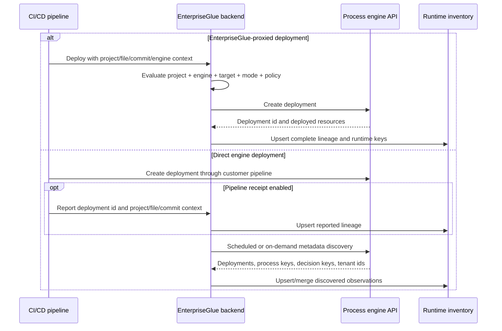
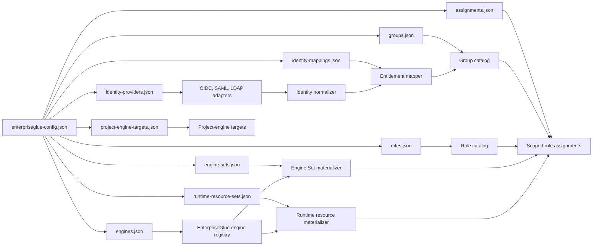
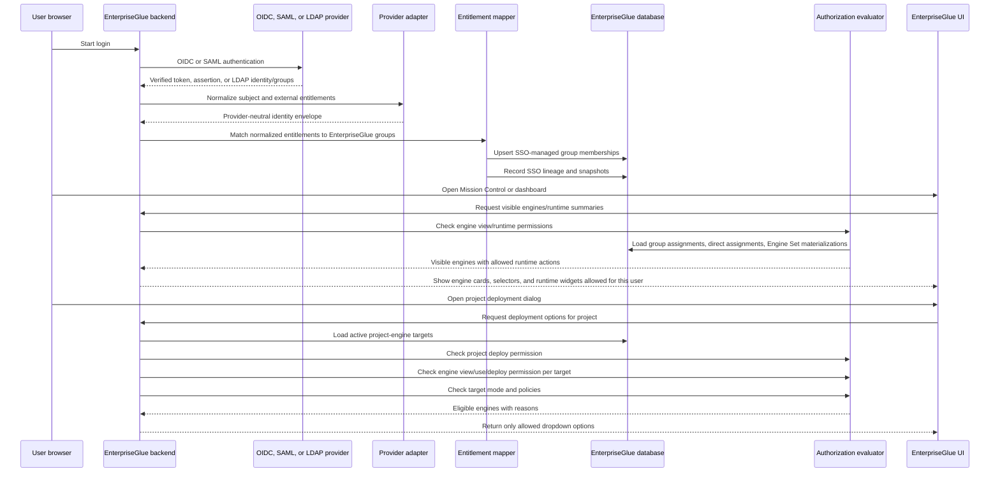
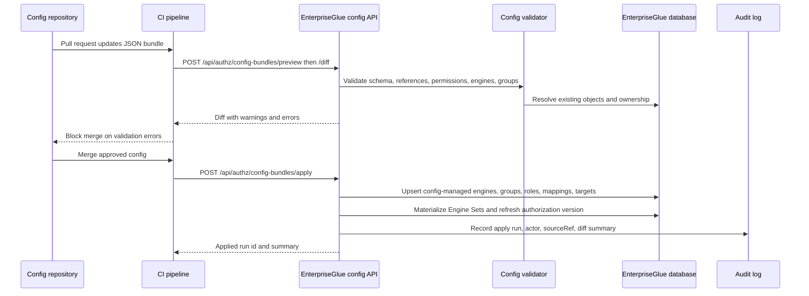
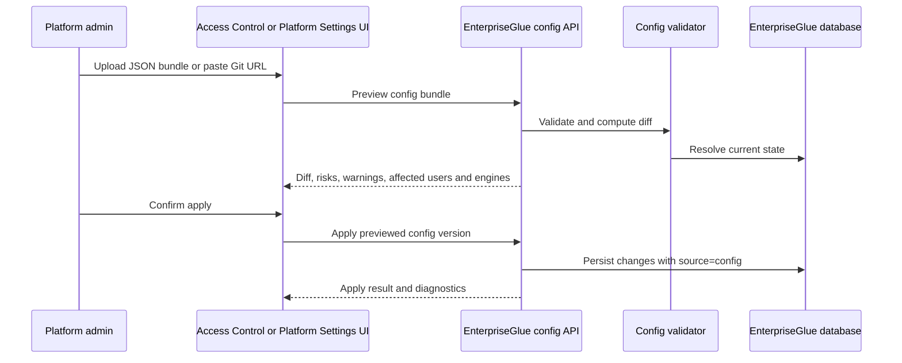

# JSON-Driven Authorization and Engine Registration Plan

Last updated: 2026-07-12

## Purpose

This document defines the target design and implementation plan for customer-managed JSON configuration of:

- EnterpriseGlue custom roles and permission bundles.
- EnterpriseGlue internal groups.
- Provider-neutral OIDC, SAML, and LDAP entitlement mappings into EnterpriseGlue groups.
- Per-engine and per-Engine Set role assignments.
- Runtime resource-level role assignments for customers using one shared central process engine.
- Engine registration using JSON that matches the current EnterpriseGlue engine UI and APIs.
- Project-to-engine deployment targets used by deployment dropdowns and Mission Control/Starbase navigation.

The design keeps the runtime authorization model simple:

```text
verified external identity -> normalized entitlement -> EnterpriseGlue group -> scoped role assignment -> permission -> policy/context decision
```

JSON files are a provisioning source. Runtime authorization must use persisted EnterpriseGlue records and the authorization evaluator, not raw JSON or raw JWT claims.

## AI Agent Progress Tracker

Use this tracker as the next-phase implementation handoff. The sections below contain the design detail and examples for each todo item.

Status legend:

- [x] ✅ Done
- [ ] ⬜ Todo
- [ ] ⏸ Deferred

Current config-as-code status:

- [x] ✅ RBAC foundation prerequisites exist: principal-scoped assignments, groups, custom roles, custom permissions, Engine Sets, project-engine targets, SSO mappings, SSO snapshots, external engine registration, and OpenAPI route inventory.
- [x] ✅ Design decisions are documented for JSON bundle shape, role/group mapping, custom roles, engine registration, engine metadata, project-engine targets, and dropdown/runtime filtering expectations.
- [x] ✅ Central shared-engine strategy is documented with `enterpriseglue_authoritative` as v1 and engine-native modes deferred.
- [x] ✅ Provider-neutral identity normalization, distributed-versus-central runtime scoping, dual deployment ingestion, and the focused v1 runtime resource boundary are documented.
- [x] ✅ Target operator guides now cover platform configuration and deployment/CI-CD operationalization without presenting unimplemented interfaces as currently available.
- [ ] ⬜ Complete the end-to-end alignment gate: clean principal assignments, external identity links, provider-id-bound login, secure secrets, config ownership fields, project-target ownership, runtime assignment semantics, and legacy authorization removal.
- [x] ✅ Implement shared JSON config bundle schemas, strict canonical validation, deterministic config keys, SHA-256 bundle hashing, and hash-bound persistence for the currently supported object families.
- [x] ✅ Implement provider-neutral identity adapters and entitlement mappings for OIDC, SAML, and LDAP.
- [x] ✅ Implement deterministic identity adapter contract tests across OIDC, SAML, LDAP, and adapter lookup dispatch.
- [x] ✅ Add Playwright smoke coverage for the administrator Identity Providers flow and complete the direct-LDAP form surface, including bounded directory enumeration and scheduled reconciliation controls.
- [ ] ⬜ Implement containerized protocol-faithful mock OIDC, SAML, and LDAP services for browser end-to-end testing. The in-process contract harness now exercises OIDC discovery/PKCE/JWKS, SAML attributes, and LDAP bind/group semantics.
- [x] ✅ Expose side-effect-free strict config-bundle preview at `POST /api/authz/config-bundles/preview`, protected by `platform.authz.roles.manage`, with OpenAPI and route-inventory coverage.
- [x] ✅ Persist custom-role source ownership (`system`, `manual`, `config`, `api`, or `automation`) and stable source references for the future bundle compiler.
- [x] ✅ Validate cross-file bundle references for roles, permissions, groups, identity providers, engines, Engine Sets, runtime resource sets, assignments, and project-engine targets before future persisted-reference resolution.
- [x] ✅ Expand copied custom-role templates during preview, including same-scope validation and cycle detection; apply persists the expanded permission list.
- [x] ✅ Add `POST /api/authz/config-bundles/diff` for side-effect-free persisted role/group/engine/Engine Set/Runtime Resource Set/identity-provider/identity-mapping/project-engine-target create, update, no-op, conflict, and authoritative-archive previews. Assignment detail remains outside the diff response; focused tests cover identity-mapping and project-engine-target lifecycle states.
- [x] ✅ Add hash-bound `POST /api/authz/config-bundles/apply` for roles, groups, engines, Engine Sets, Runtime Resource Sets, scoped group assignments, provider-neutral identity providers/mappings, and project-engine targets. It runs one transaction, writes audit rows, rejects stale previews and ownership conflicts, refuses unsupported object families rather than ignoring them, and source-cleans derived memberships when an authoritative config mapping is changed or disabled.
- [x] ✅ Persist engine config provenance (`configKey`, source reference/hash, ownership mode, last applied time) plus `runtimeAccessScope`, `deploymentIntegration`, and `connectionMode` with backward-compatible defaults.
- [x] ✅ Persist provider-neutral identity-provider keys and source references so entitlement mappings resolve configured providers safely; config-bundle creation/update/archive is supported.
- [ ] ⬜ Implement config preview, diff, apply, export, run history, audit, and rollback-safe source ownership semantics.
- [ ] ⬜ Implement UI and CI/CD workflows for config bundle upload/import/export/apply and managed-by-config drift diagnostics.
- [ ] ⬜ Update deployment scripts, Compose/OpenShift manifests, environment templates, readiness, rollback, security, troubleshooting, and operator docs when the config runtime is implemented.
- [ ] ⬜ Implement central-engine runtime resource inventory, runtime resource sets, materialization, and authorization filtering for Mission Control/dashboard reads.
- [x] ✅ Persist and expose the v1 `engineRuntimeAuthorizationMode`; all settings and bundle schemas reject unsupported modes and normalize missing legacy values to `enterpriseglue_authoritative`. Runtime-resource route filtering remains a later phase.
- [ ] ⬜ Implement first-class `customer_sidecar` engine connection mode, endpoint-auth policy, shared connection resolution, UI/config/OpenAPI fields, and mock-sidecar transport tests. Keep the downstream peer token outside EnterpriseGlue.
- [ ] ⏸ Defer EnterpriseGlue-issued sidecar action-token integration, sidecar principals/heartbeats/inventory, mirrored engine backstop, and engine-native authority/import modes.

## Core Decisions

- [x] ✅ Keep default system roles immutable and use them as stable templates and platform defaults.
- [x] ✅ Allow customers to create editable custom roles with allow-only permissions.
- [x] ✅ Normalize external Entra/OIDC/SAML claims into EnterpriseGlue groups before assigning permissions.
- [x] ✅ Normalize OIDC, SAML, and LDAP identities into one provider-neutral identity envelope before mapping entitlements to EnterpriseGlue groups.
- [x] ✅ Support users having different roles on different engines through scoped role assignments.
- [x] ✅ Default distributed engines to engine-wide runtime access and allow central engines to opt into resource-aware runtime filtering without changing the authorization authority mode.
- [x] ✅ Support EnterpriseGlue-proxied deployment and direct engine deployment with optional pipeline receipts plus mandatory metadata reconciliation.
- [x] ✅ Keep v1 runtime assignment scopes focused on engine, runtime tenant, process definition key, decision definition key, and runtime resource set.
- [x] ✅ Keep production configuration bundles separate from test-only identity fixtures while validating both through shared provider and mapping contracts.
- [x] ✅ Support central shared engines by adding runtime resource scopes below the engine, for example process definition key and decision definition key.
- [x] ✅ Make `enterpriseglue_authoritative` the v1 runtime authorization mode and keep engine-native mirroring/import as later explicit modes.
- [x] ✅ Keep engine registration separate from engine authorization, then combine them in dropdown and deployment eligibility APIs.
- [x] ✅ Keep runtime authorization based on database records and evaluator decisions, not direct JSON reads.
- [x] ✅ Add API-only JSON config-bundle preview, diff, and hash-bound apply endpoints; import upload, export, and run history remain pending.
- [ ] ⬜ Add UI and CI/CD workflows for managing config bundles.
- [ ] ⬜ Add config-managed source ownership and drift diagnostics for imported objects.
- [x] ✅ Add a Role Library with a fixed-width role list and focused single-role grouped permission editor. The legacy matrix remains available in Access Control for compatibility until it can be removed.
- [ ] ⬜ Add customer-managed sidecar transport to the existing engine configuration and runtime connection paths without creating a parallel authorization model.
- [x] ✅ Close the frontend action inventory gap: bridge evaluation actions are referenced by the shared authoritative bridge client, while the aggregate `engine.instances.mutate` action is explicitly API-only because concrete runtime mutation actions own mounted UI controls.

## Relationship To Implemented RBAC Foundation

This document describes the next implementation phase after the RBAC foundation. It assumes the following are already available from the current `feat/sso-engine-assignments` worktree:

- [x] ✅ Principal-scoped role assignments for users, groups, API clients, and service accounts.
- [x] ✅ Custom roles, custom permissions, allow-only role semantics, role assignment APIs, and Effective Access explanations.
- [x] ✅ SSO group mappings, SSO engine assignment mappings, SSO access snapshots, access-authority transition controls, and high-risk mapping guardrails.
- [x] ✅ Engine Sets, project-engine targets, deployment eligibility, external engine systems, external engine registration, lifecycle/decommission behavior, capability drift diagnostics, and source-owned field enforcement.
- [x] ✅ Shared action registry, OpenAPI `x-enterpriseglue-authz`, strict backend route inventory guard, strict frontend action inventory guard, and mounted frontend action gating.

The remaining work in this document is not to rebuild those foundations. It is to add:

- [ ] ⬜ A Phase 0 contract normalization pass where the implemented compatibility model conflicts with the clean target model.
- [ ] ⬜ Configuration-as-code import/export/preview/apply flows on top of the existing RBAC and engine registry services.
- [ ] ⬜ Config source ownership and drift handling for objects already represented in the database.
- [ ] ⬜ Central-engine runtime resource scopes below an engine, with Mission Control/dashboard filtering by process and decision resource subsets.
- [ ] ⬜ `engineRuntimeAuthorizationMode` v1 enforcement with `enterpriseglue_authoritative` as the only active mode.

## Current Platform Capabilities To Reuse

- [x] ✅ Engine records already support `name`, `baseUrl`, `type`, `externalId`, labels, auth fields, version, environment tag, lifecycle/source metadata, and tenant scope.
- [x] ✅ Manual engine creation remains available at `POST /engines-api/engines`.
- [x] ✅ API-based external engine upsert exists at `POST /engines-api/external/engines`.
- [x] ✅ Engine list reads are filtered through `engineService.getUserEngines(...)` and authorization visible-collection checks.
- [x] ✅ Engine Sets support `all`, exact `engine_ids`, and label selectors with materialized membership.
- [x] ✅ Project-engine targets support active/disabled/archive state and deployment mode flags for manual, CI, API, and import.
- [x] ✅ SSO assignment mapping and SSO access snapshot services already support engine-scoped SSO-derived access.
- [x] ✅ Effective access evaluation can explain why a user has or lacks access.
- [ ] ⬜ Mission Control authorization is still mostly engine-scoped. Shared central engines require resource-level scopes and collection filtering before different projects can safely share one runtime engine.

## End-To-End Alignment Audit

The 2026-07-12 codebase review found that the implemented RBAC foundation is a useful starting point, but the following contracts must be normalized before config-as-code and central-engine authorization can be safely layered on top.

| Priority | Current code reality | Target alignment |
| --- | --- | --- |
| P0 | `role_assignments` still requires legacy `user_id`; its uniqueness constraint uses user/resource/source-mapping compatibility fields rather than principal/scope/source lineage. | Make `principal_type`, `principal_id`, `role_id`, `scope_type`, `scope_id`, `source`, and `source_ref` the canonical non-null uniqueness contract. Remove user/resource aliases from new writes and evaluation. |
| P0 | Legacy platform admin, project/member, engine/member, owner/delegate fallbacks still grant permissions and sync into RBAC. | Keep accountable owner metadata, but remove legacy authorization grants and `syncLegacyRoleAssignments` after greenfield seeding and UI/API migration. All authorization must come from scoped assignments and policies. |
| P0 | Provider-neutral direct OIDC now has a provider-key-bound start/callback flow with PKCE, nonce, discovery/JWKS validation, and normalized identity provisioning. Microsoft/Google legacy flows and direct LDAP still need migration to the same provider lifecycle. | Complete direct LDAP and migrate remaining protocol starts/callbacks while retaining the current compatibility routes until their replacements pass parity. |
| P0 | `User` has provider-specific Entra/Google columns but no general external identity link. Normalized identity snapshots are diagnostics, not a safe account-link model. | Add `external_identities` with unique tenant/provider/subject -> user linkage. Keep entitlement snapshots separate. Remove provider-specific user identity columns from the target model. |
| P0 | Provider `tenant_id` represents an external directory tenant while authorization entities use `tenant_id` as the EnterpriseGlue tenant boundary. | Split `tenantId` for EnterpriseGlue scope from `directoryTenantId`/issuer-specific configuration. Never overload the same field. |
| P0 | SSO provider secrets use reversible base64 marking and engine `password_enc` is consumed as plaintext by runtime clients. | Add one secret resolver/encryption boundary for UI, JSON config, and runtime. Production APIs store encrypted local values or opaque external refs; they never persist resolved plaintext. |
| P0 | Runtime permissions are engine-scoped and `requireAction(...)` authorizes only the engine before handlers fetch whole collections or instance details. | Add runtime-resource resolvers and a filtering service that performs query pushdown or bounded post-filtering and resolves instance/detail lineage before response or mutation. |
| P0 | The engine selector filters hard-coded legacy roles (`owner`, `delegate`, `operator`), excluding custom/runtime-resource viewers. | Return permission-derived engine visibility/capabilities from the backend and remove role-name filtering from selectors, Dashboard, and engine pages. |
| P0 | `project_engine_targets` enforces one row per project/engine pair, while some prose implies multiple source rows can coexist for the same pair. | Keep one effective target per pair. Config apply must skip, conflict, or explicitly transfer ownership of an existing manual row; it must never create competing mode flags. |
| P0 | Deployment and artifact rows require project lineage; direct engine discovery cannot satisfy it. The current edit-target resolver can fall back to file-key matching. | Make project/file lineage nullable, store lineage quality, and disallow bridge navigation from guessed file-key matches. Only complete or validated reported lineage can open the cross-product bridge. |
| P1 | Roles, permissions, providers, mappings, engines, and targets do not share complete config source/hash/apply metadata. | Add object-level config ownership fields and deterministic keys before bundle apply. Use explicit ownership transfer for manual objects. |
| P1 | `AccessControl.tsx`, the action registry, OpenAPI registry, and authz router are already very large monoliths. | Split them into domain modules before adding identity, config, and runtime-resource surfaces; preserve aggregate exports and route guards. |
| P1 | Current-user permission snapshots contain platform/project/engine permissions only. | Keep snapshots coarse. Do not add every process/decision key; runtime collections are backend-filtered and return row/action decisions where needed. |

### Locked Alignment Decisions

- [x] ✅ Keep one effective project-engine target per project/engine pair.
- [x] ✅ Keep runtime permissions in the engine permission namespace and allow an engine-scoped role to be assigned to an engine, Engine Set, exact runtime resource, or runtime resource set.
- [x] ✅ Model runtime tenant as a runtime resource kind, not a third top-level assignment resource type.
- [x] ✅ Keep navigation permission snapshots coarse; runtime-resource visibility is server-filtered.
- [x] ✅ Make identity mappings group-first. Provider default access is represented as an `exists` mapping to an internal group, not a provider `defaultRole` mutation.
- [x] ✅ Treat the current SSO platform-role and direct-engine mapping models as migration inputs, not parallel target models. Product wizards may create a managed internal group plus scoped assignment, but runtime lineage stays entitlement -> group -> assignment.
- [ ] ⬜ Require exact provider-id-bound login and reconciliation for every protocol. Generic OIDC is exact-provider bound; legacy Microsoft/Google and direct LDAP remain pending.
- [x] ✅ Require a real secret resolver/encryption service before config bundle apply can handle provider or engine credentials.
- [x] ✅ Make the Phase 0 alignment gate a prerequisite for Phase 1 config schemas and runtime-resource persistence.

## Recommended Config Bundle

Support both a folder bundle and a single-file bundle. Folder bundles are better for enterprise GitOps review.

```text
enterpriseglue-config/
  enterpriseglue-config.json
  engines.json
  engine-sets.json
  runtime-resource-sets.json
  roles.json
  groups.json
  assignments.json
  identity-providers.json
  identity-mappings.json
  project-engine-targets.json

test/identity-mocks/
  subjects.json
  oidc-provider.json
  saml-provider.json
  ldap-directory.json
  scenarios.json
```

Files under `test/identity-mocks/` are test-harness inputs and must never be accepted as production config-bundle imports. They may reference the same provider keys, external subject ids, entitlement ids, and internal group keys so contract tests exercise the production schemas.

The root manifest imports the other files and defines apply mode.

```json
{
  "apiVersion": "enterpriseglue.ai/v1alpha1",
  "kind": "EnterpriseGlueConfigBundle",
  "metadata": {
    "key": "acme-prod-authz",
    "description": "Production authorization and engine inventory",
    "owner": "iam-platform-team"
  },
  "tenantKey": "default",
  "mode": "authoritative",
  "settings": {
    "engineAccessAuthority": "sso_managed",
    "projectAccessAuthority": "manual",
    "engineOnboardingMode": "external_only",
    "projectEngineTargetMode": "hybrid",
    "engineRuntimeAuthorizationMode": "enterpriseglue_authoritative"
  },
  "imports": [
    "./engines.json",
    "./engine-sets.json",
    "./runtime-resource-sets.json",
    "./roles.json",
    "./groups.json",
    "./assignments.json",
    "./identity-providers.json",
    "./identity-mappings.json",
    "./project-engine-targets.json"
  ]
}
```

### Platform Settings In The Bundle

The `settings` block controls who owns engine inventory, project-to-engine relationships, and human access assignments. These settings are platform-wide defaults and should be applied with the same preview/diff discipline as roles, groups, and engines.

```json
"settings": {
  "engineAccessAuthority": "sso_managed",
  "projectAccessAuthority": "manual",
  "engineOnboardingMode": "external_only",
  "projectEngineTargetMode": "hybrid",
  "engineRuntimeAuthorizationMode": "enterpriseglue_authoritative"
}
```

#### `engineAccessAuthority`

Controls how engine access assignments are managed in the UI and cleanup workflows. It does not change the evaluator formula: EnterpriseGlue still evaluates all valid role assignments and policies.

| Value | Meaning | UI behavior | Typical use |
| --- | --- | --- | --- |
| `manual` | Manual engine access is the primary operating mode. | Admins can add, update, and remove manual engine access. SSO-derived rows may be visible for diagnostics if mappings exist. | Standalone installs or early setup before SSO is authoritative. |
| `transition_to_sso` | Manual and SSO-derived engine access coexist while the customer moves to SSO. | UI shows both manual and SSO rows, highlights duplicates, and enables explicit cleanup preview/apply for duplicate manual rows. | Migration from manually managed access to Entra/OIDC/SAML managed access. |
| `sso_managed` | SSO is the intended authority for engine access. | SSO-owned rows are source-owned and not directly removable in normal member management. Manual rows may remain for break-glass or explicitly selected exceptions. | Enterprise deployments where engine access is governed by identity provider claims and config. |

Important rules:

- `sso_managed` must not delete manual access automatically.
- Cleanup of duplicate manual access must go through explicit transition cleanup preview/apply.
- SSO-derived access rows should show lineage to the claim, mapping, group, role, and engine or Engine Set.

#### `projectAccessAuthority`

Controls how project membership/access is managed. Project access can remain manual even when engine access is SSO-managed.

| Value | Meaning | UI behavior | Typical use |
| --- | --- | --- | --- |
| `manual` | Project access is owned by project owners, delegates, or platform admins. | Project member dialogs allow manual add/update/remove according to permissions. | Most teams where projects are created and staffed inside EnterpriseGlue. |
| `transition_to_sso` | Manual and SSO-derived project access coexist during migration. | UI can show both sources and support duplicate diagnostics when SSO project mappings are introduced. | Customers gradually moving project access to IdP groups. |
| `sso_managed` | SSO/config is the intended project access authority. | SSO-owned rows are not normally removable in project member UI; manual controls are restricted to manual exceptions. | Enterprises where project access is centrally governed. |

For the near-term roadmap, engine access is the stronger SSO use case. Project access may intentionally stay `manual` because many customers want project teams to be managed locally while engine access is governed centrally.

#### `engineOnboardingMode`

Controls how engines enter the EnterpriseGlue engine registry.

| Value | Meaning | UI/API behavior | Typical use |
| --- | --- | --- | --- |
| `manual_allowed` | Manual UI registration and external/API registration are both allowed. | Platform admins can create engines in the UI; external API/config can also register engines. | Default mode and easiest local setup. |
| `external_only` | Engine lifecycle is owned by config or external systems. | Manual create/delete actions are hidden or rejected; config/API registration is the expected path. | GitOps/IaC-owned engine inventory. |
| `hybrid` | Manual engines and external/config-owned engines coexist. | UI allows manual engines while preserving source-owned fields on external/config-managed engines. | Migration phase or mixed ownership by environment/domain. |

In `external_only`, manual edits to config-owned or externally registered engine fields should be blocked unless the field is explicitly manual-owned. This prevents UI drift from the customer's source of truth.

#### `projectEngineTargetMode`

Controls how project-to-engine deployment target relationships are managed. These targets decide whether an engine is eligible for a project's deployment dropdown after permissions pass.

| Value | Meaning | UI/API behavior | Typical use |
| --- | --- | --- | --- |
| `manual_allowed` | Project owners/admins can manage deployment targets locally. | Manual target add/update/remove is available according to permissions; source-owned targets stay protected. | Default local/project-led deployment setup. |
| `external_only` | Project-engine target relationships are owned by config or external systems. | Manual target changes and legacy sync are blocked; only source-owned targets count for eligibility. | Enterprises where deployment topology is governed centrally. |
| `hybrid` | Manual and source-owned targets coexist. | UI can manage manual targets while config/external targets remain source-owned. | Recommended when projects stay local but some engine connectivity is centrally governed. |

#### `engineRuntimeAuthorizationMode`

Controls how EnterpriseGlue and engine-native authorization interact for runtime artifacts such as process definitions, decision definitions, instances, jobs, incidents, variables, batches, migrations, and history. This setting is separate from engine access authority. `engineAccessAuthority` decides how users get EnterpriseGlue roles on engines. `engineRuntimeAuthorizationMode` decides whether EnterpriseGlue alone, EnterpriseGlue plus a mirrored engine backstop, or the engine itself is the source of runtime resource authorization.

| Value | Meaning | Product behavior | Roadmap |
| --- | --- | --- | --- |
| `enterpriseglue_authoritative` | EnterpriseGlue is the source of truth for product authorization. Engine-native permissions are not edited as a separate product model. | EnterpriseGlue evaluates scoped roles, runtime resource sets, policies, project-engine targets, and route context. The backend may call the engine with a configured service identity, customer sidecar, or gateway identity. | Implement in v1. This is the default and recommended mode. |
| `mirrored_engine_backstop` | EnterpriseGlue remains the source of truth, but selected EnterpriseGlue runtime permissions are mirrored to the engine where technically possible. | Admins still edit EnterpriseGlue roles/groups/resource sets. Engine-native authorization is shown as sync/backstop status, not as a second permission editor. Engine denial after EnterpriseGlue allow is surfaced as `engine_backstop_denied`. | Later phase after v1, mainly for customers who expose Camunda directly or require native engine defense-in-depth. |
| `engine_native_authority` | The engine's native authorization model is treated as the runtime source of truth and EnterpriseGlue reflects or imports it. | EnterpriseGlue would need to read/sync engine-native users, groups, permissions, tenants, and resource ids, then map them back to UI decisions and diagnostics. | Defer. This is complex and should not block v1 because it conflicts with EnterpriseGlue project, Starbase, SSO, config, and policy concepts. |

Conflict rule:

```text
enterpriseglue_authoritative:
  final decision = EnterpriseGlue evaluator decision

mirrored_engine_backstop:
  final product decision = EnterpriseGlue evaluator decision
  execution can still fail closed if the engine backstop denies the call

engine_native_authority:
  final decision requires imported engine-native authorization plus EnterpriseGlue context checks
```

The UI should not expose two independent permission matrices for the same action. Product admins should configure EnterpriseGlue roles, groups, runtime resource sets, and policies. If a later engine-native mode is enabled, the UI should show engine sync/backstop diagnostics next to the EnterpriseGlue decision.

Visibility and dropdown implications:

For general engine surfaces such as Mission Control, engine overview pages, engine selectors, and dashboard engine widgets, project access is not required. The user should see an engine when they have an engine-scoped permission that grants visibility.

```text
engine exists and is active
+ user has engine view/runtime permission on the engine or a matching Engine Set
+ policy/context checks pass
= engine appears in Mission Control, engine lists, and dashboard engine views
```

For project deployment dropdowns and project-specific engine options, project access and project-engine target eligibility are also required.

```text
engine visible to user
+ user has project deploy permission
+ user has engine deploy/use permission
+ active project-engine target exists
+ requested deployment mode is allowed
= engine appears in the deployment dropdown
```

#### Example Combination

This example:

```json
"settings": {
  "engineAccessAuthority": "sso_managed",
  "projectAccessAuthority": "manual",
  "engineOnboardingMode": "external_only",
  "projectEngineTargetMode": "hybrid",
  "engineRuntimeAuthorizationMode": "enterpriseglue_authoritative"
}
```

means:

- Engines are registered by JSON/API/external systems, not manually in the UI.
- Engine access comes from SSO/config-managed group mappings.
- Project membership remains managed inside EnterpriseGlue.
- Project-to-engine deployment targets can be centrally configured, but manual project targets may also exist where permitted.
- Runtime resource authorization is decided by EnterpriseGlue, including central-engine process/decision resource sets and route-level checks.

This is a good fit for customers who want centralized control over runtime engines while still allowing teams to manage project collaboration locally.

### Apply Modes

| Mode | Behavior |
| --- | --- |
| `additive` | Create or update config-managed objects but never remove stale config-managed records. |
| `authoritative` | Create/update desired config-managed records and archive or remove stale records owned by this config bundle. |
| `preview_only` | Validate and diff only. Used by CI pull requests and UI review. |

Authoritative mode must only touch records with `source = "config"` and matching `sourceRef`. It must not remove manual, API, SSO, or system records. Legacy authorization rows must be removed or migrated during Phase 0 and are not valid config inputs.

### JSON Configuration Interface Status And Extension

The JSON bundle is partially implemented. The platform exposes strict schemas, canonical hashing, side-effect-free preview/diff, and hash-bound apply for config-owned roles, groups, engines, Engine Sets, runtime resource sets, group assignments, project-engine targets, provider-neutral identity providers, and identity mappings. Server-side export/history, Platform Settings bundle UI, and protocol-specific provider connection testing are implemented; affected-principal analysis remains unimplemented.

The implementation must provide one bundle compiler over the same domain services used by the UI. JSON apply must not write authorization tables directly or maintain a second business-rule implementation.

The production bundle now needs these object families:

| File/object family | Existing domain foundation | Required bundle extension |
| --- | --- | --- |
| `roles.json` and permissions | Custom role/permission CRUD and role source lineage exist | Add template expansion, source-ownership enforcement, permission diff, and sensitive-risk validation. |
| `groups.json` | Internal group CRUD exists | Add config ownership and stable references from identity mappings and assignments. |
| `identity-providers.json` | Provider-neutral OIDC/SAML/LDAP persistence and config apply exist | Add protocol adapters, secret resolution, sync policy execution, and connectivity-test metadata. |
| `identity-mappings.json` | SSO group mappings exist | Compile normalized external entitlements to internal groups independent of protocol. |
| `engines.json` | Manual/external engine APIs exist | Add `runtimeAccessScope`, deployment integration, first-class `connectionMode`, endpoint-auth policy validation, source ownership, and config-safe secret refs. |
| `engine-sets.json` | Engine Set CRUD/materialization exists | Add deterministic config keys and previewed selector materialization. |
| `runtime-resource-sets.json` | Not implemented | Add tenant/process/decision selectors, materialization, lineage, and broad-grant warnings. |
| `assignments.json` | Principal-scoped role assignment CRUD exists | Add stable references to groups, roles, engines, Engine Sets, and runtime resource sets. |
| `project-engine-targets.json` | Target CRUD/eligibility exists | Add config ownership and deployment-mode validation against engine integration settings. |

Apply order is deterministic:

```text
validate and canonicalize all files
-> resolve secret references without revealing values
-> providers, permissions, roles, groups
-> engines and Engine Sets
-> runtime resource sets and inventory references
-> scoped assignments
-> identity mappings
-> project-engine targets
-> materialization/reconciliation jobs
-> authorization version invalidation and audit
```

Interface requirements:

- [ ] ⬜ Accept a single JSON document or a ZIP containing the declared imported JSON files.
- [ ] ⬜ Reject undeclared files, path traversal, duplicate object keys, unknown schema versions, plaintext secrets, and test-only fixture files.
- [ ] ⬜ Extend current file-and-path validation errors with object keys, severity, and remediation guidance.
- [x] ✅ Make the current schema preview side-effect free; provider connectivity checks are explicit optional operations, never implicit network calls during schema validation.
- [ ] ⬜ Bind apply to the exact canonical preview hash and reject stale previews.
- [ ] ⬜ Execute domain writes through existing role/group/engine/assignment/mapping/target services or shared lower-level commands used by both UI and bundle apply.
- [ ] ⬜ Let apply select reconciliation behavior: `none`, `preview`, or asynchronous `apply`; never block a large config transaction on a full directory scan.
- [ ] ⬜ Export source-owned production objects without secret values and without test fixture data.
- [ ] ⬜ Keep manual UI management available according to object ownership mode (`manual`, `config_warn`, or `config_locked`).
- [ ] ⬜ Add config bundle version and normalized object fingerprints to every apply run and affected object lineage.

## Engine JSON Design

Engine config must mirror the current engine UI and route schema. Do not make future-only fields part of the default v1 customer example.

### Supported V1 Fields

| JSON field | Current EnterpriseGlue field | Notes |
| --- | --- | --- |
| `key` | config reference only | Stable config key used by other JSON files. Stored in config ownership metadata, not necessarily exposed as engine id. |
| `name` | `engines.name` | Required. |
| `type` | `engines.type` | `ion`, `operaton`, or `camunda7`. |
| `baseUrl` | `engines.base_url` | Required. Same validation as engine UI/API. |
| `externalId` | `engines.external_id` | Recommended for config-managed engines. Must be unique. |
| `labels` | `engines.labels_json` | Operational metadata used by Engine Sets, SSO selectors, filtering, diagnostics, and dropdown eligibility. |
| `auth.type` | `engines.auth_type` | `none`, `basic`, `bearer`, or `oauth2-client-credentials`. |
| `auth.username` | `engines.username` | Basic username or OAuth2 client id. |
| `auth.passwordRef` | `engines.password_enc` | Resolved by importer from secret source. Never store plaintext in Git. |
| `auth.tokenRef` | `engines.password_enc` | Bearer token reference. |
| `auth.tokenUrl` | `engines.oauth_token_url` | OAuth2 client credentials only. |
| `auth.scopes` | `engines.oauth_scopes` | OAuth2 client credentials only. |
| `auth.audience` | `engines.oauth_audience` | OAuth2 client credentials only. |
| `version` | `engines.version` | Optional. May be refreshed by health/version checks. |
| `environmentTagId` | `engines.environment_tag_id` | Optional existing environment tag id. |
| `runtimeAccessScope` | new `engines.runtime_access_scope` | `engine_wide` for the normal distributed-engine case; `resource_aware` for central/shared engines. Defaults to `engine_wide`. |
| `deploymentIntegration` | new engine deployment integration settings | v1 exposes `enterpriseglue_proxy` or `direct_engine`: proxy mode permits EnterpriseGlue deployment; direct mode rejects proxy deployment and accepts pipeline receipts. The independent multi-flag ingestion settings remain later work. |

### Distributed And Central Engine Runtime Scopes

Most EnterpriseGlue installations use distributed engines where one project or team owns one engine. These engines should remain simple. A smaller number of customers use a central engine shared by many teams and require filtering below the engine.

`runtimeAccessScope` controls granularity and is independent from `engineRuntimeAuthorizationMode`, which controls authority.

| Value | Intended topology | Authorization behavior | UI behavior |
| --- | --- | --- | --- |
| `engine_wide` | Default distributed engine, normally one project/team per engine | Engine-scoped runtime roles authorize runtime resources. Runtime-resource assignments are rejected to avoid misleading configuration. | Existing engine and Mission Control flows remain simple; no runtime-resource administration is shown. |
| `resource_aware` | Central/shared engine with multiple teams, projects, tenants, or domains | Engine metadata access and runtime-resource access are separate. Broad engine runtime roles remain possible for central administrators; normal teams receive tenant/process/decision resource-set assignments. | Engine appears when the user has broad runtime access or at least one visible runtime resource. Lists and counts are filtered to the authorized subset. |

There is deliberately no third `mixed` value. A `resource_aware` engine already supports both broad engine assignments and narrow resource-set assignments. Config preview must warn when a broad engine grant shadows a narrow resource-set grant for the same principal.

- [x] ✅ Add `RuntimeAccessScopeSchema = z.enum(['engine_wide', 'resource_aware'])` with `engine_wide` as the default.
- [x] ✅ Persist `engines.runtime_access_scope` and expose it through manual, external, config, list, and detail engine contracts. Dedicated engine-management OpenAPI completion remains tracked below.
- [x] ✅ Reject exact runtime-resource and runtime-resource-set assignments unless the containing engine uses `resource_aware` runtime access. Assignment normalization preserves the requested runtime scope type.
- [x] ✅ Reject changing a `resource_aware` engine back to `engine_wide` while exact runtime-resource or runtime-resource-set role assignments still target that engine.
- [ ] ⬜ Require authorized-subset filtering for every runtime collection and count on `resource_aware` engines.
- [x] ✅ Return and display an allow-only overlap warning from runtime-scoped assignment creation when active direct, inherited-group, or materialized Engine Set grants already supply the same permission. Access Control supports exact runtime-resource and runtime-resource-set assignment scopes for human principals, with engine-first inventory/set selectors instead of opaque IDs. The assignment remains additive; legacy-role and policy overlap diagnostics remain future work.

### Dual Deployment Ingestion

Deployment execution and deployment metadata ingestion are separate concerns. An engine may enable both EnterpriseGlue-proxied deployment and direct Camunda/Operaton API deployment.

The current v1 UI/API deliberately uses a smaller mutually exclusive `deploymentIntegration` enum. This prevents accidental use of EnterpriseGlue proxy deployment against an engine that the customer has declared pipeline-owned. The multi-flag model below remains the target when direct metadata discovery and independent reconciliation scheduling are implemented.

```json
"deploymentIntegration": {
  "proxyEnabled": true,
  "directApiEnabled": true,
  "pipelineReceiptEnabled": true,
  "metadataDiscoveryEnabled": true,
  "reconciliationIntervalSeconds": 300
}
```



Rules:

- `proxyEnabled` allows an authorized human or machine principal to deploy through EnterpriseGlue after project, engine, target-mode, policy, and capability checks pass.
- `directApiEnabled` documents that customer pipelines may deploy directly to the process engine. It does not grant EnterpriseGlue deployment permission.
- `pipelineReceiptEnabled` enables a machine-authenticated callback that records project, file, commit, tenant, deployment, process, and decision lineage after a direct deployment.
- `metadataDiscoveryEnabled` controls scheduled engine deployment/process/decision metadata reconciliation. It defaults to enabled for proxy and direct deployment paths; administrators can disable the per-engine scheduler through the Engine Detail or JSON configuration while retaining explicit manual reconciliation.
- Existing project-engine target flags still decide whether `manual`, `ci`, `api`, and `import` use is eligible. Deployment integration settings do not replace target eligibility.

Persist one deployment record per `engineId + engineDeploymentId` and merge richer observations into that record. Record lineage quality as:

| Quality | Meaning | Product use |
| --- | --- | --- |
| `complete` | EnterpriseGlue proxied the deployment and captured project/file/commit lineage. | Full audit and Mission Control-Starbase bridge. |
| `reported` | A trusted pipeline receipt supplied verified lineage after direct deployment. | Full bridge when referenced project/file/version still resolves. |
| `discovered` | Engine reconciliation found the deployment and runtime keys but no project/file origin. | Runtime authorization and inventory only. |
| `inferred` | Project/file origin was matched through a configured naming or metadata convention. | Diagnostics by default; bridge only after validation policy allows it. |

- [x] ✅ Extend `EngineDeployment` with ingestion source, lineage quality, reporting principal, reconciliation timestamps, nullable project lineage, canonical lineage JSON, and a unique engine/deployment identity. Proxy deployments record `complete` lineage and receipt processing never downgrades that quality.
- [x] ✅ Make `EngineDeploymentArtifact.projectId` nullable for engine-discovered artifacts and preserve process/decision key, version, tenant, and resource-name metadata.
- [x] ✅ Add `POST /engines-api/external/engines/:engineId/deployment-receipts`: machine-authenticated, API-target-eligible, idempotent receipt ingestion that persists sanitized pipeline lineage, reports process/decision metadata into the runtime inventory, and creates or enriches the canonical `EngineDeployment` history with `reported` lineage.
- [x] ✅ Add scheduled and on-demand deployment/runtime inventory reconciliation. The permission-gated on-demand endpoint and disabled-by-default `RUNTIME_INVENTORY_RECONCILIATION_INTERVAL_MS` poller refresh active resource-aware runtime inventory, deactivate only definitions absent from successful engine listings, and ingest engine-observed deployment records/artifacts as `discovered` lineage without guessing project or file ownership.
- [x] ✅ Never infer project/file lineage solely from a process key. Engine discovery writes `discovered` records with nullable project/file lineage only; no configured inference convention exists yet, so `inferred` is never produced by runtime or deployment reconciliation.
- [x] ✅ Require `complete` or validated `reported` lineage for Mission Control-Starbase edit navigation. Server-side process, decision, and shared edit-target resolution reject `discovered`/`inferred` history; `reported` mappings also require a resolved versioned project file.

### Engine Labels As Metadata

For v1, engine metadata such as country, domain, environment, region, and business unit should be represented as labels because labels already exist in the current engine model and are used by Engine Set materialization and SSO assignment selectors.

Recommended label keys:

| Label key | Example | Usage |
| --- | --- | --- |
| `country` | `nl`, `de`, `us` | Filter engines by country and create country-specific Engine Sets. |
| `domain` | `payments`, `claims`, `kyc` | Group engines by business or process domain. |
| `environment` | `dev`, `test`, `acc`, `prod` | Environment filtering and deployment policy. |
| `region` | `eu`, `us`, `apac` | Regional access and operations views. |
| `businessUnit` | `finance`, `operations` | Business ownership and dashboards. |
| `criticality` | `low`, `medium`, `high` | Policy and operational risk views. |
| `dataClassification` | `public`, `internal`, `confidential` | Future policy and audit views. |

Example:

```json
{
  "key": "engine-prod-nl-payments-1",
  "name": "Production NL Payments Engine 1",
  "type": "operaton",
  "baseUrl": "https://operaton-prod-nl-payments-1.example.com/engine-rest",
  "externalId": "operaton-prod-nl-payments-1",
  "labels": {
    "country": "nl",
    "domain": "payments",
    "environment": "prod",
    "region": "eu",
    "businessUnit": "finance",
    "criticality": "high"
  },
  "auth": {
    "type": "basic",
    "username": "engine-reader",
    "passwordRef": "EG_ENGINE_PROD_NL_PAYMENTS_1_PASSWORD"
  }
}
```

Do not introduce a separate `metadata` object for v1 unless the field is truly display-only and must not affect selectors or access. If display-only metadata becomes necessary later, add a dedicated `metadata_json` or `engine_metadata` model with a clear rule that only `labels` participate in selectors and authorization-adjacent decisions.

### Customer Sidecar And No EnterpriseGlue-Managed Credentials

Some customers run a sidecar or gateway in front of the process engine. In that model EnterpriseGlue should not store or send engine credentials. EnterpriseGlue still authorizes the user, project, engine, and action; the sidecar owns downstream authentication to the engine, for example with a peer-to-peer token, mTLS, or customer-owned service identity.

Keep two integration patterns separate:

| Pattern | V1 status | Authorization authority | EnterpriseGlue-to-sidecar hop | Sidecar-to-engine hop |
| --- | --- | --- | --- | --- |
| Customer-managed transport sidecar | Include in the engine connection/config work | EnterpriseGlue | Normal configured endpoint transport; `none` is allowed only for an explicitly declared private sidecar endpoint | Customer owns the peer-to-peer token, mTLS identity, or service credential; EnterpriseGlue never receives it |
| EnterpriseGlue action-token sidecar protocol | Deferred | EnterpriseGlue, with sidecar enforcement of the signed decision | EnterpriseGlue sends a short-lived, audience/action/resource-bound token | Customer sidecar exchanges or combines it with its local engine credential |

The first pattern does not require a sidecar entity, sidecar role, heartbeat API, JWKS exchange, or EnterpriseGlue-issued action token. From EnterpriseGlue's perspective it is an engine endpoint with customer-managed downstream authentication. The second pattern is a future defense-in-depth protocol and must not be a prerequisite for customer-managed sidecar connectivity.

The v1 JSON shape should use the existing engine auth model:

```json
{
  "key": "engine-prod-nl-payments-sidecar",
  "name": "Production NL Payments Engine via Sidecar",
  "type": "operaton",
  "baseUrl": "https://payments-engine-sidecar.internal/engine-rest",
  "externalId": "operaton-prod-nl-payments",
  "connectionMode": "customer_sidecar",
  "labels": {
    "country": "nl",
    "domain": "payments",
    "environment": "prod",
    "region": "eu",
    "authOwner": "customer"
  },
  "auth": {
    "type": "none"
  }
}
```

This must be described as **no EnterpriseGlue-managed engine credentials**, not as no authorization.

`connectionMode` must be a first-class engine/config field, not only a label. Allowing `auth.type = "none"` without an explicit connection mode would make a directly reachable unauthenticated engine indistinguishable from an intentional customer-sidecar setup.

Runtime flow:

```text
EnterpriseGlue user action
-> EnterpriseGlue checks project permission, engine permission, project-engine target, mode, and policies
-> EnterpriseGlue resolves the engine connection and calls the configured sidecar baseUrl using the configured endpoint transport
-> Customer sidecar authenticates to the engine with its own peer-to-peer token or service identity
-> Engine executes the request
-> EnterpriseGlue records audit lineage for the user, project, engine, action, and target
```

Security requirements:

- [ ] ⬜ `auth.type = "none"` must never bypass EnterpriseGlue RBAC or deployment eligibility checks.
- [ ] ⬜ `auth.type = "none"` is valid only when `connectionMode = "customer_sidecar"` and the platform policy explicitly permits credentialless private-sidecar endpoints.
- [ ] ⬜ `baseUrl` should point to the customer sidecar or gateway, not a public unauthenticated engine endpoint.
- [ ] ⬜ Sidecar endpoints should be private and network-restricted. Prefer mTLS, API-key references, or OAuth client credentials for the EnterpriseGlue-to-sidecar hop when the customer endpoint supports them.
- [ ] ⬜ The downstream peer-to-peer token and its rotation lifecycle remain customer-owned and must never appear in config bundles, engine APIs, logs, audits, UI fields, or support diagnostics.
- [ ] ⬜ EnterpriseGlue audit must still record the effective user, action, project, engine, and request lineage.
- [ ] ⬜ Health checks and version reads should work through the sidecar.
- [ ] ⬜ UI should label this as `Customer-managed engine authentication` or `No EnterpriseGlue-managed credentials`.
- [ ] ⬜ Config preview must reject `auth.type = "none"` unless the first-class `connectionMode` is `customer_sidecar` and the relevant platform policy allows it.
- [ ] ⬜ SSRF controls, allowed protocols/hosts, TLS verification, redirect handling, timeouts, and response-size limits apply equally to direct engine and sidecar endpoints.
- [ ] ⬜ A transport failure or sidecar denial must fail closed and be distinguishable from an EnterpriseGlue authorization denial in diagnostics.

Future optional expanded connection schema, if the flattened v1 fields become insufficient:

```json
{
  "connection": {
    "mode": "customer_sidecar",
    "authOwner": "customer",
    "description": "Customer sidecar injects peer-to-peer engine token"
  },
  "auth": {
    "type": "none"
  }
}
```

For v1, add the first-class flattened `connectionMode` field to the existing engine UI/API/config contracts and continue using the existing `auth` shape for the EnterpriseGlue-to-endpoint hop. Do not add a sidecar inventory or action-token subsystem until the second integration pattern is selected.

UI impact:

- [ ] ⬜ Engine create/edit and JSON preview show `Direct engine` or `Customer sidecar/gateway` as the connection path.
- [ ] ⬜ Selecting customer sidecar changes credential copy to `EnterpriseGlue-to-sidecar authentication` and allows the policy-controlled no-credential option.
- [ ] ⬜ Engine detail shows `Customer-managed downstream engine authentication`; it never implies that EnterpriseGlue authorization is disabled.
- [ ] ⬜ Connection tests identify the failing hop as `EnterpriseGlue -> sidecar`; they do not request or display the customer's downstream peer token.
- [ ] ⬜ Effective Access, Mission Control, deployment eligibility, Dashboard filtering, and bridge decisions behave identically for direct and sidecar-backed engines.

Required tests:

- [ ] ⬜ Mock sidecar forwards successful metadata/runtime responses while injecting an opaque customer-owned downstream token that EnterpriseGlue cannot observe.
- [ ] ⬜ Direct engine plus `auth.type = "none"` is rejected.
- [ ] ⬜ Customer-sidecar plus disallowed credentialless policy is rejected.
- [ ] ⬜ EnterpriseGlue authorization denial prevents any sidecar request.
- [ ] ⬜ Sidecar timeout, TLS failure, malformed response, and downstream denial fail closed with transport-specific diagnostics and sanitized audit data.
- [ ] ⬜ No config export, OpenAPI response, UI model, log, or audit event contains the downstream peer token.

### Example Engines

```json
{
  "engines": [
    {
      "key": "engine-prod-eu-1",
      "name": "Production EU Engine 1",
      "type": "operaton",
      "baseUrl": "https://operaton-prod-eu-1.example.com/engine-rest",
      "externalId": "operaton-prod-eu-1",
      "labels": {
        "environment": "prod",
        "region": "eu",
        "country": "nl",
        "domain": "payments",
        "businessUnit": "finance"
      },
      "auth": {
        "type": "basic",
        "username": "engine-reader",
        "passwordRef": "EG_ENGINE_PROD_EU_1_PASSWORD"
      },
      "version": null,
      "environmentTagId": null
    },
    {
      "key": "engine-dev-eu-1",
      "name": "Development EU Engine 1",
      "type": "operaton",
      "baseUrl": "https://operaton-dev-eu-1.example.com/engine-rest",
      "externalId": "operaton-dev-eu-1",
      "labels": {
        "environment": "dev",
        "region": "eu",
        "country": "nl",
        "domain": "payments"
      },
      "auth": {
        "type": "bearer",
        "tokenRef": "EG_ENGINE_DEV_EU_1_BEARER_TOKEN"
      }
    }
  ]
}
```

OAuth2 client credentials keep the current public configuration shape, but secret references must resolve through the new secret boundary rather than being copied as plaintext into the current password field:

```json
{
  "key": "engine-prod-us-1",
  "name": "Production US Engine 1",
  "type": "operaton",
  "baseUrl": "https://operaton-prod-us-1.example.com/engine-rest",
  "externalId": "operaton-prod-us-1",
  "labels": {
    "environment": "prod",
    "region": "us",
    "country": "us",
    "domain": "claims"
  },
  "auth": {
    "type": "oauth2-client-credentials",
    "username": "enterpriseglue-engine-client",
    "passwordRef": "EG_ENGINE_PROD_US_1_CLIENT_SECRET",
    "tokenUrl": "https://login.microsoftonline.com/<tenant-id>/oauth2/v2.0/token",
    "scopes": "api://operaton-prod-us/.default",
    "audience": "api://operaton-prod-us"
  }
}
```

### Secret References

- [ ] ⬜ Add one `SecretResolver` contract shared by config preview/apply, identity providers, engine clients, and connection tests.
- [ ] ⬜ Support `encrypted_local` and `external_ref` storage modes; persist ciphertext or opaque reference metadata, never the resolved plaintext.
- [x] ✅ Replace current SSO provider base64 writes with authenticated AES-GCM encryption through the shared `SecretResolver`.
- [x] ✅ Replace direct runtime consumption of `Engine.passwordEnc` with secret resolution/decryption at the engine-client boundary for BPMN client, deployment, health, and Mission Control engine calls.
- [ ] ⬜ Add importer secret-ref validation for environment variables without returning values.
- [ ] ⬜ Add optional Kubernetes Secret, Docker secret, and Vault adapters later.
- [ ] ⬜ Reject plaintext secret fields by default.
- [ ] ⬜ Audit secret reference identifiers and change events, but never resolved values; unredacted-audit permission does not reveal credentials.
- [ ] ⬜ Keep reveal-once semantics for any generated API client credentials.
- [ ] ⬜ Add tests proving API responses, logs, audit, config diffs, mock-provider failures, and engine errors never expose resolved secrets.

## Roles, Groups, And Per-Engine Assignments

EnterpriseGlue should not map Entra claims directly to individual permissions as the primary model. Claims should map to EnterpriseGlue groups. Groups receive scoped EnterpriseGlue roles.

```text
Entra claim -> EnterpriseGlue group -> role assignment on engine or Engine Set -> permissions
```

### Roles

Customers can define editable custom roles through JSON. A custom role is a named allow-only bundle of permissions for one scope. The role can then be assigned to groups, users, API clients, service accounts, engines, Engine Sets, projects, or platform scope depending on the role scope.

The preferred form is explicit and deterministic:

```json
{
  "roles": [
    {
      "key": "custom.engine.viewer",
      "name": "Engine Viewer",
      "scope": "engine",
      "description": "Can inspect runtime state but cannot mutate engine state.",
      "permissions": [
        "engine:view",
        "engine:runtime:process-definitions:view",
        "engine:runtime:process-instances:view"
      ]
    },
    {
      "key": "custom.engine.admin",
      "name": "Engine Admin",
      "scope": "engine",
      "description": "Can administer engine runtime operations and deployments.",
      "permissions": [
        "engine:view",
        "engine:edit",
        "engine:deploy",
        "engine:members:view",
        "engine:runtime:process-definitions:view",
        "engine:runtime:process-instances:view",
        "engine:runtime:process-instances:modify",
        "engine:runtime:batches:manage"
      ]
    }
  ]
}
```

The importer should create or update these as `kind = "custom"`, `isEditable = true`, `isAssignable = true`, `source = "config"`, and `sourceRef = "<bundle key>"`. The persisted role permission rows should contain the explicit permission list after validation.

Customers may also define a custom role by duplicating a seeded system role as an authoring shortcut. This is not runtime inheritance. The preview/apply service expands the referenced system role into an explicit custom permission list and stores the result on the custom role.

```json
{
  "roles": [
    {
      "key": "custom.engine.prod-operator",
      "name": "Production Engine Operator",
      "scope": "engine",
      "description": "Starts from the default engine operator and adds deployment visibility.",
      "copyFromRoleKey": "system.engine.operator",
      "addPermissions": [
        "engine:deploy:view"
      ],
      "removePermissions": [
        "engine:runtime:batches:manage"
      ]
    }
  ]
}
```

Preview must show the expanded permission list:

```json
{
  "roleKey": "custom.engine.prod-operator",
  "copyFromRoleKey": "system.engine.operator",
  "expandedPermissions": [
    "engine:view",
    "engine:deploy:view",
    "engine:runtime:process-definitions:view",
    "engine:runtime:process-instances:view"
  ],
  "removedPermissions": [
    "engine:runtime:batches:manage"
  ],
  "warnings": []
}
```

For regulated customers, explicit `permissions` is the safest style because it is fully reproducible across EnterpriseGlue upgrades. `copyFromRoleKey` is useful for maintainability, but an upgrade that changes the referenced system role can change the next preview. The preview diff must make that visible before apply.

Runtime resource-scoped roles are separate from broad engine roles. Use them when a central engine hosts artifacts for multiple projects or business domains.

```json
{
  "roles": [
    {
      "key": "custom.runtime.process.viewer",
      "name": "Runtime Process Viewer",
      "scope": "engine_runtime_resource",
      "description": "Can inspect selected process definitions and their instances on a shared engine.",
      "permissions": [
        "engine:runtime:process-definitions:view",
        "engine:runtime:process-instances:view",
        "engine:runtime:variables:view"
      ]
    },
    {
      "key": "custom.runtime.process.operator",
      "name": "Runtime Process Operator",
      "scope": "engine_runtime_resource",
      "description": "Can operate selected process definitions and instances on a shared engine.",
      "permissions": [
        "engine:runtime:process-definitions:view",
        "engine:runtime:process-definitions:start",
        "engine:runtime:process-instances:view",
        "engine:runtime:process-instances:modify",
        "engine:runtime:jobs:retry",
        "engine:runtime:incidents:view"
      ]
    },
    {
      "key": "custom.runtime.decision.viewer",
      "name": "Runtime Decision Viewer",
      "scope": "engine_runtime_resource",
      "description": "Can inspect selected decision definitions on a shared engine.",
      "permissions": [
        "engine:runtime:decisions:view"
      ]
    }
  ]
}
```

Rules:

- [ ] ⬜ Config may create and update only `custom.*` roles.
- [ ] ⬜ Config may reference immutable system roles such as `system.platform.admin` or `system.engine.operator`.
- [ ] ⬜ Config may not mutate system role permissions.
- [ ] ⬜ Role permissions must match role scope.
- [ ] ⬜ Custom roles remain allow-only. Denies and context restrictions stay in policies.
- [ ] ⬜ A role must use either explicit `permissions` or `copyFromRoleKey`; using both is rejected unless the schema explicitly allows `copyFromRoleKey` plus `addPermissions` and `removePermissions`.
- [ ] ⬜ `copyFromRoleKey` must reference an existing same-scope role.
- [ ] ⬜ `addPermissions` and `removePermissions` must reference same-scope permissions.
- [ ] ⬜ Import preview must display the final expanded permission list and baseline role fingerprint for `copyFromRoleKey`.
- [ ] ⬜ Apply must store expanded permissions, not runtime role inheritance.
- [ ] ⬜ Export should prefer explicit `permissions` by default and may include `copyFromRoleKey` lineage as metadata.

### Role Lifecycle And UI Behavior

Config-managed custom roles are editable custom roles from the RBAC model, but the product should prevent accidental drift from Git-managed configuration.

| Role type | Editable in UI | Editable by JSON | Notes |
| --- | --- | --- | --- |
| `system.*` role | No | No | Stable default roles and templates. Can be referenced or duplicated into custom roles. |
| `custom.*` manual role | Yes | No, unless imported with matching key and source policy allows claiming | Created and managed in Access Control UI. |
| `custom.*` config role | Configurable | Yes | Recommended UI behavior is read-only with `Managed by config` badge, or editable-with-drift-warning in hybrid mode. |

Recommended role ownership modes:

- `config_locked`: UI shows config-managed role permissions read-only and directs admins to update JSON.
- `config_warn`: UI allows edits but marks the role as drifted until the next config apply resolves or accepts the drift.
- `manual`: UI owns the role; config import cannot overwrite it unless a platform admin explicitly transfers ownership.

Role diff should include:

- created custom roles
- permission additions
- permission removals
- description/name changes
- assignability changes if supported later
- archive operations for config-owned roles removed from an authoritative bundle
- affected groups, users, engines, Engine Sets, and project-engine targets

### Groups

```json
{
  "groups": [
    {
      "key": "group.prod-engine-viewers",
      "name": "Production Engine Viewers",
      "description": "Users who can inspect production engines."
    },
    {
      "key": "group.prod-engine-admins",
      "name": "Production Engine Admins",
      "description": "Users who can administer production engines."
    }
  ]
}
```

### Engine Sets

Engine Sets keep config small when many engines share labels.

```json
{
  "engineSets": [
    {
      "key": "engines.prod-eu",
      "name": "Production EU Engines",
      "selector": {
        "mode": "labels",
        "labels": {
          "environment": "prod",
          "region": "eu"
        },
        "labelMatch": "all"
      }
    },
    {
      "key": "engines.all-dev",
      "name": "All Development Engines",
      "selector": {
        "mode": "labels",
        "labels": {
          "environment": "dev"
        },
        "labelMatch": "all"
      }
    }
  ]
}
```

### Scoped Assignments

Users can be viewer on one engine and admin on another engine because assignments are scoped.

```json
{
  "assignments": [
    {
      "principal": {
        "type": "group",
        "key": "group.prod-engine-viewers"
      },
      "roleKey": "custom.engine.viewer",
      "scope": {
        "type": "engine",
        "engineKey": "engine-prod-eu-1"
      }
    },
    {
      "principal": {
        "type": "group",
        "key": "group.prod-engine-admins"
      },
      "roleKey": "custom.engine.admin",
      "scope": {
        "type": "engine_set",
        "engineSetKey": "engines.prod-eu"
      }
    }
  ]
}
```

Effective permissions are additive. If a user receives viewer and admin on the same engine, the user receives the union of permissions. Denies must be expressed through ABAC policies.

## Provider-Neutral Identity And Entitlement Mapping

Authentication protocol details must stop at a provider adapter. The authorization mapper should consume one normalized identity envelope regardless of whether authentication came from OIDC, SAML, or LDAP.

```ts
interface NormalizedExternalIdentity {
  providerKey: string;
  providerType: 'oidc' | 'saml' | 'ldap';
  subjectId: string;
  username?: string;
  email?: string;
  entitlements: Array<{
    type: 'group' | 'role' | 'scope' | 'attribute';
    externalId: string;
    displayName?: string;
    value?: string;
  }>;
  observedAt: number;
}
```

Provider adapters normalize native values as follows:

| Provider input | Normalized entitlement | Notes |
| --- | --- | --- |
| OIDC `groups` claim | `type = group`, object id as `externalId` | Preferred for existing Entra security groups. |
| OIDC `roles` claim | `type = role`, app-role value or id as `externalId` | Preferred for coarse application personas. |
| OIDC `scp` claim | One `type = scope` entry per delegated scope | Primarily for API clients, not normal human group membership. |
| SAML group attribute | `type = group`, stable attribute value as `externalId` | Attribute name remains provider configuration, not mapping logic. |
| LDAP `memberOf` or group search | `type = group`, immutable directory id or normalized group DN | Prefer `entryUUID`, `objectGUID`, or equivalent immutable id when available. |

The mapping layer only matches normalized entitlements and targets EnterpriseGlue groups. Direct external-entitlement-to-permission mappings are not supported in the default product flow.

```json
{
  "identityMappings": [
    {
      "key": "entra-prod-engine-viewer",
      "providerKey": "entra-prod",
      "source": {
        "type": "role",
        "externalId": "EnterpriseGlue.ProdEngineViewer",
        "operator": "exact"
      },
      "targetGroupKey": "group.prod-engine-viewers",
      "syncMode": "authoritative"
    },
    {
      "key": "turkiye-payments-team",
      "providerKey": "turkiye-ldap",
      "source": {
        "type": "group",
        "externalId": "CN=PaymentsTeam,OU=SecurityGroups,DC=customer,DC=local",
        "operator": "exact"
      },
      "targetGroupKey": "group.tr.payments",
      "syncMode": "authoritative"
    }
  ]
}
```

### Provider Configuration

Provider configuration belongs in `identity-providers.json`. Secret values are always references.

```json
{
  "identityProviders": [
    {
      "key": "turkiye-ldap",
      "type": "ldap",
      "enabled": true,
      "authenticationMode": "direct",
      "sync": {
        "triggers": ["login", "scheduled", "manual"],
        "intervalSeconds": 900,
        "requiredForLogin": true,
        "incompleteEntitlements": "fail_closed"
      },
      "ldap": {
        "url": "ldaps://directory.customer.local:636",
        "bindDn": "CN=EnterpriseGlue,OU=ServiceAccounts,DC=customer,DC=local",
        "bindPasswordRef": "EG_LDAP_BIND_PASSWORD",
        "userBaseDn": "OU=Users,DC=customer,DC=local",
        "userSearchFilter": "(sAMAccountName={{username}})",
        "groupBaseDn": "OU=SecurityGroups,DC=customer,DC=local",
        "groupIdAttribute": "entryUUID",
        "membershipMode": "memberOf"
      }
    }
  ]
}
```

Common provider fields:

| Field | Purpose |
| --- | --- |
| `key`, `type`, `enabled` | Stable reference, adapter selection, and lifecycle. |
| `authenticationMode` | `direct` when EnterpriseGlue authenticates against the provider, or `claims_only` when another login layer supplies verified identity facts. |
| `sync.triggers` | Any supported combination of `login`, `scheduled`, and `manual`. |
| `sync.intervalSeconds` | Scheduled reconciliation interval with platform minimum/maximum validation. |
| `sync.requiredForLogin` | When true, login fails closed if authoritative normalization/reconciliation cannot complete. |
| `sync.incompleteEntitlements` | `fail_closed` or `preserve_previous`; `fail_closed` is required for authoritative high-risk mappings. |

Protocol-specific fields remain inside their adapter block:

| Provider type | Required configuration examples |
| --- | --- |
| OIDC | `issuerUrl`, `clientId`, `clientSecretRef`, callback, scopes, claim/userinfo/group-fetch settings, expected issuer/audience. |
| SAML | Metadata URL/XML reference, entity id, callback/ACS, signing/encryption certificate refs, NameID and group attribute names. |
| LDAP | LDAPS URL, bind DN/password ref, user/group bases and filters, immutable id attributes, membership mode, paging, nested-group policy, TLS trust ref. |

The bundle schema must reject protocol fields outside the selected adapter block and must never return resolved secret values during preview, export, diagnostics, or test-connection responses.

LDAP may be used in either of two ways:

- Direct LDAP authentication and group resolution through an EnterpriseGlue LDAP adapter.
- Indirectly through an OIDC or SAML provider that already authenticates against LDAP and emits stable group claims. In this case no direct LDAP connection is needed.

### Mapping And Synchronization Rules

- [x] ✅ Add `IdentityProviderAdapter.normalizeIdentity(...)` with OIDC, SAML, and LDAP implementations.
- [x] ✅ Add shared provider-neutral normalized identity and entitlement contract types with deterministic OIDC, SAML, and LDAP claim-envelope adapters. Protocol authentication, directory retrieval, and reconciliation remain in progress.
- [ ] ⬜ Match exact immutable external ids by default; display-name and regex matching require preview warnings and explicit platform enablement.
- [ ] ⬜ Persist external subject, entitlement, provider, mapping, sync-run, and last-seen lineage without exposing raw token or directory payloads to normal users.
- [ ] ⬜ Create group memberships with provider-managed source lineage and remove only rows owned by the same provider and mapping during authoritative sync.
- [x] ✅ Add provider-neutral entitlement reconciliation that creates `identity_provider` group memberships with mapping lineage and removes only the exact mapping-owned row in authoritative mode.
- [ ] ⬜ Preserve manual, API, automation, and other-provider memberships during identity reconciliation.
- [x] ✅ Run direct LDAP synchronization at login, through an audited manual provider action, and through the bounded scheduled reconciliation poller. The provider interval is enforced by checkpoint leases; OIDC/SAML provider-API synchronization remains pending.
- [x] ✅ Invoke provider-neutral entitlement-to-group reconciliation from the existing normalized identity provisioning path, so current OIDC-family and SAML login flows synchronize mapped memberships at login. LDAP transport and scheduled reconciliation remain in progress.
- [x] ✅ Add a bounded replay of sanitized normalized identity snapshots for selected providers, exposed as audited `POST /api/identity/providers/:key/replay-memberships` and invoked after config-managed mapping changes. It never contacts the provider, reports truncation/failures in the config-apply receipt, and lets mapping changes repair known provider-managed memberships without waiting for another login.
- [ ] ⬜ Fail login closed when the configured provider requires authoritative entitlement synchronization and normalization or persistence fails.
- [ ] ⬜ Keep additive and authoritative modes per mapping.
- [ ] ⬜ Keep `scope` entitlements restricted to API/machine use unless a product use case explicitly approves human mapping.

Supported mapping operators for v1 are `exact`, `contains`, and `exists`. Prefix and regex operators remain advanced and must use the existing high-risk preview and platform-setting guardrails.

### Persistence Evolution

The provider-neutral model should evolve the existing SSO-specific persistence instead of adding a parallel authorization path:

| Current concept | Target concept | Required change |
| --- | --- | --- |
| `SsoProvider` | `IdentityProvider` | Add `ldap`; separate protocol-specific configuration from common provider identity. |

- [x] ✅ Add the tenant-scoped provider-neutral `IdentityProvider` persistence entity, adapter registration, and migration with protocol, authentication mode, directory tenant, secret-reference configuration, sync configuration, and config-ownership fields. Service, API, UI, and bundle lifecycle migration remain pending.
| `SsoNormalizedIdentity` | `ExternalIdentitySnapshot` | Store normalized entitlements and source fingerprint, not protocol-specific claim assumptions. |
| `SsoGroupMapping` | `IdentityEntitlementMapping` | Replace claim-only matcher fields with normalized entitlement type, external id, and guarded operator. |
| `SsoSyncRun` / `SsoSyncEvent` | `IdentitySyncRun` / `IdentitySyncEvent` | Reuse diagnostics for login, scheduled LDAP, and provider API reconciliation. |
| `AuthzGroupMembership.source = sso` | provider-managed membership source | Store provider id and mapping id explicitly; naming may remain storage-compatible during the code migration. |

Because there are no production migrations to preserve, implementation may rename or replace these tables. It must still migrate all application code in one milestone so OIDC/SAML behavior does not temporarily diverge from LDAP behavior.

### Identity Mapping Convergence

The current code has separate platform-role, group, and engine-assignment mapping entities/services. The target model keeps one authorization lineage:

```text
external entitlement
-> identity mapping
-> internal group membership
-> normal scoped role assignment
-> permission
```

- [ ] ⬜ Make `IdentityEntitlementMapping.targetGroupId` the persisted target for normal mappings.
- [x] ✅ Add provider-neutral `IdentityEntitlementMapping` persistence with entitlement type, exact/contains/exists operator, target group, sync mode, provider, tenant, and deterministic matcher contract. Group membership reconciliation remains in progress.
- [ ] ⬜ Represent “all authenticated users” as an `exists` mapping to a configured internal group; remove provider `defaultRole` authorization mutation.
- [ ] ⬜ Implement the SSO/Identity Engine Assignment UI as a wizard that selects or creates a managed internal group and creates a normal group role assignment at engine/Engine Set/runtime scope.
- [ ] ⬜ Migrate or remove `SsoClaimsMapping` and `SsoAssignmentMapping`; do not retain three runtime mapping evaluators.
- [ ] ⬜ Preserve the high-risk all-engine, regex, owner/delegate, and sensitive-permission guardrails on the resulting mapping plus group assignment workflow.
- [ ] ⬜ Store mapping, group membership, assignment, and materialization ids in explanation lineage so the extra indirection remains understandable.

### External Identity Linking

`ExternalIdentitySnapshot` is not the login-account link. Add a separate link record:

```text
ExternalIdentity
  tenantId
  providerId
  subjectId
  userId
  status
  linkedAt
  lastAuthenticatedAt
```

- [ ] ⬜ Enforce unique `(tenantId, providerId, subjectId)` and allow one user to link multiple providers.
- [ ] ⬜ Link by verified email only when the provider and platform policy permit it; ambiguous or conflicting email matches fail closed and require admin resolution.
- [ ] ⬜ Keep local credentials independent so an approved break-glass account remains usable when external providers fail.
- [ ] ⬜ Deactivation/unlink revokes sessions and provider-managed memberships without deleting manual access unless an explicit cleanup operation requests it.
- [x] ✅ Persist only allowlisted normalized identity attributes and entitlement ids; raw JWTs, SAML assertions, LDAP responses, unrestricted claims, and unrelated profile attributes are not stored in identity snapshots. Groups, roles, and scopes are normalized deterministically for reconciliation.

## Project-Engine Targets

Engine access alone should not make an engine appear in a project deployment dropdown. The project must also be connected to the engine through a project-engine target.

```json
{
  "projectEngineTargets": [
    {
      "key": "payments-prod-eu",
      "projectRef": {
        "id": "project-uuid-payments"
      },
      "engineRef": {
        "engineKey": "engine-prod-eu-1"
      },
      "status": "active",
      "source": "external",
      "modes": {
        "manual": true,
        "ci": true,
        "api": false,
        "import": true
      }
    }
  ]
}
```

For v1, `projectRef.id` is realistic because project keys are not yet a complete config-owned concept. If we later add project JSON config, `projectRef.key` should become the preferred reference.

For a pipeline-only central engine such as the Türkiye reference case, keep the target active for CI/API while explicitly disabling manual deployment:

```json
{
  "key": "turkiye-payments-central-prod",
  "projectRef": { "id": "project-uuid-tr-payments" },
  "engineRef": { "engineKey": "engine-tr-central-prod" },
  "status": "active",
  "source": "config",
  "modes": {
    "manual": false,
    "ci": true,
    "api": true,
    "import": false
  }
}
```

No human directory group should receive `project:deployment:create` or `engine:deployment:create` for this target. The pipeline API client/service account receives those permissions at the exact project and engine scopes.

### Project-Engine Target Ownership Rule

The current database and evaluator use one effective target per `(tenantId, projectId, engineId)`. Keep that invariant.

- [ ] ⬜ `hybrid` means manually owned and config/external-owned targets may coexist across different project/engine pairs, not as competing rows for the same pair.
- [ ] ⬜ If config preview finds a manual row for the desired pair, return `ownership_conflict` by default.
- [ ] ⬜ Allow an explicit previewed `transferOwnership` operation only to a principal with target-manage and config-apply permissions; record previous source, actor, reason, and bundle hash.
- [ ] ⬜ If a manual apply chooses `skip`, preserve the manual row and report the desired object as unapplied drift.
- [ ] ⬜ Authoritative removal archives only rows owned by the same bundle/sourceRef; it never removes or weakens a manual target.
- [ ] ⬜ Target mode flags are updated atomically on the one effective row so deployment eligibility never sees two contradictory mode sets.

## Config Perspective



## Runtime Flow



## Config Deployment Flow

### CI/CD Pipeline



### UI Import



## Engine Visibility And Deployment Dropdown Decisions

General engine visibility and project deployment eligibility are related but not the same decision.

### Mission Control, Engine Lists, And Dashboard Visibility

Mission Control and dashboard surfaces should show engines based on engine-scoped access. A user does not need access to a project to see an engine where they have an engine role.

| Check | Required condition |
| --- | --- |
| Engine registry | Engine exists, belongs to tenant, and lifecycle is active. |
| Engine permission | User has `engine:view`, runtime read, operate, deploy-view, or another surface-specific engine permission on the engine or a materialized Engine Set. |
| Policy/context | ABAC policies and contextual checks do not deny the read. |
| Surface action | The UI shows only actions allowed by the user's engine permissions. |

Examples:

- A user with `custom.engine.viewer` on Engine A should see Engine A in Mission Control and dashboard engine widgets.
- A user with `custom.engine.admin` on Engine B should see Engine B plus additional admin/runtime actions.
- If the same user has no project access, project deployment dropdowns may still be empty even though Mission Control shows the engine.

### Project Deployment Dropdowns

When a user opens a deployment dropdown for a project, EnterpriseGlue should call one backend eligibility API. The API must return only engines where all checks pass.

| Check | Required condition |
| --- | --- |
| Engine registry | Engine exists, belongs to tenant, and lifecycle is active. |
| Project target | Active project-engine target exists for the project and engine. |
| Project permission | User has project deploy permission on the project. |
| Engine permission | User has engine use/deploy permission on the engine or a materialized Engine Set. |
| Mode | Requested mode is allowed by the project-engine target. |
| Policy/context | ABAC policies and contextual checks do not deny the action. |
| Secrets/connectivity | Engine auth config exists when required; health warnings may be shown but should not grant access. |

This means a user can see Engine A in Mission Control as a viewer and Engine B as an admin if their groups assign different roles on those scopes. The same user will only see engines in a project deployment dropdown when they also have the required project permission and an active project-engine target exists.

## Central Engine Runtime Resource Scoping

Some Camunda 7 Enterprise customers use one central process engine where many projects deploy their processes, decisions, and operations. In that model, engine-level authorization is too coarse. A user may need to see the central engine in Mission Control but only see the process definitions, decision definitions, instances, variables, jobs, incidents, and batches that belong to their project or business domain.

### Camunda 7 Pattern To Learn From

Camunda 7 models authorization as permissions granted to a user or group for a resource and a resource id. Built-in resource ids include process definition key, process instance id, decision definition key, decision requirements definition key, deployment id, task id, batch id, tenant id, and filter id. Camunda also supports additional process definition permissions such as read task, update task, create instance, read instance, update instance, retry job, suspend, update variables, migrate instance, delete instance, read history, and delete history.

Camunda's tenant model is another related pattern. One process engine can serve multiple tenants by storing tenant identifiers on deployments and propagated runtime data, but Camunda notes that not every API is transparently tenant-separated and that custom access checking may still be needed for exposed APIs.

EnterpriseGlue should use the same useful idea, resource-level authorization inside a shared engine, but not copy Camunda's revoke-heavy model. Revokes are expensive for high-cardinality resources such as tasks and process instances. Our clean model should stay allow-only for roles and use ABAC policies for deny/context restrictions.

The Türkiye reference case confirms the first practical boundary: LDAP/IDM security groups receive process-related `Read`, `Migrate`, and `Delete` capabilities on a central engine, tenant ids and decision definitions are expected to be restricted, and no human group receives deployment permission. The exact Camunda authorization export remains a follow-up input, so v1 should model the stable primary scopes without reproducing every Camunda resource-id type.

### Authority Mode Roadmap

The central-engine roadmap should avoid duplicate permission controls. EnterpriseGlue owns the product-level permission model in v1. Engine-native authorization can be integrated later as a backstop or imported authority only when a customer has a strong operational reason.

| Mode | V1 status | What EnterpriseGlue owns | What the engine owns | Admin UI model |
| --- | --- | --- | --- | --- |
| `enterpriseglue_authoritative` | Build first. Default. | Roles, groups, scoped assignments, runtime resource sets, policies, route checks, Mission Control filtering, dashboard filtering, Starbase bridge checks, audit, and explanations. | Engine executes requests using the configured integration identity, gateway, or sidecar path. Engine-native authorization is not edited as a product model. | One EnterpriseGlue permission matrix and resource-set model. |
| `mirrored_engine_backstop` | Design after v1. | EnterpriseGlue remains the source of truth and pushes selected resource grants to the engine. | Engine enforces a mirrored subset where the engine can represent the same resource ids and identities. | EnterpriseGlue editor plus read-only sync/backstop diagnostics. No separate engine permission editor. |
| `engine_native_authority` | Defer. | EnterpriseGlue adds UI diagnostics, project/Starbase context checks, and route guards around imported engine permissions. | Engine-native users, groups, permissions, tenants, and resource ids are treated as runtime authority. | Read/import/diagnose first. Full editing is a separate product decision. |

V1 implementation boundary:

- [ ] ⬜ Implement `enterpriseglue_authoritative` only.
- [ ] ⬜ Persist `engineRuntimeAuthorizationMode` so the product contract is clear, but reject or mark `mirrored_engine_backstop` and `engine_native_authority` as unsupported until their milestones exist.
- [ ] ⬜ Do not build duplicate Camunda permission editors in Access Control.
- [ ] ⬜ Do not synchronize EnterpriseGlue permissions into Camunda in v1.
- [ ] ⬜ If the engine rejects a call despite EnterpriseGlue allowing it, surface an operational `engine_backstop_denied` or `engine_access_rejected` error with diagnostics rather than granting by fallback.
- [ ] ⬜ If EnterpriseGlue denies a request, never call the engine even if engine-native permissions might allow it.

### EnterpriseGlue Target Model

Add first-class runtime resource scopes below an engine:

```text
engine
  -> engine_runtime_resource_set
    -> engine_runtime_resource
```

Runtime resources are discovered from deployment lineage and runtime engine queries, then materialized into EnterpriseGlue records for efficient filtering and explainability.

Runtime permissions remain **engine-scoped permissions**. A role containing `engine:runtime:*` permissions has `role.scope = engine`, but its assignment may target `engine`, `engine_set`, `engine_runtime_resource`, or `engine_runtime_resource_set`. This extends the existing Engine Set assignment exception and avoids cloning the same role for every runtime resource kind.

| Scope | Stable identity | Typical resource kinds | Assignment use |
| --- | --- | --- | --- |
| `engine` | `engineId` | Whole runtime engine | Broad runtime operator/admin roles. |
| `engine_runtime_resource` | `engineId + resourceKind + resourceKey + optional engineTenantId` | `runtime_tenant`, `process_definition`, `decision_definition`, and deployment lineage | Exact access to one stable runtime artifact. |
| `engine_runtime_resource_set` | Selector fingerprint plus materialized members | Process or decision keys by exact list, prefix, label, project lineage, deployment source, or tenant id | Scalable customer group mapping for central engines. |

### Resource Scope Boundary

Central-engine authorization should be fine-grained around stable runtime artifacts. It should not create normal assignment rows for every short-lived engine object.

| Resource scope | Put in v1 scope? | Why |
| --- | --- | --- |
| `engine` | Yes | Needed for broad engine visibility, settings, health, connection diagnostics, and whole-engine operator/admin roles. |
| `runtime_tenant` resource kind | Yes | Persisted as `engine_runtime_resource(kind = runtime_tenant)`. A tenant-scoped assignment applies only inside the selected engine. |
| `engine_runtime_resource_set` | Yes | Primary customer-facing grouping for process keys, decision keys, project lineage, deployment lineage, labels, prefixes, and exact lists. |
| `engine_process_definition` | Yes | Primary process runtime resource. Access normally applies to all versions of a process definition key unless a policy narrows it. |
| `engine_decision_definition` | Yes | Primary decision runtime resource. Access normally applies to all versions of a decision definition key unless a policy narrows it. |
| `engine_deployment` | Inventory/lineage only in v1 | Store for reconciliation, diagnostics, and selectors. Do not expose deployment id as a normal human assignment scope because it changes frequently. |
| `engine_process_instance` | Inherited, not direct assignment in v1 | Resolve instance id to process definition key, runtime tenant, deployment, and project lineage, then evaluate inherited access. |
| `engine_job` and `engine_incident` | Inherited, not direct assignment in v1 | Resolve to process definition or deployment lineage before retry, view, or remediation actions. |
| `engine_batch` and `engine_migration` | Composite | Evaluate all affected definitions/instances before creating a batch or migration. Return partial-denial diagnostics. |
| `engine_variable` | Action plus inherited scope | Use `variables:view` and `variables:update` on the inherited process/task scope. Add variable-name or data-classification policy later. |
| `engine_history` | Action plus inherited scope | Use separate history permissions inherited from process or decision scope because history access can expose sensitive data. |

Recommended persisted fields for `engine_runtime_resources`:

| Field | Purpose |
| --- | --- |
| `tenantId` | EnterpriseGlue tenant boundary. |
| `engineId` | Parent engine. |
| `resourceKind` | `process_definition`, `decision_definition`, `deployment`, `case_definition`, or later `process_instance`. |
| `resourceKey` | Stable engine key, such as Camunda process definition key or decision definition key. |
| `resourceVersion` | Optional runtime version for diagnostics; access should usually apply to all versions of a key. |
| `engineTenantId` | Optional process-engine tenant id where the runtime supports tenant identifiers. |
| `deploymentId` | Runtime deployment id when known. |
| `sourceProjectId` | Starbase project that deployed or owns the artifact when lineage exists. |
| `sourceFileId` | Starbase file/model that produced the runtime artifact when lineage exists. |
| `labelsJson` | Optional labels copied from deployment metadata or config. |
| `lastDiscoveredAt` | Last successful inventory refresh. |
| `source` and `sourceRef` | `runtime_discovery`, `deployment_lineage`, `config`, or `api` ownership lineage. |

V1 should avoid direct per-process-instance assignments because instance ids are high-cardinality and short-lived. Instance access should normally inherit from the process definition key, decision key, tenant id, deployment lineage, or project lineage. Instance-specific checks can exist as contextual requirements for dangerous mutations.

V1 assignment scopes are therefore intentionally limited to:

- [ ] ⬜ Whole engine for the normal distributed-engine topology.
- [ ] ⬜ Runtime tenant within one `resource_aware` engine.
- [ ] ⬜ Process definition key, applying to all versions unless a policy narrows it.
- [ ] ⬜ Decision definition key, applying to all versions unless a policy narrows it.
- [ ] ⬜ Materialized runtime resource set containing tenant, process, or decision resources.

Tasks, process instances, variables, jobs, incidents, history, batches, and migrations inherit these scopes. They are not independent assignment targets in v1.

### JSON Config Example

Add `runtime-resource-sets.json` to describe central-engine partitions:

```json
{
  "runtimeResourceSets": [
    {
      "key": "runtime.payments.processes.prod",
      "name": "Payments production process definitions",
      "engineRef": {
        "engineKey": "engine-prod-central-1"
      },
      "resourceKind": "process_definition",
      "selector": {
        "mode": "keys",
        "keys": [
          "payment-approval",
          "payment-reconciliation",
          "refund-handling"
        ]
      }
    },
    {
      "key": "runtime.claims.decisions.prod",
      "name": "Claims production decisions",
      "engineRef": {
        "engineKey": "engine-prod-central-1"
      },
      "resourceKind": "decision_definition",
      "selector": {
        "mode": "prefix",
        "prefix": "claims-"
      }
    },
    {
      "key": "runtime.payments.project-lineage.prod",
      "name": "Runtime artifacts deployed by Payments project",
      "engineRef": {
        "engineKey": "engine-prod-central-1"
      },
      "resourceKind": "process_definition",
      "selector": {
        "mode": "project_lineage",
        "projectRef": {
          "id": "project-uuid-payments"
        }
      }
    }
  ]
}
```

Assignments can then target a runtime resource set instead of the whole engine:

```json
{
  "assignments": [
    {
      "principal": {
        "type": "group",
        "key": "group.payments-ops"
      },
      "roleKey": "custom.runtime.process.operator",
      "scope": {
        "type": "engine_runtime_resource_set",
        "runtimeResourceSetKey": "runtime.payments.processes.prod"
      }
    }
  ]
}
```

### Runtime Permission Catalog Impact

Keep broad engine-scoped permissions for customers who want simple engine-level administration. Add the ability to evaluate the same runtime action family at runtime-resource scope.

Recommended fine-grained runtime actions:

| Action family | Example permission ids | Resource resolver |
| --- | --- | --- |
| Process definition read | `engine:runtime:process-definitions:view` | `engineRuntimeResource.byProcessDefinitionKey` |
| Process start | `engine:runtime:process-definitions:start` | `engineRuntimeResource.byProcessDefinitionKey` |
| Process instance read | `engine:runtime:process-instances:view` | Resolve instance to process definition key and optional runtime tenant id. |
| Process instance mutate | `engine:runtime:process-instances:modify`, `engine:runtime:process-instances:suspend`, `engine:runtime:process-instances:delete` | Resolve instance to inherited definition/deployment scope plus contextual checks. |
| Variables | `engine:runtime:variables:view`, `engine:runtime:variables:update` | Resolve process/task instance to inherited resource scope; field-level redaction still applies. |
| Jobs/incidents | `engine:runtime:jobs:retry`, `engine:runtime:incidents:view` | Resolve job/incident to process definition key where available. |
| Decisions | `engine:runtime:decisions:view`, `engine:runtime:decisions:evaluate` | `engineRuntimeResource.byDecisionDefinitionKey`. |
| Batches/migrations | `engine:runtime:batches:manage`, `engine:runtime:migrations:execute` | Require all affected runtime resources to pass, or return partial denial. |

The initial catalog should make the common central-engine capabilities explicit without creating one permission per engine endpoint:

| Customer capability | Initial permission family | Notes |
| --- | --- | --- |
| Read process runtime | `engine:runtime:process-definitions:view`, `engine:runtime:process-instances:view`, `engine:runtime:history:view`, `engine:runtime:variables:view` | Roles may bundle these as a process reader while the evaluator still redacts fields independently. |
| Migrate process instances | `engine:runtime:migrations:execute` | Migration preview and validation actions may map to this permission initially; split planning from execution only when a concrete workflow needs it. |
| Delete process instances | `engine:runtime:process-instances:delete` | History deletion stays separate and is not implied. |
| Read decisions | `engine:runtime:decisions:view` | Evaluation remains a separate permission if exposed. |
| Deploy | `engine:deployment:create` | For the Türkiye pattern, assign only to API clients/service accounts and never to human directory groups. |

Evaluator lookup order for runtime actions:

1. Exact assignment on the runtime resource.
2. Assignment through a materialized runtime resource set.
3. Broad assignment on the parent engine, if the role intentionally grants whole-engine runtime access.
4. Engine Set assignment on the parent engine, if the role intentionally grants whole-engine runtime access.
5. Policy and contextual checks.

### Backend Route Impact

Mission Control collection endpoints must filter by runtime-resource authorization, not just by engine authorization.

| Endpoint shape | Required behavior |
| --- | --- |
| Process definitions list | Return only definitions whose key is allowed, unless the user has broad engine runtime read. Prefer pushing allowed keys/tenant ids into the engine query. |
| Process definition detail/start | Resolve `engineId + processDefinitionKey` or definition id to the runtime resource before allowing read/start. |
| Process instances list | Filter by allowed process definition keys, runtime tenant ids, or deployment/project lineage. Avoid fetching all central-engine instances and filtering in memory for large engines. |
| Process instance detail/mutation | Resolve the instance to its process definition key and deployment lineage, then evaluate the requested action. |
| Decisions list/evaluate | Filter and evaluate by decision definition key. |
| Batches and migrations | Evaluate every selected process definition or instance group. Return partial-denial reasons before creating a batch. |
| Dashboard/runtime summaries | Counts must be computed from the authorized subset, not the whole central engine. |

Add one shared `RuntimeAuthorizationFilterService` used by every Mission Control and dashboard route:

```ts
interface RuntimeAuthorizationFilterService {
  getEngineVisibility(principal: PrincipalRef): Promise<VisibleEngineDecision[]>;
  buildCollectionFilter(input: RuntimeCollectionAuthzInput): Promise<RuntimeCollectionFilter>;
  resolveAndEvaluate(input: RuntimeObjectAuthzInput): Promise<RuntimeObjectDecision>;
  evaluateComposite(input: RuntimeCompositeAuthzInput): Promise<RuntimeCompositeDecision>;
}
```

- [ ] ⬜ For `engine_wide`, use the existing engine-permission fast path without runtime materialization.
- [ ] ⬜ For `resource_aware`, push allowed keys/tenant ids into the engine query when the engine API supports it.
- [ ] ⬜ Add engine-adapter query capability metadata for process keys, decision keys, tenant filters, instance lineage, history, jobs, incidents, batches, and counts.
- [ ] ⬜ Permit bounded post-filtering only with an explicit result/page cap; otherwise fail closed with `runtime_filter_not_supported` rather than fetching an unbounded central-engine collection.
- [ ] ⬜ Resolve detail/mutation objects live from the engine or verified inventory before evaluation; never trust a client-supplied process key for an instance/job/incident id.
- [ ] ⬜ For batch/migration requests, resolve and evaluate every affected stable parent resource before invoking the engine.
- [ ] ⬜ Return sanitized per-row action decisions only for rows already visible to the principal.
- [ ] ⬜ Keep `GET /api/authz/me/permissions` limited to platform, project, and engine navigation snapshots; do not serialize all runtime keys into the session snapshot.
- [ ] ⬜ Invalidate runtime materialization/filter caches on deployment, discovery, receipt, tenant/key change, assignment, role, mapping, policy, and engine lifecycle changes.

### UI Impact

Mission Control must distinguish engine visibility from runtime resource visibility:

```text
user can see central engine
+ user has at least one broad engine runtime permission or one visible runtime resource inside it
= engine appears in Mission Control and dashboard engine selectors

selected engine
+ allowed process definition keys / decision keys / runtime tenant ids
= only matching rows, counters, actions, and detail links are visible
```

Required UI changes:

- [x] ✅ Mission Control engine dropdown/API shows central engines when the user has either broad engine access or at least one allowed runtime resource in the engine. Runtime-resource and Runtime Resource Set assignments contribute their containing engine to evaluator discovery; the engine list no longer starts from legacy membership rows.
- [ ] ⬜ Replace `EngineSelector.tsx` hard-coded owner/delegate/operator filtering with backend permission-derived engine visibility and runtime capability fields.
- [ ] ⬜ Process, decision, instance, incident, job, batch, and migration lists show only authorized runtime resources.
- [x] ✅ Dashboard engine and process widgets use authorized subsets: runtime-resource-visible engines enable dashboard process/metrics surfaces, engine discovery is evaluator-derived, and process counts come from the runtime-filtered process-instance endpoint. Project/file aggregate cleanup remains separate.
- [ ] ⬜ Remove Dashboard legacy-role visibility fallbacks and project-member-only counts; use evaluator-visible project/engine collections and filtered runtime aggregations.
- [ ] ⬜ Bulk actions show partial-denial diagnostics when selected rows span allowed and denied resources.
- [ ] ⬜ Engine Detail > Access adds a `Runtime Resources` tab or section for process/decision resource sets, exact grants, and source lineage.
- [ ] ⬜ Access Control Effective Access supports resource type `engine_runtime_resource` and input fields for engine, resource kind, resource key, and optional runtime tenant id.
- [ ] ⬜ Config import preview shows which process/decision keys a runtime resource set currently materializes, plus unmatched selectors.

### Deployment And Starbase Bridge Impact

Project-to-engine targets still decide whether a project may deploy to a central engine. Runtime resource authorization decides what the user can see or operate after deployment.

Deployment flow:

```text
project deploy permission
+ active project-engine target
+ engine deploy/use permission
+ deployment mode is allowed
+ policy/context passes
= user may deploy

successful deployment
-> record deployment lineage projectId/fileId/engineId/processDefinitionKey/decisionDefinitionKey/deploymentId
-> materialize or refresh runtime resources and runtime resource sets
-> refresh authorization version
```

Mission Control -> Starbase and Starbase -> Mission Control bridge decisions must include runtime resource checks:

- Opening a process instance or process definition from Mission Control into Starbase requires runtime resource read plus project file read/edit and matching deployment lineage.
- Opening a Starbase file into Mission Control requires project file read plus runtime resource read on the deployed process or decision key.
- If the user can see the project but not the runtime resource, hide or disable the bridge button with a reason.
- If the user can see the runtime resource but not the project file, show the runtime artifact but do not offer edit-in-Starbase.
- The current `file-key-match` fallback is diagnostic only in the target model and must never authorize bridge navigation. A process/decision key collision across projects is not verified deployment lineage.

### OpenAPI And Route Inventory Impact

Every migrated Mission Control route must declare whether it authorizes against `engine`, `engine_runtime_resource`, or a composite scope.

Required new route inventory fields for runtime routes:

| Field | Meaning |
| --- | --- |
| `runtimeResourceKind` | Process definition, decision definition, deployment, instance-inherited, batch, or migration. |
| `runtimeResourceResolver` | How the route resolves keys from ids, query params, body payload, or engine response. |
| `collectionFilterMode` | Pushdown filter, bounded post-filter, or denied until indexed filtering exists. |
| `lineageRequired` | Whether project/deployment lineage is required for the action. |
| `partialDenialMode` | Deny whole request, return per-row omissions, or return per-item denial reasons. |

## Source Ownership And Drift

Every imported object should carry source metadata:

```text
source = "config"
sourceRef = "<bundle key>"
sourceHash = "<stable hash of normalized config object>"
lastAppliedAt
lastAppliedBy
```

Rules:

- [ ] ⬜ UI must show a `Managed by config` badge for config-owned engines, roles, groups, mappings, targets, and Engine Sets.
- [ ] ⬜ UI edits to config-owned fields should either be disabled or flagged as drift, depending on platform mode.
- [ ] ⬜ CI/CD apply should reconcile drift according to bundle mode.
- [ ] ⬜ Manual edits must never be silently deleted by config apply unless the object is config-owned and the preview clearly shows the removal.
- [ ] ⬜ Config apply must record audit entries with before/after summaries and redacted secrets.

## Schema, Persistence, And File Impact

The implementation should extend existing packages rather than introduce an authorization subsystem beside the current one.

### Shared Contracts And Registry

- [ ] ⬜ Add provider-neutral identity, entitlement, mapping, synchronization, runtime-scope, deployment-receipt, lineage-quality, runtime-resource, and config-bundle Zod schemas under `packages/shared/src/schemas/platform-admin/`.
- [ ] ⬜ Extend `packages/shared/src/schemas/platform-admin/authz.ts` with identity mapping, external identity diagnostics, runtime resource, runtime resource set, and effective-access input/output schemas.
- [ ] ⬜ Extend `packages/shared/src/schemas/platform-admin/engine-management.ts` with `runtimeAccessScope`, `deploymentIntegration`, `connectionMode`, and sanitized endpoint-auth request/response fields.
- [ ] ⬜ Extend `packages/shared/src/schemas/mission-control/engine.ts`, shared common engine contracts, BPMN engine client types, and external registration schemas so manual, runtime, external, and config paths expose the same engine fields.
- [ ] ⬜ Extend `packages/shared/src/schemas/platform-admin/platform-settings.ts` with `engineRuntimeAuthorizationMode`; keep `runtimeAccessScope` per engine rather than platform-wide.
- [ ] ⬜ Extend `packages/shared/src/authz/permission-actions.ts` with `engine_runtime_resource` and `engine_runtime_resource_set` plus identity/config/deployment-receipt actions; runtime tenant is a resource kind, not a top-level type.
- [ ] ⬜ Separate role permission scope from assignment target type so engine roles can target engines, Engine Sets, exact runtime resources, and runtime resource sets.
- [ ] ⬜ Extend `packages/shared/src/schemas/openapi.ts` and generated OpenAPI output for every new and changed route.

### Persistence And Migrations

- [ ] ⬜ Replace or evolve SSO-specific provider/mapping/snapshot/sync entities into provider-neutral identity entities with OIDC, SAML, and LDAP support.
- [ ] ⬜ Add `ExternalIdentity` as the account-link table with unique `(tenantId, providerId, subjectId)` and indexed `userId`; keep normalized entitlement snapshots diagnostic/reconciliation data only.
- [ ] ⬜ Replace provider-specific `User.entraId` / `User.googleId` authorization-link use with `ExternalIdentity` and define explicit verified-email linking policy for standalone-to-SSO transition.
- [ ] ⬜ Split EnterpriseGlue `tenantId` from external `directoryTenantId`/issuer tenant fields in provider schemas and persistence.
- [ ] ⬜ Add `identity_provider` membership/assignment source semantics with explicit provider id and mapping id lineage; migrate current `sso` source handling in the same milestone.
- [ ] ⬜ Add `EngineRuntimeResource` and `EngineRuntimeResourceSet` entities plus materialization lineage and uniqueness on engine, kind, key, and optional engine tenant id.
- [ ] ⬜ Add `runtimeAccessScope`, deployment integration configuration, and first-class `connectionMode` to `Engine`; add platform policy persistence for credentialless private-sidecar endpoints.
- [ ] ⬜ Extend `EngineDeployment` and `EngineDeploymentArtifact` for direct discovery, nullable project lineage, receipt provenance, and lineage quality.
- [ ] ⬜ Replace legacy role-assignment uniqueness with principal/scope/source uniqueness and make legacy `userId`, `resourceType`, `resourceId`, and `sourceMappingId` aliases removable.
- [ ] ⬜ Make role keys tenant-scoped where roles are tenant-owned and add deterministic config keys/source metadata to roles, groups, providers, mappings, engines, Engine Sets, and targets.
- [ ] ⬜ Keep one `ProjectEngineTarget` per project/engine pair and add explicit config ownership transfer/conflict metadata rather than source-duplicate target rows.
- [ ] ⬜ Add config bundle source, object ownership/hash, preview/apply run, and run-event entities.
- [ ] ⬜ Add matching migrations under both `packages/shared/src/infrastructure/persistence/migrations/` and the existing `packages/shared/src/db/migrations/` re-export path, then export all entities through the persistence indexes.
- [ ] ⬜ Update every configured database adapter/entity registry and run migration tests against the supported OSS database baseline.

### Shared Services

- [ ] ⬜ Add `IdentityProviderAdapter` plus OIDC, SAML, and LDAP adapter implementations; evolve `SsoNormalizedIdentityService`, `SsoGroupMappingService`, and `SsoSyncDiagnosticsService` into the provider-neutral orchestration path.
- [x] ✅ Add a shared `SecretResolver` used by identity providers and engine connections; replace SSO base64 writes and direct engine credential consumption. Config preview/apply integration remains required before config apply is enabled.
- [ ] ⬜ Add a shared engine `ConnectionResolver` used by health, metadata, deployment, Mission Control, and reconciliation calls. It must distinguish direct versus customer-sidecar endpoints without changing authorization semantics.
- [ ] ⬜ Complete provider-id-bound auth start/callback orchestration for every protocol. Generic OIDC is implemented with provider-bound state, PKCE, nonce, discovery, JWKS verification, and normalized provisioning; direct LDAP supports LDAPS service lookup, user bind verification, and normalized group output. Legacy Microsoft/Google migration remains pending.
- [ ] ⬜ Converge platform-role, group, and direct-engine SSO mapping services into group-first identity mappings; UI convenience flows create a managed internal group plus normal scoped assignment.
- [x] ✅ Add shared runtime inventory, runtime-resource-set materialization, and deployment-receipt services. Runtime authorization filtering and scheduled deployment reconciliation remain pending.
- [ ] ⬜ Extend `DeploymentEligibilityService` only for deployment eligibility; do not mix deployment metadata discovery into the eligibility evaluator.
- [ ] ⬜ Extend permission/effective-access services to resolve engine-wide versus resource-aware runtime scopes and explain broad-grant shadowing.

### Backend Host

- [ ] ⬜ Split `packages/backend-host/src/modules/platform-admin/routes/authz.ts` first, then add focused identity/config/runtime-resource routers.
- [x] ✅ Add the external machine-authenticated deployment receipt route with API deployment eligibility, action/OpenAPI metadata, audit logging, and inventory materialization. Runtime scope settings, inventory reads, and reconciliation routes remain pending.
- [x] ✅ Update `packages/backend-host/src/modules/mission-control/engines/routes.ts` manual engine create/update/list/detail schemas and serializers, including runtime scope, deployment integration, metadata discovery, pipeline receipt ingestion, managed-field protection, and canonical deployment-history reads.
- [ ] ⬜ Update auth start/callback routes and provider services so exact provider ids flow through state, account linking, normalization, mapping, sync diagnostics, and audit.
- [ ] ⬜ Complete authorized-subset filtering and inherited runtime-resource resolvers across every Mission Control route family. Process, process-instance, decision, batch, migration, job, incident, history, variable, and the legacy compatibility process-instance router now use runtime-aware guards; metrics remain intentionally engine-wide-only and fail closed for resource-only grants. Final route-family audit remains pending.
- [ ] ⬜ Update deployment query services and `edit-target-resolution.ts` for nullable project lineage and remove authorization through file-key fallback.
- [ ] ⬜ Register every route in OpenAPI with `x-enterpriseglue-authz`, collection filter mode, lineage requirements, and audit risk.

### Frontend Host

- [ ] ⬜ Extend `packages/frontend-host/src/features/platform-admin/hooks/useAuthzApi.ts` and platform settings/admin API types for identity, runtime resource, config-bundle, receipt, and reconciliation contracts.
- [ ] ⬜ Refactor `packages/frontend-host/src/features/platform-admin/pages/AccessControl.tsx` into focused tab components as new surfaces are added; the behavior may change without restructuring the overall Carbon admin navigation.
- [ ] ⬜ Refactor `PlatformSettingsPage.tsx` tab metadata into a central section registry so Identity Providers, Identity Mappings, Access Control, and Configuration do not duplicate navigation/permission logic. A permission-visible Identity Providers tab with compact Carbon lifecycle management is implemented; broader registry consolidation remains pending.
- [x] ✅ Update `EnginesPage.tsx` and `EngineMembersModal.tsx` for runtime access scope, identity source lineage, runtime resource sets, deployment ingestion status, canonical lineage diagnostics, and managed metadata/receipt controls.
- [ ] ⬜ Update `EngineSelector.tsx`, Dashboard context/UI, engine API types, and shared engine stores to consume permission-derived visibility instead of legacy `myRole` allowlists.
- [ ] ⬜ Update Mission Control engine selectors, process/decision lists, process details, batches, migrations, and dashboard widgets for authorized subsets.
- [ ] ⬜ Update `DeployDialog.tsx`, project deployment-target UI, deployment history, and Mission Control-Starbase bridge diagnostics for proxy/direct ingestion and lineage quality.

## Proposed APIs

- [x] ✅ `POST /api/authz/config-bundles/preview` and `POST /api/authz/config-bundles/diff`
  - Preview validates the bundle; diff covers persisted roles, groups, engines, Engine Sets, runtime resource sets, identity providers, identity mappings, and project-engine targets, and reports source-ownership conflicts and authoritative archives. Assignment detail, warnings, acknowledgements, and affected-object analysis remain pending.
- [x] ✅ `POST /api/authz/config-bundles/apply`
  - Applies an exact previewed bundle hash for config-owned roles, groups, engines, Engine Sets, runtime resource sets, group assignments, project-engine targets, identity providers, and identity mappings. Unsupported object families still fail closed.
- [ ] ⬜ `GET /api/config-bundles/runs`
  - Lists preview/apply runs.
- [ ] ⬜ `GET /api/config-bundles/runs/:id`
  - Returns one run with diagnostics.
- [ ] ⬜ `GET /api/config-bundles/export`
  - Exports current config-managed records as JSON.
- [ ] ⬜ `POST /api/config-bundles/validate-secret-refs`
  - Optional preflight check for secret reference availability without returning secret values.
- [x] ✅ `GET|POST|PUT|DELETE /api/identity/providers`
  - Manages provider-neutral OIDC, SAML, and LDAP provider definitions with secret references, archival delete semantics, audit entries, and exact action/OpenAPI metadata.
- [ ] ⬜ `POST /api/identity/providers/:id/test-connection`
  - Performs an explicit protocol-specific connectivity/configuration test and returns sanitized capability diagnostics without creating a session or membership.
- [x] ✅ `GET|POST|PUT|DELETE /api/identity/mappings`
  - Manages normalized entitlement-to-group mappings, sync mode, source lineage, and configuration-owned edit protection.
- [x] ✅ `POST /api/identity/mappings/test`
  - Normalizes a sanitized provider sample and returns match results and normalized entitlements without persisting membership.
- [ ] ⬜ `POST /api/identity/providers/:id/reconciliation-preview`
  - Computes membership additions/removals and incomplete-provider warnings without persistence.
- [ ] ⬜ `POST /api/identity/providers/:id/reconcile`
  - Starts an asynchronous provider reconciliation run and returns its run id.
- [ ] ⬜ `GET /api/identity/sync-runs` and `GET /api/identity/sync-runs/:id/events`
  - Exposes provider-neutral login/scheduled reconciliation diagnostics.
- [ ] ⬜ `GET /api/auth/providers/enabled`
  - Returns minimal provider-id-bound login options without secrets or mapping details.
- [ ] ⬜ `GET /api/auth/providers/:providerId/start` and protocol-appropriate callback route
  - Starts OIDC/SAML login for the exact provider id and binds provider, tenant, redirect, nonce, and anti-replay state.
- [ ] ⬜ `POST /api/auth/providers/:providerId/login`
  - Performs direct LDAP authentication only for providers configured with `authenticationMode = direct`; rate limits and generic credential errors are mandatory.
- [ ] ⬜ `GET /engines-api/engines/:engineId/runtime-resources`
  - Lists authorized inventory or admin diagnostics by runtime kind, key, tenant, lineage, and status.
- [ ] ⬜ `POST /engines-api/engines/:engineId/runtime-resources/reconcile`
  - Runs idempotent deployment/process/decision metadata discovery and resource-set rematerialization.
- [x] ✅ `POST /engines-api/external/engines/:engineId/deployment-receipts`
  - Accepts an idempotent API-client or service-account receipt for a direct pipeline deployment only after API deployment eligibility passes; it stores sanitized lineage and updates runtime inventory.
- [ ] ⬜ `GET /engines-api/engines/:engineId/deployments/:deploymentId/lineage`
  - Returns sanitized ingestion source, lineage quality, project/file references, runtime keys, and reconciliation status.

Authorization:

- [ ] ⬜ Add `platform:config-bundles:view`.
- [ ] ⬜ Add `platform:config-bundles:preview`.
- [ ] ⬜ Add `platform:config-bundles:apply`.
- [ ] ⬜ Add `platform:config-bundles:export`.
- [ ] ⬜ Allow scoped API clients to call preview/apply from CI/CD.
- [ ] ⬜ Record OpenAPI `x-enterpriseglue-authz` metadata for every route.

Config transport and response rules:

- [ ] ⬜ Accept `application/json` for a single-file bundle and `application/zip` or multipart upload for a folder bundle.
- [ ] ⬜ Return a canonical bundle hash, schema version, source key, object-level diff, warnings, required acknowledgements, and optional reconciliation preview.
- [x] ✅ Add deterministic config-bundle preview validation for declared JSON imports with strict schema validation, object counts, undeclared/missing file rejection, and canonical SHA-256 hash. Diff, acknowledgements, and reconciliation preview remain in progress.
- [ ] ⬜ Require idempotency keys for every apply caller. The API/CLI now supports persisted tenant-scoped idempotency keys and replays completed matching receipts; interactive UI callers still need generated keys.
- [ ] ⬜ Return `202 Accepted` plus a run id for asynchronous identity/runtime reconciliation triggered after apply.
- [ ] ⬜ Keep config run and identity sync run ids cross-linked for diagnostics and audit.

## UI Design

Add a config management tab without restructuring the existing Carbon admin UI.

Recommended placement:

- Platform Settings tab: `Configuration`
- Access Control tab: `Config Imports` or link to Platform Settings Configuration

UI capabilities:

- [ ] ⬜ Upload folder zip, single JSON file, or paste Git URL.
- [ ] ⬜ Show schema validation results before diff.
- [ ] ⬜ Show object diff grouped by Engines, Engine Sets, Runtime Resource Sets, Roles, Groups, Identity Providers, Identity Mappings, Assignments, and Project-engine targets.
- [ ] ⬜ Show warnings for all-engine selectors, regex mappings, external-only modes, secret ref failures, and destructive authoritative removals.
- [x] ✅ Require an exact preview hash to prevent time-of-check/time-of-use drift, and require an expected tenant scope for CLI/CI applies so target credentials cannot apply to a different tenant.
- [ ] ⬜ Show config-managed badges in Engine Detail, Access Control roles/groups/mappings, Engine Sets, and project deployment target views.
- [ ] ⬜ Provide export current config button for backup and GitOps bootstrap.
- [ ] ⬜ Provide copyable CI command examples after a successful UI preview.

### Role Management UI Pattern

Do not continue with a matrix that renders every role as a column. It becomes horizontally unbounded, makes permission names hard to scan, and performs poorly when customers create many roles.

Use a two-state role workspace inside the existing Access Control `Roles` tab:

1. **Role library**: a normal Carbon data table with search, scope filter, kind/source/status tags, permission count, assignment count, and row actions. The table must fit the content width without page-level horizontal scrolling.
2. **Single-role editor**: opening a role replaces the tab content with a focused editor and Back action. Show role metadata at the top, then a searchable permission catalog grouped by category in Carbon accordions. Render permission checkboxes in a responsive one-to-three-column layout inside each category.

Editor behavior:

- [ ] ⬜ Keep system roles read-only and expose `Duplicate as custom role` as the primary action.
- [ ] ⬜ Allow custom role name, description, scope-compatible permissions, assignability, and archive state to be edited according to exact actions.
- [ ] ⬜ Keep scope immutable after creation; changing scope requires duplication because permission and assignment semantics change.
- [ ] ⬜ Add search, category filter, risk filter, `Selected only` toggle, selected permission count, and unsaved-change protection.
- [ ] ⬜ Show permission key, plain-language description, risk tag, and implications without requiring a separate Permissions tab lookup.
- [ ] ⬜ Require the existing acknowledgement flow for sensitive permissions before save.
- [ ] ⬜ Show config ownership: `config_locked` is read-only; `config_warn` permits edits but marks drift; manual roles remain editable.
- [ ] ⬜ Use a sticky Carbon action bar with Save and Cancel; do not put a save button in every permission row.
- [x] ✅ Remove the unbounded role-permission matrix from the primary Roles workflow. Custom roles are edited in the focused scoped editor; system roles are duplicated before mutation. A bounded role-comparison view remains optional future work.
- [ ] ⬜ Verify no page-level horizontal overflow at supported desktop and tablet widths and ensure long permission labels wrap inside their category.

The separate `Permissions` tab remains the catalog administration and inspection surface. The `Assignments` tab remains the principal-to-scope assignment surface. The role editor selects what a role contains; it does not also assign users or groups.

### Existing UI Surface Impact

| Existing surface | Required update | Visibility and interaction rule |
| --- | --- | --- |
| Platform Settings > SSO/Identity | Rename the product concept to Identity Providers where appropriate; configure OIDC, SAML, or LDAP and show adapter/sync health. | Provider secrets remain write-only; diagnostics require identity mapping read permission. |
| Access Control > Groups | Show manual versus provider-managed memberships and provider/mapping lineage. | Provider-managed rows are not manually removable; manual rows remain independently editable. |
| Access Control > Roles | Replace the wide matrix with the role library and focused editor above. | System/config-locked roles are read-only; custom manual roles are editable. |
| Access Control > Identity Mappings | Replace protocol-specific claim language with normalized group/role/scope/attribute source facts while retaining protocol-specific sample/test help. | Exact stable IDs are the default; risky matchers display preview warnings. |
| Access Control > Effective Access | Add runtime tenant/process/decision resource inputs and identity entitlement source chain. | Explain engine-wide grants, resource-set grants, broad-grant shadowing, policy, and context separately. |
| Engine create/edit/detail | Runtime access scope and v1 deployment integration controls/status are implemented; independent ingestion controls remain pending. | Default to `engine_wide`; show runtime-resource controls only for `resource_aware`. Direct-engine mode disables EnterpriseGlue deployment and uses pipeline receipts for lineage. |
| Engine Detail > Access | Add runtime tenants/resource sets and provider-managed group assignments. | Keep accountable owner metadata separate from effective access. |
| Engine Detail > Deployments | Show proxied/reported/discovered/inferred badges, receipt principal, last reconciliation, and lineage gaps. | The detail surface now shows bounded canonical history with lineage-quality and ingestion-source badges, project-lineage availability, resource count, reconciliation time, reporting principal, and a discovered-only navigation limitation alongside sanitized direct-pipeline receipts. Bridge actions require verified lineage; reconciliation is admin/action guarded. |
| Mission Control engine selector | Include distributed engines with engine runtime access and central engines with at least one visible runtime resource. | Do not require project membership for general Mission Control visibility. |
| Mission Control lists and details | Filter processes, decisions, instances, variables, history, jobs, incidents, batches, and migrations by inherited runtime scope. | Known unavailable mutations are disabled with a concise reason; unknown resources are hidden. |
| Dashboard | Compute runtime counts from the same authorized subset as Mission Control. | Never show whole-engine central counts to a resource-scoped user. |
| Starbase deploy dialog | Keep manual target eligibility; show only targets with manual mode and human deploy permission. | Pipeline-managed direct-engine targets are denied during eligibility evaluation and displayed as `Pipeline-managed` instead of appearing manually deployable. |
| Project deployment targets | Show manual/CI/API/import flags plus proxy/direct integration status. | Target mode controls eligibility; engine integration controls transport and metadata ingestion. |
| Deployment history and bridge links | Show lineage quality and missing-origin diagnostics. | `complete` or validated `reported` lineage enables project/file bridge navigation. |

## CI/CD Design

Recommended flow:

```bash
enterpriseglue-config validate ./enterpriseglue-config
enterpriseglue-config preview ./enterpriseglue-config --server "$EG_URL" --token "$EG_CONFIG_TOKEN"
enterpriseglue-config apply ./enterpriseglue-config --server "$EG_URL" --token "$EG_CONFIG_TOKEN" --preview-hash "$HASH"
```

The CLI can be a thin wrapper over the same APIs used by the UI.

CI/CD security:

- [ ] ⬜ Use an API client or service account with config-bundle permissions only.
- [ ] ⬜ Support dry-run preview on pull requests.
- [ ] ⬜ Apply only after merge to protected branch.
- [ ] ⬜ Require signed commits or pipeline identity for high-risk environments where appropriate.
- [ ] ⬜ Keep secret values in the CI secret store, not in JSON.
- [ ] ⬜ Audit actor as the API client plus source repository metadata.

## Identity Adapter Mock Testing Architecture

Identity testing must prove the normalized adapter contract and the real protocol boundaries. A unit test that passes a hand-written claims object directly to the mapping service is necessary but not sufficient.

### Test Layers

| Layer | Test mechanism | Purpose | CI placement |
| --- | --- | --- | --- |
| Pure normalization | Table-driven fixtures call each adapter normalizer in process | Fast coverage of claims, attributes, LDAP entries, entitlement deduplication, and validation. | Every backend test run. |
| Shared adapter contract | One reusable contract suite runs against OIDC, SAML, LDAP, and an in-memory fake adapter | Proves every adapter returns the same subject/entitlement semantics and error classifications. | Every backend test run. |
| Mapping/reconciliation service | Real database repositories plus normalized identity fixtures | Proves additive/authoritative behavior, source ownership, idempotency, audit, snapshots, and authorization version changes. | Every backend test run. |
| Protocol mock integration | Ephemeral local OIDC, SAML, and LDAP mock services | Proves discovery/JWKS/token validation, signed assertions, LDAP bind/search/TLS/group resolution, timeouts, and malformed responses. | Dedicated integration job and local `verify` profile. |
| Backend route/login flow | Supertest against the real auth/provider/config routes and mock services | Proves session creation is fail-closed and configuration APIs enforce actions and schemas. | Integration job. |
| Frontend contract | MSW handlers for provider, mapping, preview, sync, and diagnostics APIs | Proves forms, test results, errors, source badges, and read-only behavior. | Frontend test run. |
| Browser end-to-end | Local EnterpriseGlue plus mock services and seeded database | Proves configure -> preview -> apply -> login -> visible engines/resources -> group removal -> reconciliation. | Required pre-merge workflow for identity/config changes. |

### Shared Adapter Contract

Every adapter must pass the same assertions:

- [ ] ⬜ Produces a stable provider key, provider type, subject id, normalized username/email, observation time, and typed entitlement list.
- [ ] ⬜ Deduplicates repeated entitlements deterministically without losing the preferred immutable external id.
- [ ] ⬜ Keeps display names diagnostic-only and never substitutes them for a configured immutable id match.
- [ ] ⬜ Classifies invalid credentials/signatures, unavailable provider, timeout, malformed response, missing required subject, and incomplete group result distinctly.
- [ ] ⬜ Redacts tokens, assertions, bind passwords, certificates/private keys, and sensitive raw attributes from errors, audit, and snapshots.
- [ ] ⬜ Supports deterministic clock and correlation id injection for repeatable sync/audit assertions.
- [ ] ⬜ Produces the same normalized group entitlement for equivalent OIDC, SAML, and LDAP identities.

### Mock Services

Create a test-only package or fixture boundary, for example `packages/identity-testkit/`, that is never imported by production runtime code.

The testkit should expose an in-process control API to tests, not to product code:

```ts
interface IdentityMockController {
  setSubject(subject: MockIdentitySubject): Promise<void>;
  setEntitlements(subjectId: string, entitlements: MockEntitlement[]): Promise<void>;
  deleteSubject(subjectId: string): Promise<void>;
  rotateSigningMaterial(): Promise<void>;
  setFailureMode(mode: 'none' | 'timeout' | 'unavailable' | 'malformed' | 'incomplete'): Promise<void>;
  reset(): Promise<void>;
}
```

- [ ] ⬜ Bind mock services to loopback/ephemeral ports and expose control methods only inside the test process or isolated test network.
- [ ] ⬜ Reset all subjects, entitlements, keys, clocks, replay caches, and failure modes between tests.
- [ ] ⬜ Generate signing keys/certificates per test run and never commit reusable private keys or bind credentials.

#### Mock OIDC Provider

- [ ] ⬜ Serve discovery metadata, authorization, token, JWKS, userinfo, and optional group/app-role API endpoints on an ephemeral port.
- [ ] ⬜ Issue signed JWTs with configurable issuer, audience, subject, groups, roles, scopes, expiry, nonce, and key id.
- [ ] ⬜ Support key rotation, invalid signature, wrong issuer/audience, expired/not-yet-valid token, missing subject, group overage marker, and provider timeout scenarios.
- [ ] ⬜ Support changing a subject's groups/roles between login and scheduled reconciliation.

#### Mock SAML Identity Provider

- [ ] ⬜ Serve metadata and produce signed assertions with configurable NameID, email, group attributes, roles, audience, recipient, timestamps, and session index.
- [ ] ⬜ Support certificate rotation, invalid signature, wrong audience/recipient, expired assertion, replayed response id, missing NameID, multi-valued attributes, and malformed XML.
- [ ] ⬜ Verify raw assertions and private keys never appear in logs or API diagnostics.

#### Mock LDAP Directory

- [ ] ⬜ Run an ephemeral in-process LDAP server or CI container with deterministic users, groups, nested memberships, immutable group ids, DNs, paging, and TLS configuration.
- [ ] ⬜ Support bind success/failure, user search, `memberOf`, group reverse search, nested groups, disabled/deleted users, renamed group with stable id, deleted group, paging, referral behavior, timeout, and unavailable directory.
- [ ] ⬜ Test both direct LDAP authentication and LDAP-backed groups delivered indirectly through OIDC/SAML.
- [ ] ⬜ Keep the implementation swappable: the adapter contract must not depend on the chosen LDAP test server library or container image.

### Deterministic Test Personas And Topologies

Fixtures should include at least:

| Persona | External state | Expected EnterpriseGlue result |
| --- | --- | --- |
| Distributed viewer | One external group mapped to viewer on Engine A | Engine A visible; Engine B absent; no deployment. |
| Per-engine mixed user | Viewer group on Engine A and operator group on Engine B | Different effective permissions per engine. |
| Central process reader | Türkiye team group mapped to selected process keys and tenant | Central engine visible; only selected process/instance/history subset visible. |
| Central migrator | Reader plus migrate role on the same resource set | Migration controls available only for fully authorized selections. |
| Decision reader | Decision group mapped to selected decision keys and tenant | Only selected decisions visible; evaluate absent unless separately granted. |
| Pipeline principal | API client/service account with project and engine deploy permissions | CI/API deployment allowed; human manual deployment remains hidden. |
| Removed member | Group removed after initial login | Authoritative sync removes only provider-owned membership and derived access. |
| Multi-provider user | Manual membership plus OIDC and LDAP memberships | One provider cleanup preserves manual and other-provider access. |

### Mapping And Reconciliation Scenarios

- [ ] ⬜ Exact group, role, scope, and attribute mapping; multiple mappings matching one identity; duplicate external entitlements; and no-match behavior.
- [ ] ⬜ Group rename with stable immutable id keeps membership; reused display name with different id does not inherit access.
- [ ] ⬜ Additive synchronization preserves previous provider-managed membership; authoritative synchronization removes stale rows owned by that mapping only.
- [ ] ⬜ Mapping disable/delete removes only its owned memberships and assignments.
- [ ] ⬜ Manual, API, automation, bootstrap, and other-provider assignments survive reconciliation.
- [ ] ⬜ Concurrent login and scheduled reconciliation remain idempotent under the uniqueness constraints.
- [ ] ⬜ Provider partial group result or group-overage state fails closed when authoritative completeness is required.
- [ ] ⬜ Cross-tenant provider, group, mapping, principal, engine, and runtime-resource references are rejected.
- [ ] ⬜ Mapping preview/test never persists users, memberships, assignments, or authorization-version changes.
- [ ] ⬜ Successful reconciliation records sanitized run/events and invalidates only affected principal/resource snapshots.

### JSON Bundle Round-Trip Scenarios

- [ ] ⬜ Preview and apply a bundle containing providers, roles, groups, engines, runtime resource sets, assignments, identity mappings, and project-engine targets.
- [ ] ⬜ Export the applied source-owned state, re-preview it, and receive a deterministic no-op diff.
- [ ] ⬜ Reject missing provider/group/role/engine references, duplicate keys, wrong-scope permissions, plaintext secrets, and test fixture imports.
- [ ] ⬜ Prove UI-created manual objects survive authoritative config apply unless ownership is explicitly transferred.
- [ ] ⬜ Prove a config-managed mapping change can request asynchronous reconciliation without holding the apply transaction open.
- [ ] ⬜ Prove stale preview hashes, changed secret-ref availability, and conflicting concurrent applies fail safely.

### Test Harness Files And Commands

- [ ] ⬜ Add reusable adapter contract helpers and fixtures under a dedicated testkit package or `backend/test/identity-mocks/` boundary.
- [ ] ⬜ Add backend protocol-integration suites under `backend/test/integration/identity/` and keep existing service unit tests focused.
- [ ] ⬜ Extend frontend MSW handlers in `frontend/test/mocks/handlers.ts` for identity/config APIs and failure variants.
- [ ] ⬜ Add a local identity mock compose/profile only if LDAP protocol fidelity requires a container; OIDC/SAML mocks should prefer ephemeral test processes.
- [ ] ⬜ Add `test:identity-contract`, `test:identity-integration`, and `test:config-bundles` scripts plus a root verification aggregate.
- [ ] ⬜ Publish no fixed mock ports or credentials; tests allocate ephemeral ports and use generated short-lived signing keys/certificates.
- [ ] ⬜ Archive sanitized failure diagnostics and sync-run ids as CI artifacts without tokens, assertions, bind credentials, or raw PII.

## Implementation Plan

### Phase 0: Contract And Codebase Alignment Gate

This phase is required because the current implementation still carries compatibility fields and parallel SSO/legacy authorization paths. No production config apply or `resource_aware` engine may be enabled before the relevant exit criteria pass.

#### Principal And Role Assignment Contract

- [ ] ⬜ Make `principalType` and `principalId` required for every assignment and replace the database uniqueness constraint with tenant/principal/role/scope/source/sourceRef uniqueness.
- [x] ✅ Add a collision-safe, non-null canonical assignment identity key and unique database constraint; active assignment writers now populate it. Required principal fields and removal of compatibility aliases remain in progress.
- [x] ✅ Move role-assignment evaluation, effective-access lineage, and evaluator-backed visible project/engine discovery to canonical principal and scope fields.
- [x] ✅ Change active manual, SSO, bootstrap, and engine-governance assignment writes to canonical fields; legacy aliases are now nullable and retained only for migration/diagnostic reads.
- [x] ✅ Keep permission scope (`engine`) separate from assignment target type (`engine`, `engine_set`, `engine_runtime_resource`, `engine_runtime_resource_set`).
- [x] ✅ Extend assignment validation and evaluator lookup for exact runtime resources and runtime-resource-set materialization. Runtime resource evaluation includes additive direct engine and Engine Set grants, and fails closed for unknown/inactive inventory rows.
- [ ] ⬜ Stop writing `userId`, `resourceType`, `resourceId`, and `sourceMappingId` aliases in new code, then remove them after local development data migration.
- [x] ✅ Make tenant-owned custom role keys unique through the canonical `tenantId:key` identity while preserving globally stable system-role keys under the `platform` identity.

#### Legacy Authorization Removal

- [ ] ⬜ Seed bootstrap local admin through `system.platform.admin` assignment instead of `User.platformRole = admin` authorization.
- [ ] ⬜ Change local/SSO session contracts to carry principal and tenant identity; treat any legacy platform-role field as display/migration data only until removed.
- [ ] ⬜ Stop SSO provisioning and invitations from mutating platform roles; map authenticated users to internal groups and assignments.
- [ ] ⬜ Stop project/engine/member/governance services from calling `syncLegacyRoleAssignments`; write canonical assignments at the originating command boundary.
- [ ] ⬜ Remove evaluator grants from platform role, ProjectMember/ProjectMemberRole, EngineMember, owner/delegate, and explicit legacy permission tables.
- [ ] ⬜ Preserve accountable owner/delegate fields only as governance metadata and require explicit effective role assignments for access.
- [ ] ⬜ Replace engine/project collection builders and frontend role helpers with evaluator-backed visible collections and action decisions.

#### Provider-Neutral Identity Foundation

- [ ] ⬜ Add `IdentityProvider`, `ExternalIdentity`, `ExternalIdentitySnapshot`, `IdentityEntitlementMapping`, `IdentitySyncRun`, and `IdentitySyncEvent` contracts with unambiguous EnterpriseGlue tenant and external directory fields.
- [x] ✅ Add the provider-neutral `ExternalIdentity` account-link entity and service with unique tenant/provider/subject identity, user linkage, directory-tenant metadata, and active/last-seen lifecycle fields. Existing normalized SSO snapshots now maintain the link; provider and entitlement contract replacement remains in progress.
- [ ] ⬜ Complete provider-id-bound OIDC/SAML start/callback flows and LDAP direct/claims-only modes. Generic OIDC support and exact provider state validation are implemented; SAML compatibility remains and LDAP is pending.
- [x] ✅ Bind SAML start/callback state and metadata generation to an optional exact provider id. Explicit-provider login resolves the same configured SAML provider for authorization redirect, assertion validation, and metadata; legacy no-provider SAML login remains compatible. Generic OIDC, Microsoft configuration migration, and LDAP modes remain pending.
- [ ] ⬜ Replace provider `defaultRole` with an explicit default/internal-group mapping and converge all external access through groups plus scoped assignments.
- [ ] ⬜ Define verified-email account-linking policy, collision handling, unlink/deactivate behavior, and break-glass local account behavior.
- [ ] ⬜ Allowlist persisted identity attributes and entitlements; do not persist raw tokens, full assertions, bind responses, or unrestricted claims JSON.

#### Secret And Config Ownership Foundation

- [x] ✅ Replace provider base64 secret writes with the shared AES-GCM `SecretResolver`; legacy base64 rows are read-only compatibility input until rotated, and opaque `ref:` resolution is available for later config ownership.
- [x] ✅ Add engine credential resolution so `passwordEnc` is not treated as plaintext at runtime; engine create/update stores authenticated ciphertext or an opaque external reference, and runtime calls resolve both modes through `SecretResolver`.
- [ ] ⬜ Add source, sourceRef, sourceHash, configKey, lastAppliedAt, and ownership mode where required on every config-managed object.
- [ ] ⬜ Define one-row project-engine-target conflict/ownership-transfer behavior and cover it in preview/apply services.

#### Module Boundaries

- [ ] ⬜ Split the 8k+ line Access Control page into tab/domain components before adding Identity, Config Imports, and Runtime Resources.
- [ ] ⬜ Split the platform authz router into roles/permissions, assignments/groups, identity, engine sets/runtime resources, targets, policies, machines, and audit routers.
- [ ] ⬜ Split action and OpenAPI registrations into domain modules with aggregate validation exports so strict inventory guards remain authoritative.
- [ ] ⬜ Keep shared types generated/imported from shared schemas instead of duplicating hand-maintained frontend interfaces.

Phase 0 exit criteria:

- [ ] ⬜ No new authorization write uses a legacy user/role/member field.
- [ ] ⬜ Provider login and reconciliation are exact-provider-id based for every protocol. Generic OIDC is executable; legacy Microsoft/Google and direct LDAP remain pending.
- [ ] ⬜ Secrets are encrypted or externally referenced end to end.
- [ ] ⬜ Config-manageable entities have deterministic keys and ownership metadata.
- [ ] ⬜ Project-engine target ownership has one unambiguous effective row per pair.
- [ ] ⬜ Runtime role assignment types can be represented without changing permission scope.
- [ ] ⬜ Module splits preserve route/OpenAPI/frontend action inventory guards.

### Phase 1: Shared Config Contract

- [x] ✅ Add shared Zod schemas for `EnterpriseGlueConfigBundle` and the declared production JSON files.
- [x] ✅ Add `identity-providers.json` and `identity-mappings.json` schemas with normalized entitlement types, stable external ids, provider-specific adapter configuration, secret refs, and sync modes.
- [ ] ⬜ Add provider-neutral `NormalizedExternalIdentity`, `ExternalEntitlement`, `IdentityProviderAdapter`, and identity sync diagnostic types.
- [x] ✅ Add test-only identity fixture schemas that reuse production provider/mapping identifiers but are rejected by production bundle manifests.
- [x] ✅ Add schema version and strict unknown-field rejection.
- [x] ✅ Add stable object hashing and canonical JSON normalization.
- [ ] ⬜ Add reference resolver types for `engineKey`, `engineExternalId`, `engineSetKey`, `groupKey`, `roleKey`, and `projectRef`.
- [x] ✅ Add validation for same-scope role permissions.
- [x] ✅ Add validation that system roles are reference-only and not mutable.
- [x] ✅ Add custom-role config validation for explicit `permissions`.
- [x] ✅ Add custom-role `copyFromRoleKey` expansion with same-scope `addPermissions` and `removePermissions`.
- [ ] ⬜ Add role baseline fingerprinting so previews show when a system-role template changed.
- [x] ✅ Add settings schema for `engineRuntimeAuthorizationMode` with `enterpriseglue_authoritative` enabled in v1 and the other modes rejected as unsupported.
- [x] ✅ Add and persist per-engine `runtimeAccessScope` and `deploymentIntegration` schemas with distributed-engine defaults.
- [ ] ⬜ Add first-class engine `connectionMode = direct | customer_sidecar` and platform policy for credentialless private-sidecar endpoints; reject `auth.type = "none"` for direct engines.
- [ ] ⬜ Add deployment receipt, ingestion source, lineage quality, runtime inventory observation, and reconciliation result schemas.
- [x] ✅ Add config schemas for runtime resource sets with exact keys, prefix selectors, labels, project lineage, and optional runtime tenant id. Deployment-lineage selectors remain pending with the runtime inventory model.
- [x] ✅ Add shared resource types for `engine_runtime_resource` and `engine_runtime_resource_set`, persisted `RuntimeResourceSet` selector/source metadata, a sanitized runtime resource inventory, and selector materialization with lineage. Evaluator resolution and runtime discovery routes remain pending.
- [ ] ⬜ Add shared resource resolvers for process definition key, decision definition key, deployment id, and instance-inherited runtime resources.
- [x] ✅ Add label validation for engine metadata keys such as `country`, `domain`, `environment`, `region`, `businessUnit`, `criticality`, and customer-defined keys. Keys are stable lower-camel, snake, dot, or dash identifiers without whitespace; values remain customer-defined text.
- [x] ✅ Document that labels, not display-only metadata, are used for Engine Set selectors and authorization-adjacent filtering.
- [ ] ⬜ Add validation that secret refs are references only, not plaintext secrets.
- [ ] ⬜ Add explicit validation and warning copy for `auth.type = "none"` as no EnterpriseGlue-managed endpoint credentials; permit it only for policy-approved `customer_sidecar` engines.
- [ ] ⬜ Add tests for valid and invalid config bundles.

### Phase 2: Preview Service

- [x] ✅ Add `ConfigBundlePreviewService` for strict, side-effect-free schema and staged-object reference validation.
- [ ] ⬜ Load multi-file folder bundle and single-file bundle.
- [ ] ⬜ Resolve imports with path traversal protection.
- [ ] ⬜ Resolve all references against current database state and staged objects in the same bundle.
- [x] ✅ Extend the implemented role/group/engine create/update/archive/no-op diff to Engine Sets, Runtime Resource Sets, config-owned identity mappings, and config-owned project-engine targets. Assignment detail remains pending.
- [ ] ⬜ Produce role permission diffs with additions, removals, expanded template permissions, and affected assignments.
- [ ] ⬜ Produce runtime resource set diffs with matched, unmatched, newly matched, and no-longer-matched process or decision keys.
- [ ] ⬜ Validate identity provider references and preview normalized entitlement-to-group matches without contacting providers unless an explicit connectivity test is requested.
- [ ] ⬜ Warn about display-name/regex identity matching, broad runtime grants shadowing narrow resource sets, resource sets on `engine_wide` engines, and human deployment roles on pipeline-only targets.
- [ ] ⬜ Preview deployment integration and lineage schema changes, including direct-engine deployments that cannot resolve project/file origin.
- [ ] ⬜ Detect destructive authoritative removals.
- [ ] ⬜ Detect drift between config-owned object hash and live object state.
- [ ] ⬜ Compute affected engines, groups, users, and deployment targets where possible.
- [ ] ⬜ Return warnings and required acknowledgements.

### Phase 3: Apply Service

- [x] ✅ Add `ConfigBundleApplyService` for roles, groups, and engines; extend it to all remaining config object families.
- [x] ✅ Require the exact canonical preview hash on the implemented apply endpoint.
- [x] ✅ Apply the implemented role/group/engine vertical in one transaction.
- [x] ✅ Upsert config-managed custom roles and explicit/template-expanded permissions.
- [x] ✅ Store expanded custom-role permission lists after `copyFromRoleKey` resolution for the implemented role apply path.
- [x] ✅ Upsert config-managed groups.
- [x] ✅ Upsert provider-neutral identity providers and entitlement mappings with secret-reference-only provider configuration, source ownership, audit events, and source-scoped authoritative disable/archive behavior. Adapter execution and secret-reference availability checks remain pending.
- [x] ✅ Upsert config-managed engines using the current engine field shape, opaque secret references, provenance, and central/distributed runtime settings.
- [x] ✅ Persist engine runtime access scope and deployment integration settings.
- [ ] ⬜ Refresh Engine Set materializations and authorization snapshots when config apply changes engine labels.
- [ ] ⬜ Resolve secret refs and write encrypted engine credential fields.
- [ ] ⬜ Upsert config-managed Engine Sets and materialize them.
- [x] ✅ Upsert config-managed runtime resource sets with tenant-scoped keys, config source ownership, engine-key resolution, audit events, authoritative archival, and post-apply materialization against the persisted runtime inventory. Engine discovery/reconciliation remains pending.
- [x] ✅ Upsert config-managed group role assignments for platform, engine, Engine Set, exact runtime-resource, and Runtime Resource Set scopes using canonical assignment keys and source-scoped authoritative cleanup. User/API/service-account and project scopes remain pending.
- [x] ✅ Upsert config-managed provider-neutral identity entitlement mappings by provider config key and internal group key, with source-scoped authoritative disablement. Provider creation from bundles is implemented.
- [x] ✅ Upsert config-managed project-engine targets by explicit `projectRef.id` and config engine key, with source-scoped authoritative archival. Project-key resolution remains pending until projects have deterministic config keys.
- [ ] ⬜ Refresh authorization version and frontend permission snapshot invalidation.
- [ ] ⬜ Record audit events and run diagnostics.

### Phase 4: Runtime Integration

- [ ] ⬜ Ensure OIDC, SAML, and LDAP adapters normalize identities before mappings create provider-managed group memberships.
- [ ] ⬜ Ensure login and scheduled synchronization share one identity reconciliation service and diagnostics model.
- [ ] ⬜ Enforce `enterpriseglue_authoritative` as the only active runtime authorization mode in v1.
- [ ] ⬜ Ensure provider-created group memberships use `source = "identity_provider"` plus provider/mapping lineage for OIDC, SAML, and LDAP.
- [ ] ⬜ Ensure config-managed assignments use `source = "config"` and source lineage.
- [x] ✅ Ensure Engine Set and Runtime Resource Set materialization refresh after config-managed engine creation or label changes.
- [x] ✅ Add runtime resource inventory reconciliation after EnterpriseGlue deployments, engine registration/update synchronization, config-managed engine changes, and explicit admin reconciliation. Import/pipeline receipt ingestion remains pending.
- [x] ✅ Add an explicit admin reconciliation path that discovers process and decision definitions through the configured engine client, upserts sanitized runtime inventory rows, and rematerializes Runtime Resource Sets. Deployment/import/engine-sync triggers remain pending.
- [ ] ⬜ Reconcile direct engine deployments by `engineId + engineDeploymentId` without duplicating proxied or receipt-backed records.
- [ ] ⬜ Accept idempotent pipeline receipts and upgrade discovered lineage to reported lineage when references validate.
- [ ] ⬜ Persist process key, decision key, version, runtime tenant id, deployment id, and source observation for every discovered artifact.
- [ ] ⬜ Ensure runtime resource set materialization refreshes after deployment lineage, engine label, runtime tenant, or selector changes.
- [ ] ⬜ Ensure deployment dropdown uses project-engine targets plus project and engine evaluator checks.
- [x] ✅ Ensure Mission Control collections with process- or decision-definition lineage filter by engine runtime resource authorization for central shared engines. Messages, signals, and metrics remain engine-wide-only and therefore fail closed for resource-only grants.
- [x] ✅ Filter Mission Control process-definition and decision-definition collections through a bounded runtime-inventory guard for `resource_aware` engines; broad engine grants keep the existing fast path.
- [x] ✅ Resolve process/decision definition detail, XML, process definition activity counts, process-definition key resolution, and decision evaluation by id or key live from the engine before evaluating an exact runtime-resource inventory entry. Client-supplied definition ids or keys are never treated as authorization keys. Instance, history, batch, migration, and dashboard filtering remain pending.
- [x] ✅ Resolve live process-instance and historic-process-instance detail plus instance-scoped read/mutation routes to their process-definition key before runtime-resource evaluation. Resource-aware process-instance, history, historic-variable lists, and preview counts issue engine queries only for authorized definition keys. Batch/migration and dashboard aggregation remain pending.
- [x] ✅ Resolve direct process-instance modification and process-definition modification/restart batch creation to their inherited or exact runtime resource before authorization. Resource-aware multi-instance batch mutations require explicit process instance ids and evaluate every inherited definition before the engine call.
- [x] ✅ Resolve both source and target process definitions before migration preview, plan, validation, and execution authorization; explicit active-source instance requests are evaluated through inherited process-definition access. Query-based batch/migration selection remains intentionally denied for resource-aware engines until a bounded composite selector resolver is implemented.
- [x] ✅ Resolve jobs and job definitions through their referenced process definition before authorizing detail or mutation routes; resource-aware collections filter their returned items by the authorized process-definition inventory.
- [x] ✅ Resolve user tasks and task-scoped variables/forms through their referenced process definition; resource-aware task lists and counts query only authorized process-definition keys.
- [x] ✅ Resolve external-task mutations through their referenced process definition; resource-aware external-task queries and fetch-and-lock calls are constrained to authorized process-definition keys.
- [x] ✅ Route direct process-instance mutations, direct job retries, and synchronous migration execution through the same process-definition and migration guards as their batch equivalents.
- [x] ✅ Apply process-definition resource guards to the first-mounted process routes, including edit-target resolution, definition details/XML/statistics, and process starts, so they cannot shadow the resource-aware shared routes.
- [x] ✅ Persist process-definition lineage for newly created local batch records and filter batch reads, details, cancellation, suspension, and record deletion by that lineage on resource-aware engines; legacy unscoped batch records fail closed there.
- [x] ✅ Apply the decision-definition resource resolver to the first-mounted decision edit-target route and preserve body-supplied engine resolution for decision evaluation mutations.
- [x] ✅ Filter historic task, variable, decision, and process-scoped user-operation collections by authorized definition keys; historic decision input/output requests resolve their decision-definition lineage before access is evaluated.
- [x] ✅ Keep `engine_wide` distributed-engine behavior on the fast path and invoke resource filtering only for `resource_aware` engines.
- [x] ✅ Ensure process instance, job, incident, batch, and migration mutations resolve inherited process definition or decision scopes before authorization.
- [x] ✅ Ensure EnterpriseGlue denial prevents engine calls even when the engine might allow the request.
- [ ] ⬜ Ensure engine-side rejection after EnterpriseGlue allow is reported as an operational engine rejection, not as an authorization fallback.
- [ ] ⬜ Route direct and customer-sidecar engines through one connection resolver so authorization, redaction, retries, timeouts, and audit behavior cannot drift by transport.
- [ ] ⬜ Ensure effective-access explanations include config bundle lineage.
- [ ] ⬜ Ensure `auth.type = "none"` engines still require normal EnterpriseGlue project, engine, target, mode, and policy authorization before calls are sent to the sidecar.
- [ ] ⬜ Ensure health/version checks can run through customer sidecar base URLs without EnterpriseGlue-managed credentials.
- [ ] ⬜ Ensure runtime never reads JSON files directly.

### Phase 5: APIs And OpenAPI

- [x] ✅ Add config bundle preview/diff/apply APIs, hash-bound apply audit events, recent apply-run history API, server-side export of config-owned roles/groups/engines, and `pnpm authz:config` CI preview/apply command. Multi-file folder/ZIP import and export of the remaining config families remain pending.
- [x] ✅ Add runtime resource inventory and runtime resource set read/preview/reconcile APIs. On-demand reconciliation preserves richer lineage and deactivates only definitions absent from a confirmed engine response.
- [ ] ⬜ Add provider-neutral identity provider, identity mapping, mapping test, sync-run, and sync-event APIs.
- [x] ✅ Add direct deployment receipt and deployment lineage APIs with machine-principal authorization and idempotency keys. Receipts are merged into the canonical deployment history, so proxy and externally reported deployment lineage use one model.
- [ ] ⬜ Add OpenAPI schemas for every config object. The config-bundle lifecycle now has typed manifest, preview, diff, hash-bound apply, and apply-history contracts; individual imported file schemas and export response coverage remain pending.
- [ ] ⬜ Add OpenAPI schemas for runtime authorization mode and unsupported-mode validation errors.
- [ ] ⬜ Add OpenAPI schemas for engine `connectionMode`, endpoint-auth policy errors, sanitized transport diagnostics, and manual/external/config registration parity.
- [ ] ⬜ Add OpenAPI `x-enterpriseglue-authz` metadata.
- [ ] ⬜ Add OpenAPI `x-enterpriseglue-authz` metadata for every Mission Control route, including collection filter mode and runtime resource resolver.
- [ ] ⬜ Add route inventory entries and tests.
- [x] ✅ Add the API-client-only `config:bundle:manage` scope for CI/CD configuration lifecycle routes. It is enforced together with a platform-scoped `platform:authz:roles:manage` RBAC assignment; deployment service accounts intentionally remain deployment-only.
- [ ] ⬜ Add rate limits and payload size limits.

### Phase 6: UI

- [x] ✅ Add Platform Settings Configuration tab with pasted JSON preview/diff and exact-hash apply, server-side export, recent apply-run history, and a compact materialization/identity-replay receipt. Upload/ZIP import remains pending; the API-driven CI CLI is documented and available separately.
- [x] ✅ Add paste and JSON file import/export controls using Carbon components. ZIP and multi-file folder import remain pending.
- [x] ✅ Add diff viewer with search, operation/object-type/priority filters, and attention-first risk grouping.
- [x] ✅ Bind apply to the exact canonical preview hash.
- [x] ✅ Add recent config apply-run history.
- [x] ✅ Add JSON export of the current editor payload.
- [x] ✅ Complete managed-by-config badges across Access Control and Engine UI surfaces. Engine inventory and registration detail show configuration ownership/provenance; config-locked engines are read-only and config-warn edits are marked as drift. Access Control roles, identity mappings, groups, memberships, role assignments, Engine Sets, and Engine Set assignment usage show `Managed by config`. Config-sourced groups/memberships, custom roles, project targets, and all non-manual Engine Sets reject manual mutation at the shared service boundary.
- [x] ✅ Add the Role Library and single-role editor; it avoids page-level horizontal scrolling for normal role management. Legacy Access Control matrix removal remains pending.
- [x] ✅ Complete role-editor sticky save/reset controls. Grouped permission accordions, shared sensitive-permission filtering, permission search, selected-only filtering, responsive checkboxes, system-role duplication, config ownership states, and permission selection during new-role creation are complete.
- [x] ✅ Add provider-neutral Identity Provider and Identity Mapping labels/forms while retaining protocol-specific OIDC/SAML/LDAP fields inside provider setup. Direct LDAPS configuration now includes bind identity, secret reference, user/group base DNs, user filter, and membership lookup fields. The provider overflow menu exposes bounded stored-membership replay separately from LDAP directory reconciliation; replay persists an SSO synchronization run for diagnostics and the on-demand provider history panel reads `GET /api/identity/providers/:key/sync-runs`. The connection-test action performs LDAP bind/search, OIDC discovery, and bounded HTTPS SAML metadata entity-descriptor validation.
- [x] ✅ Show engine labels such as country, domain, environment, and region in engine detail and expose the inventory's discovered `key=value` metadata labels as exact filters.
- [x] ✅ Show the active `enterpriseglue_authoritative` runtime authorization mode in Platform Settings with explanatory copy. Unsupported later modes remain rejected by settings validation.
- [x] ✅ Add a permission-gated Access Control > Runtime Resources tab for bounded, sanitized process/decision inventory inspection and manual reconciliation.
- [x] ✅ Add a compact, permission-gated Engine Detail runtime-resource summary for `resource_aware` central engines. It shows bounded sanitized inventory only to administrators with runtime inventory read permission.
- [x] ✅ Add per-engine runtime access scope controls to manual create/edit and engine detail. The API rejects unsafe downgrade to engine-wide access while resource-scoped assignments exist.
- [x] ✅ Add per-engine v1 deployment integration controls to manual create/edit and engine detail. `enterpriseglue_proxy` permits EnterpriseGlue deployment; `direct_engine` rejects proxy deployment and accepts machine-authenticated pipeline receipts.
- [ ] ⬜ Add independent deployment ingestion switches, discovery/reconciliation scheduling, and remaining lineage diagnostics. Per-engine `metadataDiscoveryEnabled` is complete across persistence, engine API, JSON bundle apply/export, Engine Detail UI, and the disabled-by-default scheduler. Per-engine `pipelineReceiptEnabled` is likewise complete and machine receipt ingestion rejects disabled engines. Separate deployment discovery ingestion controls and richer lineage diagnostics remain pending.
- [ ] ⬜ Add Mission Control filters and empty states that explain when the user can see the engine but has no visible process or decision resources. Dashboard context and the selected-engine dashboard view now label resource-scoped runtime access, and Process definitions plus Decisions show authorized-subset empty states; remaining collection views remain pending.
- [ ] ⬜ Ensure dashboard and Mission Control counters are based on authorized runtime subsets.
- [ ] ⬜ Show `Customer-managed engine authentication` or `No EnterpriseGlue-managed credentials` for sidecar engines instead of implying missing security.
- [ ] ⬜ Complete generic config ownership modes: config-locked engines are enforced and config-warn engine edits are marked as drift; config-sourced custom roles/groups/memberships are read-only. Add persisted `config_warn` ownership and drift-warning behavior for roles, groups, assignments, Engine Sets, and project-engine targets after the generic ownership schema is available.
- [ ] ⬜ Add duplicate-system-role-to-config-role flow in the UI export/import path.
- [ ] ⬜ Add disabled/editable field behavior for config-owned objects.
- [ ] ⬜ Add effective-access links from config diff rows.

### Phase 7: CI/CD Tooling

- [x] ✅ Add `pnpm authz:config` CLI commands for validate, preview, hash-bound apply, and export. It uses machine credentials, prints JSON for CI, and returns distinct nonzero usage/validation/request exit codes.
- [x] ✅ Add a manually dispatched, environment-protected GitHub Actions preview/apply workflow. It requires a reviewed commit SHA, uploads sanitized receipts, serializes target-environment runs, and requires an explicit `APPLY` confirmation for mutation.
- [x] ✅ Add Docker Compose and OpenShift secret-reference examples that keep secret bytes outside JSON bundles and mount only read-only files. Optional bootstrap mounting is available through the Compose overlay and OpenShift ConfigMap projection.
- [x] ✅ Document least-privilege configuration API-client creation, scoped role assignment, Environment-secret storage, and rotation/revocation.
- [x] ✅ Add machine-readable CLI output and distinct usage, preview-validation, and request/runtime exit codes for CI. Finer-grained authorization, conflict, and reconciliation exit codes remain pending.
- [x] ✅ Add disabled-by-default `EG_CONFIG_*` settings to every Docker/OpenShift environment example and the configuration reference/matrix. Shared validation, backend `.env.example`, startup file bootstrap, fail-closed behavior, and sanitized health status are complete; self-host and published-image integration documentation remains pending.
- [ ] ⬜ Add optional config-bundle mounting to every deployment path. The Compose overlay and OpenShift script/configuration projection are complete; dev, self-host, and published-image documentation/integration remain pending.
- [ ] ⬜ Ensure production backend images expose a non-root-readable config mount path without baking customer bundles into images.
- [ ] ⬜ Complete optional OpenShift bootstrap deployment. The Kustomize base projects optional bundle/secret volumes and the deploy script creates a bundle ConfigMap with hash-triggered rollout; explicit external-secret integration and deployment validation remain pending.
- [ ] ⬜ Enforce complete startup order including required reconciliation and readiness. Migrations, catalog seeding, optional file bundle validation/apply, `/ready` bootstrap-failure gating, and Engine Set/runtime-resource materialization receipts are complete; provider identity reconciliation gating remains pending.
- [ ] ⬜ Add sanitized config status to health/readiness, logs, metrics, and deployment receipts.
- [ ] ⬜ Update Docker, OpenShift, deployment-runbook, SSO, configuration-reference, security-hardening, and troubleshooting documentation in the same implementation milestone.
- [ ] ⬜ Keep [Configure Authorization, Identity, And Engines](../how-to/configure-authorization-and-engines.md) and [Deploy Authorization Configuration](../how-to/deploy-authorization-config.md) synchronized with executable schemas and scripts through CI example validation. Bootstrap environment-variable parity is now guarded in CI; JSON example/schema validation remains pending.

### Phase 8: Verification

- [ ] ⬜ Schema tests prove role-assignment principal/scope/source uniqueness, tenant-scoped custom role keys, external identity uniqueness, one target per project/engine pair, and nullable deployment project lineage.
- [ ] ⬜ Legacy-removal tests prove platform admin, project/engine member rows, owner/delegate metadata, and old role fields grant nothing without canonical assignments.
- [ ] ⬜ Bootstrap, invitation, project creation, engine creation, ownership/delegate governance, local login, and SSO login tests prove canonical assignments are created at the originating command boundary.
- [ ] ⬜ Provider routing tests prove two providers of the same protocol remain isolated by provider id and state; generic OIDC is exercised end to end.
- [ ] ⬜ External identity tests cover multi-provider links, verified-email linking, collision, unlink, deactivation, session revocation, and break-glass local access.
- [ ] ⬜ Secret tests prove provider and engine credentials are encrypted or externally referenced and never exposed through API, logs, audit, config, errors, or test artifacts.
- [ ] ⬜ Target ownership tests cover conflict, skip, explicit transfer, authoritative archive, atomic mode updates, and manual-row preservation.
- [ ] ⬜ Service tests for bundle validation, preview, apply, authoritative cleanup, and drift handling.
- [ ] ⬜ Engine import tests for current UI-supported auth modes and labels.
- [ ] ⬜ Identity adapter and mapping tests for OIDC groups/roles/scopes, SAML group attributes, LDAP immutable group ids/DNs, additive sync, authoritative sync, and cross-provider membership preservation.
- [ ] ⬜ Run the shared adapter contract suite against the in-memory fake, OIDC, SAML, and LDAP adapters.
- [ ] ⬜ Run protocol-level mock service tests for signing, issuer/audience, assertion validation, LDAP bind/search/TLS, timeouts, key/certificate rotation, and malformed responses.
- [ ] ⬜ Run full configure/apply/login/reconcile browser scenarios against the local mock identity stack.
- [ ] ⬜ Test provider and mapping UI connection-test, mapping-preview, reconciliation-preview, run-history, and sanitized failure states through MSW and browser flows.
- [ ] ⬜ Per-engine access tests proving viewer on Engine A and admin on Engine B.
- [ ] ⬜ Central-engine tests proving users see different process/decision resources on the same engine.
- [ ] ⬜ Runtime authorization mode tests proving v1 accepts only `enterpriseglue_authoritative`.
- [ ] ⬜ Mission Control collection filtering tests for process definitions, decisions, instances, jobs, incidents, batches, migrations, and dashboard summaries.
- [ ] ⬜ Collection tests prove unsupported unbounded post-filtering fails closed and supported pushdown/bounded filtering returns no unauthorized rows or counts.
- [ ] ⬜ Detail/mutation tests prove client-supplied process/tenant lineage is ignored and live resolved lineage controls the decision.
- [ ] ⬜ Engine selector and Dashboard tests prove custom-role and runtime-resource-only users see permitted engines without legacy role strings and never receive whole-central-engine counts.
- [ ] ⬜ Permission snapshot tests prove runtime resource keys are not serialized into `GET /api/authz/me/permissions`.
- [ ] ⬜ Runtime resource resolver tests for process definition key, decision definition key, process instance inherited scope, deployment lineage, and runtime tenant id.
- [ ] ⬜ Distributed-engine tests proving `engine_wide` remains the default and does not require runtime-resource materialization.
- [ ] ⬜ Direct deployment tests proving discovery is idempotent, receipts enrich lineage, nullable project lineage is handled, and bridge links require verified lineage.
- [x] ✅ Bridge lookup and route tests prove `file-key-match` and inferred/unverified lineage never authorize Mission Control-Starbase navigation. The edit-target API now requires a deployment artifact with project/file lineage.
- [ ] ⬜ Deployment dropdown tests proving project target and engine permission filtering.
- [ ] ⬜ UI tests for preview, apply, badges, and config-owned read-only fields.
- [ ] ⬜ Role editor tests for search, category selection, sensitive acknowledgement, unsaved changes, system-role duplication, config ownership, and no horizontal page overflow at supported widths.
- [ ] ⬜ OpenAPI and route inventory guard tests.
- [ ] ⬜ Security tests for secret redaction and forbidden plaintext secrets.
- [ ] ⬜ Docker dev/prod/published-image tests cover no bundle, valid mounted bundle, restart idempotency, invalid bundle, hash mismatch, unresolved secret, and fail-closed readiness.
- [ ] ⬜ OpenShift tests cover optional ConfigMap bundle projection, separate secrets, hash-triggered rollout, successful readiness, and failed rollout preserving the prior healthy ReplicaSet.
- [ ] ⬜ CI/CD tests cover validate, preview, exact-hash apply, stale-preview rejection, idempotent reapply, reconciliation wait, sanitized receipt, and previous-bundle rollback.
- [ ] ⬜ Documentation tests parse every published JSON example with shared schemas and verify every documented environment variable exists in the configuration matrix and env templates.

## Breaking Points To Watch

- Engine credential handling is currently stored through existing `passwordEnc`, `username`, and OAuth fields. The config importer must resolve references into this model without exposing values in logs or UI.
- Project references are currently stronger by id than by config key. A future project config model should add stable project keys before customers rely on project-key references.
- Entra `groups` claims can hit overage limits. Product docs should recommend Entra app roles for most human business personas.
- Regex claim mappings are powerful but hard to audit. Keep them advanced and preview-heavy.
- Authoritative cleanup must be source-scoped. Never delete manual/API/SSO/system records because they are absent from a config bundle. Phase 0 removes legacy authorization rows before config apply is enabled.
- Engine label changes can alter Engine Set membership and therefore access. Every label change must refresh materializations and authorization version.
- Central shared engines make engine-level reads unsafe for Mission Control collections. Every list, count, detail, and mutation route must either filter by runtime resource scope or explicitly require broad engine-level runtime access.
- Runtime resource filtering must prefer engine query pushdown. Fetch-all then post-filter is not acceptable for high-cardinality production instance, job, incident, variable, batch, or history endpoints unless the request is strictly bounded.
- Runtime resource inventory can be stale. Mutating routes must resolve live resource lineage or fail closed when the cached runtime resource cannot be verified.
- Project deployment lineage must be written on successful deploys. Without lineage, Starbase/Mission Control bridge decisions and project-lineage runtime resource sets become incomplete.
- Duplicate permission models can confuse administrators. Access Control must expose EnterpriseGlue roles/resource sets as the editable model and show engine-native state only as diagnostics unless a later mode is explicitly implemented.
- `mirrored_engine_backstop` is only useful when the engine can see meaningful user/group identity or the customer needs protection for direct engine access. If EnterpriseGlue calls the engine only through one service identity and the engine is not directly exposed, mirroring adds complexity with little security value.
- `engine_native_authority` can conflict with EnterpriseGlue project membership, Starbase file access, SSO group normalization, config source ownership, and policy checks. Treat it as a separate future product mode rather than an incremental v1 switch.
- Frontend permission snapshots are UX only. Backend checks remain authoritative.

## Product Recommendation

The product should present this as **Configuration as Code for Access and Engine Inventory**:

- Default roles remain stable and immutable.
- Customers define custom roles for their operational model.
- Customers define internal EnterpriseGlue groups as the normalization layer.
- Entra/OIDC/SAML claims map into those groups.
- Groups receive scoped roles on engines, Engine Sets, runtime resource sets, projects, and platform resources.
- Engines can be registered by JSON when customers want GitOps/IaC ownership.
- Central shared engines should default to `enterpriseglue_authoritative` with runtime resource sets. Engine-native mirroring should be a later diagnostic/backstop mode, not a second v1 permission editor.
- UI remains useful for preview, diagnostics, export, and small manual changes.
- CI/CD becomes the preferred path for production config changes.
