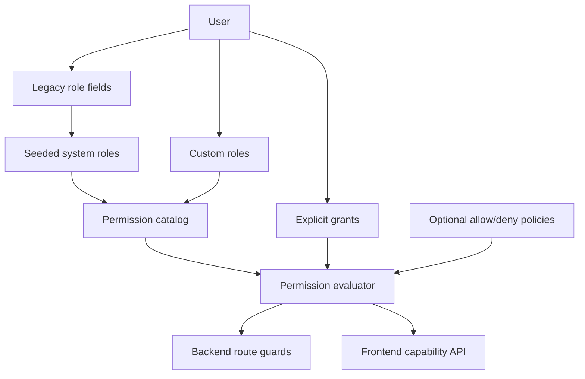

# OSS Custom RBAC and External Engine Registration Plan

## Purpose
This document proposes a backward-compatible authorization evolution for EnterpriseGlue OSS.

The goal is to support:
- default roles matching the roles EnterpriseGlue has today
- platform-admin-defined custom roles
- fine-grained view and edit permissions for each product capability
- external engine registration through a machine API
- SSO-claim-based user assignment to engines
- a clear admin UI for role, permission, and assignment management

This is an implementation plan. The current model remains documented in `09-oss-authorization-access-control-model.md`.

## Implementation Progress

Status for the current OSS implementation slice on `feat/sso-engine-assignments`:

### Completed
- [x] Add RBAC entities and tables for `permissions`, `roles`, `role_permissions`, `role_assignments`, and `sso_assignment_mappings`.
- [x] Add migrations and register them through the shared migration entry points.
- [x] Seed deterministic system roles for `system.platform.admin`, `system.platform.user`, all project roles, and all engine roles.
- [x] Seed a centralized permission catalog from current platform, project, engine, and Mission Control behavior.
- [x] Extend permission evaluation to include legacy role fields, scoped RBAC assignments, explicit permission grants, and existing ABAC policies.
- [x] Keep legacy memberships dynamic instead of backfilling them into `role_assignments`.
- [x] Add effective-access evaluation with allow/deny explanation output.
- [x] Add custom role create/update/archive support for platform-admin-defined roles.
- [x] Enforce custom roles as allow-only permission bundles; deny-style role inputs are rejected and explicit denies stay in the ABAC/policy layer.
- [x] Add custom permission creation for scope-specific `:custom:` permission keys.
- [x] Add manual scoped role assignment list/create/delete support.
- [x] Add SSO engine assignment mappings separate from existing SSO platform-role mappings.
- [x] Sync Microsoft and SAML provisioning into engine-scoped SSO assignments after user creation/update.
- [x] Fail login when SSO assignment sync fails.
- [x] Support exact engine ID, all-engines, external engine ID, and engine label selectors for SSO engine assignments.
- [x] Restrict SSO-assigned system engine roles to `system.engine.operator` and `system.engine.deployer`.
- [x] Allow SSO assignment mappings to target active, assignable custom engine roles.
- [x] Ensure SSO sync writes only `source = "sso"` role assignments and never mutates `engine_members`.
- [x] Ensure authoritative SSO sync removes stale SSO-managed assignments only.
- [x] Add API client persistence for external engine registration clients.
- [x] Add scoped API client token creation, rotation, revocation, and authentication.
- [x] Add idempotent external engine registration through `POST /engines-api/external/engines`.
- [x] Require `engine:register` API client scope for external engine registration.
- [x] Add engine `externalId`, `labelsJson`, `registrationSource`, and `externalUpdatedAt` metadata.
- [x] Add separate `external_engine_registrations` persistence, including API-client identity and last-registered timestamps, while retaining engine metadata columns for backward compatibility.
- [x] Add audit records for external engine registration create/update.
- [x] Expose external engine metadata and labels through engine schemas and responses.
- [x] Support optional connection testing during external engine registration and return recorded health.
- [x] Warn admins before manually editing externally registered engines because later registrations may overwrite those fields.
- [x] Add platform-admin registered-engine inventory and per-engine external registration audit reads.
- [x] Add `/admin/access-control` with Roles, Permissions, Assignments, Effective Access, SSO Engine Assignments, and External Registration tabs.
- [x] Add registered external-engine inventory and audit drilldown to the Access Control External Registration tab.
- [x] Add search and scope filtering to the Access Control Roles tab.
- [x] Add duplicate-system-role action that opens a custom role draft with copied permissions.
- [x] Require explicit acknowledgement before saving custom roles with sensitive permissions.
- [x] Add dangerous-permission warnings, quick filters, and dependency hints to the Access Control Permissions tab.
- [x] Classify operation-specific member/project-access permissions as access-control risks and engine environment permissions as sensitive operations in the Access Control Permissions tab.
- [x] Add SSO assignment diagnostics for stale SSO-managed assignments and missing external engine or label targets.
- [x] Add audit records for custom-role, manual role-assignment, and SSO-managed assignment add/remove mutations.
- [x] Add non-assignable `system.platform.developer` compatibility role for legacy `users.platformRole = developer` records.
- [x] Add SSRF-oriented validation for external registration URLs, blocking embedded credentials and local, metadata, private, link-local, multicast, or reserved address literals.
- [x] Add `GET /api/authz/me/permissions` for current-user effective platform, project, and engine permission snapshots.
- [x] Expose current-user permissions through shared contracts, frontend auth service, and authorization hooks.
- [x] Use current-user platform permissions for admin route guards and header admin navigation, with legacy capability fallback.
- [x] Codify `system.engine.deployer` as deployment-focused only, with no Mission Control runtime mutation permissions.
- [x] Use engine-scoped permission snapshots for Mission Control route/menu visibility, with legacy capability fallback.
- [x] Use platform permission snapshots for User Management and Audit Log page entry gates.
- [x] Add elevated `platform:audit:unredacted-view` permission, API gating, OpenAPI docs, UI toggle gating, and backend/frontend tests for opt-in unredacted audit payloads.
- [x] Add granular platform user-management permissions for view, create, update, deactivate, delete, permanent delete, and unlock operations.
- [x] Add granular project member-management permissions for user search/lookup, invitation, direct add, role update, member removal, and deploy-grant management while preserving `project:members:manage` as the compatibility fallback.
- [x] Add granular project delegate-management and ownership-transfer permissions while preserving owner-only default behavior.
- [x] Add granular engine member, environment, and project-access permissions for lookup, invitation, direct add, role update, removal, environment set/lock, and access-request view/approve/deny/revoke while preserving `engine:members:manage` and `engine:edit` compatibility fallbacks.
- [x] Add granular engine delegate-management and ownership-transfer permissions while preserving owner-only default behavior.
- [x] Gate User Management create, edit, unlock, deactivate, and permanent-delete UI actions with operation-specific permissions while preserving `platform:user:manage` fallback.
- [x] Migrate backend `/api/users` routes to granular user-management permissions while preserving `platform:user:manage` as the compatibility fallback.
- [x] Update OpenAPI authz schemas to expose tenant-aware role, assignment, policy, audit, and SSO assignment payloads.
- [x] Migrate invitation creation checks to platform users-create/user-manage, project member-manage, and engine member-manage permission fallbacks while preserving legacy admin/owner/delegate behavior.
- [x] Migrate setup-complete admin route to `platform:settings:manage` permission evaluation while preserving platform-admin behavior.
- [x] Gate Starbase project detail actions with project-scoped permissions for file view/create/edit/delete, member view/manage, project settings, Git connection, and deploy, while preserving legacy project role fallback.
- [x] Gate Starbase project member modal add, invite reissue, role edit, deploy-grant, and remove actions with operation-specific project member permissions while preserving `project:members:manage` fallback.
- [x] Migrate backend Starbase member-management routes to accept scoped `project:members:view` and `project:members:manage` permissions while preserving owner/delegate and member-access behavior.
- [x] Migrate Starbase project member search/lookup, invitation, direct add, role update, remove, and deploy-grant routes to operation-specific project member permissions while preserving legacy owner/delegate and `project:members:manage` behavior.
- [x] Add shared project authorization middleware permission fallbacks and migrate Starbase project rename/delete/engine-access plus folder project-level read/create/import/download entry points.
- [x] Add shared file authorization middleware permission fallbacks and migrate direct Starbase file, folder, version, and comment entry points to scoped project file/version permissions.
- [x] Migrate Starbase engine-deployment list, file deployment, file history, and latest-deployment read checks to scoped project file-view permission fallbacks.
- [x] Migrate Mission Control process/decision edit-target checks to scoped project file-view/file-edit permission fallbacks for Starbase edit links.
- [x] Add route-specific engine permission fallback support to shared engine authorization middleware.
- [x] Migrate Mission Control process-instance and process/decision definition routes to route-specific engine permission fallbacks.
- [x] Migrate Mission Control batch, direct operation, modification, message/signal, metrics, and extended-history routes to route-specific engine permission fallbacks.
- [x] Migrate Mission Control jobs, tasks, external-task, and migration routes to route-specific engine permission fallbacks.
- [x] Migrate Starbase direct engine deployment and process-definition diagram routes to route-specific engine deploy/deploy-view permission fallbacks.
- [x] Migrate engine deployment passthrough list/read/delete routes to scoped engine deploy-view/deploy permission fallbacks.
- [x] Allow scoped `engine:edit` permission to receive unredacted engine auth fields in Mission Control engine list/detail reads while preserving redaction for view-only access.
- [x] Migrate the legacy aggregate Mission Control router to route-specific engine permission fallbacks.
- [x] Migrate VCS/checkpoint commit, publish, history, status, snapshot, and restore route checks to scoped project file-view, version-create, and version-restore permission fallbacks.
- [x] Migrate Git deployment and lock routes to scoped project deploy, file-view, file-edit, version-restore, and project-settings permission fallbacks.
- [x] Migrate Git repository and project-connection routes to scoped project file-view and Git-connect permission fallbacks.
- [x] Migrate Git sync status, push/pull, and sync repository-list routes to scoped project Git-pull, Git-push, and file-view permission fallbacks.
- [x] Migrate engine access-request creation to scoped project settings permission fallback.
- [x] Gate Engines page edit, delete, test-connection, and member row actions with engine-scoped permissions while preserving legacy engine role fallback.
- [x] Begin engine route migration by allowing scoped engine permissions to authorize engine update/delete/test and engine member-management routes while keeping owner/delegate behavior.
- [x] Include custom engine role assignments in accessible engine reads so permission-scoped users can see assigned engines without backfilling `engine_members`.
- [x] Add custom-role assignment controls directly inside project and engine member-management dialogs, using assignable custom roles and manual scoped role assignments.
- [x] Keep the existing SSO Role Mappings page unchanged for platform-role provisioning.
- [x] Add backend route/service tests and frontend Access Control tests for the implemented slice.
- [x] Bump touched published packages: `@enterpriseglue/shared`, `@enterpriseglue/backend-host`, and `@enterpriseglue/frontend-host`.
- [x] Platform Admin authz APIs now use route-specific platform permissions for roles, custom permissions, policies, platform SSO mappings, SSO engine assignments, external engine registration, effective-access evaluation, and authz audit reads while preserving platform-admin behavior.
- [x] EE extension navigation and menu capability gates now use current-user permission snapshots while preserving legacy `UserCapabilities` and deprecated admin role fallbacks.
- [x] Live backend route-guard audit shows no remaining standalone platform-admin module route gates; remaining direct platform-admin uses are compatibility short-circuits or display context.
- [x] Remaining frontend admin capability cleanup now uses permission snapshots for generic admin route access, setup checks, admin header affordances, and profile role display with legacy capability fallback.

### Partially Completed
- [x] External engine registration metadata is implemented on the existing `engines` table.
- [x] A separate `external_engine_registrations` table is implemented; engine metadata columns remain as the backward-compatible API shape.
- [x] External registration uses dedicated scoped API client bearer tokens.
- [x] Dedicated API client entities, scoped machine credentials, secret rotation, and last-used tracking are implemented.
- [x] `system.platform.developer` is implemented as a non-assignable compatibility role for old installs that contain `users.platformRole = developer`.
- [x] Custom roles are implemented over the seeded permission catalog.
- [x] Custom permission creation is implemented; permissions can now be system-defined or custom.
- [x] The evaluator can authorize from custom roles.
- [x] Shared legacy route middleware now evaluates through `permissionService` first whenever a route supplies a scoped permission; legacy role and membership checks remain as compatibility fallback and helper names remain stable for existing route imports.
- [x] Engine management route migration has started for update, delete, test connection, member view/manage, environment edit, and access-request management checks.
- [x] Engine management route migration now includes operation-specific permissions for member lookup, invite, add, update, remove, environment set/lock, and project access-request view/approve/deny/revoke operations.
- [x] Starbase member-management route migration covers member list, user search, lookup, capabilities, invitation reissue, add, update, deploy-grant, and remove operations, including operation-specific project member permissions with `project:members:manage` retained as a compatibility fallback.
- [x] Starbase project/folder route migration has started through shared project authorization middleware permission fallbacks.
- [x] Starbase direct file, folder, version, and comment route migration now accepts scoped project file/version permissions while preserving legacy access checks.
- [x] Starbase engine-deployment read route migration now accepts scoped project file-view permissions while preserving legacy project and engine visibility checks.
- [x] Mission Control process/decision edit-target route migration now accepts scoped project file-view and file-edit permissions while preserving legacy project membership behavior.
- [x] Shared engine middleware now supports route-specific scoped engine permission fallback, and process-instance/process-definition/decision-definition routes pass concrete engine permissions.
- [x] Mission Control batch, direct operation, modification, message/signal, metrics, and extended-history routes now pass concrete engine permissions.
- [x] Mission Control jobs, tasks, external-task, and migration routes now pass concrete engine permissions.
- [x] Starbase direct engine deployment and process-definition diagram routes now pass concrete engine deploy/deploy-view permissions.
- [x] Engine deployment passthrough list/read/delete routes now accept scoped engine deploy-view/deploy permissions.
- [x] Mission Control engine list/detail responses now expose auth fields to scoped engine editors while preserving redaction for view-only roles.
- [x] Project delegate assignment, delegate promotion, and ownership transfer routes now accept scoped project delegate-management and ownership-transfer permissions while preserving owner behavior.
- [x] Engine delegate assignment and ownership transfer routes now accept scoped engine delegate-management and ownership-transfer permissions while preserving owner behavior.
- [x] The legacy aggregate Mission Control router now passes concrete engine permissions for definition, instance, history, modify, delete, and retry endpoints.
- [x] VCS/checkpoint route migration now accepts scoped project file-view and version permissions while preserving legacy role checks.
- [x] Git deployment and lock route migration now accepts scoped project deploy, file, version, and settings permissions while preserving legacy role checks.
- [x] Git repository and project-connection route migration now accepts scoped project file-view and Git-connect permissions while preserving legacy role checks.
- [x] Git sync route migration now accepts scoped project Git-pull, Git-push, and file-view permissions while preserving legacy role checks.
- [x] Engine access-request creation now accepts scoped project settings permission while preserving legacy owner/delegate project behavior.
- [x] Shared deploy authorization middleware now accepts scoped project `project:deploy` and engine `engine:deploy` permissions while preserving legacy deploy roles and explicit deploy grants.
- [x] Starbase import-from-engine authorization now accepts scoped `engine:deploy:view` permission while preserving legacy engine member-role behavior.
- [x] Shared generic authorization middleware now accepts platform, project, and engine permission fallbacks while preserving legacy role checks.
- [x] Dashboard context now derives user, process, metrics, and deployment visibility from effective permission snapshots while preserving legacy role visibility fallbacks.
- [x] Platform Admin authz route migration now accepts route-specific platform permissions for access-control reads/writes, platform SSO mappings, SSO engine assignments, external engine registration, effective-access evaluation, and audit reads while preserving platform-admin behavior.
- [x] The Access Control UI covers roles, permissions, assignments, effective access, and SSO engine mappings.
- [x] API-client management is available in the Access Control External Registration tab.
- [x] A registered-engines table and external-registration audit detail view are implemented in the Access Control External Registration tab.
- [x] The current-user permissions endpoint and client hooks are implemented as the first frontend capability upgrade foundation.
- [x] Admin navigation and Mission Control visibility have started consuming current-user permission snapshots.
- [x] User Management UI actions now use finer-grained operation checks for create, update, unlock, deactivate, and permanent delete actions.
- [x] Backend user-management routes enforce granular view, create, update, deactivate, unlock, and permanent-delete permissions.
- [x] Invitation creation now accepts scoped platform users-create/user-manage, project member-manage, and engine member-manage permissions while preserving legacy admin/owner/delegate behavior.
- [x] Setup-complete now accepts scoped platform settings permission while preserving legacy platform admin behavior.
- [x] Starbase project detail actions use project-scoped permission snapshots for toolbar, row, batch, member, Git, and deploy affordances.
- [x] Starbase project member modal actions now use operation-specific project member permissions for add, invite reissue, role update, deploy-grant, and remove controls.
- [x] Starbase project member-management routes now accept operation-specific member permissions for search/lookup, invite, add, role update, remove, and deploy-grant operations while preserving owner/delegate and `project:members:manage`.
- [x] Engine management routes now accept operation-specific engine permissions for member lookup, invite, add, update, remove, environment set/lock, and project access-request operations while preserving owner/delegate and umbrella permission behavior.
- [x] Engines page row actions use engine-scoped permission snapshots for edit, delete, test connection, member view, and member management affordances.
- [x] Engine members modal actions now use operation-specific engine permissions for add, invite reissue, role update, removal, delegate removal, and project access-request controls.
- [x] Online project import-from-engine options now use engine-scoped `engine:deploy:view` permission snapshots with legacy engine-role fallback.
- [x] Git versions deployment-history visibility now uses engine-scoped `engine:deploy:view` permission snapshots with legacy engine-role fallback.
- [x] Dashboard panels now use platform and engine permission snapshots with Dashboard context compatibility fallback.
- [x] Backend user-management routes now enforce granular permissions server-side.
- [x] EE extension navigation and menu gates now consume RBAC permission snapshots for matching legacy capability names, with legacy capabilities retained as compatibility fallbacks.
- [x] Generic admin route access, setup checks, admin header affordances, and profile role display now consume permission snapshots where possible while retaining legacy capability fallbacks.

### Deferred or Explicitly Out of Scope for This Slice
- [x] Backfill legacy project and engine memberships into `role_assignments` as synchronized `source = "legacy"` rows. These rows are for admin visibility and migration continuity; authorization still resolves live legacy membership dynamically, and `source = "legacy"` rows are excluded from the RBAC assignment grant path.
- [ ] Allow SSO to assign engine owner or delegate roles.
- [x] Decide not to add deny permissions to custom roles; custom roles remain allow-only and denies belong in ABAC/policies.
- [x] Add audit records for role, assignment, and SSO sync mutations.
- [x] Add explicit SSRF-grade URL validation beyond the existing engine URL safeguards.
- [x] Replace all coarse frontend capability checks with resource-scoped permission checks where the frontend has a matching platform/project/engine snapshot; legacy `UserCapabilities` is now consumed only through centralized compatibility helpers.
- [x] EE extension navigation and menu capability gates now use current-user permission snapshots where an OSS platform, project, or engine permission can satisfy the legacy capability.
- [x] Git versions deployment-history visibility has moved from legacy engine role only to scoped `engine:deploy:view` permission snapshots with legacy fallback.
- [x] Dashboard user, process, and metrics panels have moved to permission snapshots with context fallback.
- [x] Add custom-role assignment controls directly inside project and engine member-management dialogs.
- [x] Add OSS-compatible tenant scope hooks for RBAC roles, role assignments, SSO engine assignment mappings, explicit grants, ABAC policies, and authz audit logs.
- [x] Keep tenant-aware OpenAPI contracts aligned with those OSS-compatible tenant scope hooks.

#### Proposed Resolution: SSO Engine Owner / Delegate Assignment

Do not let SSO mutate accountable engine owner/delegate metadata. SSO owner/delegate should create only effective scoped RBAC grants, with `source = "sso"`, mapping lineage, and normal reconciliation cleanup. This preserves support for multiple effective owners while keeping one accountable owner as governance metadata.

Recommended implementation:

- Keep `system.engine.owner` and `system.engine.delegate` hidden from direct SSO mapping by default.
- Add disabled-by-default platform settings for SSO owner and SSO delegate grants.
- Do not require a dedicated save-time acknowledgement for owner/delegate mappings. Enabling the platform setting plus mapping preview/test is sufficient for v1. Broad all-engine selectors and sensitive-permission custom roles may still keep their own guardrails.
- Permit exact engine, external engine id, label-backed Engine Set, and guarded all-engine selectors only when the matching high-risk selector setting is also enabled.
- Fail login closed when an enabled owner/delegate mapping cannot materialize safely.
- Remove only SSO-managed owner/delegate assignments when mappings stop matching or when the platform setting is disabled; never remove manual/API assignments or accountable owner metadata.
- Show effective owner/delegate grants separately from accountable owner/delegate fields in Engine Access and Effective Access.
- Audit mapping create/update/delete, login/scheduled materialization, stale cleanup, and setting changes.

Engine access visibility and transition model:

- Add SSO engine access snapshots that record provider subject/group/app-role ids, current roles, previous roles, status, last sync, cleanup reason, and mapping lineage.
- Use current `role_assignments` for authorization; use snapshots only for diagnostics, audit, and admin visibility.
- Show a consolidated Engine Detail > Access list with accountable owner metadata, effective owners/delegates/operators/deployers/custom roles, source badges, status, and last sync.
- Show full provider/mapping details in Access Control only when the admin has SSO mapping read permission.
- Treat Manual -> SSO as an explicit transition, not a permanent "hybrid" human-access mode. Use `manual`, `transition_to_sso`, and `sso_managed` for engine access authority.
- During transition, show manual and SSO grants together, flag duplicate/conflicting rows, and provide a preview/apply cleanup tool. Normal SSO sync may remove only `source = "sso"` rows; manual duplicate cleanup is a separate admin action.
- Keep project access authority separate from engine access authority. SSO may manage engine roles while project creation, project owners, and project members remain manual.

Mission Control and Starbase bridge model:

- Mission Control -> Starbase edit links require engine edit-target read permission, project file read/edit permission, an active project-engine target, and edit-target lineage to the project file.
- Starbase -> Mission Control links require project file read permission, an active project-engine target, and matching engine runtime read permission.
- If the user can view one side but not the other, keep the visible side usable and hide or disable the bridge action with a concise reason.
- Backend bridge/evaluate APIs must return stable reason codes and admin diagnostic links; frontend visibility is UX only.

Validation required before marking this deferred item complete:

- Service tests for disabled-by-default rejection, exact engine grant, Engine Set grant, all-engine guardrail, stale cleanup, snapshot status updates, and manual assignment survival.
- Route tests for create/update/test mapping APIs and platform setting toggles.
- Frontend tests proving owner/delegate role options appear only when enabled or editing an existing owner/delegate mapping, mapping preview/test is available, and no dedicated owner/delegate acknowledgement is required.
- Engine Detail and Access Control tests proving the effective access list distinguishes accountable metadata, SSO grants, manual grants, status, last roles, and provider/mapping lineage according to viewer permissions.
- Transition tests proving duplicate manual cleanup is previewed/applied only by explicit admin action and never by normal SSO login sync.
- Bridge tests proving Mission Control -> Starbase and Starbase -> Mission Control links require project permission, engine permission, active target, and lineage.
- [x] Remove direct legacy platform-admin helper dependency from Platform Admin authz route checks; all Access Control route checks now flow through `permissionService`.
- [x] Derive Dashboard platform-admin compatibility flags from current-user platform permission snapshots instead of synchronous platform-role helpers.
- [x] Implement EE tenant membership, tenant-admin, and super-admin resolution in the EE plugin. OSS preserves enterprise-resolved tenant context and calls the EE post-auth resolver when registered; OSS continues to use default tenant compatibility without the plugin.

## Design Principles
- **Backward compatible first**
  Existing users, project memberships, engine memberships, owner fields, and route behavior must continue to work after upgrade.

- **Default roles remain**
  Current platform, project, and engine roles become seeded system roles. They are visible and explainable, but protected from accidental deletion.

- **Permissions become authoritative**
  Roles should be treated as bundles of permissions. Backend route guards should gradually move from role-name checks to permission checks.

- **Ownership remains explicit**
  Project owner and engine owner remain explicit accountable relationships. Custom roles can grant powerful permissions, but should not silently replace ownership semantics.

- **Frontend gates are advisory**
  The UI should hide unavailable actions and pages, but backend authorization remains authoritative.

- **SSO is a source of assignments**
  SSO claims can assign roles and permissions, but only for assignments marked as SSO-managed. Manual assignments must not be removed by SSO sync.

## Current State Summary
The OSS app currently uses several overlapping authorization mechanisms:

- `users.platformRole` for platform-level access.
- `project_members.role` and `project_member_roles.role` for project access.
- `engines.ownerId`, `engines.delegateId`, and `engine_members.role` for engine access.
- `permission_grants` for additive explicit grants.
- `sso_claims_mappings` for SSO claim to platform-role mapping.
- Route middleware such as `requireProjectRole`, `requireEngineReadOrWrite`, `requireEngineDeployer`, and `requirePermission`.
- Frontend capabilities such as `canManageUsers`, `canViewAuditLogs`, `canManagePlatformSettings`, and `canViewMissionControl`.

The migration should not remove any of these immediately. It should wrap them in a more general permission model and phase direct role checks out over time.

## Target Architecture


The evaluator should answer one question:

`Does user U have permission P on resource R?`

Role names should be an implementation detail, not the final authority used by every route.

## Data Model Changes

### New Tables
Add these tables beside existing tables.

| Table | Purpose |
| --- | --- |
| `permissions` | Seeded permission catalog with key, label, scope, category, and description |
| `roles` | System and custom roles |
| `role_permissions` | Permission membership for each role |
| `role_assignments` | User to role assignment, optionally scoped to a platform, project, or engine resource |
| `sso_assignment_mappings` | SSO claims to scoped role assignments |
| `external_engine_registrations` or engine columns | External registration metadata and API identity |
| `api_clients` | Machine clients allowed to call external registration APIs |

### Suggested `roles` Columns
| Column | Notes |
| --- | --- |
| `id` | Stable id, for example `system.project.editor` or UUID for custom roles |
| `key` | Human readable stable key |
| `name` | Display name |
| `description` | Optional text |
| `scope` | `platform`, `project`, or `engine` |
| `kind` | `system` or `custom` |
| `is_editable` | false for system roles |
| `is_assignable` | false for internal compatibility-only roles if needed |
| `created_by_id` | User id for custom roles |
| `created_at` / `updated_at` | Audit fields |

### Suggested `role_assignments` Columns
| Column | Notes |
| --- | --- |
| `id` | UUID |
| `user_id` | Assigned user |
| `role_id` | System or custom role |
| `resource_type` | `platform`, `project`, `engine`, or null for platform/global |
| `resource_id` | Project id or engine id when scoped |
| `source` | `legacy`, `manual`, `sso`, `api`, or `system` |
| `source_mapping_id` | SSO mapping id or API client id when applicable |
| `last_seen_at` | Used for SSO reconciliation |
| `created_by_id` | Actor that created the assignment |
| `created_at` / `updated_at` | Audit fields |

### Engine Registration Metadata
The existing `engines` table can be extended with:

| Column | Notes |
| --- | --- |
| `external_id` | Stable id from the external system |
| `registration_source` | Source system name |
| `managed_externally` | true when an external API owns core metadata |
| `labels_json` | JSON labels for SSO selector mappings, for example region/domain/environment |
| `last_registered_at` | Last external upsert timestamp |

Add a unique index on `external_id` where not null.

Implemented status: the current slice uses `external_id`, `labels_json`, `registration_source`, and `external_updated_at` on `engines`. It does not add `managed_externally` or a separate registration table yet.

## Seeded System Roles
These roles should be seeded during migration and preserved across upgrades.

### Platform Roles
| System role | Backing legacy field | Behavior |
| --- | --- | --- |
| `system.platform.admin` | `users.platformRole = admin` | Preserves current admin behavior |
| `system.platform.user` | `users.platformRole = user` | Preserves current default user behavior |
| `system.platform.developer` | legacy value if present | Compatibility role only if existing data or old integrations still produce `developer` |

`system.platform.developer` should not be newly assigned unless a deployment already uses it. If present, preserve the current observed behavior, which is at least `platform:user:view`.

### Project Roles
| System role | Backing legacy role | Current behavior to preserve |
| --- | --- | --- |
| `system.project.owner` | `owner` | manage settings, members, files, folders, versions, Git, deploy, and delete project |
| `system.project.delegate` | `delegate` | manage settings, members, files, folders, versions, Git, and deploy, but not delete project by default |
| `system.project.developer` | `developer` | create/edit/delete project content, create/restore versions, Git push/pull, deploy |
| `system.project.editor` | `editor` | create/edit/view files and create versions, no deploy by default |
| `system.project.viewer` | `viewer` | view project files and members |

Project ownership should continue to be inferred from `projects.ownerId` even if a membership row is missing.

### Engine Roles
| System role | Backing legacy role | Current behavior to preserve |
| --- | --- | --- |
| `system.engine.owner` | `engines.ownerId` | manage engine, members, project access, deployments, and Mission Control mutation actions |
| `system.engine.delegate` | `engines.delegateId` | near-owner engine management, no implicit ownership transfer |
| `system.engine.operator` | `engine_members.role = operator` | view Mission Control and operate process instances/jobs/batches |
| `system.engine.deployer` | `engine_members.role = deployer` | deployment-focused access only, with no Mission Control runtime mutation permissions |

Existing `deployer` behavior is intentionally narrow: Mission Control mutation middleware accepts owner/delegate/operator, not deployer. Preserve this behavior; use operator or custom engine roles for runtime operation access.

## Permission Catalog
The catalog should be centralized in shared code, seeded into the database, and exposed to the frontend grouped by category.

### Platform Permissions
| Permission | Meaning |
| --- | --- |
| `platform:dashboard:view` | View dashboard shell and platform overview |
| `platform:users:view` | View users |
| `platform:users:create` | Create/invite platform users |
| `platform:users:update` | Update user profile, status, or role |
| `platform:users:deactivate` | Deactivate users |
| `platform:users:delete` | Soft delete users |
| `platform:users:permanent-delete` | Permanently delete users |
| `platform:users:unlock` | Unlock locked users |
| `platform:audit:view` | View audit logs and audit stats |
| `platform:audit:unredacted-view` | View unredacted audit payloads when explicitly requested |
| `platform:settings:view` | View platform settings |
| `platform:settings:manage` | Manage platform settings |
| `platform:branding:view` | View branding settings |
| `platform:branding:manage` | Manage branding settings |
| `platform:email:view` | View email configuration |
| `platform:email:manage` | Manage email configuration |
| `platform:email-templates:view` | View email templates |
| `platform:email-templates:manage` | Manage email templates |
| `platform:sso:view` | View SSO providers |
| `platform:sso:manage` | Manage SSO providers |
| `platform:sso-mappings:view` | View SSO mappings |
| `platform:sso-mappings:manage` | Manage SSO mappings |
| `platform:authz:check` | Evaluate authorization checks |
| `platform:authz:roles:view` | View roles and permissions |
| `platform:authz:roles:manage` | Create/update/archive custom roles |
| `platform:authz:policies:view` | View authorization policies |
| `platform:authz:policies:manage` | Manage authorization policies |
| `platform:authz:audit:view` | View authorization audit log |
| `platform:git-providers:view` | View Git provider configuration |
| `platform:git-providers:manage` | Manage Git provider configuration |
| `platform:environments:view` | View environment tags |
| `platform:environments:manage` | Manage environment tags |
| `platform:governance:view` | Search governance resources |
| `platform:governance:manage` | Reassign owners/delegates and perform governance actions |
| `platform:engine-registration:manage` | Manage external engine registration clients |

### Self-Service Permissions
These do not usually need admin configuration, but they should still be explicit in the catalog.

| Permission | Meaning |
| --- | --- |
| `self:profile:view` | View own profile |
| `self:profile:update` | Update own profile |
| `self:password:change` | Change own password |
| `self:notifications:view` | View own notifications |
| `self:notifications:mark-read` | Mark own notifications as read |
| `self:notifications:delete` | Delete own notifications |
| `self:git-credentials:view` | View own Git credentials metadata |
| `self:git-credentials:manage` | Create/update/delete own Git credentials |
| `self:git-oauth:connect` | Connect Git OAuth provider |

### Project Permissions
| Permission | Meaning |
| --- | --- |
| `project:view` | View project |
| `project:create` | Create project |
| `project:update` | Rename/update project |
| `project:delete` | Delete project |
| `project:export` | Download/export project |
| `project:import` | Import ZIP/project content |
| `project:members:view` | View project members |
| `project:members:search` | Search users for project membership |
| `project:members:invite` | Invite project members |
| `project:members:add` | Add existing users as project members |
| `project:members:update-role` | Change project member roles |
| `project:members:remove` | Remove project members |
| `project:members:transfer-ownership` | Transfer project ownership |
| `project:members:manage-deploy-grant` | Grant/revoke editor deploy permission |
| `project:engine-access:view` | View connected engines and access requests |
| `project:engine-access:request` | Request engine access for a project |
| `project:files:view` | View files |
| `project:files:create` | Create/import files |
| `project:files:update-content` | Edit file content |
| `project:files:rename` | Rename files |
| `project:files:move` | Move files |
| `project:files:delete` | Delete files |
| `project:files:download` | Download files |
| `project:files:restore` | Restore file from version or commit |
| `project:files:callers:view` | View file caller references |
| `project:folders:view` | View folders |
| `project:folders:create` | Create folders |
| `project:folders:rename` | Rename folders |
| `project:folders:move` | Move folders |
| `project:folders:delete` | Delete folders |
| `project:folders:download` | Download folders |
| `project:versions:view` | View file versions and commits |
| `project:versions:create` | Create versions/checkpoints |
| `project:versions:restore` | Restore versions |
| `project:versions:compare` | Compare versions |

### Project Git, VCS, and Deployment Permissions
| Permission | Meaning |
| --- | --- |
| `project:git:view` | View project Git connection |
| `project:git:connect` | Connect project to Git |
| `project:git:update-token` | Update project Git token |
| `project:git:disconnect` | Disconnect project Git |
| `project:git:init` | Initialize repository |
| `project:git:clone` | Clone repository |
| `project:git:sync-status:view` | View sync status |
| `project:git:sync` | Run sync |
| `project:git:repositories:view` | View project repositories |
| `project:git:repositories:delete` | Remove project repository record |
| `project:git:commits:view` | View Git commit history |
| `project:vcs:status:view` | View VCS status |
| `project:vcs:commit` | Commit/checkpoint project changes |
| `project:vcs:publish` | Publish committed changes |
| `project:vcs:restore` | Restore from VCS commit |
| `project:deployments:view` | View project deployment history |
| `project:deploy` | Deploy project resources |
| `project:rollback` | Roll back project deployment |

### Engine Permissions
| Permission | Meaning |
| --- | --- |
| `engine:view` | View engine metadata |
| `engine:create` | Create engine manually |
| `engine:update` | Update engine metadata |
| `engine:delete` | Delete engine |
| `engine:secrets:view` | View engine secret-backed configuration |
| `engine:secrets:manage` | Manage engine secrets/auth config |
| `engine:test` | Test engine connection |
| `engine:health:view` | View engine health |
| `engine:environment:set` | Set environment tag |
| `engine:environment:lock` | Lock/unlock engine environment |
| `engine:members:view` | View engine members |
| `engine:members:lookup` | Look up users for engine membership |
| `engine:members:invite` | Invite engine members |
| `engine:members:add` | Add existing users as engine members |
| `engine:members:update-role` | Update engine member roles |
| `engine:members:remove` | Remove engine members |
| `engine:delegate:assign` | Assign/remove engine delegate |
| `engine:ownership:transfer` | Transfer engine ownership |
| `engine:project-access:view` | View project access requests |
| `engine:project-access:approve` | Approve project engine access |
| `engine:project-access:deny` | Deny project engine access |
| `engine:project-access:revoke` | Revoke project engine access |
| `engine:deployment:preview` | Preview deployment resources |
| `engine:deployment:create` | Deploy resources to engine |
| `engine:deployment:view` | View engine deployments |
| `engine:deployment:delete` | Delete engine deployments |

### Mission Control Permissions
| Permission | Meaning |
| --- | --- |
| `engine:mission-control:view` | Access Mission Control for an engine |
| `engine:process-definitions:view` | View process definitions |
| `engine:process-definitions:xml:view` | View process definition XML |
| `engine:process-definitions:stats:view` | View process definition statistics |
| `engine:process:start` | Start process instances |
| `engine:process:modify` | Modify process instances |
| `engine:process:restart` | Restart process definitions |
| `engine:process:migrate` | Create/execute migration plans |
| `engine:instances:view` | View process instances |
| `engine:instances:variables:view` | View process variables |
| `engine:instances:variables:update` | Update process variables |
| `engine:instances:suspend` | Suspend process instances |
| `engine:instances:activate` | Activate process instances |
| `engine:instances:delete` | Delete process instances |
| `engine:instances:retry` | Retry process instance failures |
| `engine:instances:history:view` | View process instance history |
| `engine:incidents:view` | View incidents |
| `engine:batches:view` | View batches |
| `engine:batches:create` | Create batch actions |
| `engine:batches:suspend` | Suspend/resume batches |
| `engine:batches:delete` | Delete batch records or batch executions |
| `engine:decisions:view` | View decision definitions and history |
| `engine:decisions:evaluate` | Evaluate decisions |
| `engine:tasks:view` | View tasks |
| `engine:tasks:claim` | Claim tasks |
| `engine:tasks:unclaim` | Unclaim tasks |
| `engine:tasks:assign` | Assign tasks |
| `engine:tasks:complete` | Complete tasks |
| `engine:tasks:variables:view` | View task variables |
| `engine:tasks:variables:update` | Update task variables |
| `engine:tasks:form:view` | View task forms |
| `engine:jobs:view` | View jobs and job definitions |
| `engine:jobs:execute` | Execute jobs |
| `engine:jobs:retries:update` | Update job retries |
| `engine:jobs:suspend` | Suspend/resume jobs or job definitions |
| `engine:external-tasks:view` | View external tasks |
| `engine:external-tasks:fetch-lock` | Fetch and lock external tasks |
| `engine:external-tasks:complete` | Complete external tasks |
| `engine:external-tasks:fail` | Report external task failure |
| `engine:external-tasks:bpmn-error` | Report external task BPMN error |
| `engine:external-tasks:extend-lock` | Extend external task lock |
| `engine:external-tasks:unlock` | Unlock external tasks |
| `engine:messages:correlate` | Correlate messages |
| `engine:signals:send` | Send signals |
| `engine:metrics:view` | View engine metrics |
| `engine:pii:unredacted:view` | View unredacted PII where redaction applies |

## Default Role Permission Mapping
The first implementation should seed system roles with permissions that preserve current behavior. The expanded catalog can be introduced without changing behavior by mapping current role groups conservatively.

### Platform Defaults
| Role | Permissions |
| --- | --- |
| `system.platform.admin` | All platform permissions, plus all currently admin-reachable route capabilities |
| `system.platform.user` | Self-service permissions only |
| `system.platform.developer` | Compatibility only, at least `platform:users:view` when legacy data requires it |

### Project Defaults
| Role | Permissions |
| --- | --- |
| `system.project.owner` | all project permissions |
| `system.project.delegate` | all project permissions except `project:delete` and ownership-only operations unless already allowed today |
| `system.project.developer` | view project, manage files/folders, create/restore versions, Git push/pull/sync, deploy |
| `system.project.editor` | view project, view members, create/edit files/folders, create versions |
| `system.project.viewer` | view project, files, folders, members, versions, deployments |

### Engine Defaults
| Role | Permissions |
| --- | --- |
| `system.engine.owner` | all engine and Mission Control permissions |
| `system.engine.delegate` | all engine and Mission Control permissions except ownership transfer where owner-only today |
| `system.engine.operator` | Mission Control view and operational mutation permissions currently available to operators |
| `system.engine.deployer` | deployment view/create permissions only; no Mission Control runtime mutation permissions |

## Permission Evaluation Order
Use this order during the migration:

1. Resolve legacy system-role permissions from existing fields.
2. Resolve custom role assignments from `role_assignments`.
3. Resolve explicit permission grants from `permission_grants`.
4. Apply optional authorization policies.
5. Return allow/deny with an explanation.

The explanation should be available to admins, for example:

```json
{
  "allowed": true,
  "permission": "engine:deployment:create",
  "resourceType": "engine",
  "resourceId": "engine-123",
  "sources": [
    { "type": "system-role", "role": "system.engine.operator" },
    { "type": "custom-role", "role": "deployment-approver" }
  ]
}
```

## External Engine Registration

### API
Add a machine-authenticated external API:

Planned long-term shape:

`POST /api/external/engines/register`

Implemented OSS slice:

`POST /engines-api/external/engines`

The implemented endpoint uses scoped API client bearer-token authentication and upserts by `externalId`.

Scope decision: skip additional external engine registration work for now. The implemented foundation remains secret-free; raw secret payloads and credential rotation endpoints are deferred to a later change if needed.

Implemented platform-admin read APIs:
- [x] `GET /api/authz/external-engines`
- [x] `GET /api/authz/external-engines/:id/audit`

Example payload:

```json
{
  "externalId": "prod-camunda-eu-1",
  "name": "Production EU",
  "baseUrl": "https://camunda.example.com/engine-rest",
  "type": "camunda7",
  "environment": "production",
  "authType": "oauth2-client-credentials",
  "ownerEmail": "platform-owner@example.com",
  "labels": {
    "region": "eu",
    "domain": "claims"
  }
}
```

### Registration Behavior
- [x] Authenticate with an API client, not a browser user session.
- [x] Require an API client scope such as `engine:register`.
- [x] Upsert by external engine id, implemented as `externalId`.
- [x] Store registration metadata on the engine.
- [x] Store registration/index metadata in `external_engine_registrations`, including source, API client id, labels, and last registered timestamp.
- [x] Store labels on the engine for SSO selector mapping.
- [x] Resolve SSO external engine id and label selectors from `external_engine_registrations`, with legacy engine-column fallback.
- [x] Preserve manual engine registration through `POST /engines-api/engines`.
- [x] Add deeper URL validation to reduce SSRF risk beyond the existing engine URL safeguards.
- [x] Optionally test the engine connection after registration.
- [x] Write audit records for every create/update.
- [x] Respect externally managed engines by warning before manual edits to fields that may be overwritten.

### API Client Management
Platform admins need a UI and API to:
- [x] create API clients
- [x] rotate client secrets
- [x] disable clients
- [x] set scopes
- [x] view last-used timestamps
- [x] view engine registration audit history

API client management, registered-engine inventory, and engine registration audit history are implemented in the Access Control External Registration tab.

## SSO-Based Engine Assignment

### New Mapping Type
Add SSO assignment mappings separate from the existing platform role mapping.

Example:

```json
{
  "providerId": "saml-provider-id",
  "claimType": "group",
  "claimKey": "groups",
  "claimValue": "Camunda Prod Operators",
  "targetScope": "engine",
  "targetSelector": {
    "externalEngineId": "prod-camunda-eu-1"
  },
  "targetRoleId": "system.engine.operator",
  "syncMode": "authoritative",
  "priority": 100
}
```

Supported selectors:
- exact engine id
- external engine id
- engine label selector, for example `environment=production`
- wildcard selector for all engines when explicitly enabled

### Login Sync
During SSO login:
1. Extract SSO claims as today.
2. Resolve platform role as today for backward compatibility.
3. Resolve matching SSO assignment mappings.
4. Upsert `source = sso` role assignments for matching engines.
5. Set `lastSeenAt` for matched SSO assignments.
6. Remove stale `source = sso` assignments when claims no longer match.
7. Never remove `source = manual` assignments.

### Safe Defaults
- [x] Do not assign `system.engine.owner` from SSO.
- [x] Do not assign `system.engine.delegate` from SSO in the current slice.
- [x] Allow SSO assignment only to `system.engine.operator`, `system.engine.deployer`, or active assignable custom engine roles.
- [x] Allow custom engine roles for SSO assignment.
- [x] Reject exact engine-id mappings when the target engine does not exist.
- [x] Resolve external engine id and label selectors at login sync time after engines are registered.

## Required UI Changes

### Platform Admin Navigation
Add an **Access Control** section under Platform Admin.

Pages:
- [x] Roles
- [x] Permissions
- [x] Assignments
- [x] SSO Assignments
- [x] External Engine Registration
- [x] Effective Access

Implemented status: these are currently delivered as tabs in one `/admin/access-control` page rather than separate pages. The External Registration tab covers API clients, registered-engine inventory, and per-engine registration audit drilldown.

### Roles Page
Purpose: manage system and custom roles.

Required UI:
- [x] Role table with name, scope, kind, permission count, and updated date.
- [x] System roles marked as read-only.
- [x] Duplicate system role action.
- [x] Create custom role action.
- [x] Archive custom role action.
- [x] Role edit modal with permission selection.
- [x] Search and filter by scope: platform, project, engine.

Behavior:
- System roles cannot be deleted.
- System role permissions cannot be edited directly.
- Custom roles can be edited only by users with `platform:authz:roles:manage`.

### Permission Matrix UI
Purpose: assign permissions to custom roles.

Required UI:
- [x] Group permissions by product area.
- [x] Split permissions by permission category and scope.
- [x] Create custom permissions from the Permissions tab.
- [x] Show dangerous permissions with warnings, for example ownership transfer, permanent delete, unredacted PII, engine secret management.
- [x] Provide quick filters: "View only", "Editor", "Operator", "Deployment".
- [x] Show dependencies and implications, for example `project:files:update-content` requires `project:files:view`.

### Assignments Page
Purpose: assign roles to users.

Required UI:
- [x] Select user.
- [x] Select scope: platform, project, or engine.
- [x] Select resource when scope is project or engine.
- [x] Select system or custom role.
- [x] Show source: manual, SSO, API, legacy.
- [x] Prevent direct removal of non-manual assignments.
- [x] Allow manual override/additional assignment without affecting SSO assignments.

### SSO Assignments Page
Purpose: map SSO claims to scoped roles.

Required UI:
- [x] Provider selector.
- [x] Claim type selector: group, role, email domain, custom.
- [x] Claim key and claim value fields.
- [x] Target scope selector.
- [x] Target engine selector by engine id, all engines, external id, or labels.
- [x] Target role selector.
- [x] Sync mode selector: additive or authoritative.
- [x] Test claims panel that shows matched mappings and resulting assignments.

### External Engine Registration Page
Purpose: manage external engine registration clients and registered engines.

Required UI:
- [x] API clients list with scopes, status, created date, last used date.
- [x] Create/rotate/revoke API client actions.
- [x] Registered engines table showing external id, source, labels, last registered date, status.
- [x] Per-engine detail showing registration payload metadata and audit history.
- [x] Warning banner for externally registered engines when manual edits may be overwritten.

External engine registration API-client UI, registered-engine inventory, audit drilldown, and edit-warning coverage are implemented. The warning uses current `registrationSource = external_api` and `externalId` metadata because `managed_externally` is not a separate schema field in this slice.

### Effective Access Page
Purpose: explain why a user can or cannot do something.

Required UI:
- [x] User selector.
- [x] Optional resource selector.
- [x] Permission selector.
- [x] Result panel with allow/deny and contributing sources.
- [x] Warnings for stale SSO assignments or missing engines, shown as SSO Engine Assignment diagnostics.

### Existing UI Updates
Update existing pages to consume permissions/capabilities from the new evaluator:
- [x] Admin navigation should use platform permissions instead of `canAccessAdminRoutes` only.
- [x] User Management should check user-specific operation permissions for create, update, unlock, deactivate, and permanent delete.
- [x] Starbase actions should hide or disable based on project permissions.
- [x] Project member modal should show assignable system/custom project roles.
- [x] Engines page should use engine permissions for edit/delete/test/member actions.
- [x] Engine member modal should show assignable system/custom engine roles.
- [x] Mission Control route/sidebar visibility should use engine-scoped permissions instead of the coarse `canViewMissionControl` flag.

## Backend Implementation Plan

### Phase 1: Catalog and System Roles
- [x] Create permission catalog in shared code.
- [x] Seed permission records.
- [x] Seed system roles and role-permission rows.
- [x] Add read APIs for roles and permissions.
- [x] Preserve current route behavior.

### Phase 2: Permission Evaluator
- [x] Extend `permissionService.hasPermission` to include system roles from legacy fields and custom role assignments.
- [x] Add `evaluatePermission` response with explanation sources.
- [x] Keep platform admin compatibility behavior.
- [x] Add tests proving all existing default roles still have the same access.

### Phase 3: Custom Role Management
- [x] Add role CRUD APIs.
- [x] Add role permission update APIs.
- [x] Add custom permission creation API.
- [x] Add assignment APIs.
- [x] Prevent edits to system roles.
- [x] Add audit logs for role and assignment changes.

### Phase 4: Route Migration
Gradually migrate routes from direct role checks to permission checks.

Phase status:
- [x] Complete for this milestone. Shared generic/project/file/engine/deploy middleware now supports permission-service-first evaluation when a route supplies scoped permissions, with legacy role and membership checks retained as compatibility fallback. Backend user-management, invitation, setup-complete, Platform Admin authz APIs, Dashboard context, Starbase project/folder/member/file/version/comment/engine-deployment/direct-deployment/member-management/delegate/ownership routes, operation-specific project member search/invite/add/update/remove/deploy-grant routes, engine deployment passthrough routes, Mission Control engine list/detail/update/delete/test and process-instance/process-definition/decision-definition/edit-target/batch/direct/modify/message/metrics/history/jobs/tasks/external-task/migration/legacy aggregate routes, VCS/checkpoint routes, Git deployment/lock/repository/project-connection/sync routes, engine access-request creation, and engine management/delegate/ownership/environment/project-access routes accept granular/scoped permission grants while preserving legacy role behavior.

Priority order:
1. Platform admin routes.
2. Engine management routes.
3. Starbase project/member/file/folder routes.
4. Git/VCS/deployment routes.
5. Mission Control routes.

During migration, route tests should assert both:
- old default roles continue to pass/fail as before
- custom roles can grant equivalent access

### Phase 5: External Engine Registration
- [x] Add API client entity and authentication middleware.
- [x] Add engine registration endpoint.
- [x] Add external registration audit logs.
- [x] Add SSRF-grade URL validation.
- [x] Add external engine metadata fields.
- [x] Add `external_engine_registrations` table and register it in shared persistence adapters.
- [x] Add admin UI for API clients.
- [x] Add admin UI for registered engines.

### Phase 6: SSO Engine Assignment
- [x] Add SSO assignment mapping table and service.
- [x] Extend SSO provisioning flow to sync assignments.
- [x] Add test-claims API for assignment mappings.
- [x] Add admin UI for SSO assignment mappings.
- [x] Add stale assignment cleanup based on `source = sso`.

### Phase 7: Frontend Capability Upgrade
- [x] Add permissions endpoint for current user:
  - [x] platform permissions
  - [x] per-project permissions
  - [x] per-engine permissions
- [x] Add shared/frontend contracts, auth service method, and React Query hook for the current-user permissions endpoint.
- [x] Replace coarse frontend checks incrementally.
  - [x] Admin route guards and header admin navigation use platform permission snapshots with legacy capability fallback.
  - [x] Mission Control route/menu visibility uses engine permission snapshots with legacy capability fallback.
  - [x] User Management and Audit Log entry gates recognize matching platform permissions.
  - [x] User Management row/action buttons use operation-specific permissions with `platform:user:manage` fallback.
  - [x] Starbase project detail toolbar, row, batch, member, Git, and deploy affordances use project permission snapshots with legacy project-role fallback.
  - [x] Engines page edit, delete, test-connection, member view, and member management row actions use engine permission snapshots with legacy engine-role fallback.
  - [x] Project member-management dialogs are opened from scoped permission snapshots and action-gated by operation-specific add, invite, role-update, deploy-grant, and remove permissions.
  - [x] Engine member-management dialogs are opened from scoped permission snapshots and action-gated by operation-specific lookup, add, invite, role-update, remove, delegate, and project-access permissions.
  - [x] Online project import-from-engine selector uses scoped engine permission snapshots with legacy engine-role fallback.
  - [x] Git versions deployment history uses scoped engine permission snapshots with legacy engine-role fallback.
  - [x] Dashboard panels use platform and engine permission snapshots with Dashboard context fallback.
  - [x] EE extension navigation and menu capability gates use matching platform/project/engine permission snapshots with legacy capability and deprecated role fallbacks.
  - [x] Generic admin route access, setup checks, admin header affordances, and profile role display use permission snapshots with legacy capability fallback.
  - [x] Direct OSS frontend `user.capabilities` reads are centralized in shared permission helpers for route guards, app shell navigation, Mission Control sidebars, page gates, and extension gates.
  - [x] Member add/edit dialogs include optional assignable custom role selection for direct member adds and role edits, and preserve SSO-managed assignments during manual sync.
- [x] Keep existing `UserCapabilities` fields until all consumers are migrated.

## Backward Compatibility Requirements

### Data Compatibility
- Do not remove `users.platformRole`.
- Do not remove `project_members.role`.
- Do not remove `project_member_roles.role`.
- Do not remove `engines.ownerId` or `engines.delegateId`.
- Do not remove `engine_members.role`.
- Do not require existing installs to backfill role assignments before authorization works.

### API Compatibility
- Existing APIs must keep accepting current role names.
- Existing user and member responses should keep returning `role` and `roles`.
- New role assignment fields can be additive.
- Existing frontend capabilities should continue to be returned until replaced.

### Behavior Compatibility
- Platform admins keep current admin access.
- Project owners/delegates/developers/editors/viewers keep current access.
- Engine owners/delegates/operators/deployers keep current access.
- Existing explicit permission grants keep working.
- Existing SSO platform-role mappings keep working.

### Migration Strategy
- Seed system roles deterministically.
- Do not create duplicate assignments for every legacy row initially.
- Derive system-role permissions dynamically from legacy fields.
- Optionally materialize legacy assignments later for reporting, with `source = legacy`.
- Keep rollback simple: new tables can exist unused while legacy behavior remains intact.

## Security and Audit Requirements
- [x] Audit role create/update/archive events.
- [x] Audit role assignment create/delete events.
- [x] Audit SSO assignment sync add/remove events.
- [x] Audit external engine registration create/update events.
- [x] Hash API client secrets at rest.
- [x] Show API client secrets only once at creation/rotation.
- [x] Validate external engine URLs with SSRF-grade controls.
- [x] Do not expose engine secrets through general view permissions.
- [x] Require elevated permission for unredacted PII.
- [x] Require explicit admin confirmation for dangerous permissions in custom roles.

## Testing Plan

### Compatibility Tests
- [x] For each default project role, assert current expected access.
- [x] For each default engine role, assert current expected access.
- [x] For platform admin/user, assert current expected platform access.
- [x] Verify explicit grants still add access.
- [x] Verify manual assignments are not removed by SSO sync.

### Custom Role Tests
- [x] Custom role with a single permission grants only that permission.
- [x] Custom role scoped to project A does not grant access to project B.
- [x] Custom role scoped to engine A does not grant access to engine B.
- [x] Archived role stops granting access.
- [x] System role cannot be edited or deleted.

### SSO Assignment Tests
- [x] Matching SSO group creates engine role assignment.
- [x] Removed SSO group removes only SSO-managed assignment.
- [x] Manual assignment survives SSO sync.
- [x] Mapping to missing exact engine target is rejected during mapping validation.
- [x] External id and label selectors are resolved at sync time.
- [x] SSO cannot assign owner or delegate.

### External Registration Tests
- [x] API client can register engine with valid scope.
- [x] API client without scope is denied.
- [x] Authenticated caller can register an external engine through the implemented endpoint.
- [x] Re-registering same external id updates existing engine.
- [x] Docker loopback base URLs are rejected.
- [x] SSRF-risk external registration URLs are rejected.
- [x] Audit entries are written.
- [x] Authz route lists registered external engines and registration audit entries.

### Frontend Tests
- [x] Access Control route renders.
- [x] Roles and permissions views render seeded data.
- [x] Custom-role creation validates required fields.
- [x] Effective access query controls render.
- [x] Manual assignments render with removal affordance.
- [x] SSO engine assignment form validates external engine and label selector fields.
- [x] External Registration API client tab renders client status and create validation.
- [x] External Registration tab renders registered engines and audit drilldown.
- [x] Access Control Permissions tab creates custom permissions.
- [x] Permission risk and implication tests cover granular member/project-access risk classification and engine member permission implications.
- [x] Auth service and authorization hook exports cover the current-user permissions endpoint.
- [x] Auth context and protected route tests cover permission snapshot loading and permission-aware admin access.
- [x] User Management tests cover operation-specific action gating.
- [x] Engine members modal tests cover operation-specific action gating.
- [x] Online project wizard tests cover scoped import-from-engine eligibility.
- [x] Invitation route tests cover scoped platform users-create, project member-manage, and engine member-manage permission fallback behavior.
- [x] Starbase project member route tests cover scoped delegate-management and ownership-transfer permission fallback behavior.
- [x] Setup-status route tests cover scoped platform settings permission fallback behavior.
- [x] Audit Log tests cover elevated unredacted PII toggle visibility and request behavior.
- [x] Starbase tests cover scoped project permission action gating.
- [x] Starbase project member modal tests cover operation-specific action gating and add/invite submit validation.
- [x] Backend Starbase member route tests cover scoped project member view/manage permissions and operation-specific member search, invite, add, role-update, remove, and deploy-grant permissions without legacy manager membership.
- [x] Shared project authorization middleware tests cover scoped project permission fallback behavior.
- [x] Shared file authorization middleware and Starbase file/folder/version route tests cover scoped project file/version permission fallbacks.
- [x] Starbase engine-deployment route tests cover scoped project file-view permission fallback behavior.
- [x] Mission Control process/decision edit-target route tests cover scoped project file-view/file-edit permission fallback behavior.
- [x] Shared engine authorization middleware tests cover route-specific scoped engine permission fallback behavior.
- [x] Mission Control batch, direct operation, modification, message/signal, metrics, and extended-history route tests pass after route-specific engine permission fallback updates.
- [x] Mission Control jobs, tasks, external-task, and migration route tests pass after route-specific engine permission fallback updates.
- [x] Starbase direct deployment route tests cover scoped engine deploy/deploy-view permission fallback behavior.
- [x] Engine deployment passthrough route tests cover scoped engine deploy-view/deploy permission fallback behavior.
- [x] Shared deploy authorization middleware tests cover scoped project and engine deploy permission fallbacks.
- [x] Legacy aggregate Mission Control route tests pass after route-specific engine permission fallback updates.
- [x] Mission Control engine route tests cover scoped `engine:edit` unredacted list/detail responses.
- [x] Engine-management route tests cover scoped delegate-management and ownership-transfer permission fallback behavior.
- [x] Engine-management route tests cover operation-specific custom engine permissions for member lookup, invite, add, update, remove, environment set/lock, and project access-request operations.
- [x] VCS route tests cover scoped project file-view fallback behavior for uncommitted status reads.
- [x] Git deployment and lock route tests cover scoped project permission fallback behavior.
- [x] Git repository and project-connection route tests cover scoped project permission fallback behavior.
- [x] Git sync route tests cover scoped project Git-pull permission fallback behavior.
- [x] Engine-management route tests cover scoped project settings permission fallback for engine access requests.
- [x] Project member-management tests cover assignable custom-role selection in direct add and edit flows.
- [x] Shared generic authorization middleware tests cover platform, project, and engine permission fallback behavior.
- [x] Git versions panel tests cover scoped deployment-history visibility and legacy role fallback.
- [x] Dashboard route and frontend tests cover permission-derived visibility and compatibility fallbacks.
- [x] Authz route tests cover route-specific platform permission access for Platform Admin authz APIs.
- [x] Extension navigation/menu tests cover permission-derived capability gates and legacy capability fallback.
- [x] Protected route tests cover permission-backed generic admin access and setup checks.

## Open Decisions
- [x] Whether project-level custom roles should support multiple simultaneous roles per user from day one. Current decision: manual scoped assignments and member-dialog custom-role controls support multiple custom roles per project user.
- [x] Whether engine `delegate` can be SSO-managed or only manually assigned. Current decision: SSO cannot assign delegate in this slice.
- [x] Whether `deployer` should gain Mission Control mutation access beyond current behavior. Current decision: keep deployer deployment-focused and use operator/custom roles for operational mutations to avoid backward-incompatible privilege expansion.
- [x] Whether external engine registration should allow secrets in the registration payload or require manual secret attachment. Current decision: skip additional external engine registration work for now; keep registration secret-free and revisit credential rotation in a later change if needed.
- [x] Whether custom roles should support deny permissions or only allow permissions plus separate policy denies. Current decision: custom roles are allow-only and explicit denies remain in ABAC/policies to preserve additive RBAC semantics.
- [x] Whether external registration should move from the existing authenticated route to dedicated API-client authentication. Current decision: external registration now requires an `engine:register` API client token.

## Recommended First Milestone
The safest first milestone is:

1. [x] Add permission catalog and seeded system roles.
2. [x] Add read-only UI for system roles and effective permissions.
3. [x] Add evaluator explanation API.
4. [x] Prove compatibility through tests.

The implementation has moved beyond the first milestone and now includes custom role editing, custom permission creation, manual role assignments, member-dialog custom-role assignment controls, API-client management, external engine registration metadata/upsert with a separate `external_engine_registrations` table, registered-engine inventory, external registration audit drilldown, mutation audit coverage, SSRF-oriented external registration URL validation, elevated unredacted-audit permission gating, current-user permission snapshots, SSO engine assignments, scoped Dashboard panels, scoped Engines page actions, granular backend user-management, invitation, setup-complete, and Platform Admin authz route guards flowing through the shared permission evaluator, Dashboard context permission-derived visibility, EE extension navigation/menu permission gates, centralized frontend legacy-capability compatibility helpers, Starbase project/folder/member/file/version/comment/engine-deployment/direct-deployment/member-management/delegate/ownership route guards, engine deployment passthrough permission fallbacks, shared generic/project/file/engine/deploy middleware permission fallback support, tenant scope hooks for RBAC/ABAC/SSO assignment evaluation, EE tenant membership/tenant-admin/super-admin resolution, Git versions deployment-history permission snapshot gating, Mission Control engine list/detail secret visibility for scoped editors, Mission Control process-instance/process-definition/decision-definition/edit-target/batch/direct/modify/message/metrics/history/jobs/tasks/external-task/migration and legacy aggregate route permission fallbacks, VCS/checkpoint permission fallbacks, Git deployment/lock/repository/project-connection/sync permission fallbacks, engine access-request project-permission fallback, and engine management/delegate/ownership route migrations. Remaining work is concentrated in full route migration and eventual retirement of legacy compatibility helpers after downstream consumers no longer depend on `UserCapabilities`.

## Latest Verification
As of May 31, 2026:
- `corepack pnpm run typecheck` passes.
- `corepack pnpm run test:unit` passes: backend 243 files / 854 tests, frontend 266 files / 1062 tests.
- `corepack pnpm --filter ./backend run verify` passes.
- `corepack pnpm --filter @enterpriseglue/shared run build`, `@enterpriseglue/backend-host run build`, and `@enterpriseglue/frontend-host run build` pass.
- `corepack pnpm run guard:published-package-versions` passes; the guard reported no changed files against its base calculation.
- No dedicated OpenAPI generation/check script is exposed in package scripts; OpenAPI/Zod coverage is currently validated through TypeScript build and route/schema tests.
- `corepack pnpm run test:integration` passes against an isolated temporary PostgreSQL database on the already-running local `eg-ee-e2e-pg` container: 23 files / 79 tests passed, 1 file / 1 test skipped.
- Browser-based E2E smoke was run against this worktree's local backend/frontend on `8788`/`5174` after installing the missing Playwright Chromium cache. `corepack pnpm run test:e2e:smoke` passes: 22 tests passed.
- Authenticated browser validation for `/t/default/admin/access-control` passes on the `8788`/`5174` worktree stack with a DB-backed platform-admin user. The Access Control page loads and the Roles, Permissions, Effective Access, SSO Engine Assignments, and External Registration tabs render.
- Focused follow-up verification for the permission-service-first middleware and legacy assignment sync passes: `corepack pnpm --filter webmodeler-backend exec vitest --run __tests__/shared/middleware/projectAuth.test.ts __tests__/shared/middleware/engineAuth.test.ts __tests__/shared/middleware/authorize.test.ts __tests__/shared/services/platform-admin/permissions.test.ts __tests__/shared/services/platform-admin/engineService.test.ts __tests__/shared/services/platform-admin/projectMemberService.test.ts --config vitest.config.ts`.
- Focused route verification for legacy assignment sync call sites passes: `corepack pnpm --filter webmodeler-backend exec vitest --run __tests__/modules/starbase/routes/projects.test.ts __tests__/modules/mission-control/engines/routes.test.ts __tests__/modules/git/routes/clone.test.ts --config vitest.config.ts`.
- Follow-up package builds pass: `corepack pnpm --filter ./packages/shared run build` and `corepack pnpm --filter @enterpriseglue/backend-host run build`.
