# EnterpriseGlue OSS Plugin Platform and Authoring Guide

Status: implemented local platform foundation with real local OCI 1.1 subject/referrer acceptance;
first entitled production publication and customer acceptance remain release gates

Last reviewed: 2026-07-27

## Purpose

This guide defines the reusable way to add optional products to EnterpriseGlue OSS. ION Support is
the first paid private plugin, but no public runtime contract is specific to support, Operaton,
models, or licensing.

A plugin can add a Carbon user interface and an isolated backend service without:

- changing or rebuilding the EnterpriseGlue OSS source tree at the customer;
- receiving the host Express application, database connection, Docker socket, or raw secrets;
- bundling another copy of React or Carbon;
- taking ownership of another plugin's routes, slots, events, storage, or lifecycle;
- requiring a customer CI pipeline; or
- publishing the private source of a commercial plugin.

The TypeScript and Zod contracts in `packages/plugin-sdk` are authoritative. This guide explains
how those contracts fit together; it does not replace them.

The v1 platform supports UI-only, backend-only, full-stack, event-driven, fixed-schedule, and
locally sanitized diagnostic plugins. These are combinations of one manifest, not separate
frameworks. Every plugin has one reverse-DNS identity, publisher, permission set, lifecycle, data
owner, and signed release unit. Remote unreviewed UI, in-process backend extensions, arbitrary
install scripts, arbitrary cron/commands, full host-object subscriptions, and caller-selected
file or network access are outside v1.

## Architecture

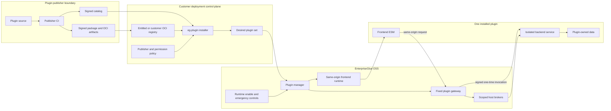

The installer is the only component allowed to change deployment desired state or render Compose
and Helm output. The running host can enable, disable, or emergency-stop execution, but it cannot
install an image or rewrite deployment infrastructure.

## Contract layers

| Layer | Public interface | Owner | Rule |
| --- | --- | --- | --- |
| Identity | Reverse-DNS plugin ID and SemVer version | SDK and manifest | Stable and globally namespaced |
| Manifest | `EnterpriseGluePluginManifestV1` | SDK | Closed, signed, declarative, and deny-by-default |
| Frontend | `EnterpriseGlueFrontendPluginV1` and typed contributions | SDK and frontend host | Same-origin ESM; shared React, router, Carbon, theme, and host UI API |
| Backend | Fixed health/readiness/capability paths and declared operations | SDK and backend host | Process-isolated service; no host app or database injection |
| Invocation | Short-lived Ed25519 claims with one-time `jti` | Host gateway | Tenant, deployment, subject, plugin, operation, and request digest are bound |
| Data access | Identity, resource, storage, diagnostic, secret-use, notification, and schedule brokers | Host | A declared permission and operation-specific schema are required |
| Events | Versioned minimized host event envelopes | Host event runtime | At-least-once delivery, idempotency, retry, pause, deployment-wide per-subscription circuit, payload-free dead-letter inspection, and explicit audited replay |
| Contribution availability | `PluginContributionAvailabilityDeclarationV1`, closed projection, and read-only frontend snapshot | Backend host and plugin | Server-derived tenant refresh; bounded CAS/lease/expiry state; fail closed only for the exact declared contributions; never authorization |
| Lifecycle | Install, enable, disable, upgrade, rollback, uninstall, and emergency state | Installer and host control plane | Optimistic revision, hashed idempotency, safe audit, and failure containment |
| Distribution | Payload-only OCI subject, signed catalog/package inventory, indexed evidence referrers, air-gap index, immutable OCI references | Publisher CI and installer | Publish subject before digest-bound catalog; exact host evidence and digest verification are required |
| Commercial use | Plugin-owned entitlement check | Plugin backend | Registry access and UI visibility are not a license boundary |

## Public/private source and image boundary

The OSS repository is the neutral host and SDK, never the source or dependency home for a paid
plugin. Every `@enterpriseglue/*` package declared by an OSS manifest or resolved by the OSS
lockfile must be one of the workspaces physically present in this repository. Public source may
import only those packages. The two legacy optional enterprise-loader package names remain
restricted to their existing dedicated loader files; they are not a plugin installation path.

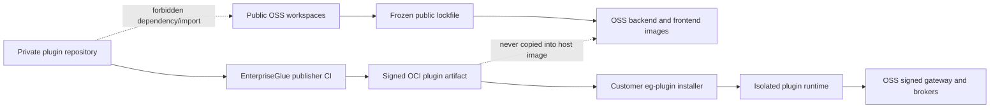

The enforced evidence is:

- `pnpm guard:paid-plugin-boundary` discovers the public workspace allowlist, rejects any other
  EnterpriseGlue dependency, lockfile package, or source reference, and verifies that both
  production Dockerfiles use the frozen public lockfile without escaping the repository build
  context.
- `scripts/check-paid-plugin-image-boundary.mjs` scans freshly built backend and frontend runtime
  files and image configuration for any EnterpriseGlue package marker outside that public
  allowlist. Public image CI runs it immediately after building both production images.
- `pnpm test:plugin-platform:reference-image` builds and runs the independent public reference
  plugin, proves one signed invocation succeeds, then proves replay remains rejected after its
  container restarts.
- Private publisher CI checks out an immutable public OSS revision as a sibling and reruns the
  public source/dependency guard before building a paid artifact. It does not copy private source
  into the public checkout or host images. Customers run none of these builds.

Adding another paid plugin therefore requires no new public import or dependency. The publisher
implements the same SDK contracts in its private repository and distributes an immutable signed
artifact through the existing installer interface.

### Release-image immutability and browser self-containment

Release-producing Dockerfiles pin every external `FROM` image by exact `sha256`. A declared
BuildKit syntax image is also an external build input and must be pinned by digest. Run:

```text
pnpm run guard:release-dockerfile-pins
```

The guard covers backend/frontend production images, the installer, the reference plugin, and its
lifecycle/migration fixtures. Updating a base or syntax image is an explicit reviewed source
change; a mutable tag alone is rejected.

Mission Control must render without a public font host. The production source imports pinned
local IBM Plex Sans, IBM Plex Sans Arabic, and IBM Plex Mono packages, removes Carbon font-face
rules that point at IBM's CDN, contains no Google font/preconnect links, and retains
`font-src 'self' data:`. Do not widen CSP to repair a missing asset. Run:

```text
pnpm run guard:frontend-self-contained
```

Publisher acceptance must still exercise the actual frontend release image, not only a Vite
source server. The ION publisher gate builds this Dockerfile, obtains the host through a
disposable registry manifest digest, deletes mutable tags, stops the registry, and runs with
pulling disabled on a hardened internal network. It then verifies the exact network-delivered
private entry, customer-side diagnostic boundary, technical Q&A selector boundary,
not-entitled contribution isolation, ordinary Mission Control continuity, CSP, and zero public
browser egress. This is publisher CI; customers still compile nothing.

## Repository layout for a new plugin

The publisher may use any build system, but its output must map to this logical layout:

```text
plugin.yaml
packages/
  frontend/                  optional same-origin ESM
  backend/                   optional isolated HTTP service
schemas/
  operations/               closed request and success-response schemas
  events/                   declared event payload schemas
deploy/
  defaults/                 non-secret bounded defaults
  migrations/               plugin-owned migration job, when required
tests/
  sdk-conformance/
  host-compatibility/
  integration/
```

The signed runtime package contains only declared files. Supply-chain evidence such as SBOM,
provenance, vulnerability, license, malware, and secret-scan results remains indexed evidence and
is not exposed as frontend content.

## Manifest interface

Every plugin declares, at minimum:

- immutable plugin identity, version, publisher, SDK and host compatibility;
- optional frontend module path, content hash, slots, routes, navigation, and settings;
- optional backend digest-only image, health/readiness paths, and closed operations;
- required and optional permissions;
- resource descriptors for non-sensitive configuration, fixed-path deployment files, or opaque
  secret references;
- minimized event subscriptions and fixed schedules;
- an optional tenant-scoped contribution-availability refresh operation, bounded refresh/staleness
  intervals, and the exact plugin-owned contributions it may hide;
- dependencies and conflicts; and
- storage, egress, and deployment requirements.

Unknown fields, mutable image tags, path traversal, non-namespaced contributions, undeclared
operations, and permissions outside the public catalog fail validation.

Use the generated schema for editor assistance:

```text
@enterpriseglue/plugin-sdk/schema/enterpriseglue-plugin-manifest-v1.schema.json
```

Use the runtime parser for release acceptance:

```ts
import { parseEnterpriseGluePluginManifestV1 } from '@enterpriseglue/plugin-sdk';

const manifest = parseEnterpriseGluePluginManifestV1(candidate);
```

### Machine-readable host capability catalog

Plugin authors and deployment operators must not infer supported permissions, slots, event types,
egress policy names, publishers, or compatibility from scattered source constants or screenshots.
The public SDK defines one strict `EnterpriseGluePluginPlatformCapabilities` v1 contract and
publishes its draft-2020-12 schema at:

```text
@enterpriseglue/plugin-sdk/schema/enterpriseglue-plugin-platform-capabilities-v1.schema.json
```

The backend constructs the catalog from the exact capability sets it passes to the resolver.
Consequently the host cannot advertise one set while enforcing a different set. The authenticated
deployment-administrator endpoint is:

```http
GET /api/plugin-platform/v1/capabilities
Cache-Control: no-store
```

The Carbon Plugin Management page renders the same response. It contains:

- active host and SDK versions, frontend/backend protocol majors, and exact shared frontend
  runtime;
- the current/previous-minor support-window policy, the minor lines that actually exist, and the
  exact supported SDK package versions;
- every supported permission with broker, scope, data class, risk, and explicit-grant mode;
- every additive slot with surface, scope, context major, multiplicity, and deterministic ordering;
- every minimized host event with required permission, at-least-once delivery, host-derived tenant
  scope, and delivered-payload erasure;
- `none` plus deployment-approved egress policy identifiers; and
- trusted publisher identifiers.

It cannot represent an egress destination, credential, trust key, tenant/user/resource identifier,
customer content, or plugin payload. The endpoint is authoring/preflight and administrator
evidence—not authorization. Manifest verification, permission grants, tenant/resource policy,
publisher signatures, live backend capabilities, and per-call authorization still run
independently.

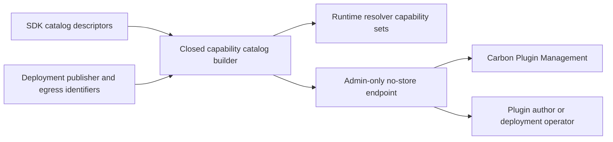

## Frontend interface

The frontend module exports one registration function. It receives only the versioned host UI
context and registers namespaced contributions. It must not import private host source paths or
bundle its own React or Carbon runtime.

### Exact shared runtime and dependency gate

The OSS host, public SDK, reference plugin, private plugin manifest, and compatibility evidence
must move the plugin-visible runtime as one atomic compatibility unit. The current unit is:

| Shared runtime | Exact version |
| --- | --- |
| React | `19.2.6` |
| React DOM | `19.2.6` |
| React Is | `19.2.6` |
| React Router DOM | `7.18.1` |
| Carbon React | `1.107.0` |
| Carbon icons | `11.80.0` |
| Carbon styles | `1.106.0` |
| Plugin SDK, current | `0.2.0` |
| Plugin SDK, previous | `0.1.0` |

The host application dependencies and SDK peers are exact, not ranges. A plugin declares the
manifest-visible revisions exactly and the resolver rejects a mismatch before loading its
frontend entry. The plugin SDK is the one controlled exception to current-version equality:
the host advertises exact supported SDK packages `0.2.0` and `0.1.0`; the plugin's declared
range must contain its exact manifest `shared.pluginSdk`, and that package must appear in the
host catalog. This permits one frozen previous-minor plugin without weakening the exact
React/router/Carbon checks. A shared-runtime update therefore requires one public host/SDK
change, updated current/previous compatibility fixtures, and a matching private-plugin release;
it is not a silent dependency refresh.

The public lockfile is generated with the exact `pnpm@11.0.8` declared in `package.json`.
`pnpm run audit:production` fails CI for actionable high or critical advisories across the full
runtime and build lockfile, then scans production frontend source. Its only approved exception is
`GHSA-qwww-vcr4-c8h2`, which applies to React Router's unstable RSC APIs: the OSS host uses Data
Mode through `createBrowserRouter`, and the gate rejects RSC entry points or APIs. The exception
is named exactly in `pnpm-workspace.yaml`; adding another exception, making it broad, enabling
RSC, or allowing the exception to become stale fails the gate. Container/base-image scanning,
SBOM review, and publisher artifact scanning remain separate release controls.

The v1 entry is one self-contained, valid UTF-8 ESM file. It may export values but may not contain
static imports, dynamic imports, or `import.meta`; React, React DOM, the router, Carbon, icons, API,
navigation, notifications, and telemetry come only from the host context. The public
`assertSafePluginFrontendEntryV1` policy also rejects direct browser networking/navigation,
string-to-code evaluation, unsafe HTML sinks, global stylesheet installation, executable-Markdown
renderer fingerprints, and duplicate React-runtime fingerprints. The private publisher must run
the same policy before signing, the installer reruns it before staging, and the host reruns it
after the entry digest check before advertising the module.

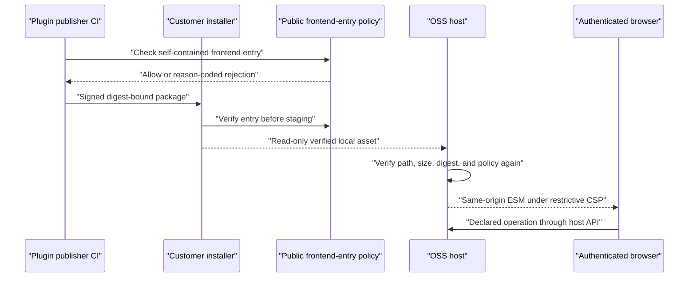

The browser profile remains trusted same-origin publisher code, not an untrusted-code sandbox.
The source policy and CSP reduce mistakes and common escape paths; publisher review, backend
authorization, revocation, and the runtime kill switch remain mandatory.

Initial additive contribution types are:

- tenant routes;
- tenant navigation;
- platform settings sections;
- engine incident actions;
- engine log actions;
- process-instance detail actions; and
- engine overview cards.

The host validates ownership, route namespaces, slot compatibility, ordering, and declared
permissions before activation. Deactivation removes every contribution owned by that plugin.
Failure is isolated at the plugin boundary and must not break ordinary Mission Control routes.

`host.navigation.toContribution(id, params)` substitutes matching route placeholders and carries
unused string parameters as URL-encoded query state. The destination receives both query and path
parameters, with path parameters taking precedence. Treat every received value as untrusted:
validate it against the operation's closed opaque-reference schema before use.

Carbon is the UI contract:

- use the host-provided Carbon components and design tokens;
- feature-detect `host.ui.primitives` for the host-rendered `PageLayout`, `PageHeader`, and
  `ConfirmModal`; keep an accessible fallback until the plugin's declared minimum host version
  guarantees those additive helpers;
- use `host.ui.locale`, optional `host.ui.direction`, and optional
  `host.ui.prefersReducedMotion` rather than guessing browser presentation policy;
- preserve keyboard navigation, focus order, semantic headings, loading, empty, and error states;
- render host/catalog strings as text, not HTML;
- use the host notification and routing APIs; and
- pass accessibility and shared-runtime compatibility checks before release.

The page primitives use logical inline/block spacing, responsive widths, one explicit page
landmark and labelled heading. `ConfirmModal` delegates focus trapping, escape handling, and
keyboard submit/cancel behavior to the host's exact Carbon runtime and requires the plugin to
supply every visible label, so the plugin—not the host—owns translation. Busy confirmation is
fail-closed: close and submit are ignored until the in-flight action settles. Pass the mounted
launcher button ref through `launcherButtonRef`; the host restores focus after cancel or a
successful submit. These helpers do not grant permission, perform navigation, make a request, or
render HTML.

### Frontend activation failure containment

The host keeps a bounded browser-local circuit for import, module-identity, and activation
failures. It is keyed by exact plugin ID, version, and installer/bootstrap revision. Three
failures within five minutes quarantine only that exact frontend in that browser for fifteen
minutes. Success clears the exact entry, while a new source version or revision gets a fresh
attempt. The host best-effort calls `deactivate` after partial activation failure and continues
activating unrelated plugins.

The local record contains only plugin ID/version/revision, a closed failure code, counters, and
timestamps. It contains no tenant, user, route, exception, stack, or plugin/customer content; it
is bounded to 32 entries and 16 KiB and expires old state. Malformed/unavailable storage is
discarded or falls back to an in-memory page circuit.

This is local availability containment, not trusted platform-health evidence. Browser state
cannot disable a deployment, tenant backend, event/schedule operation, or another browser.
Durable runtime disable remains an authenticated platform-administrator control; deployment
disable remains installer authority.

The old `componentOverrides` and `featureOverrides` types and helpers are deprecated and confined
to the single transitional enterprise-plugin bridge. Ordinary owner records are rejected when
they request either replacement. Native plugins use only manifest-declared additive
contributions.

## Tenant-scoped contribution availability

Use contribution availability only when external dependency state should hide selected plugin
controls for one tenant—for example, an incompatible API major, missing dependency feature, or
inactive paid entitlement. Do not use it for user/resource authorization, operation admission, or
general plugin health.

The signed manifest declares one background-only operation and its exact presentation boundary:

```yaml
contributionAvailability:
  refreshOperationId: io.example.plugin.refresh-contribution-availability
  refreshIntervalSeconds: 300
  maximumStalenessSeconds: 900
  gatedContributionIds:
    - io.example.plugin.main-route
    - io.example.plugin.main-navigation
    - io.example.plugin.context-action
```

The operation is a declared non-streaming `POST` with a closed empty request, no resource binding,
and the platform projection response. Route-linked navigation or settings must share gating with
their route; unknown, duplicate, foreign, or undeclared IDs fail manifest/projection validation.
The response contains only `contributionId`, `available`, a closed reason code, `evaluatedAt`, and
`validUntil`. It must not contain tenant/user identity, endpoints, credentials, entitlement
documents, customer data, diagnostic payload, or error text.

```mermaid
sequenceDiagram
  participant Scheduler as "OSS background dispatcher"
  participant Gateway as "Signed operation gateway"
  participant Plugin as "Isolated plugin backend"
  participant Dependency as "Brokered external dependency"
  participant Store as "Deployment-wide CAS store"
  participant Browser as "Authenticated tenant frontend"

  Scheduler->>Gateway: "Empty refresh request; server-derived tenant"
  Gateway->>Plugin: "Signed one-time invocation"
  Plugin->>Dependency: "Declared host-broker operation"
  Dependency-->>Plugin: "Closed safe capability facts"
  Plugin-->>Gateway: "Closed contribution projection"
  Gateway->>Store: "Validate IDs/time/source revision; CAS publish"
  Browser->>Store: "Tenant plugin bootstrap"
  Store-->>Browser: "Full validated set filtered by current projection"
```

The host first validates the plugin's complete registered contribution set against the signed
manifest, then filters the declared subset. A plugin cannot use the projection to add an
undeclared contribution. Missing, invalid, expired, or source-version-mismatched state hides only
the declared gated IDs; ungated host UI and other plugins remain available. Refresh failure never
extends `validUntil`. Leases and optimistic revisions coordinate replicas, and an installer source
or plugin-version change invalidates the old projection immediately.

The frontend receives a read-only `host.availability` snapshot:

```ts
host.availability.get(contributionId);
host.availability.isAvailable(contributionId);
host.availability.reason(contributionId);
```

Reading it performs no request. Unknown IDs are unavailable. Every backend operation must still
independently enforce plugin/tenant enablement, emergency state, signed invocation, entitlement,
user/resource permission, engine binding, admission, circuit, and schema validation.

## Backend interface

The backend is a separate least-privilege process. It exposes fixed unauthenticated liveness and
readiness responses containing no customer data. Container health probes must use a bounded,
lightweight client already present in the image and compare the exact expected response. They must
not start Node.js, a JVM, or another application runtime for every probe. This is a release
contract, not only an optimization: the default reference-plugin limit is 100m CPU and its
Compose probe timeout is two seconds, so runtime-startup latency can otherwise make a healthy
service appear unavailable under runner or node contention. Liveness says only that the process
can serve its fixed health contract; product dependency checks belong in readiness.

Every product operation must:

1. match a manifest-declared method and path;
2. validate the closed request schema;
3. verify the host-signed invocation;
4. consume the one-time invocation ID durably;
5. enforce tenant, deployment, subject, permission, entitlement, and operation policy;
6. use only declared host broker operations; and
7. return a closed, size-bounded success response or a safe error code.

For a resource broker call, “declared” is a five-way intersection: the manifest permission
catalog, the operation's `requiredPermissions`, the installation grant, the signed invocation
grant, and the exact authorized reference in `claims.resourceRefs`. The operation's
`resourceBinding` derives that reference from a closed request field after host authorization.
It scopes the object; it never grants the broker permission. The broker denies the call when any
one of these values is absent or mismatched. Plugin conformance tests must exercise every denial,
not only the successful path.

The installer generates an Ed25519 invocation key pair for the host/sidecar boundary. The private
signing key remains an owner-readable regular file at mode `0600`. The public verification key is
also validated as a regular non-symlink file but is projected at mode `0644`: it is not secret,
and the fixed UID 65532 sidecar must be able to read a native-Linux bind mount whose host owner is
the installer account. Docker Desktop file sharing can mask an incorrect `0600` public-key mode,
so native-Linux permission behavior is part of Compose release acceptance.

The binding source is exact. `source: body` resolves only the declared nested field after the
closed request schema passes. `source: path` requires the operation path to contain exactly one
complete `:field` segment matching the binding field. The request must replace it with one safe
opaque segment; an omitted substitution, changed static segment, encoded delimiter, second
dynamic segment, or body value is rejected. The host forwards the same matched concrete path to
the sidecar, so authorization and execution cannot use different resource paths. GET and DELETE
operations may bind only from the path because their gateway envelope intentionally carries no
forwarded body.

The gateway calls a host-owned `PluginResourceAuthorizerV1` before the capability handshake or
sidecar request. Its input is limited to plugin/operation identity, authenticated subject,
host-derived tenant, declared resource kind, and the closed bound reference. Production uses the
EnterpriseGlue engine visibility policy; a plugin cannot supply or modify this port. This keeps
the generic runtime independent from plugin product logic while preserving pre-sidecar
authorization and enables connected conformance tests without replacing the policy boundary.

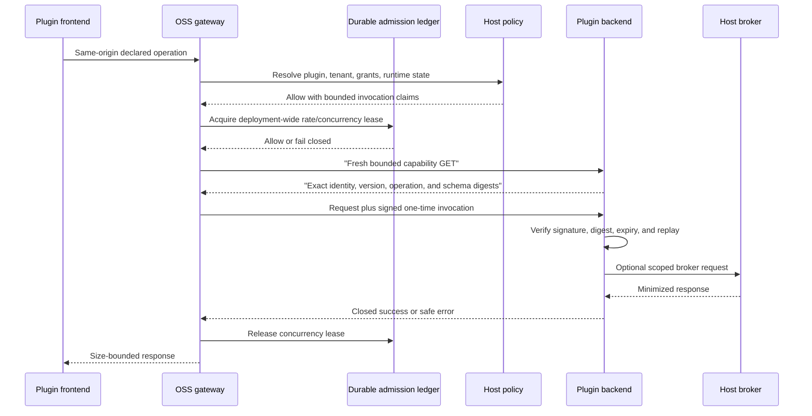

Raw deployment secrets stay in the host. A plugin gets an opaque reference and can request only
an approved host-owned use operation. A commercial plugin must verify entitlement inside its
backend on every paid operation.

Backend protocol v1 deliberately performs that capability handshake for every accepted
synchronous operation, event delivery, scheduled job, and contribution-availability refresh.
It does not cache a previous sidecar identity or schema result. This makes a wrong image, partial
rollout, service misroute, restart, or schema drift fail before the next signed operation. A
future cache requires a new protocol revision with an authenticated workload generation,
lifecycle-atomic invalidation, cross-replica consistency, and rolling-upgrade/rollback acceptance;
a version key or short TTL alone is not sufficient.

Production admission is database-backed across all OSS host replicas. It persists only a SHA-256
bucket for the subject/tenant scope, the plugin and operation identifiers, bounded window counts,
and expiring concurrency leases—never the raw subject or tenant reference. An unavailable
admission store fails closed before the sidecar is contacted. A host crash does not permanently
consume capacity because the operation-bound lease expires. Event delivery separately enforces
durable per-plugin and per-tenant-subscription outstanding-delivery limits. Retryable failures
open one database-backed plugin/deployment/tenant/event-subscription circuit; it rejects new work
during cooldown and allows exactly one half-open probe. Deployment administrators see only a
cursor-bounded projection of opaque delivery/plugin/type/attempt/reason/time fields and can
requeue an exact dead-letter attempt with an atomic safe audit; tenant and event payload never
enter the Carbon control page. One full, open, or failing subscriber is reported as unavailable
without blocking unrelated plugins.

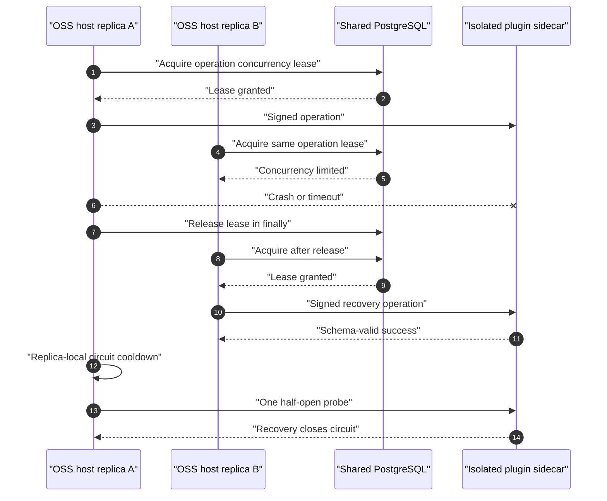

Synchronous operation circuits are deliberately replica-local for fast blast-radius containment;
deployment-wide concurrency/rate state remains durable. Asynchronous event circuits and delivery
leases are deployment-wide because queued work can outlive a process and move between replicas.
`pnpm run test:plugin-platform:multi-replica` exercises those interfaces through two independent
host runtime/control/admission/circuit/dispatcher instances, separate PostgreSQL pools, and two
independent real HTTP sidecars that verify every Ed25519 invocation. It proves cross-replica
`429` admission,
lease release, crash and timeout containment, replica-independent recovery, cooldown probing,
unrelated-route health, failed-event handoff, retry drain, competing-worker exactly-once claim,
payload minimization after delivery, and pseudonymous admission storage. The same connected gate
also proves that tenant enablement is evaluated from the authenticated host route before
capability or sidecar I/O, a sidecar can persist only tenant-scoped plugin data through the signed
host storage broker, the resulting namespace is bound to plugin/deployment/tenant by the host,
and an operation whose optional storage permission was not granted receives a fixed `403` before
the sidecar is contacted. Both plugins write the same tenant/key through different sidecars and
produce distinct rows, while an operation ID owned by the primary plugin is rejected when
addressed through the secondary plugin before its capability or operation endpoint is called.
After the primary operation circuit opens, the secondary plugin remains callable on that same
host replica and advances its storage revision from `r1` to `r2` using optimistic concurrency.
The gate also uses the real database-backed control store on both replicas. An authenticated
platform stop through replica A becomes visible through replica B and denies a new operation
before capability or sidecar I/O within a two-second local acceptance ceiling. Already queued
event work becomes payload-free dead-letter state with `subscription_inactive`, new event work is
not queued, and ordinary host health remains available. Resume through replica B restores
operation and event delivery through replica A without changing plugin or tenant desired state.
This is synthetic local propagation evidence, not a production customer SLO.

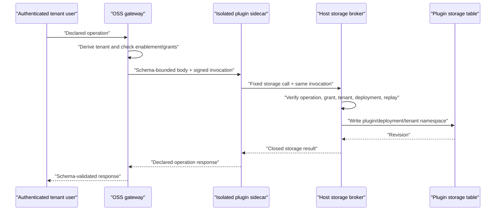

The browser and sidecar cannot supply a different tenant or a database namespace. An unenabled
tenant is indistinguishable from an unavailable plugin (`404`). A known operation that lacks its
required grant returns the fixed safe error `403 {"error":"Plugin permission denied"}`; neither
case reaches the capability endpoint or operation endpoint. Plugins never receive the host
database connection.

For native server-sent events, declare `streaming: sse`, a closed request schema, and a response
schema describing one JSON event—not the whole byte stream. The frontend calls
`host.api.stream(...)`; older compatible hosts that do not expose the optional method can retain
a bounded JSON fallback. The OSS gateway validates the method, path, body, grant, capability
hashes, admission limits, and one-time invocation exactly as for JSON calls. It then accepts only
`text/event-stream`, incrementally bounds total bytes and individual events, parses only
`event`/`id`/JSON `data` fields, validates every data value against the signed response schema,
and reserializes a canonical event. Raw upstream SSE lines are never forwarded. Backpressure,
client disconnect, operation timeout, event-count limit, circuit state, and a fixed safe stream
error are host-owned. Upload streaming remains unavailable in v1.

For host engine events, declare exactly one catalog event type, its matching permission, and a
manifest-owned delivery operation. The built-in pairs are:

| Event type | Permission | Closed payload purpose |
| --- | --- | --- |
| `io.enterpriseglue.host.incident.v1` | `host.events.subscribe.incident` | Minimized incident metadata |
| `io.enterpriseglue.host.failed-job.v1` | `host.events.subscribe.failed_job` | Minimized exhausted-job metadata |
| `io.enterpriseglue.host.engine-inventory.v1` | `host.events.subscribe.engine_inventory` | Opaque engine reference, product, configured version, and UTC-day bucket only |

The inventory permission is optional, high risk, and explicitly granted. The corresponding event
cannot represent engine names, endpoints, credentials, topology, health, logs, exception text,
variables, process payloads, usage, or arbitrary metadata. The engine poller is independently
disabled by default, emits at most one deterministic event per engine/version/UTC day, and uses
`unknown` rather than guessing an absent version. A successful delivery erases its persisted
payload just like the other host events. A plugin must still verify its own entitlement and
tenant/resource binding; the catalog and permission do not authorize a cloud transfer by
themselves.

For locally sanitized diagnostics, a plugin may provide an optional opaque
`consumerContextRef` in the declared collection request. The host includes that value in the
signed bundle and validates any context/artifact references returned by the fixed handoff
receipt before projecting them to the plugin. This lets a consumer bind evidence to an existing
case or record without learning a path, destination, credential, or raw content. The reference is
opaque and tenant meaning remains the receiving service's responsibility; the host never treats
it as authorization by itself. Omitting it preserves the v1 legacy signature shape and automatic
consumer behavior.

The additive `diagnostics/status` broker route is callable only from a signed tenant invocation
that carries `host.identity.read_safe`. It reports the deployment-wide collection-permission
decision, one of `ready`, `disabled`, `degraded`, or `unavailable`, a fixed reason code, and only
`none`/`single`/`multiple` as the approved-source-set class. It also fixes
`filteringBoundary=enterpriseglue_backend`, `rawUploadPermitted=false`, and
`browserEditable=false`. The local collector verifies that its policy, protected signing key,
protected handoff credential, fixed endpoint shape, and approved source files are usable without
reading source content or making a handoff request. Neither the request nor response can contain
an engine, source ID, path, endpoint, credential, key identifier, pod/container name, tenant
selector, or raw byte. Older SDK 0.1.x clients can omit this optional method.

The deployment policy can select one of three bounded mounted-file parsers:
`file_tail`, `docker_json_file_tail`, or `kubernetes_cri_file_tail`. The structured variants
validate Docker JSON-file or CRI record envelopes and normalize only timestamp, stream/tag, and
log text before the existing redaction and post-scan. They neither discover containers/pods nor
use a runtime socket, kubeconfig, service-account token, Kubernetes API, selector, or command.
Malformed structured records fail closed before signing or handoff.

Deployment administrators can inspect aggregate collector telemetry at
`GET /api/plugin-platform/v1/metrics/diagnostics`. The typed SDK response contains only plugin
identity, closed collection/status outcome, normalized safe reason, sanitized-byte band,
none/single/multiple source class, count, and generation time. The in-process registry caps each
collection and status map at 1,000 series and saturates counters. It has no field for tenant,
subject, deployment, engine, case, incident, job, source, path, endpoint, key, credential,
content, detected value, correlation, or exact byte count. Unknown reason strings become
`other`. Telemetry failure is swallowed and cannot alter collection, filtering, signing, or
health behavior.

The adjacent `GET /api/plugin-platform/v1/metrics/events` endpoint projects only plugin identity,
one of the three closed host event types, enqueue/delivery/circuit outcome classes, a normalized
safe reason, first/retry/exhausted attempt class, bounded count, and generation time. It has no
tenant, deployment, engine, incident, job, event, delivery, operation, actor, correlation,
endpoint, exception, or payload field. The database event store records only committed enqueue,
duplicate, retry, dead-letter, administrator-requeue, open, half-open, and recovery observations;
failed transactions do not create success series. Each map is capped at 1,000 series, arbitrary
sidecar receipt reasons become `other`, counters reset with the backend process, and telemetry
failure cannot change event delivery. Both metrics endpoints require deployment-administrator
authorization and send `Cache-Control: no-store`.

## Lifecycle

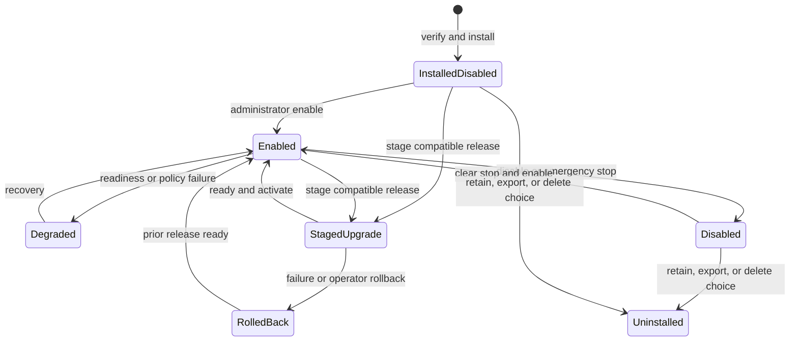

Installation is deployment-scoped. Tenant enablement is a separate server-authorized state.
Emergency stop preserves the desired plugin set so clearing the stop can safely resume it.
The deployment-side installer now resolves the complete installed and enabled sets before every
install, enable, disable, upgrade, rollback, or uninstall. A missing/incompatible dependency,
cycle, or conflict rejects the candidate transaction without changing the previous state.

Each accepted change atomically emits `plugin-lifecycle-plan.json` with the desired-state revision,
canonical plan SHA-256, plugin/data-schema versions, immutable migration image, signed rollback boundary, explicit
retain/export/delete phase, and a safe ordered subset. An enabled upgrade or rollback uses
`stage -> drain -> deactivate -> checkpoint -> migrate -> activate -> ready -> commit`; a new
install remains disabled after `stage -> migrate? -> commit`, and enable is a separate
`activate -> ready -> commit` operation. The same transaction journal restores that plan together
with installer state and Compose/Helm output after interruption. Migration images are included in
the exact required air-gap artifact set and are digest-mapped for a customer registry.

The installer also emits `plugin-lifecycle-observation.json`, a separate strict display-only
projection. It contains an opaque execution reference, desired/execution revision, plan hash,
plugin/operation, safe status/reason, completed and next phase, update time, and an optional lease
expiry. It cannot contain the raw plan, history, worker/lease identity, command, path, credential,
cluster object, or customer payload. Compose mounts this file read-only into the host. The host
accepts it only when its revision, plan presence, plugin, and operation match current installer
state; stale or malformed input is reduced to a payload-free reason. The projection is never an
execution gate and always says `workloadReconciliation: not_checked`.

```mermaid
sequenceDiagram
  autonumber
  participant Operator as "Deployment operator"
  participant Installer as "Verified external installer"
  participant Resolver as "Desired-set resolver"
  participant Files as "Atomic deployment files"
  participant Store as "Filesystem or Kubernetes CAS execution store"
  participant Worker as "Strict phase runner"
  participant Compose as "Fixed Compose adapter"
  participant Cluster as "Kubernetes/OpenShift adapter"
  participant Host as "OSS control API"
  participant Admin as "Carbon administrator UI"

  Operator->>Installer: "Install, upgrade, rollback, disable, or uninstall"
  Installer->>Resolver: "Validate all installed and enabled manifests"
  Resolver-->>Installer: "Activation order or reason-coded rejection"
  Installer->>Installer: "Validate source/target schema and rollback boundary"
  Installer->>Files: "Journal previous snapshot"
  Installer->>Files: "Write state, plan, safe observation, Compose, and Helm"
  Installer->>Files: "Commit or restore complete previous snapshot"
  Worker->>Store: "Claim hash/revision-bound phase plan"
  Store->>Files: "Verify current plan hash and desired revision"
  Worker->>Store: "Checkpoint strict next phase and renew lease"
  Store-->>Worker: "Resume after an expired lease without repeating phases"
  Worker->>Compose: "Execute one fixed phase with stable idempotency key"
  Worker->>Cluster: "Execute the same fixed phase contract"
  Worker->>Files: "Atomically refresh safe observation after checkpoints"
  Host->>Files: "Read desired state plus safe observation only"
  Host-->>Admin: "Current, not started, stale, or invalid; workload not checked"
```

The installer package exports the product-neutral execution state, filesystem store, and strict
phase-runner contracts used in this flow. The private filesystem store uses atomic replacement,
an exclusive recoverable lock, compare-and-swap revisions, bounded execution history, and exact
plan-hash/revision verification. The runner grants one bounded worker lease, calls only the fixed
next phase with a stable execution/phase idempotency key, checkpoints completed phases, resumes
after lease expiry, rejects plan drift, and changes to manual-intervention state when a failure
follows an irreversible migration. Replacing a failed or manual-intervention execution requires
its exact revision and the operation-specific inverse recovery command for the same plugin; a
live execution cannot be superseded.

The deployment-only Compose adapter is implemented locally. `apply-compose` runs in a
digest-pinned, non-root, capability-dropped, read-only worker with no network and only the
deployment directory plus local Docker socket mounted. It validates bounded non-symlink Compose
inputs, stages immutable images and schema-versioned volumes, stops enabled workloads before
checkpoint/migration, runs fixed-UID no-network migration utilities, removes an unhealthy
candidate, and executes retain/export/delete with SHA-256 manifests. Every completed
infrastructure effect has a context-bound private receipt, so recovery does not repeat it. A real
Docker drill proves disabled install, healthy enable, stopped disable, and uninstall export
through the customer wrapper.

The Kubernetes/OpenShift implementation uses one namespace ConfigMap as the execution source of
truth and Kubernetes `resourceVersion` as compare-and-swap. Its bounded lease and history use the
same runner semantics as Compose. The adapter owns schema-versioned PVCs, fixed utility and signed
migration Jobs, immutable phase-receipt ConfigMaps, deny-all lifecycle-job networking, Helm
activation, rollout recovery, and explicit data disposition. Checkpoint/export manifests remain on
a retained artifact PVC. The OpenShift profile lets SCC allocate the UID/GID without weakening
non-root, seccomp, read-only-root, capability, token, or resource controls.

The customer worker container mounts one self-contained namespace-scoped kubeconfig read-only and
never receives the Docker socket. Helm release metadata uses ConfigMaps, avoiding Kubernetes
Secret access. A separate one-time bootstrap chart creates the installer ServiceAccount,
namespace Role, and RoleBinding. The Role can reconcile only the documented plugin resources; it
cannot access Secrets, mutate RBAC, use `pods/exec` or `pods/log`, cross namespaces, or access
cluster-scoped resources. The real Kubernetes lifecycle drill uses this restricted identity,
checks both its positive and negative permissions, and never gives the worker cluster-admin.
It obtains one 15-minute service-account credential for initial install/enable, writes a distinct
15-minute replacement to a new regular, non-symlinked mode-`0600` kubeconfig, removes the old local
file, and runs upgrade, rollback, failure recovery, disable, and uninstall through the replacement.
This proves bounded worker credential replacement; server-side revocation or expiry enforcement
still belongs to the customer's Kubernetes identity provider.
A local safe execution mirror blocks competing desired-state mutation without
requiring ordinary render/status commands to hold cluster credentials. The browser-safe
observation is exposed through the admin-only
`GET /api/plugin-platform/v1/deployment-execution` route and Carbon Plugin Management page. The
OSS web application never receives Docker/Kubernetes, registry, or migration-command authority,
and the observation never changes plugin admission.

## Build and release flow

### Non-circular OCI subject and referrers

Publisher CI must not place a catalog inside the OCI subject whose digest that catalog names.
The required order is:

1. Build the runtime bundle and every required evidence file.
2. Create and sign `package-index.json` in payload-only mode.
3. Push the package index, its signature, and every indexed file as one immutable OCI subject
   with artifact type `application/vnd.enterpriseglue.plugin.package.v1`.
4. Record the returned subject digest.
5. Create and sign the catalog entry using that exact digest.
6. Attach the catalog/signature and each indexed evidence file through the OCI 1.1 Referrers API.
7. Sign/attest the OCI subject, then discover, pull, verify, and install it disabled.

```mermaid
sequenceDiagram
  participant CI as "Publisher CI"
  participant Registry as "OCI 1.1 registry"
  participant Installer as "Public installer"

  CI->>CI: "Sign payload-only package index"
  CI->>Registry: "Push package subject"
  Registry-->>CI: "Subject sha256 digest"
  CI->>CI: "Finalize and sign digest-bound catalog"
  CI->>Registry: "Attach catalog and indexed evidence"
  CI->>Registry: "Attach publisher signature and attestation"
  CI->>Registry: "Discover and re-pull exact digest"
  CI->>Installer: "Verify reconstructed package; install disabled"
```

The package index binds every attachment by safe relative path, role, byte size, and SHA-256.
Verification must key attachments by path because multiple records may have the same role. The
standard evidence roles are SBOM, provenance, vulnerability report, license report, malware
report, and secret-scan report. Runtime files remain layers of the package subject; evidence is
never staged as browser content.

Cosign or an equivalent registry signature proves online publisher/workflow identity. The
catalog and package-index Ed25519 envelopes provide the extracted-package trust contract used
after connected pull and during air-gap import. Tags are locators only; catalog, installer state,
backend/migration images, and receipts use immutable digest references.

### Signed release-compatibility interface

Every publisher release line uses two signed but different compatibility records:

1. Each catalog release declares a host SemVer range and lists the exact `testedHostVersions` on
   which that one immutable plugin release passed. Every package, OCI, air-gap, and lower-level
   signed catalog install/upgrade path requires a valid range that contains the customer's host
   version **and** the same exact version in the signed list. Neither claim is sufficient alone.
2. Once two real plugin-capable host releases and two real plugin releases exist, protected
   publisher CI emits one
   `EnterpriseGluePluginCompatibilityMatrix` with the exact four-cell Cartesian product:
   current host/current plugin, current host/previous plugin, previous host/current plugin, and
   previous host/previous plugin.

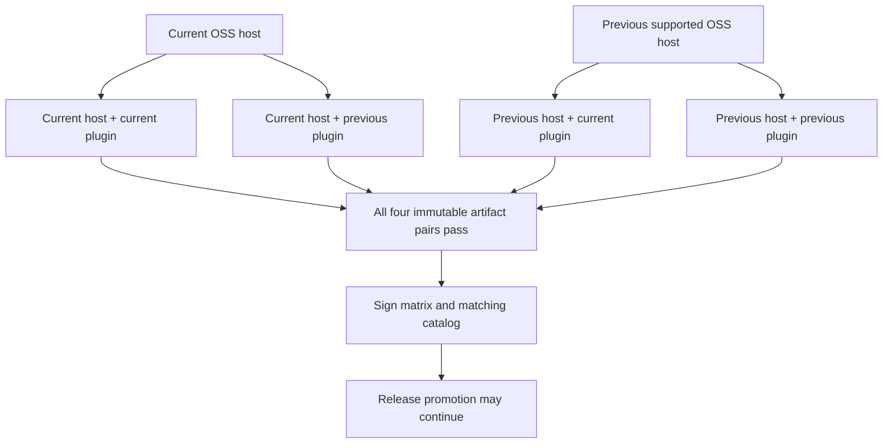

The closed v1 matrix records `pluginId`, `publisher`, distinct current/previous host and plugin
versions, and exactly four cells. Every cell binds its versions to the exact immutable
`hostArtifact` and `pluginArtifact` OCI digest references and has the literal result `passed`, a
bounded suite revision, UTC test time, and SHA-256 of retained evidence. The same version must use
the same artifact in both of its cells, and the plugin artifact must equal that release's bundle
in the signed catalog. A failed or missing cell therefore cannot be represented as a releasable
matrix. Failed logs stay in protected CI and the release does not advance. The matrix generation
time must not precede any cell evidence, current versions must be greater than previous versions,
and both plugin releases must be stable, non-revoked entries in the same signed catalog. Both
catalog releases must also name both tested host versions.

The SDK publishes the portable draft-2020-12 structural schema at
`@enterpriseglue/plugin-sdk/schema/enterpriseglue-plugin-compatibility-matrix-v1.schema.json`.
Its Zod parser additionally enforces the exact four-cell and timestamp rules. The release gate
cross-checks both signatures against the same publisher trust document:

```text
eg-plugin verify-compatibility-matrix \
  --catalog ./catalog.json \
  --catalog-signature ./catalog.signature.json \
  --matrix ./compatibility-matrix.json \
  --matrix-signature ./compatibility-matrix.signature.json \
  --trust ./publisher-trust.json
```

This is publisher release evidence, not a customer-side CI requirement. Customers receive the
already verified, signed catalog and artifacts. A first plugin-capable release must list only
versions actually tested; it must not invent a previous host or plugin version merely to produce
four cells.

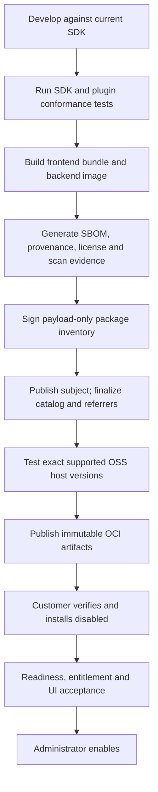

The publisher CI owns builds, evidence, signing, and exact host testing. The customer only runs the
digest-pinned installer and its approved OCI import tool. A customer does not need Git, Node,
private npm credentials, a compiler, or a local CI pipeline.

The generic deployment toolchain has its own release cadence. The manual protected
`plugin-toolchain-production` workflow in this public repository binds one exact clean `main`
commit and one shared installer/chart SemVer, rejects version reuse, and publishes:

- the Linux AMD64/ARM64 `plugin-installer` image;
- the fixed `enterpriseglue-plugin-runtime` Helm chart; and
- the one-time namespace-only `enterpriseglue-plugin-installer-rbac` chart.

All three are OCI subjects addressed and signed by digest with the workflow's GitHub OIDC
identity. The installer image carries BuildKit provenance/SBOM and is scanned and executed after
re-pull. Both charts are packaged twice with the source commit epoch, must produce identical
SHA-256 values, and are re-pulled by digest. One non-secret receipt binds the source revision,
version, three subjects, and both archive hashes and explicitly declares that customer CI/builds
are not required. A paid-plugin workflow references an accepted toolchain release; it does not
rebuild these public artifacts.

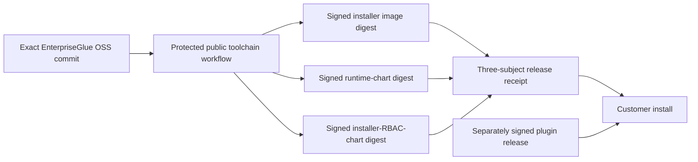

The retained release also contains a signed
`enterpriseglue-plugin-toolchain-airgap/v1` bundle. Its manifest binds the exact release receipt,
source revision, three source digests, three OCI-layout archive paths, archive sizes and SHA-256
values, both Helm payload hashes, and the exact included import-utility bytes.
`scripts/plugin-toolchain-airgap.mjs export` copies each subject recursively, including its OCI
signature referrers, and verifies that the layout and tar archive retain the release digest. The
workflow signs the manifest as a Sigstore blob with the same GitHub workflow identity.

An air-gapped customer pre-provisions ORAS, Cosign, Node, and an independently approved Sigstore
trusted-root file; the trusted root must not be trusted merely because it arrived in the same
bundle. After approved media intake, the included public utility verifies the signed manifest
before parsing it, rejects extra files/symlinks/hash or size drift, imports the three layouts
recursively into customer-owned repositories, verifies each destination digest and signature,
and re-hashes the two Helm payloads:

```text
cosign verify-blob \
  --bundle ./toolchain-airgap/toolchain-airgap.sigstore.json \
  --certificate-identity \
    https://github.com/EnterpriseGlue/enterpriseglue-the-bridge-oss/.github/workflows/plugin-toolchain-release.yml@refs/heads/main \
  --certificate-oidc-issuer https://token.actions.githubusercontent.com \
  --trusted-root /etc/enterpriseglue/trust/sigstore-trusted-root.json \
  ./toolchain-airgap/toolchain-airgap.json

# Compare toolchain-airgap.mjs to .utility.sha256 in the verified manifest
# with the deployment's approved SHA-256 utility before executing it.

node ./toolchain-airgap/toolchain-airgap.mjs import \
  --bundle ./toolchain-airgap \
  --target-prefix registry.customer.example/enterpriseglue \
  --certificate-identity \
    https://github.com/EnterpriseGlue/enterpriseglue-the-bridge-oss/.github/workflows/plugin-toolchain-release.yml@refs/heads/main \
  --certificate-oidc-issuer https://token.actions.githubusercontent.com \
  --trusted-root /etc/enterpriseglue/trust/sigstore-trusted-root.json \
  --receipt ./toolchain-airgap-import-receipt.json
```

The import command has no source-registry option and records
`sourceRegistryAccessed: false`, `customerCiRequired: false`, and
`customerBuildRequired: false`. The real local gate stops and removes its source registry before
starting the destination registry, rejects a modified archive, preserves all three digests, and
runs ORAS, Cosign, Helm, and kubectl from the imported installer image. Do not execute the
included utility until the manifest signature and its signed utility hash have been checked with
independent trusted tools.

The lower-level `install` and `upgrade` commands used by controlled publisher/platform tests
enforce the same `--host-version` policy. They cannot bypass the package/OCI/air-gap compatibility
preflight by supplying individual signed catalog and manifest files.

Connected install:

```text
eg-plugin install-package \
  --package ./verified-plugin-package \
  --trust ./publisher-trust.json \
  --host-version <exact-host-version> \
  --output ./.enterpriseglue/plugins
```

Air-gapped preparation, customer-registry import, and install:

```text
eg-plugin prepare-airgap \
  --airgap ./plugin-airgap \
  --trust ./publisher-trust.json \
  --host-version <exact-host-version> \
  --registry-prefix registry.customer.example \
  --output ./.enterpriseglue/airgap-prepared

EG_PLUGIN_OCI_NETWORK=customer-registry-network eg-plugin import-airgap \
  --airgap ./plugin-airgap \
  --trust ./publisher-trust.json \
  --host-version <exact-host-version> \
  --registry-map ./.enterpriseglue/airgap-prepared/airgap-registry-map.json

eg-plugin install-airgap-package \
  --airgap ./plugin-airgap \
  --trust ./publisher-trust.json \
  --host-version <exact-host-version> \
  --registry-map ./.enterpriseglue/airgap-prepared/airgap-registry-map.json \
  --output ./.enterpriseglue/plugins
```

`prepare-airgap` verifies the signed package and air-gap index, exact host compatibility, required
bundle/backend/migration set, archive media type, byte size, and SHA-256 before producing the
digest-preserving map. `import-airgap` opens each real OCI-layout tar by the signed source digest,
copies it only to the mapped customer registry, and rejects a destination descriptor with a
different digest. It never calls the publisher registry. The locked-down wrapper gives only this
target-import command the selected registry network and a read-only copy of customer-owned OCI
credentials; it receives no Docker socket, kubeconfig, source credentials, build tools, or
customer CI. The final command installs disabled and renders only mapped immutable references
while preserving the original signed manifest.

## Implementation checklist for each new plugin

### P0: product and trust boundary

- [ ] Read the target host's authenticated capability catalog; record the exact host/SDK minor
  line, permissions, slots, events, named egress policy, and publisher identity required by the
  plugin. Do not infer support from a screenshot or a different deployment.
- [ ] Assign plugin ID, publisher, source owner, release owner, support owner, and security owner.
- [ ] Define whether the plugin is public/private and free/paid.
- [ ] Define customer data, tenant boundary, retention, deletion, residency, and audit behavior.
- [ ] Select only additive slots and closed backend operations; document every rejected privilege.
- [ ] Threat-model frontend trust, backend isolation, brokers, egress, secrets, events, storage,
  installation, upgrade, rollback, and uninstall.

### P1: contracts

- [ ] Pin the supported plugin SDK minor and add a frozen consumer compile fixture.
- [ ] Pin the exact host-advertised React, React DOM, React Is, router, Carbon React, Carbon icons,
  and Carbon styles unit; update host, SDK peers, manifest, current/previous fixtures, and
  compatibility evidence atomically.
- [ ] Create a valid namespaced manifest with exact required permissions.
- [ ] Define closed request, success-response, event, resource, and configuration schemas.
- [ ] If controls depend on tenant-scoped external state, declare the exact gated contribution
  set and one empty-input availability refresh operation; test unknown/duplicate/foreign IDs,
  invalid intervals, invalid time bounds, and route/navigation gating mismatch.
- [ ] Define compatibility, dependency, conflict, and migration ranges.
- [ ] Add conformance tests for malformed, unknown, oversized, replayed, cross-tenant, and
  unauthorized inputs.

### P2: frontend

- [ ] Use the host React, router, Carbon, theme, and UI APIs.
- [ ] Produce one self-contained frontend ESM and pass
  `assertSafePluginFrontendEntryV1`; do not import modules, call browser networking directly,
  install global CSS, evaluate strings, render executable Markdown/HTML, or bundle a UI runtime.
- [ ] Register and remove only plugin-owned namespaced contributions.
- [ ] Use only additive native contributions. Do not use legacy `componentOverrides` or
  `featureOverrides`; ordinary owner records are rejected.
- [ ] Treat `host.availability` as a read-only presentation snapshot: no render-time preflight,
  no authorization decision, and an ungated diagnostic surface where supportability requires it.
- [ ] Cover load failure, partial-activation cleanup, exact-source local quarantine,
  source-revision recovery, disabled, degraded, unavailable, and entitlement states. Never make
  browser failure evidence a server-disable authority.
- [ ] Pass keyboard, screen-reader, contrast, responsive, and shared-runtime acceptance.

### P3: backend and data

- [ ] Run as a non-root, read-only, capability-dropped service with no host database or socket.
- [ ] Implement fixed health, readiness, capability, and declared operation endpoints.
- [ ] For SSE, emit only bounded JSON events matching the declared response schema and retain a
  bounded non-streaming fallback for older compatible hosts or transient stream failure.
- [ ] Verify signed one-time invocations and persist replay protection.
- [ ] Use only declared brokers and minimized inputs.
- [ ] For every `resourceBinding`, prove the host-owned resource-authorizer denies a mismatched or
  inaccessible reference before capability/sidecar work and that the accepted reference is the
  exact one carried in signed `resourceRefs`. For a path binding, also prove omitted substitution
  and a conflicting body value cannot select or replace the authorized resource.
- [ ] If availability is declared, return only the closed boolean/reason projection, derive tenant
  from the signed invocation, keep failures payload-free, and never extend a stale projection.
- [ ] For event subscriptions, use delivery ID for idempotency, return only closed receipts, test
  durable circuit/open-probe behavior, and prove administrator recovery never exposes or edits the
  event payload.
- [ ] Isolate plugin storage and migrations; implement backup, restore, export, and deletion.
- [ ] When commercial, enforce provider-neutral entitlement plus explicit operation/access class
  on every paid operation and background job; durably audit bounded allow/deny metadata without
  customer payload, credentials, or entitlement documents.

### P4: distribution and operations

- [ ] Require exact-digest external base and declared Dockerfile syntax images; keep the host
  browser bundle self-contained under self/data-only font CSP.
- [ ] Build immutable frontend, backend, and migration artifacts in publisher CI.
- [ ] Generate SBOM, provenance, vulnerability, license, malware, and secret-scan evidence.
- [ ] Sign the payload-only package inventory, publish its OCI subject, finalize the
  digest-bound catalog, and attach catalog/evidence OCI 1.1 referrers.
- [ ] Sign/attest the online subject with protected workload identity; sign the catalog, package
  inventory, and optional air-gap index with deployment-trusted protected keys.
- [ ] Re-pull the subject and every indexed attachment by digest, verify path/size/SHA-256 and
  publisher trust, and install disabled before promotion.
- [x] Implement and containerize a deployment-side `eg-plugin install-oci` acquisition adapter
  that requires a subject digest, uses customer-owned read-only OCI credentials, verifies the
  protected Cosign workflow identity, discovers exactly one matching catalog plus every indexed
  evidence referrer, reconstructs the signed package, delegates to `install-package`, cleans
  temporary material on every exit, and installs disabled. Registry reads retry only bounded
  transient throttling, `5xx`, timeout, connection, or interrupted-EOF failures; partial pull
  directories are discarded before retry, while auth, CA, signature, digest, and policy failures
  fail immediately.
- [ ] Test the exact current/previous OSS hosts against the exact current/previous plugin
  artifacts, retain one evidence hash per cell, sign the closed four-cell matrix, and run
  `verify-compatibility-matrix` against the matching signed catalog before promotion.
- [ ] Prove install-disabled, enable, disable, emergency stop/resume, upgrade, rollback, and
  uninstall with retain/export/delete behavior.
- [ ] Prove online and air-gapped installation without customer source, build tools, or CI.
- [ ] Add alerts and runbooks that contain no plugin or customer payload.

### P5: independent coexistence and launch

- [ ] Install with the public reference plugin and at least one other realistic plugin.
- [ ] Prove deterministic contribution ownership and independent disable/failure behavior.
- [ ] Prove route, storage, event, permission, secret, network, and lifecycle isolation.
- [ ] Prove missing/invalid/expired availability hides only declared contributions, preserves
  ordinary Mission Control and an unrelated plugin, and recovers across replica crash/restart and
  exact plugin upgrade/rollback.
- [ ] Pass customer-like Compose and Kubernetes/OpenShift acceptance.
- [ ] Complete security, privacy, commercial, release, and pilot approvals.

## Local conformance commands

From the EnterpriseGlue OSS repository:

```text
pnpm run audit:production
pnpm run guard:release-dockerfile-pins
pnpm run guard:frontend-self-contained
pnpm run test:plugin-platform
pnpm run typecheck:plugin-platform
pnpm run build:plugin-platform
pnpm run test:plugin-platform:persistence
pnpm run test:plugin-platform:mysql
pnpm run test:plugin-platform:mssql
pnpm run test:plugin-platform:oracle
pnpm run test:plugin-platform:spanner
pnpm run test:plugin-platform:multi-replica
pnpm run test:plugin-platform:compose-lifecycle
pnpm run test:plugin-platform:kubernetes-lifecycle
pnpm run test:plugin-platform:kubernetes-lifecycle:local
```

The persistence command applies the real plugin migrations to digest-pinned disposable
PostgreSQL, exercises every durable store, then takes a custom-format logical dump and restores it
into a separate clean database with `--no-owner` and `--no-privileges`. Through fresh real store
instances it verifies all nineteen plugin tables, the restored emergency-control revision,
deployment and tenant desired state, safe audit history, optimistic plugin-storage revision,
erased delivered-event payloads, and absence of active gateway leases. It then proves a
revision-protected emergency stop survives another control-store restart, resumes normally, and
accepts a subsequent revision-protected deployment mutation. This is synthetic local logical
recovery evidence. It does not approve a production backup provider, encryption or KMS custody,
immutability, coordinated application recovery, customer topology, or an RPO/RTO.

The MySQL command applies the same nine migrations to a digest-pinned disposable MySQL 8.4
service and requires the same nineteen plugin tables. Public identifier contracts are ASCII and
bounded; the migration boundary projects only primary, indexed, unique, and defaulted textual
keys to case-sensitive `ascii_bin` `VARCHAR` columns while UTF-8 payload/content remains
`utf8mb4` `TEXT`. The gate inspects every textual index column, round-trips two storage keys that
differ only by case, a multibyte payload, maximum contract-sized plugin/storage keys,
restart-safe emergency stop/resume, and deployment-wide gateway concurrency through real stores.
The same gate proves schedule idempotency, crashed-lease recovery, and pause/resume/cancel; event
idempotency, crashed-lease recovery, payload-free dead-letter inspection, plugin-scoped audited
replay, subscription pause/resume, durable circuit open/reject/single-probe/recovery,
deployment-wide and concurrent backlog limits with capacity reclamation, and bounded
payload-free lifecycle metrics. MySQL and MariaDB transactions run at `READ COMMITTED` so a
transaction that waits for the serialized queue-state row observes the preceding committed
mutation rather than its earlier repeatable-read snapshot. The shared transaction helper also
retries only explicit InnoDB deadlock-victim error `ER_LOCK_DEADLOCK`/1213, with five bounded
attempts and short backoff; other MySQL failures remain fail-closed. The gate then takes a consistent
`mysqldump`, restores it into a clean database, and uses fresh stores to require all nineteen
tables, exact emergency/plugin/tenant state, safe audit, case-sensitive UTF-8 storage, erased
delivered-event payloads, and zero active gateway/event/schedule leases. It proves post-restore
emergency stop/restart/resume and revision-protected deployment disable/enable. This is local
synthetic logical-recovery evidence, not approval of a production backup provider, encryption or
KMS custody, immutability, coordinated customer-topology recovery, or an RPO/RTO. It is wired
into both OSS CI workflows and the private cross-repository CI. The command also creates a fresh
isolated MySQL database and runs the same two-host/two-sidecar acceptance used for PostgreSQL:
separate runtime/control/admission/circuit/dispatcher instances and database pools prove signed
invocation, tenant and cross-plugin storage isolation, permission denial before sidecar work,
deployment-wide admission, replica-local synchronous circuit isolation, durable event handoff
and competing-worker uniqueness, payload erasure, ordinary-route continuity, and cross-replica
emergency stop/restart/resume. A separate synthetic regression drives 128 distinct events
through four independent MySQL pools/workers, repeats one event idempotently, and requires
exactly 128 delivered rows, erased payloads, cleared leases, and completion within a generous
60-second ceiling. The ceiling detects severe regressions; it is not a production throughput SLO.

The Oracle command applies the same nine migrations to a digest-pinned disposable Oracle XE 21
service and requires the same nineteen plugin tables. The shared migration policy maps bounded
identifier/key columns to `VARCHAR2`, boolean state to `NUMBER(1,0)`, 64-bit counters to
`NUMBER(19,0)`, and the four large JSON content columns to `CLOB`. The gate inspects all textual
index columns and content-column types, then proves case-sensitive storage keys, a multibyte CLOB
round trip, maximum contract-sized identifiers/keys, restart-safe emergency stop/resume, and
deployment-wide gateway concurrency through real stores. It also creates two due schedules and
two queued events, uses independent stores to claim each pair concurrently without duplication,
persists retry state, reclaims each retry, and completes delivery. Separate fixtures prove
schedule idempotency, crashed-lease recovery, pause/resume/cancel; event idempotency,
crashed-lease recovery, payload-free dead-letter inspection, plugin-scoped audited replay,
subscription pause/resume, durable circuit open/reject/single-probe/recovery, deployment-wide
and concurrent backlog limits with capacity reclamation, and bounded payload-free lifecycle
metrics. Single-row mutation paths use the shared Oracle-safe write-lock helper. Bounded batch
claimers avoid TypeORM's invalid `FETCH NEXT ... FOR UPDATE` Oracle shape by reading a bounded
ordered candidate window and then locking small ID chunks with `FOR UPDATE SKIP LOCKED`, with
eligibility rechecked under lock. The command starts and removes its own database locally; both
OSS workflows reuse their existing Oracle service and run the gate before whole-application
schema synchronization. Oracle transactions retry only an explicit `ORA-00060` deadlock victim,
with eight bounded attempts and jittered backoff; all other Oracle failures remain fail-closed.
In container-managed mode the wrapper creates separate least-privilege restore, load, and
acceptance users. It exports the source schema with Oracle Data Pump, sends the administrative
connect string over standard input rather than process arguments, and imports into the
pre-created restore user with `REMAP_SCHEMA` while excluding source-user metadata, grants,
tablespace quota, and statistics.
Fresh stores require the exact nineteen tables, control/deployment/tenant/audit/storage state,
erased delivered-event payloads, and zero active gateway/event/schedule leases, then prove
post-restore emergency stop/restart/resume and revision-protected deployment disable/enable.
A separate synthetic regression enqueues 128 distinct events plus one idempotent replay through
four independent Oracle pools, drains them with four workers, and requires exactly 128 delivered
rows, erased payloads, zero active leases, and completion within a generous sixty-second
severe-regression ceiling. The ceiling is not a production throughput SLO. The clean acceptance
user then runs the same two-host/two-sidecar acceptance as PostgreSQL, MySQL, and SQL Server with
separate runtime/control/admission/circuit/dispatcher instances and pools, proving signed
invocation, storage/permission/admission/circuit/event isolation, competing-worker uniqueness,
payload erasure, ordinary-route continuity, cross-replica emergency recovery, and
failure-completion circuit timing. The OSS matrix workflows pass their service-container ID and
explicit disposable-database drill flag so all three database-creating proofs execute. An
arbitrary external database without explicit database-administration authority skips them.
These are local synthetic recovery, bounded-load, and behavioral proofs; they do not approve a
production backup provider, encryption/KMS custody, immutability, coordinated customer-topology
recovery, measured RPO/RTO, production sizing/performance, or customer-topology acceptance.

The SQL Server command applies the same nine migrations to a digest-pinned SQL Server 2022 CU20
Developer service and requires the same nineteen tables. The shared migration/runtime policy maps
bounded ASCII identifier/key columns to exact-length `VARCHAR` with
`Latin1_General_100_BIN2`, the four large JSON content columns to `NVARCHAR(MAX)`, other plugin
text to `NVARCHAR(4000)`, and booleans to `BIT`. The gate inspects all textual index and content
columns, round-trips case-distinct keys, Unicode content, and maximum contract-sized identifiers,
and proves restart-safe emergency control, deployment-wide gateway concurrency, and durable
event/schedule claim, retry, reclaim, and delivery through real stores. Separate fixtures prove
schedule idempotency, crashed-lease recovery, pause/resume/cancel; event idempotency,
crashed-lease recovery, payload-free dead-letter inspection, plugin-scoped audited replay,
subscription pause/resume, durable circuit open/reject/single-probe/recovery, deployment-wide
and concurrent backlog limits with capacity reclamation, and bounded payload-free lifecycle
metrics. A fresh isolated schema then runs the same two-host/two-sidecar acceptance as
PostgreSQL and MySQL with separate runtime/control/admission/circuit/dispatcher instances and
database pools, proving signed invocation, tenant/cross-plugin storage isolation, pre-sidecar
permission denial, deployment-wide admission, replica-local circuit isolation, durable event
handoff and competing-worker uniqueness, payload erasure, ordinary-route continuity, and
cross-replica emergency recovery. The slow-timeout case also proves an implicit-time synchronous
circuit starts its cooldown when failure completes, not when the request started. The disposable
gate uses a dedicated source database, takes a native `COPY_ONLY` backup with checksum, runs
`RESTORE VERIFYONLY` with checksum, and restores into a separate clean database with explicit
data/log moves. Fresh stores verify the nineteen-table set, exact emergency/plugin/tenant/audit
state, case-sensitive Unicode storage, delivered-payload erasure, zero active gateway/event/
schedule leases, and safe post-restore emergency plus deployment mutations. A separate clean
database drives 128 distinct events plus one idempotent replay through four independent pools
and workers and requires exactly 128 delivered rows, erased payloads, cleared leases, and
completion below a non-SLO sixty-second regression ceiling. It runs in a path-scoped public
workflow, weekly, on demand, and as a required protected
plugin-toolchain release gate; unrelated OSS/private CI does not pay the image-pull cost.
Container-managed test mode runs the database-creating recovery/load drills by default. External
database mode skips them unless the operator explicitly sets
`ENTERPRISEGLUE_PLUGIN_TEST_MSSQL_RUN_DATABASE_DRILLS=true` with isolated-database creation,
native backup/restore, and server-local backup-path authority.

The Spanner command applies the same nine migrations to the digest-pinned official Cloud Spanner
emulator and requires the same nineteen tables. The runtime and migration policies translate the
portable logical types to `STRING`, `BOOL`, and `INT64`; all 69 textual primary/unique/index
columns remain bounded while the four large JSON content columns use `STRING(MAX)`. Narrow
compatibility code compensates for two TypeORM 0.3.28 Spanner defects: it creates a replay-safe
migration ledger whose generated identifier is the existing safe migration timestamp, and it
uses Spanner's DDL channel so added non-null columns retain their default/backfill expression.
Serializable read-write transactions omit TypeORM's unsupported SQL lock clause and retry only
explicit Spanner `ABORTED` results. The connected gate proves one-time migration replay,
case-distinct and maximum-sized keys, Unicode content, safe audit, emergency restart/resume,
deployment-wide gateway concurrency, and two independent workers concurrently claiming distinct
events and schedules followed by retry, reclaim, and delivery. It additionally proves schedule
idempotency, crashed-lease recovery, pause/resume/cancel; event idempotency, crashed-lease
recovery, payload-free dead-letter inspection, plugin-scoped audited replay, subscription
pause/resume, durable circuit open/reject/single-probe/recovery, deployment-wide and concurrent
backlog limits with capacity reclamation, and bounded payload-free lifecycle metrics. A
second clean emulator database receives all nineteen plugin tables under one quiesced strong
snapshot timestamp. Fresh stores verify 49 copied fixture rows, exact emergency/plugin/tenant/
audit/storage state, delivered-payload erasure, zero active gateway/event/schedule leases, and
safe post-copy emergency restart/resume plus deployment mutations. This validates restore
invariants only: the official emulator is in-memory and does not implement Spanner Backup APIs,
so the copy is not represented as a backup mechanism. A third clean database round-robins 128
distinct events plus one idempotent replay across four independent pools and four worker
identities, requiring exactly 128 delivered rows, erased payloads, zero active leases, and
completion inside a non-SLO sixty-second ceiling. The round-robin schedule is deliberate because
the emulator permits one read-write transaction at a time and ignores request cancellation;
production performance cannot be inferred from it. A fourth clean database runs the same
two-host/two-sidecar acceptance as PostgreSQL, MySQL, Oracle, and SQL Server and proves signed
invocation, storage/permission/admission/circuit/event isolation, competing-worker uniqueness,
payload erasure, ordinary-route continuity, cross-replica emergency recovery, and
failure-completion circuit timing. A
path-scoped public workflow runs on relevant pull requests/main plus weekly/on demand; protected
plugin-toolchain publication runs the same complete wrapper. Container-managed emulator mode
runs the database-creating drills by default; arbitrary external mode skips them unless the
operator explicitly authorizes and supplies clean databases. The workspace build policy
explicitly sets the transitive `protobufjs`
postinstall to `false`: no third-party generated-code script runs during installation, and the
immutable-install check plus connected Spanner gate prove that the supported runtime does not
depend on it.

PostgreSQL remains the database for the complete recovery and performance evidence.
MySQL, Oracle, SQL Server, and Spanner add the durable event and schedule lifecycle behaviors
described above through their connected gates. MySQL also has local logical-recovery,
two-replica, and bounded synthetic-load evidence; production sizing/performance and
customer-topology acceptance remain separate. Oracle also has local Data Pump logical-recovery,
two-replica, and bounded synthetic-load evidence; production backup-provider/KMS/immutability,
coordinated recovery, measured RPO/RTO, sizing/performance, and customer-topology acceptance
remain separate.
SQL Server also has the local two-replica
evidence, native local recovery rehearsal, and bounded synthetic-load evidence described above;
production backup-provider/KMS/immutability, coordinated-topology recovery, measured RPO/RTO,
sizing/performance, and customer-topology acceptance remain separate. Spanner now has local
strong-snapshot copy/restore-invariant, bounded round-robin load, and two-replica behavioral
evidence. Native Spanner backup/restore and optional cross-region/project backup copy, IAM/CMEK,
production GCP instance topology, measured RPO/RTO, production load/performance, and
customer-topology acceptance remain separate.

The multi-replica command starts digest-pinned disposable PostgreSQL, applies the real plugin
control/emergency/storage/event/admission migrations, and runs the connected
two-host/two-sidecar acceptance
described above. It covers tenant enablement, signed tenant-storage brokering, pre-sidecar
permission denial, cross-plugin route and storage namespace ownership, shared admission,
replica-local synchronous circuits, durable event handoff, and database-backed emergency
stop/resume propagation. It is wired into both OSS CI workflows. No customer endpoint or data is
used.

The final command is the reproducible local entry point: it builds the primary reference,
immutable secondary lifecycle fixtures at `0.1.0`, `0.2.0`, and failing-candidate `0.3.0`, a
separate immutable migration image, and the installer image; creates a disposable Kind cluster;
adds local repository@digest aliases without weakening the manifests to tags; runs the restricted
customer worker; and deletes the cluster and temporary kubeconfigs. Set
`EG_PLUGIN_SKIP_IMAGE_BUILD=true` only to reuse already-built local images.

The lower-level Kubernetes lifecycle command is an opt-in connected drill. It requires separate
host-reachable and container-reachable kubeconfig files, the exact context, and immutable local
installer, primary, secondary-v1/v2/v3, and migration image references through the
`EG_PLUGIN_TEST_*` environment variables. It creates a temporary restricted
namespace/RoleBinding, issues two distinct 15-minute installer credentials, switches the worker
to a new mode-`0600` kubeconfig after initial install/enable, removes the old local kubeconfig,
and removes the namespace and fixture on success.

The private ION Support repository additionally runs
`pnpm verify:plugin-signed-lifecycle`. It uses ephemeral publisher keys and local immutable images
to prove signed install, enabled schema migration `0 -> 1`, exact rollback `1 -> 0`, preserved
customer-payload hash, two-plugin coexistence, unhealthy-candidate cleanup, unrelated-plugin
health, and revision-bound recovery. This is customer-like local Compose evidence, not production
key custody or a customer acceptance sign-off.

`pnpm verify:plugin-oci-registry` starts a disposable digest-pinned Zot OCI 1.1 registry and
proves the real payload-first package/referrer contract, Cosign and internal signatures,
path-specific evidence re-pull, disabled installation, and digest stability after a separate
mutable channel tag moves. This proves the registry protocol locally; it is not the first
entitled production publication or customer-registry acceptance.

The implemented connected customer command is:

```text
eg-plugin install-oci \
  --subject registry.example/plugin@sha256:<digest> \
  --trust ./publisher-trust.json \
  --cosign-policy ./publisher-workflow-policy.json \
  --host-version <exact-host-version> \
  --output ./.enterpriseglue/plugins
```

It is a deployment adapter, not a host or browser API: it receives no Docker socket, kubeconfig,
host database credential, or plugin secret. It requires an immutable digest, uses a closed
keyless or public-key Cosign policy, bounds manifest-declared cumulative downloads and direct
referrers, requires all six evidence categories, verifies each attachment by type/path/size/hash,
re-verifies Ed25519 package/catalog trust and exact catalog-subject agreement, installs disabled,
and removes temporary material on success or failure. Unit coverage rejects oversized subjects,
duplicate evidence, and unsafe keyless policy; proves custom-CA propagation and registry/proxy
credential non-disclosure; retries simulated `429` and interrupted pulls only three attempts at
most; removes partial bytes before retry; and does not retry `401`. The real Zot drill invokes
this command and passes.

The installer image contains digest-pinned ORAS 1.3.3 and Cosign 3.1.2, their Apache-2.0 notice
and license text, and the generated JavaScript runtime-dependency license inventory. The
customer wrapper mounts only the workspace, an ephemeral acquisition directory, and a read-only
standard OCI credential file; network access is explicit and Docker/Kubernetes credentials
remain absent. An optional private CA is mounted read-only. Optional proxy credentials are written
to an ephemeral mode-`0600` env file and never placed in Docker arguments.
Published-image and repetition of auth/custom-CA/proxy/throttling/interruption/non-disclosure
acceptance against an entitled customer registry remain release gates.

The public `packages/plugin-reference` implementation is the minimal non-commercial example. A
new publisher should copy its contract shape, not its identity, signing inputs, or placeholder
image digest.

## Current boundary

The local foundation implements the SDK, plural registry/resolver, dependency-safe desired-state
transactions, schema/rollback lifecycle planning, durable filesystem and Kubernetes ConfigMap
execution stores, compare-and-swap locking/history, a strict hash-bound
lease/checkpoint/recovery phase runner, and deployment-only Compose and Kubernetes/OpenShift
adapters/customer wrappers with serialized plan authority, schema-versioned volumes/PVCs,
checkpoint/export evidence, readiness cleanup, and effect receipts,
the namespace-scoped installer RBAC bootstrap chart and restricted-identity Kubernetes drill,
additive frontend runtime with installer-and-host frontend-entry policy enforcement, deprecated
legacy replacement APIs quarantined to the transitional bridge, exact-source browser-local
activation-failure containment, partial-activation cleanup, and a restrictive nginx/backend CSP,
fixed backend gateway, scoped brokers, durable events/schedules/storage/control/audit, shared
event-subscription circuit and payload-free Carbon dead-letter recovery, a connected
two-replica gateway/queue recovery gate, a reference
plugin, no-build signed package installation, transaction recovery, Compose/Helm rendering, and a
signed air-gap verification/mapping/install path. The development Compose and hardened production
image definitions build the SDK/runtime workspaces explicitly; the final backend image contains
and imports the packaged SDK, runtime, and host plugin runtime.

It is not yet production-complete. Local OCI/referrer publication and real connected-registry
acceptance now pass. First entitled production publication, read-only customer pull, production
publisher-key custody, the published installer digest and customer-registry acceptance,
removable-media/offline archive acceptance, Kubernetes multi-plugin route/event and
customer-topology repetition of the locally passing multi-replica invocation gate, OpenShift
full-lifecycle customer acceptance, and named external approvals remain required. Safe control-API
execution observation plus customer-like signed Compose schema migration/rollback and
two-plugin failure/recovery now pass locally: incompatible and revoked releases are denied before
mutation; readiness, process-crash, and controlled migration failures remove the bad candidate
while the unrelated plugin stays healthy; exact failed-revision recovery succeeds. Native-host
tests also keep an unrelated valid plugin active when another module is invalid. A disposable
Kubernetes 1.36.1 cluster acceptance already proves two sequential disabled installs, concurrent
readiness for two fixed plugin identities, an in-cluster secondary capability-identity handshake,
distinct service accounts/PVCs/host-gateway-only network-policy projections, denied workload API
authority, the secondary's immutable `0.1.0 -> 0.2.0 -> 0.1.0` enabled
upgrade/rollback with schema `0 -> 1 -> 0`, the exact eight-phase transition each way, preserved
payload, and no primary-pod restart; a deliberately failing `0 -> 2` migration that stops before
candidate activation, leaves the primary pod unchanged, and recovers only through exact
failed-revision rollback to the healthy `0.1.0`/schema-0 workload; isolated secondary disable and
retain-uninstall; primary export-uninstall; artifact-manifest verification; cluster CAS state;
independent readiness-failing and process-crashing `0.4.0`/`0.5.0` fixture validation; bounded
candidate rollout failures that remove each unhealthy Deployment; exact failed-revision rollback
to healthy `0.1.0` after each failure without changing the primary pod UID; and 74 phase receipts
through the packaged customer worker. Initial install/enable uses one 15-minute restricted
installer kubeconfig; all later lifecycle work uses a distinct 15-minute replacement after the
old local file is removed. The drill builds and loads eight immutable local images:
the primary, secondary `0.1.0` through `0.5.0`, migration utility, and installer.

The reference image also treats health-probe cost as part of this acceptance boundary. Its
Dockerfile installs a bounded BusyBox `wget` shell probe that verifies the exact
`{"status":"alive"}` body without starting Node.js. A source contract test prevents a
runtime-based probe from returning, and an image-level acceptance runs with the same 100m CPU,
128 MiB memory, read-only filesystem, dropped capabilities, and two-second probe budget used by
the lifecycle deployment.
