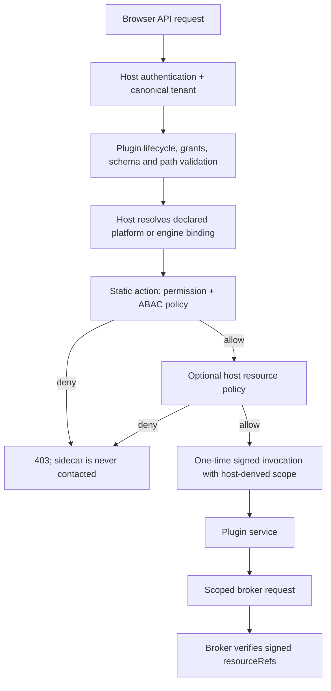
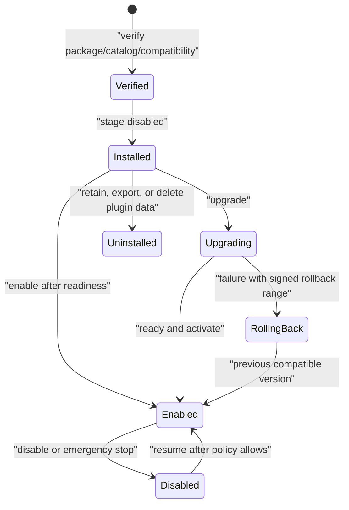

# OSS Plugin Platform and Authoring Guide

Status: local implementation foundation; public review, publication, and customer acceptance are
still required before this is a supported release channel.

Last reviewed: 2026-08-19

## Purpose

EnterpriseGlue OSS provides a reusable, product-neutral plugin platform. It lets a separately
distributed plugin add additive Carbon UI and an isolated backend service without rebuilding an
OSS deployment or giving the plugin host-internal privileges.

The OSS repository owns generic contracts, host runtime, lifecycle controls, installer, and
security policy. A plugin publisher owns plugin behavior, entitlement, private product source,
and its signed release. The platform is intentionally not coupled to any particular paid plugin.

## OSS v0.13.1 integration baseline

The generic platform is being integrated on top of EnterpriseGlue OSS `v0.13.1`, which is the
first target for the next plugin-platform release (`v0.14.0`). The integration deliberately
follows the OSS Carbon navigation and grouped settings workspace rather than adding a separate
administration application.

| Surface | Host behavior | Why it belongs there |
| --- | --- | --- |
| Main or tenant plugin route | The responsive desktop header and mobile SideNav group active signed plugin navigation under **Plugins**. Root and tenant route scopes retain their own canonical paths. | A general-purpose plugin may have a product page, but it must remain visibly separate from built-in OSS navigation. |
| Platform Settings → Operations → Plugins | The generic lifecycle and emergency controls live here. Deployment-owned plugin settings appear as host-rendered links below the controls. `/admin/plugins` remains a redirect for old bookmarks. | Lifecycle state changes the whole deployment and is therefore a platform operation, not an engine action. |
| Mission Control engine, incident, failed-job, and process-instance actions | Diagnostic plugins contribute compact contextual actions at the object being investigated. A plugin may also declare one Mission Control child workspace, such as a case overview, through `parentDestination: mission-control`. | The user sends exact context at the source, while longer-running investigations remain discoverable in the same product area. |

Every added surface inherits the existing OSS Carbon Design System runtime and responsive
navigation behavior. Plugin frontend code uses the host's React, router, Carbon package, page
layout primitives, spacing tokens, and accessible fallback controls; it must not ship a parallel
design system or a second React runtime.

### Control-plane authorization

The plugin control API uses static OSS FGA actions instead of a broad administrator middleware:

- `platform.settings.read` protects safe plugin lifecycle, capability, audit, metrics, and
  tenant-enablement reads.
- `platform.settings.manage` protects enable/disable, emergency stop, and dead-letter replay
  mutations.
- contextual diagnostic slots use the selected engine's `engine.instances.read` decision. A
  denied engine hides the action; the invocation gateway independently enforces the static action
  before contacting the plugin.

The temporary `deploymentAdminMiddleware` and `tenantAdminMiddleware` route options remain only
as compatibility aliases for existing host tests and deployments. New integrations must use the
explicit read/manage lanes above.

## Supported plugin shapes

| Shape | Uses | Example purpose |
| --- | --- | --- |
| UI-only | Carbon frontend module and declared contributions | Read-only dashboard |
| Backend-only | Isolated service and declared operation | Policy check |
| Full-stack | Both frontend and backend | Product workflow |
| Event-driven | Minimized event subscription | Incident classification |
| Scheduled | Fixed manifest schedule | Inventory reconciliation |
| Diagnostic | Approved local collector and sanitized handoff | Support-bundle analysis |

The first version does not allow arbitrary internet-loaded UI, in-process backend extensions,
plugin install scripts, direct host-database access, caller-selected files or URLs, unrestricted
cron jobs, or arbitrary network egress.

## Host and plugin compatibility across OSS releases

The host version has two authorities with distinct purposes:

| Context | Version authority | Reason |
| --- | --- | --- |
| Source and unreleased builds | Checked-in plugin-platform release identity | Gives developers one deterministic candidate version |
| Published backend image | Immutable `vX.Y.Z` release tag injected by protected image CI | Prevents a later patch image from advertising an older host version |

The published-image workflow validates the injected value from inside the final runtime image.
Repository contract tests also require the source and production Docker defaults to match the
checked-in candidate and require both protected image-build attempts to inject the release value.

A plugin manifest may declare a SemVer host range, but that range is not sufficient for
activation. The signed private catalog must also list the exact host patch in
`testedHostVersions`, and the signed current/previous compatibility matrix must bind every tested
host/plugin pair to immutable image digests and retained evidence. Therefore a new OSS patch is
safe by default: an existing plugin remains unavailable on that exact patch until the private
plugin pipeline has tested it and published updated signed evidence. No customer-side CI or OSS
rebuild is required.

For each paid plugin repository, keep its current and previous supported plugin releases in the
matrix. Test both against the current and previous supported OSS host releases. Older combinations
remain installable only while their signed catalog entry and entitlement are active; they are not
silently treated as compatible with newer hosts.

## System boundary

```mermaid
flowchart LR
  subgraph Publisher["Plugin publisher"]
    Source["Plugin source"]
    CI["Publisher CI"]
    Bundle["Signed plugin package"]
    Catalog["Signed catalog"]
  end

  subgraph Deployment["Customer deployment control plane"]
    Installer["eg-plugin installer"]
    Policy["Publisher, entitlement, and grant policy"]
    Registry["Approved OCI registry"]
    Desired["Verified desired state"]
  end

  subgraph Host["EnterpriseGlue OSS host"]
    Control["Lifecycle and emergency controls"]
    Frontend["Same-origin Carbon module runtime"]
    Gateway["Fixed signed operation gateway"]
    Brokers["Scoped host brokers"]
  end

  subgraph Plugin["Installed plugin"]
    UI["Frontend ESM"]
    Service["Isolated backend service"]
    Data["Plugin-owned data"]
  end

  Source --> CI --> Bundle --> Registry
  CI --> Catalog --> Installer
  Registry --> Installer
  Policy --> Installer
  Installer --> Desired --> Control
  Control --> Frontend
  Control --> Gateway
  Frontend --> UI
  UI -->|"declared same-origin operation"| Gateway
  Gateway -->|"short-lived signed invocation"| Service
  Gateway --> Brokers --> Service
  Service --> Data
```



The installer is the only component that changes deployment desired state or renders Compose and
Helm output. The host can enable, disable, or emergency-stop an already installed plugin; it does
not receive Docker, Kubernetes, registry, or publisher-build authority.

## Public contracts

The authoritative TypeScript and Zod contracts are in
[`packages/plugin-sdk`](../../packages/plugin-sdk). The runtime implementation is in
[`packages/plugin-runtime`](../../packages/plugin-runtime).

| Contract | Rule |
| --- | --- |
| Manifest | Closed, versioned, reverse-DNS identity, immutable image digest, declared compatibility, permissions, and an optional static end-user authorization action for each interactive backend operation |
| Frontend module | Same-origin ESM, manifest-equal identity and contributions, shared host React/router/Carbon runtime |
| Backend capability | Fixed health/readiness/capability paths plus closed declared operations |
| Invocation claim | Short-lived Ed25519 token with plugin, tenant, deployment, subject, operation, request digest, and one-time ID |
| Broker request | Declared permission, operation-specific schema, and host-derived scope are all required |
| Lifecycle state | Installed, enabled, healthy, compatible, degraded, or disabled; installation and enablement are separate |

Generated manifest and capability schemas are packaged with the SDK:

```text
@enterpriseglue/plugin-sdk/schema/enterpriseglue-plugin-manifest-v1.schema.json
@enterpriseglue/plugin-sdk/schema/enterpriseglue-plugin-platform-capabilities-v1.schema.json
```

The host exposes a safe, no-store capability projection to deployment administrators. It includes
supported protocol and SDK lines, exact shared frontend runtime, named permissions, slots, events,
egress-policy identifiers, and trusted publishers. It does not expose credentials, destinations,
tenant/resource identifiers, customer content, or plugin payloads.

### Fine-grained authorization contract

Fine-grained access control (FGA) in OSS is the authority for an end user's ability to invoke a
plugin operation. Plugin installation, entitlement, and `permissions.required` are separate
controls: they decide whether the plugin may exist or use a host capability; they never grant a
user access to customer data.

An interactive operation may declare exactly one host-owned authorization mapping:

```yaml
authorization:
  actionId: engine.instances.read
  resource: engine.binding
```

`actionId` must be an existing, static EnterpriseGlue action. The SDK only permits
`platform.self` or `engine.binding` as the resource mapping. An engine mapping also requires the
operation's declared engine resource binding. The gateway—not the plugin—resolves the current
user, tenant, and bound engine reference. It rejects unknown actions, mismatched resource types,
missing bindings, tenant-invisible engines, FGA permission denials, and ABAC policy denials.

No dynamic plugin action identifiers, caller-provided resource references, permission snapshots,
or raw browser access tokens are passed to the plugin. This keeps the action registry reviewable
and prevents a paid plugin from becoming an authorization bypass.

Older manifests that have no `authorization` mapping remain wire-compatible but are fail-closed
behind a deliberately conservative host baseline: `platform.dashboard.read` for an unbound
operation and `engine.instances.read` for an engine-bound operation. Plugin publishers should
migrate to an explicit mapping before relying on a more specific action. A future support-case
resource type must add its resolver and static action to OSS before a case-bound operation is
allowed; it must not be simulated with a customer-provided case ID.

## Frontend authoring

Plugin frontend modules are trusted, publisher-approved, same-origin code. They share the exact
host React, React Router, and Carbon Design System runtime; a plugin must not bundle another
runtime.

Native plugins are additive:

- declare routes, navigation, settings, and slots in the signed manifest;
- use only the typed host extension and UI APIs;
- namespace every contribution with the plugin identity;
- treat host UI primitives as optional and provide an accessible fallback;
- use host routing and notification APIs rather than direct browser networking; and
- clean up every contribution when deactivated.

The initial host extension points include global header actions, platform settings, engine and
incident actions, process-instance detail actions, and plugin-owned tenant routes/navigation.
Native plugins cannot replace host features or components. The legacy override seam is reserved
for the existing transitional loader and is rejected for ordinary plugin ownership.

```mermaid
sequenceDiagram
  participant Browser
  participant Frontend as "OSS frontend host"
  participant Gateway as "OSS gateway"
  participant Service as "Plugin backend"

  Browser->>Frontend: "Load verified same-origin module"
  Frontend->>Frontend: "Check identity, digest, manifest, and slot ownership"
  Frontend->>Browser: "Render additive Carbon contribution"
  Browser->>Gateway: "Invoke declared operation"
  Gateway->>Gateway: "Authenticate; resolve tenant and bound resource"
  Gateway->>Gateway: "Evaluate static FGA action and ABAC policy"
  Gateway->>Gateway: "Apply optional host-only resource policy"
  Gateway->>Service: "Closed request plus signed one-time invocation"
  Service-->>Gateway: "Closed response or bounded SSE"
  Gateway-->>Browser: "Validated response"
```

The frontend host keeps a bounded browser-local failure circuit for exact
`plugin-id/version/bootstrap-revision` activation failures. It removes partial contributions,
does not expose customer content in the record, and never disables the ordinary Mission Control
experience.

The host passes its already-computed FGA decision into contextual slots. A denied slot does not
render, including its label or action, while the gateway independently enforces the same class of
decision for every request. Hiding an action is therefore an ergonomics improvement, not the
security control.

## Backend isolation and brokers

A plugin backend is a separate process or workload. It never receives the Express application,
host database connection, Docker socket, Kubernetes credential, raw secret, or unrestricted
network access.

For every operation the host validates the plugin/version/protocol/schema hashes, authenticated
user and tenant context, deployment and tenant enablement, emergency state, permission grants,
the manifest's static FGA mapping, the resolved resource and policy decision, admission limits,
and the declared operation. Only then does it sign one short-lived invocation. The plugin must
verify the claim and durably consume the one-time ID before performing work.



The signed broker claim carries only the host-resolved `resourceRefs`. A broker rechecks that an
engine read is within that signed scope and the canonical tenant visibility boundary; it does not
recreate legacy role checks or trust an ID sent by the plugin.

The available broker families are deliberately scoped:

- safe identity and resource reads;
- plugin-owned storage with optimistic revision;
- minimized events and fixed schedules;
- locally filtered diagnostics;
- host-rendered notifications; and
- host-only secret use with opaque references.

An entitlement is a plugin-owned decision. The host may present a safe reason code, but a paid
plugin backend must check its entitlement on every paid operation.

### Customer-side diagnostics and full logs

The diagnostic collector is part of the OSS host and runs in the same customer environment as
the EnterpriseGlue adapter. Its PII/secret filtering executes before any support plugin or cloud
endpoint sees a bundle. The plugin receives a sanitized, bounded handoff only; raw logs are not
stored by the host broker or sent through a browser.

Full sanitized log bundles are an explicit opt-in diagnostic policy, not a default. The host
requires user confirmation and marks the signed evidence level as
`sanitized_full_log_bundle_confirmed`; it limits the handoff to 10 MiB and one million lines.
The customer adapter remains the privacy boundary whether EnterpriseGlue OSS is deployed
on-premises or the support agent itself is cloud-hosted. A plugin may distill a confirmed,
sanitized case into generic knowledge only through the separately governed knowledge-promotion
workflow; it must never infer permission to retain raw artifacts from the diagnostic request.

## Installation and lifecycle

The public `@enterpriseglue/plugin-installer` package and `eg-plugin` command verify a signed
catalog/package inventory before writing deployment state. They support install, enable, disable,
upgrade, rollback, uninstall, status, local Compose application, and Kubernetes/OpenShift
application.

The installer verifies exact file hashes, manifest/resource hashes, publisher trust, immutable
image references, host compatibility, required permission grants, and the complete dependency and
conflict graph. It writes a canonical desired-state revision, a lifecycle plan, and a safe
display-only execution observation.



Customers consume publisher-built artifacts and do not clone plugin source or run publisher CI.
Before public publication, the exact installer image, charts, trust root, and artifact digests
must be part of an accepted release receipt. Until then, the following commands are local
engineering evidence, not customer instructions:

```sh
pnpm test:plugin-installer
pnpm test:plugin-platform:chart
pnpm test:plugin-platform:compose-lifecycle
pnpm test:plugin-platform:multi-replica
pnpm test:plugin-platform:images
```

## Distribution and air-gapped operation

The installer implementation accepts a signed package inventory and digest-pinned OCI subject.
The intended release format is:

1. Publish the payload subject first.
2. Publish a signed catalog that binds plugin identity/version to that immutable subject digest.
3. Attach or index SBOM, provenance, vulnerability, license, malware, and secret-scan evidence.
4. Verify the publisher trust policy, catalog binding, package inventory, and exact host evidence
   before staging disabled.
5. For air-gapped deployments, import the same verified digest set into an approved customer
   registry; do not build source in the customer environment.

Release publication, registry interoperability, and customer air-gap acceptance remain required
gates. A local implementation alone is not evidence of a supported customer distribution.

The protected public release workflow is
[`plugin-toolchain-release.yml`](../../.github/workflows/plugin-toolchain-release.yml). It is
manual-only, accepts one exact 40-character protected OSS commit, builds a multi-architecture
installer, packages both charts reproducibly, publishes immutable subjects, signs and verifies
them with workload identity, scans the final installer image, writes a non-secret receipt, and
creates a signed air-gap bundle. Its local disposable-registry counterpart is:

```sh
pnpm test:plugin-toolchain-release-policy
pnpm test:plugin-toolchain-release:local
```

The local drill proves signed registry publication, digest re-pull, chart determinism, tamper
rejection, bundled-tool execution, and disconnected import. It does not constitute a protected
public publication or a customer-registry acceptance.

## Public/private boundary

Public OSS contains generic host code only. A private plugin does not become an OSS workspace
dependency, source import, route, entitlement, credential, model configuration, or host-image
layer.

The source guard is mandatory for this boundary:

```sh
pnpm guard:paid-plugin-boundary
```

It discovers the public workspace package allowlist and rejects non-public EnterpriseGlue
dependencies, lockfile markers, source imports, and unsafe production-Dockerfile inputs. The
production-image acceptance command builds both final images from a clean Docker context, imports
the backend plugin host using its real package-resolution path, and scans final image paths and
compiled assets for non-public package markers:

```sh
pnpm test:plugin-platform:images
```

The lower-level `guard:paid-plugin-image-boundary` remains available when a release workflow has
already built immutable backend and frontend images and wants to scan those exact references.

## Local verification evidence

The current local implementation is covered by focused checks:

- SDK compatibility fixtures and 57 SDK tests;
- 61 runtime tests;
- 75 backend host and control-plane tests;
- 32 Carbon frontend host tests;
- 58 installer and lifecycle tests;
- a hardened reference-plugin container that rejects invocation replay after restart;
- Helm/RBAC security rendering checks;
- real local Compose lifecycle application; and
- a disposable PostgreSQL two-replica acceptance.

The checks prove local engineering behavior. They do not replace public code review, protected CI,
package/image/chart publication, private released-artifact pairing, customer topology testing, or
contractual acceptance.

## Release checklist

- [x] Generic public SDK, runtime, host, installer, charts, and reference-plugin source exist in
  a clean local OSS worktree.
- [x] Interactive plugin operations and contextual plugin slots bridge to OSS FGA without
  transmitting an authorization bypass to a plugin.
- [x] Customer-side sanitized full-log collection is bounded and requires explicit confirmation.
- [x] Local focused tests, container checks, Compose lifecycle, Helm security, and two-replica
  acceptance pass.
- [x] OSS source boundary guard rejects private plugin dependencies and imports.
- [x] Protected generic installer/chart release workflow and a local signed OCI/air-gap drill
  exist; no protected public execution has occurred.
- [ ] Review and merge the stacked generic OSS slices.
- [ ] Run protected public CI, including source and final-image boundary guards.
- [ ] Publish immutable SDK/runtime, host images, installer image, and charts.
- [ ] Migrate each private plugin manifest to explicit static FGA operation mappings and run its
  private CI against released OSS tags and digests.
- [ ] Publish a signed private plugin artifact and perform customer deployment acceptance.
## Mission Control child navigation and readable-engine broker

Navigation contributions may use the existing host vocabulary
`parentDestination: mission-control`. The host places those contributions in the Mission Control
sidebar and omits them from the top-level Voyager plugin list. The contributed tenant route should
use a Mission Control-relative path such as `mission-control/<plugin-area>` so the normal
Mission Control shell and responsive navigation remain present.

Plugins that need to authorize a tenant-level workspace against the caller's current engine access
may request the explicit `host.engine.access.list_safe` permission. The matching host broker:

- derives subject and tenant exclusively from the signed invocation;
- returns a bounded, paged list of opaque engine references;
- includes only engines with full `engine:instance:view` permission;
- excludes runtime-resource-only grants from whole-engine visibility;
- never returns engine endpoints, credentials, names, health payloads, or arbitrary metadata; and
- does not replace the plugin backend's own object-level access check.

The request is closed and cannot contain a tenant or subject. A plugin operation must declare the
permission, the installer must grant it, and the signed invocation must include it. A navigation
entry, active contribution, or successful broker call is not authority to return plugin-owned
customer content.
