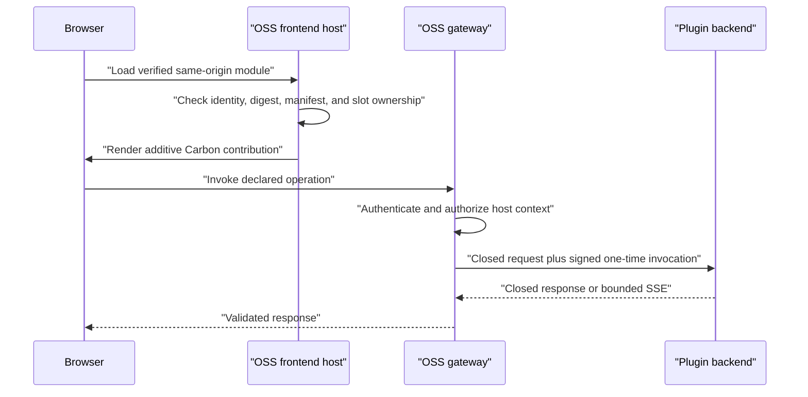
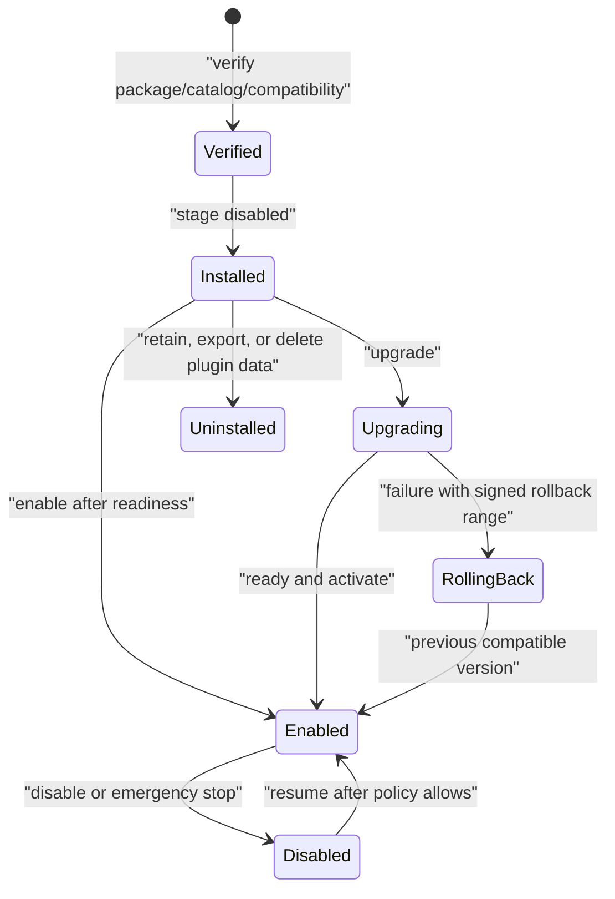

# OSS Plugin Platform and Authoring Guide

Status: local implementation foundation; public review, publication, and customer acceptance are
still required before this is a supported release channel.

Last reviewed: 2026-07-28

## Purpose

EnterpriseGlue OSS provides a reusable, product-neutral plugin platform. It lets a separately
distributed plugin add additive Carbon UI and an isolated backend service without rebuilding an
OSS deployment or giving the plugin host-internal privileges.

The OSS repository owns generic contracts, host runtime, lifecycle controls, installer, and
security policy. A plugin publisher owns plugin behavior, entitlement, private product source,
and its signed release. The platform is intentionally not coupled to any particular paid plugin.

## Supported plugin shapes

| Shape | Uses | Example purpose |
| --- | --- | --- |
| UI-only | Carbon frontend module and declared contributions | Read-only dashboard |
| Backend-only | Isolated service and declared operation | Policy check |
| Full-stack | Both frontend and backend | Product workflow |
| Event-driven | Minimized event subscription | Incident classification |
| Scheduled | Fixed manifest schedule | Inventory reconciliation |
| Diagnostic | Approved local collector and sanitized handoff | Support-bundle analysis |

The first version does not allow arbitrary internet-loaded UI, in-process backend extensions,
plugin install scripts, direct host-database access, caller-selected files or URLs, unrestricted
cron jobs, or arbitrary network egress.

## System boundary

```mermaid
flowchart LR
  subgraph Publisher["Plugin publisher"]
    Source["Plugin source"]
    CI["Publisher CI"]
    Bundle["Signed plugin package"]
    Catalog["Signed catalog"]
  end

  subgraph Deployment["Customer deployment control plane"]
    Installer["eg-plugin installer"]
    Policy["Publisher, entitlement, and grant policy"]
    Registry["Approved OCI registry"]
    Desired["Verified desired state"]
  end

  subgraph Host["EnterpriseGlue OSS host"]
    Control["Lifecycle and emergency controls"]
    Frontend["Same-origin Carbon module runtime"]
    Gateway["Fixed signed operation gateway"]
    Brokers["Scoped host brokers"]
  end

  subgraph Plugin["Installed plugin"]
    UI["Frontend ESM"]
    Service["Isolated backend service"]
    Data["Plugin-owned data"]
  end

  Source --> CI --> Bundle --> Registry
  CI --> Catalog --> Installer
  Registry --> Installer
  Policy --> Installer
  Installer --> Desired --> Control
  Control --> Frontend
  Control --> Gateway
  Frontend --> UI
  UI -->|"declared same-origin operation"| Gateway
  Gateway -->|"short-lived signed invocation"| Service
  Gateway --> Brokers --> Service
  Service --> Data
```



The installer is the only component that changes deployment desired state or renders Compose and
Helm output. The host can enable, disable, or emergency-stop an already installed plugin; it does
not receive Docker, Kubernetes, registry, or publisher-build authority.

## Public contracts

The authoritative TypeScript and Zod contracts are in
[`packages/plugin-sdk`](../../packages/plugin-sdk). The runtime implementation is in
[`packages/plugin-runtime`](../../packages/plugin-runtime).

| Contract | Rule |
| --- | --- |
| Manifest | Closed, versioned, reverse-DNS identity, immutable image digest, declared compatibility and permissions |
| Frontend module | Same-origin ESM, manifest-equal identity and contributions, shared host React/router/Carbon runtime |
| Backend capability | Fixed health/readiness/capability paths plus closed declared operations |
| Invocation claim | Short-lived Ed25519 token with plugin, tenant, deployment, subject, operation, request digest, and one-time ID |
| Broker request | Declared permission, operation-specific schema, and host-derived scope are all required |
| Lifecycle state | Installed, enabled, healthy, compatible, degraded, or disabled; installation and enablement are separate |

Generated manifest and capability schemas are packaged with the SDK:

```text
@enterpriseglue/plugin-sdk/schema/enterpriseglue-plugin-manifest-v1.schema.json
@enterpriseglue/plugin-sdk/schema/enterpriseglue-plugin-platform-capabilities-v1.schema.json
```

The host exposes a safe, no-store capability projection to deployment administrators. It includes
supported protocol and SDK lines, exact shared frontend runtime, named permissions, slots, events,
egress-policy identifiers, and trusted publishers. It does not expose credentials, destinations,
tenant/resource identifiers, customer content, or plugin payloads.

## Frontend authoring

Plugin frontend modules are trusted, publisher-approved, same-origin code. They share the exact
host React, React Router, and Carbon Design System runtime; a plugin must not bundle another
runtime.

Native plugins are additive:

- declare routes, navigation, settings, and slots in the signed manifest;
- use only the typed host extension and UI APIs;
- namespace every contribution with the plugin identity;
- treat host UI primitives as optional and provide an accessible fallback;
- use host routing and notification APIs rather than direct browser networking; and
- clean up every contribution when deactivated.

The initial host extension points include global header actions, platform settings, engine and
incident actions, process-instance detail actions, and plugin-owned tenant routes/navigation.
Native plugins cannot replace host features or components. The legacy override seam is reserved
for the existing transitional loader and is rejected for ordinary plugin ownership.



The frontend host keeps a bounded browser-local failure circuit for exact
`plugin-id/version/bootstrap-revision` activation failures. It removes partial contributions,
does not expose customer content in the record, and never disables the ordinary Mission Control
experience.

## Backend isolation and brokers

A plugin backend is a separate process or workload. It never receives the Express application,
host database connection, Docker socket, Kubernetes credential, raw secret, or unrestricted
network access.

For every operation the host validates the plugin/version/protocol/schema hashes, user and
tenant context, deployment and tenant enablement, emergency state, permission grants, admission
limits, and the declared operation. It then signs one short-lived invocation. The plugin must
verify the claim and durably consume the one-time ID before performing work.

The available broker families are deliberately scoped:

- safe identity and resource reads;
- plugin-owned storage with optimistic revision;
- minimized events and fixed schedules;
- locally filtered diagnostics;
- host-rendered notifications; and
- host-only secret use with opaque references.

An entitlement is a plugin-owned decision. The host may present a safe reason code, but a paid
plugin backend must check its entitlement on every paid operation.

## Installation and lifecycle

The public `@enterpriseglue/plugin-installer` package and `eg-plugin` command verify a signed
catalog/package inventory before writing deployment state. They support install, enable, disable,
upgrade, rollback, uninstall, status, local Compose application, and Kubernetes/OpenShift
application.

The installer verifies exact file hashes, manifest/resource hashes, publisher trust, immutable
image references, host compatibility, required permission grants, and the complete dependency and
conflict graph. It writes a canonical desired-state revision, a lifecycle plan, and a safe
display-only execution observation.



Customers consume publisher-built artifacts and do not clone plugin source or run publisher CI.
Before public publication, the exact installer image, charts, trust root, and artifact digests
must be part of an accepted release receipt. Until then, the following commands are local
engineering evidence, not customer instructions:

```sh
pnpm test:plugin-installer
pnpm test:plugin-platform:chart
pnpm test:plugin-platform:compose-lifecycle
pnpm test:plugin-platform:multi-replica
```

## Distribution and air-gapped operation

The installer implementation accepts a signed package inventory and digest-pinned OCI subject.
The intended release format is:

1. Publish the payload subject first.
2. Publish a signed catalog that binds plugin identity/version to that immutable subject digest.
3. Attach or index SBOM, provenance, vulnerability, license, malware, and secret-scan evidence.
4. Verify the publisher trust policy, catalog binding, package inventory, and exact host evidence
   before staging disabled.
5. For air-gapped deployments, import the same verified digest set into an approved customer
   registry; do not build source in the customer environment.

Release publication, registry interoperability, and customer air-gap acceptance remain required
gates. A local implementation alone is not evidence of a supported customer distribution.

## Public/private boundary

Public OSS contains generic host code only. A private plugin does not become an OSS workspace
dependency, source import, route, entitlement, credential, model configuration, or host-image
layer.

The source guard is mandatory for this boundary:

```sh
pnpm guard:paid-plugin-boundary
```

It discovers the public workspace package allowlist and rejects non-public EnterpriseGlue
dependencies, lockfile markers, source imports, and unsafe production-Dockerfile inputs. The
companion image guard scans final backend and frontend images and is intended to run in public
image CI:

```sh
pnpm guard:paid-plugin-image-boundary \
  -- --backend-image <immutable-backend-digest> \
  --frontend-image <immutable-frontend-digest>
```

## Local verification evidence

The current local implementation is covered by focused checks:

- SDK compatibility fixtures and 52 SDK tests;
- 60 runtime tests;
- 70 backend control-plane tests;
- 28 Carbon frontend host tests;
- 58 installer and lifecycle tests;
- a hardened reference-plugin container that rejects invocation replay after restart;
- Helm/RBAC security rendering checks;
- real local Compose lifecycle application; and
- a disposable PostgreSQL two-replica acceptance.

The checks prove local engineering behavior. They do not replace public code review, protected CI,
package/image/chart publication, private released-artifact pairing, customer topology testing, or
contractual acceptance.

## Release checklist

- [x] Generic public SDK, runtime, host, installer, charts, and reference-plugin source exist in
  a clean local OSS worktree.
- [x] Local focused tests, container checks, Compose lifecycle, Helm security, and two-replica
  acceptance pass.
- [x] OSS source boundary guard rejects private plugin dependencies and imports.
- [ ] Review and merge the stacked generic OSS slices.
- [ ] Run protected public CI, including source and final-image boundary guards.
- [ ] Publish immutable SDK/runtime, host images, installer image, and charts.
- [ ] Run private plugin CI against released OSS tags and digests.
- [ ] Publish a signed private plugin artifact and perform customer deployment acceptance.
