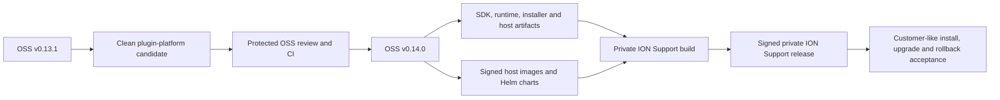
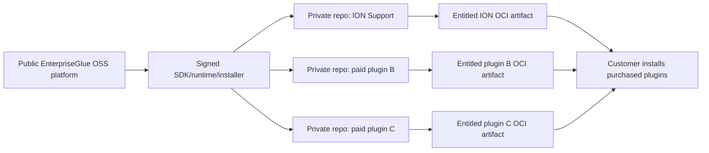
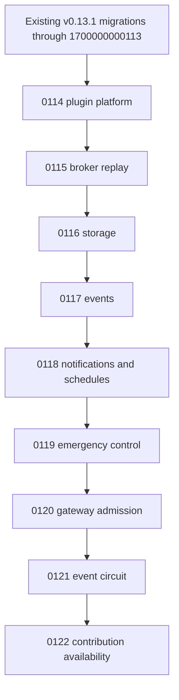

# Plugin Platform v0.14.0 Implementation and Release Plan

Status: active implementation plan

Baseline: EnterpriseGlue OSS `v0.13.1`

Target: EnterpriseGlue OSS `v0.14.0`

Private consumer: ION Support, released separately from the OSS repository

Last reviewed: 2026-08-23

## Goal

Release a product-neutral EnterpriseGlue OSS plugin platform that lets independently distributed,
paid or free plugins add bounded Carbon UI, isolated backend operations, host-authorized brokers,
events, schedules, notifications, diagnostics, and lifecycle controls without rebuilding the OSS
application or placing private plugin source in the public repository.

The first private consumer is ION Support. Its source, entitlement, support-agent configuration,
customer cases, prompts, models, and commercial behavior remain outside the OSS repository. The
OSS release contains only the reusable host, contracts, installer, policy, and reference plugin.
ION Support also remains outside every SSO, identity, EE, and unrelated product repository; its
sole source authority is the private `EnterpriseGlue/ion-support-agent` repository.

The follow-on customer installation architecture is defined in
[Native Plugin Manager and Customer Installation Plan](18-native-plugin-manager-and-customer-installation-plan.md).
It keeps `v0.14.0` as the signed platform and CLI foundation and targets the OSS-native isolated
manager plus integrated Carbon installation experience for `v0.15.0`.

## Release outcome

The OSS release and private plugin release are related but independently versioned and published.
A private plugin release must bind its evidence to the exact OSS release commit, public package
versions, host image digests, toolchain digests, and compatibility catalog it was tested against.

## Fixed decisions

- [x] Use OSS `v0.14.0` as the first distributable plugin-capable EnterpriseGlue release.
- [x] Keep all ION Support product code and commercial entitlements private.
- [x] Use one private source repository per independently sold commercial plugin; ION Support is
  owned by the private `EnterpriseGlue/ion-support-agent` repository.
- [x] Do not place ION Support in an SSO, identity, EE, or other product repository.
- [x] Keep the OSS plugin platform generic and capable of hosting more than one plugin.
- [x] Use the existing Carbon Design System, React, router, page layout, navigation, modal, and
  accessibility primitives supplied by the OSS host.
- [x] Use additive contextual contributions for engines, incidents, failed jobs, process
  instances, batches, settings, and Mission Control child workspaces.
- [x] Enforce OSS fine-grained access control in the host before a contribution is shown and again
  before an operation or broker call is executed.
- [x] Keep raw customer logs outside the browser and plugin; collect and sanitize locally before a
  bounded signed diagnostic handoff.
- [x] Use signed immutable OCI artifacts so customers do not need to clone plugin source or run a
  publisher CI pipeline.
- [x] Treat application rollback and destructive database rollback as different operations.
- [x] Support the current and immediately previous plugin SDK minor only after both are genuine
  published and tested package lines.

## Repository and commercial-product model

Use a separate private repository for each independently priced plugin. This is the recommended
default because repository access, release approval, vulnerability response, entitlement SKU,
compatibility evidence, rollback, and customer support can then be isolated to one product.

| Repository class | Visibility | Contents | Customer access |
| --- | --- | --- | --- |
| EnterpriseGlue OSS | Public | Generic host, SDK, runtime, installer, brokers, Carbon primitives, neutral reference plugin and authoring docs | Source and signed public artifacts |
| ION Support | Private, dedicated repository | Support-agent frontend/backend, prompts, workflows, knowledge policies, entitlement, tests and signed release pipeline; never SSO/identity product source | Signed entitled plugin artifacts only |
| Future paid plugin | Private repository per plugin | Only that plugin's product behavior, entitlement and release evidence | Signed artifacts for the purchased SKU only |
| Shared commercial libraries, if genuinely needed | Separate private package repository | Small versioned libraries reused by at least two private plugins; no product frontend/backend | Never installed directly by customers |

Do not put multiple paid plugins into one private monorepository merely to simplify CI. That makes
source access and release authority broader than the commercial purchase and couples unrelated
release cadences. A shared private monorepository is acceptable only when the plugins are sold,
supported, versioned, and disclosed as one inseparable suite. Even then, each plugin remains a
separate signed OCI subject, manifest, entitlement feature, compatibility matrix, and rollback
unit.

## Release invariants

The release is blocked unless all of the following remain true:

- OSS builds and runs with no plugin installed.
- Disabling or removing a plugin removes only that plugin's contributions.
- A plugin cannot select another tenant, principal, engine, incident, job, process instance,
  diagnostic source, filesystem path, model, credential, or egress destination.
- Navigation visibility never acts as authorization.
- Plugin frontend code is same-origin, integrity-checked, and uses the exact host-provided shared
  frontend dependency set.
- Plugin backend code runs as an isolated service behind the fixed signed gateway.
- The public host image contains no private plugin package, source, credential, entitlement, or
  customer data.
- Every durable table and column is TypeORM-owned, migration-backed, adapter-registered, and
  qualified on every supported database.
- Release evidence comes from clean immutable public and private commits, never a dirty worktree.

## Phase 0: establish a clean source of truth

- [x] Reconcile the existing 15 committed plugin-platform changes with all staged, unstaged, and
  untracked v0.13.1-port follow-up changes.
- [x] Decide every changed path as included, split into a later change, or removed; record the
  decision in the pull-request description.
- [x] Preserve existing user changes while eliminating mixed staged/unstaged versions of the same
  file.
- [x] Ensure the branch is based on the current `origin/main` and the `v0.13.1` release commit.
- [x] Produce one clean working tree before creating release-looking evidence.
- [x] Keep implementation commits reviewable by concern: contracts, persistence, host runtime,
  UI/FGA, installer/toolchain, tests, and documentation.
- [x] Confirm `git diff --check` passes and no generated build output is tracked accidentally.

Acceptance:

- One clean commit graph contains the complete intended OSS implementation.
- `git status --short` is empty in the evidence checkout.
- The private repository is not a dependency, submodule, build context, or source reference.
- Every paid plugin has a named private source authority and a separately revocable signed artifact
  and entitlement identity.

## Phase 1: align release and compatibility identity

- [x] Replace the prototype default host version `0.4.6` with one authoritative OSS product
  version source.
- [x] Make source and non-release builds use the checked-in `0.14.0` candidate identity.
- [x] Derive the published backend's host identity from its immutable `vX.Y.Z` release tag and
  verify the value from inside the built runtime image.
- [x] Keep exact private-CI host evidence separate from a manifest's broader SemVer range, so an
  untested patch release fails closed even when it is inside the declared range.
- [x] Align React, React DOM, React Is, React Router DOM, Carbon React, Carbon styles, and Carbon
  icons to one exact shared-frontend set.
- [x] Update the SDK peer dependencies, host capability catalog, reference plugin, private ION
  manifest, documentation, and lockfiles to that exact set.
- [x] Update the capability catalog revision and every consumer expectation together.
- [x] Prove the candidate ION manifest resolves successfully against the candidate OSS catalog.
- [x] Prove wrong host version, wrong SDK package, wrong React/router/Carbon version, and an
  untested patch release fail closed with safe reason codes.
- [x] Enforce one package-manager version across source Dockerfiles, production Dockerfiles,
  plugin toolchain Dockerfiles, local scripts, and every CI setup action.
- [x] Build the real source backend Dockerfile in protected CI so frozen-lockfile compatibility is
  exercised rather than inferred from production-image success.

Recommended first-release identities:

| Artifact | Version |
| --- | --- |
| EnterpriseGlue OSS | `0.14.0` |
| `@enterpriseglue/plugin-sdk` | `0.2.0` |
| `@enterpriseglue/plugin-runtime` | `0.1.0` |
| `@enterpriseglue/plugin-installer` | `0.1.0` |
| Runtime Helm chart | `0.1.0` |
| Installer RBAC Helm chart | `0.1.0` |

The first public package publication must not be described as an upgrade from an unpublished local
version. Later package releases must use the normal semantic-version discipline.

## Phase 2: rebase and qualify persistence

- [x] Renumber the nine plugin migrations after the current v0.13.1 maximum migration identifier.
- [x] Update migration filenames, class names, `name` values, compatibility exports, imports,
  fixtures, documentation, and tests atomically.
- [x] Use `1700000000114` through `1700000000122` unless a newer mainline migration claims part of
  that range before the pull request is finalized.
- [x] Add a guard that rejects duplicate migration identifiers.
- [x] Verify fresh installation creates all plugin tables, columns, indexes, and constraints.
- [x] Verify an actual v0.13.1 database upgrades to the candidate without dropping or rewriting
  unrelated access-governance data.
- [x] Verify repeated startup is idempotent and records no duplicate migration execution.
- [x] Verify multi-replica startup cannot execute plugin migrations concurrently.
- [x] Verify plugin disable, emergency stop, and application rollback do not require destructive
  schema reversal.
- [x] Document that full schema reversal can remove plugin data and therefore requires export or
  backup/restore approval.
- [x] Qualify PostgreSQL, MySQL/MariaDB, SQL Server, Oracle, and Spanner.

Migration order:

## Phase 3: finish public package lifecycle

- [x] Version every changed published host package according to semantic impact.
- [x] Include `@enterpriseglue/plugin-sdk`, `@enterpriseglue/plugin-runtime`, and
  `@enterpriseglue/plugin-installer` in package-version discipline.
- [x] Include all three in release-note package impact validation.
- [x] Add protected package publication workflows for the SDK and runtime.
- [x] Prepare the installer package for protected publication and retain the signed installer
  image as the customer-facing installation path.
- [x] Build before packing and verify every export exists inside the resulting tarball.
- [x] Reject `workspace:`, `link:`, absolute path, dirty source, and unpublished dependency
  references in packed artifacts.
- [ ] Verify public registry visibility using a read-only non-publisher credential.
- [ ] Generate SBOM, provenance, license, vulnerability, malware, and secret-scan evidence.
- [x] Prevent immutable version reuse.
- [ ] Record package integrity hashes and registry URLs in the release receipt.
- [ ] Replace ION Support's local `link:` dependencies with exact published versions and a frozen
  private lockfile before private release evidence is produced.
- [ ] Add a reusable private-repository template for new paid plugins without copying any ION
  Support product behavior.

## Phase 4: complete host contract parity

For each changed plugin resource, mark every surface `aligned`, `not applicable`, or `gap`.

| Resource | Schema | Persistence | Service/FGA | REST/OpenAPI | Config | Portal | Docs/tests |
| --- | --- | --- | --- | --- | --- | --- | --- |
| Plugin installation and lifecycle | [x] | [x] | [x] | [x] | [x] | [x] | [x] |
| Tenant enablement | [x] | [x] | [x] | [x] | [x] | [x] | [x] |
| Emergency stop | [x] | [x] | [x] | [x] | [x] | [x] | [x] |
| Permissions and grants | [x] | [x] | [x] | [x] | [x] | [x] | [x] |
| Gateway admission and circuit state | [x] | [x] | [x] | [x] | N/A | [x] | [x] |
| Broker replay and storage | [x] | [x] | [x] | [x] | N/A | N/A | [x] |
| Notifications and schedules | [x] | [x] | [x] | [x] | [x] | [x] | [x] |
| Contribution availability | [x] | [x] | [x] | [x] | N/A | [x] | [x] |
| Safe engine access projection | [x] | N/A | [x] | [x] | N/A | [x] | [x] |
| Local sanitized diagnostics | [x] | [x] | [x] | [x] | [x] | [x] | [x] |

Required rules:

- [x] Keep TypeORM entities and migrations authoritative for durable state.
- [x] Require `platform.settings.read` for safe lifecycle and capability reads.
- [x] Require `platform.settings.manage` for lifecycle mutations, emergency stop, and replay.
- [x] Require the selected engine's instance-read action for contextual engine/incident/job/process
  contributions.
- [x] Derive tenant, subject, and readable engines in the host.
- [x] Ensure OpenAPI documents authentication, authorization, safe errors, paging, concurrency,
  idempotency, and revision behavior.
- [x] Ensure headless configuration never contains raw secrets and uses ownership/provenance where
  a setting is deployment-managed.
- [x] Keep admin UI visibility and API authorization separate.
- [x] Test allowed scope, sibling denial, cross-tenant denial, resource mismatch, revocation, and
  disabled/expired entitlement outcomes.

## Phase 5: complete Carbon UI and accessibility acceptance

- [x] Verify plugin lifecycle controls live under Platform Settings → Operations → Plugins.
- [x] Verify Mission Control child navigation is grouped under Mission Control, not as an
  unrelated top-level destination.
- [x] Verify contextual actions appear only on the relevant engine, incident, failed-job, process,
  or batch surface.
- [x] Verify absent, disabled, incompatible, degraded, emergency-stopped, or unentitled plugins
  contribute no unsafe action.
- [x] Verify contextual analysis remains inside one host-owned Carbon dialog and returns focus to
  its launcher.
- [x] Verify Support cases use a paged Carbon data table and preserve tenant/user authorization.
- [x] Verify question composition, progress, completed answer, follow-up, export, retention,
  deletion, stronger analysis, and human escalation states.
- [x] Verify local diagnostic preflight, explicit confirmation, partial/rejected/offline results,
  signed receipt, and answer refresh.
- [x] Capture deterministic `1440x900` evidence for every changed surface.
- [x] Run narrow, 200% zoom, RTL, reduced-motion, keyboard, focus, and Axe WCAG checks.
- [x] Audit all screenshots for Carbon spacing, typography, hierarchy, status semantics, copy,
  overflow, and stale or duplicate states.

## Phase 6: repair release and compliance contracts

- [x] Replace the narrow navigation release fragment with complete v0.14.0 plugin-platform
  coverage or multiple coherent fragments.
- [x] List every migration and provide honest application and schema rollback guidance.
- [x] Describe additive APIs, security boundary, FGA actions, configuration, known limitations,
  packages, upgrade steps, and validation evidence.
- [x] Make release-note preflight pass against `origin/main` and `v0.13.1`.
- [x] Make package version recommendation resolve to OSS `0.14.0`.
- [x] Fix third-party notice generation so large pnpm JSON output cannot be truncated silently.
- [x] Check process exit status and signal before parsing dependency JSON.
- [x] Regenerate root and workspace third-party license inventories and notices.
- [x] Pass strict Apache-2.0 compatibility validation.
- [x] Pass the public/private source and final-image boundary guards.
- [ ] Update the OSS authoring guide from local-foundation status only after protected publication
  and customer-like acceptance are complete.

## Phase 7: local release-candidate verification

- [x] `pnpm run release-notes:preflight -- --base-ref origin/main`
- [x] `pnpm run lint`
- [x] `pnpm run typecheck`
- [x] `pnpm run typecheck:plugin-platform`
- [x] `pnpm run test:plugin-platform`
- [x] `pnpm run test:plugin-platform:chart`
- [x] `pnpm run test:plugin-platform:compose-lifecycle`
- [x] `pnpm run test:plugin-platform:multi-replica`
- [x] `pnpm run test:plugin-platform:images`
- [x] `pnpm run guard:paid-plugin-boundary`
- [x] Run the final-image private-code boundary guard against exact candidate images.
- [x] `pnpm run guard:published-package-versions`
- [x] `pnpm run guard:plugin-api:current`
- [x] `pnpm run guard:plugin-api:next`
- [x] `pnpm run test:database-portability:unit`
- [x] `pnpm run test:engine-tenancy:database-matrix`
- [x] `pnpm run test:authz:structure`
- [x] `pnpm run test:authz:pr`
- [ ] `pnpm run test:authz:fine-grained:local`
- [x] `pnpm run test:authz:browser`
- [ ] `pnpm run test:authz:accessibility:cross-browser`
- [ ] `pnpm run test:deployment-evidence:local`
- [x] `pnpm run test:config-bundles`
- [x] `pnpm run test:documentation-contracts`
- [x] `pnpm run guard:authz-route-inventory`
- [x] `pnpm run licenses:check`
- [x] `pnpm run test:plugin-toolchain-release-policy`
- [x] `pnpm run test:plugin-toolchain-release:local`
- [ ] Build and smoke-test production PostgreSQL and Oracle images.
- [x] Run the complete ION Support real-host browser suite against the local OSS candidate.
- [ ] Run clean dual-source OSS/private release evidence and verify every checksum independently.

### Local evidence ledger — 2026-08-23

The checked items above are local candidate evidence, not protected release evidence. Protected
CI must reproduce the required lanes from the pull-request commit before any artifact is signed or
published.

- [x] OSS plugin SDK, runtime, installer, reference plugin, backend host and frontend host suites:
  284 focused tests passed; full lint and type checking passed.
- [x] OSS Compose lifecycle: install, enable, disable, uninstall-with-export and execution receipt
  checks passed.
- [x] OSS multi-replica PostgreSQL acceptance and operation-level FGA authorization passed.
- [x] OSS production backend/frontend image builds and private-code final-image guard passed.
- [x] Public toolchain synthetic signing, deterministic chart, digest repull, tamper rejection,
  air-gap import and no-customer-CI acceptance passed.
- [x] Private ION suite: 99 test files and 685 tests passed.
- [x] Private authorization intersection passed independently for entitlement, engine binding and
  Support permissions; denied requests created no cases and transferred no Support payload.
- [x] Private diagnostic handoff passed customer-side filtering, signed-bundle verification,
  backend re-redaction, case binding, idempotency, revocation and size-limit checks with raw
  canaries absent.
- [x] Private signed lifecycle passed install, upgrade, exact rollback, incompatible/revoked
  rejection, second-plugin failure isolation and recovery with 62 receipts.
- [x] Private OCI/air-gap flow passed signed subject and evidence-referrer verification, digest
  pull after retag, disconnected import and install without customer CI.
- [x] Private real-host Carbon suite passed 26 scenarios and refreshed 43 screenshots, including
  paging, questions, contextual touchpoints, diagnostics, analysis/escalation, lifecycle,
  responsive, RTL, reduced-motion, keyboard and Axe states.
- [x] Trivy completed against the available local database cache dated 2026-08-19.
- [x] The five-database matrix passed PostgreSQL 18, MySQL 8.4, SQL Server 2022, Oracle 21 and the
  Spanner emulator across fresh-install and v0.13.1 upgrade baselines. The qualification caught
  and fixed MySQL index-width and Spanner migration-ledger portability defects before delivery.
- [x] The scoped authorization browser lane and the candidate plugin/support touchpoint suites
  passed against the exact local frontend.
- [x] Chromium passed all 17 cross-browser accessibility scenarios. Firefox and WebKit did not run
  locally because their pinned macOS runtimes were unavailable and the public dependency mirror
  timed out while refreshing the cached Linux runner; protected CI remains the required
  three-browser authority.
- [ ] Repeat Trivy in protected CI with a freshly downloaded vulnerability database.
- [ ] Repeat the disposable full Support workflow from rebuilt source images. The application
  path is not known to have failed: the local Docker builder could not download pnpm from the
  public registry, and the existing cached API image predates the adapter-viewer contract.
- [x] Run the clean five-database fresh-install and v0.13.1-upgrade matrix.
- [ ] Complete the aggregate all-local deployment-evidence profile. Its contract, configuration,
  identity, engine-mode, secret-boundary and OpenShift-rendering lanes passed, but the disposable
  image build was stopped after the Alpine/package mirrors remained network-idle for an extended
  period. The independently run production-image, Compose lifecycle, multi-replica, signed OCI
  and database gates passed.

## Phase 8: protected OSS delivery

- [ ] Push the clean OSS branch and open a pull request against `main`.
- [ ] Include the complete release fragments, generated preview, contract-parity matrix, migration
  evidence, UI evidence index, security boundary result, and rollback notes.
- [ ] Require protected CI, CodeQL, third-party notices, database qualification, image scans,
  package compatibility, plugin-platform, and browser/accessibility checks.
- [ ] Resolve every required review and merge through the protected merge queue.
- [ ] Verify Release Please creates a `v0.14.0` release pull request.
- [ ] Verify the release pull request contains the detailed generated notes and correct manifest.
- [ ] Merge the release pull request and verify tag, GitHub release, changelog, release notes,
  multi-architecture images, and package publication.

These are external repository mutations and require an explicit shipping instruction. Local
implementation and verification do not authorize pushing, merging, publishing, signing with
production identity, or deploying to a customer.

## Phase 9: protected toolchain and private ION delivery

- [ ] Dispatch the protected toolchain release from the exact protected OSS release commit.
- [ ] Verify installer image and both charts are immutable, signed, attested, scanned, and
  reproducible.
- [ ] Verify a non-publisher customer identity can pull every public artifact.
- [ ] Produce and independently verify the signed air-gap bundle.
- [ ] Build ION Support from a clean private commit using exact published OSS dependencies.
- [ ] Bind the ION catalog and package to OSS `0.14.0`, the exact capability catalog, and tested
  host image digests.
- [ ] Run private unit, integration, MCP, diagnostic, entitlement, retention, knowledge,
  authorization-intersection, browser, OCI, and signed lifecycle suites.
- [ ] Publish the signed private plugin only after its protected release approval.
- [ ] Prove install, enable, disable, upgrade, rollback, uninstall-with-retain, uninstall-with-
  export, and air-gap import in a customer-like topology.
- [ ] Record the customer-facing compatibility matrix and operational support boundary.
- [ ] Prove the ION entitlement grants only ION and cannot install or enable another paid plugin.
- [ ] Reuse this release contract for future private plugin repositories while keeping their
  source permissions, signing approvals, artifacts, catalogs and entitlements independent.

## Completion definition

Implementation is complete only when:

- [ ] OSS `v0.14.0` is a real published release containing the generic plugin platform.
- [ ] Public SDK/runtime/installer and host artifacts are immutable and independently pullable.
- [ ] All supported databases pass fresh install and v0.13.1 upgrade qualification.
- [ ] Generic OSS runs normally with zero plugins.
- [ ] The private ION plugin installs without rebuilding OSS and without customer CI.
- [ ] Authorization, tenant isolation, privacy filtering, and private-source boundaries pass both
  positive and negative acceptance.
- [ ] Carbon UI and accessibility evidence covers every plugin touchpoint and terminal state.
- [ ] Upgrade, rollback, uninstall, recovery, and air-gap procedures are verified and documented.
- [ ] The exact public/private release evidence and artifact checksums are retained according to
  policy.
