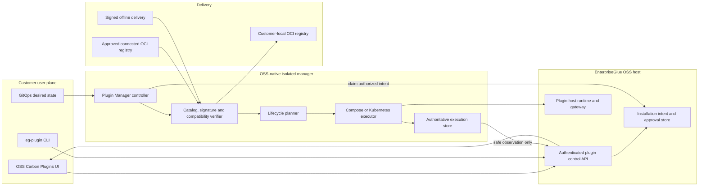
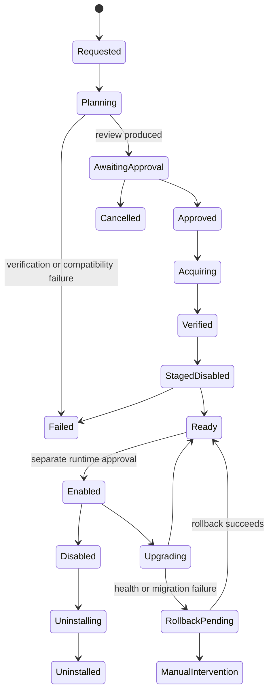
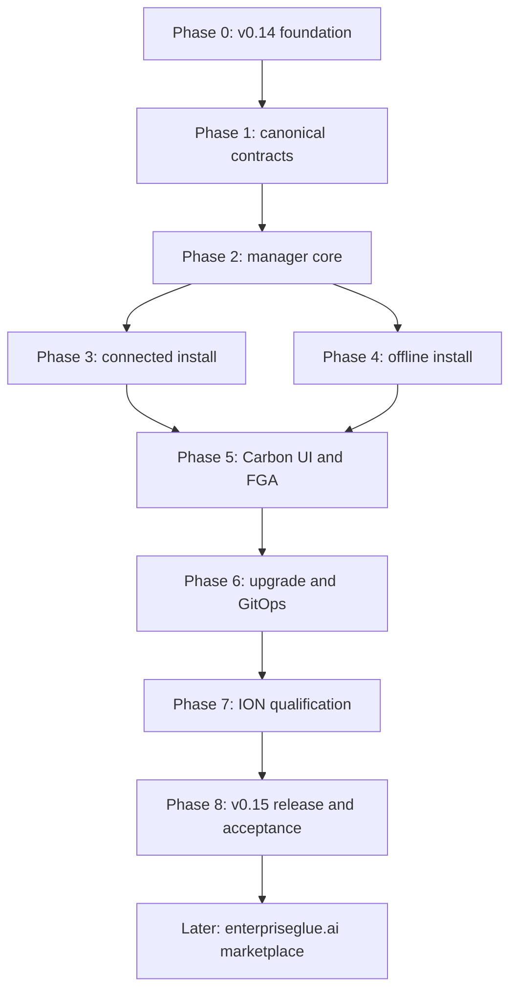

# Native Plugin Manager and Customer Installation Plan

Status: proposed implementation plan

Foundation release: EnterpriseGlue OSS `v0.14.0`

Target native-manager release: EnterpriseGlue OSS `v0.15.0`

First private consumer: ION Support, released independently from its private repository

Last reviewed: 2026-08-24

Related foundations:

- [OSS Plugin Platform and Authoring Guide](12-plugin-platform-and-authoring.md)
- [Plugin Platform v0.14.0 Implementation and Release Plan](13-plugin-platform-v0.14.0-implementation-and-release-plan.md)
- [`@enterpriseglue/plugin-installer` operator guide](../../packages/plugin-installer/README.md)

## Executive decision

EnterpriseGlue Plugin Manager will be a native OSS component. It will be developed, versioned,
packaged, documented, and released from the EnterpriseGlue OSS repository. It will run as a
separate workload so Docker, Kubernetes, registry, migration, and artifact-verification authority
never enters the browser or the ordinary OSS backend process.

The manager will orchestrate the existing public plugin installer and lifecycle contracts. It
will not introduce a second package format, compatibility decision, desired-state model, or
air-gap implementation. CLI, Carbon UI, GitOps, connected registry, and offline delivery paths
must all resolve to the same signed release, install plan, lifecycle execution, and safe
observation.

The public marketplace on `enterpriseglue.ai` is intentionally deferred. The OSS implementation
will define provider-neutral discovery, entitlement-link, and delivery contracts now so a future
website can connect without changing the customer-local installation architecture.

## Recommended release posture

Do not expand the already prepared `v0.14.0` release into a new privileged controller release.
Use:

- `v0.14.0` for the generic plugin host, SDK, runtime, signed installer, CLI, charts, supply-chain
  verification, and external-operator installation foundation;
- `v0.15.0` for the native Plugin Manager, installation-intent APIs, Carbon installation
  experience, connected/offline manager flows, and GitOps reconciliation; and
- the first generally available ION Support plugin release only after the `v0.15.0` manager path
  and the existing CLI fallback both pass customer-like acceptance.

This allows `v0.14.0` to remain a bounded platform release while preventing the first paid-plugin
customer experience from depending permanently on a multi-command operator workflow.

## Customer outcomes

When this plan is complete, a customer will be able to:

- install EnterpriseGlue OSS normally with the Plugin Manager enabled;
- inspect available imported or registry-selected plugin releases without accessing plugin source;
- generate a complete pre-install review before any deployment mutation;
- install a connected plugin from an immutable OCI digest;
- import and install the same release from a signed offline delivery;
- stage a plugin disabled, verify readiness, and enable it separately;
- inspect installation progress, safe failures, compatibility, entitlement, and health in Carbon UI;
- upgrade, roll back, disable, export, and uninstall through one lifecycle engine;
- use the same operations through UI, CLI, or GitOps;
- preflight a future OSS upgrade against every installed plugin; and
- operate without customer CI, Node.js, plugin source, publisher credentials, or a rebuilt OSS image.

## Scope now and later

| Build now in OSS | Build now in each private plugin | Defer to `enterpriseglue.ai` |
| --- | --- | --- |
| Generic manager workload and API | Signed plugin release and immutable OCI artifacts | Public search and marketing pages |
| Installation intent, plan, approval, and observation contracts | Exact OSS/plugin compatibility evidence | Pricing, checkout, quotes, and private offers |
| Connected OCI and offline delivery intake | Entitlement SKU and runtime enforcement | Customer accounts and commercial agreements |
| Compose, Kubernetes, and OpenShift lifecycle adapters | Product security, privacy, support, and deployment disclosures | Browser/device deployment linking |
| Carbon Available, Installed, Updates, and Activity surfaces | Connected and offline entitlement material | Short-lived artifact token broker |
| Compatibility, permission, migration, and rollback review | Customer-like connected and offline acceptance | Subscription renewal and billing lifecycle |
| CLI and declarative GitOps entry points | Upgrade, rollback, and revocation runbooks | Marketplace publisher onboarding |
| Generic static/imported discovery-provider interface | No customer-specific binaries | Third-party revenue sharing and certification |

The deferred website must not become a prerequisite for offline installation, local verification,
rollback, export, uninstall, or access to already entitled recovery artifacts.

## Current reusable foundation

The manager must reuse these existing OSS capabilities rather than reimplement them:

- signed catalog, package, compatibility-matrix, and air-gap verification;
- `install-package`, `install-oci`, `prepare-airgap`, `import-airgap`, and
  `install-airgap-package` acquisition paths;
- canonical plugin desired state and lifecycle plan;
- transaction journal and interrupted-operation recovery;
- fixed Compose and Kubernetes/OpenShift phase adapters;
- deployment-owned execution store and safe lifecycle observation;
- immutable migration images and rollback boundaries;
- plugin host readiness, capability, gateway, broker, and FGA enforcement;
- installed-plugin Carbon status and runtime enable/disable controls; and
- public/private source and final-image boundary guards.

The first implementation task is therefore extraction and composition, not replacement.

## Target architecture



### Trust boundaries

| Component | May hold | Must never hold |
| --- | --- | --- |
| Browser | Safe catalog, plan summary, progress, compatibility and audit data | Registry credentials, kubeconfig, Docker socket, raw plans, signatures' private keys |
| OSS backend | User session, FGA decision, installation intent, safe plan/observation | Docker socket, cluster credential, registry config, plugin secret, raw offline archive |
| Plugin Manager | Scoped registry credential, public trust, exact plan, deployment adapter credential | Billing authority, entitlement signing key, customer browser token, plugin source |
| Plugin runtime | Declared configuration, opaque secret references, isolated data | Installer credential, host database, cluster credential, other plugins' data |
| Commercial service later | Product, offer, entitlement and artifact-token authority | Customer deployment credential, Docker socket, kubeconfig, customer content |

## Packaging and deployment modes

The manager is one OSS codebase and image with deployment-specific adapters.

| Mode | Packaging | Execution authority | Default posture |
| --- | --- | --- | --- |
| Compose planner | Optional Compose service | Produces verified plan; operator runs one-shot apply | Safe default for existing deployments |
| Compose managed | Optional Compose profile plus fixed socket adapter | Restricted deployment worker receives Docker socket only during execution | Explicit operator opt-in with warning |
| Kubernetes | Helm-deployed controller | Namespace-scoped service account created by one-time bootstrap | Recommended cluster mode |
| OpenShift | Same controller with SCC-compatible workload | Namespace Role; platform assigns runtime UID/GID | Recommended OpenShift mode |
| Air-gapped | Same image preloaded or mirrored by digest | Same local adapter, no public egress | Public network disabled and tested |

Direct Docker socket access is equivalent to powerful host authority. Managed Compose must keep
the existing fixed operation adapter, read-only filesystem, no ordinary network, no capabilities,
and explicit audit warning. Planner/operator-applied mode must remain supported.

## Canonical models

Do not collapse commerce, release, or deployment state into one `installed` flag.

### Public and future marketplace model

`PluginProductDescriptorV1` is safe discovery metadata:

- stable product and plugin IDs;
- publisher identity and visible verification class;
- localized name, summary, categories, documentation and support links;
- supported deployment modes and architectures;
- public security, privacy, data-flow, retention, and subprocessors links;
- available commercial CTA class such as `contact`, `trial`, `purchase`, or `entitled`; and
- no artifact credential, entitlement document, customer identity, or deployment authority.

For `v0.15.0`, descriptors may come from a checked-in first-party file or an administrator-imported
signed catalog. A future website implements the same read-only provider contract.

### Canonical signed release

Finalize one `PluginReleaseV1` authority before the first public plugin release. It must include:

- plugin and publisher identity;
- stable, preview, or withdrawn channel state;
- plugin version and immutable package digest;
- complete runtime, migration, and helper image closure by digest;
- supported platform, architecture, database, and deployment modes;
- declared host/API/SDK ranges and exact tested host versions/digests;
- dependencies, conflicts, required capabilities, permissions, storage, network, and configuration;
- database/configuration schema transition and rollback classification;
- support start/end dates, deprecation, revocation, reason, and replacement release;
- signatures, provenance, SBOM/VEX, scans, license, and retained test-evidence references; and
- required entitlement SKU without embedding commercial terms.

Because the current catalog contracts are not publicly released, update them before `v0.14.0`
publication or introduce an explicitly versioned catalog migration. Do not allow two documents to
disagree about artifact or compatibility authority.

### Customer deployment models

Add closed, versioned contracts for:

- `PluginInstallationIntentV1`: requested plugin/release, source class, target deployment mode,
  requester, expected platform revision, and idempotency key;
- `PluginInstallReviewV1`: safe compatibility, permissions, data, egress, infrastructure,
  configuration, migration, backup, rollback, entitlement, and update-policy summary;
- `PluginInstallApprovalV1`: exact review digest, approver, decision, expected revision, and
  expiry;
- `PluginInstallationObservationV1`: safe phase/status/reason/timestamps and plan digest;
- `PluginManagerCapabilityV1`: manager/API versions, adapters, platform and supported operations;
- `PluginOfflineDeliveryRequestV1`: deployment public identity, host digest/version, platform,
  architecture, requested releases, nonce, and no customer content; and
- `PluginOfflineDeliveryReceiptV1`: verified delivery/import digests and bounded result.

The full plan, credentials, paths, commands, archive inventory, and infrastructure receipts remain
manager-owned. The host stores and renders only the safe review and observation.

## Lifecycle state machines

### Installation lifecycle



### Orthogonal states

Keep these independent:

- entitlement: `not_required`, `unavailable`, `trial`, `active`, `grace`, `expired`, `revoked`;
- release: `available`, `deprecated`, `withdrawn`, `security_revoked`;
- runtime: `disabled`, `starting`, `healthy`, `degraded`, `emergency_stopped`; and
- manager: `unavailable`, `planner_only`, `ready`, `busy`, `recovery_required`.

Purchase or entitlement must never imply installation, installation must never imply enablement,
and enablement must never grant the user access denied by host FGA.

## API and control protocol

All routes below are proposed additive APIs. Final paths must pass OpenAPI, schema, persistence,
FGA, audit, and portal parity before implementation is considered complete.

### Browser-facing host APIs

| Operation | Purpose | Proposed authorization |
| --- | --- | --- |
| `GET /api/plugin-platform/v1/products` | Safe discovery projection | `platform.plugins.catalog.read` |
| `GET /api/plugin-platform/v1/installations` | Paged installed and pending state | `platform.plugins.install.read` |
| `POST /api/plugin-platform/v1/installations:plan` | Create revision-bound intent | `platform.plugins.install.manage` |
| `GET /api/plugin-platform/v1/installations/:id/review` | Read safe pre-install review | `platform.plugins.install.read` |
| `POST /api/plugin-platform/v1/installations/:id:approve` | Approve exact review digest | `platform.plugins.install.approve` |
| `POST /api/plugin-platform/v1/installations/:id:cancel` | Cancel before irreversible phase | `platform.plugins.install.manage` |
| `GET /api/plugin-platform/v1/installation-activity` | Paged safe observations | `platform.plugins.install.read` |
| `POST /api/plugin-platform/v1/host-upgrades:preflight` | Check target host against all plugins | `platform.plugins.install.manage` |

Existing runtime enable/disable and emergency APIs remain separate. Static OSS actions are
preferred over one broad administrator middleware. The initial deployment-admin role may include
all actions, but the action model must allow procurement/security approval and deployment
execution to be separated later.

### Manager-to-host protocol

The manager uses a private internal service identity and pull-based protocol:

1. advertise `PluginManagerCapabilityV1`;
2. claim one authorized intent with an expiring lease;
3. report plan digest and safe review;
4. wait for approval of that exact digest;
5. execute only ordered lifecycle phases;
6. renew the execution lease;
7. report safe phase transitions and terminal status; and
8. recover an expired lease idempotently from manager-owned receipts.

Use mTLS or a rotatable workload credential plus audience-bound short-lived tokens. Network policy
must allow only the manager and OSS backend to reach the internal control endpoint. The browser
cannot call it directly.

## Connected installation before the marketplace exists

The first improved experience does not need `enterpriseglue.ai` commerce.

1. EnterpriseGlue commercial operations issue a registry credential, trust policy, immutable OCI
   subject, and entitlement through the existing approved channel.
2. The operator mounts the registry configuration and trust policy into the manager through
   deployment-owned secret/file configuration.
3. In **Plugins → Add plugin → Connected registry**, the operator enters or selects only an
   immutable OCI subject.
4. The backend creates an installation intent; the manager acquires catalog and evidence through
   the selected registry network.
5. The manager verifies workflow identity, signatures, digests, complete artifact closure,
   exact-host evidence, entitlement class, and revocation state.
6. The UI presents the pre-install review and plan digest.
7. Approval stages the plugin disabled, runs readiness/capability checks, and reports the result.
8. Runtime enablement remains a separate administrator action.

Registry config, proxy credentials, private CA, and artifact bytes never pass through the browser
or ordinary backend.

## Offline installation before the marketplace exists

1. EnterpriseGlue operations create a signed delivery for the exact plugin, host version,
   deployment mode, platform, and architecture.
2. The customer transfers it through their media quarantine process.
3. The operator invokes `eg-plugin offline import /approved/path/delivery.egdelivery` or copies it
   into a deployment-owned manager intake directory.
4. The manager verifies the outer inventory before importing any inner content.
5. Every image is imported to the customer registry by digest and independently re-read.
6. The same installation intent, safe review, approval, staging, readiness, and enablement flow is
   used without public egress.

Do not upload multi-gigabyte offline deliveries through the OSS backend. The UI may show safe
metadata for manager-discovered deliveries, but intake remains a local deployment operation.

Add delta deliveries after the first full-bundle path. A delta must include current catalog,
trust-root, revocation, entitlement, and evidence state even when it reuses already mirrored image
digests.

## Future marketplace integration seam

Define these provider interfaces now but ship local/static adapters first:

- `PluginDiscoveryProviderV1`: list and get safe product descriptors;
- `PluginCommercialActionProviderV1`: return a safe CTA and external URL, never execute billing;
- `PluginDeploymentLinkProviderV1`: begin and poll a short-lived device-link transaction;
- `PluginArtifactTokenProviderV1`: manager-only exchange for a repository/digest-scoped pull token;
- `PluginEntitlementProviderV1`: closed entitlement decision independent from artifact access; and
- `PluginOfflineDeliveryProviderV1`: request/status/download metadata for a signed delivery.

The later website supplies these services. OSS must retain a static/imported provider and CLI
fallback so commercial service unavailability cannot prevent local rollback, export, disable, or
uninstall.

## Compatibility and upgrade management

### Admission gate

Every installation requires both:

- declared compatibility: valid host/API/SDK/platform ranges; and
- proven compatibility: exact signed host digest/version, plugin digest, deployment mode,
  platform, architecture, database class, and retained suite revision.

`validation_pending` is not compatible.

### Host upgrades

Implement:

```text
eg-plugin doctor host-upgrade --target-version 0.16.0 --target-digest sha256:...
```

The UI exposes the same preflight. It reports each plugin as:

- supported and tested;
- validation pending;
- incompatible;
- revoked; or
- end of support.

The OSS host must remain able to start when a plugin is incompatible. It disables the incompatible
plugin and preserves the ordinary product rather than turning a plugin into a host-availability
dependency.

### Plugin updates

Add an explicit update graph and retain exact prior artifacts. Before approval, show changes to:

- permissions and FGA mappings;
- data read, generated, retained, or transferred;
- network egress and destinations;
- services, RBAC, storage, secrets, and resources;
- dependencies and conflicts;
- configuration and commercial SKU;
- database/configuration migrations; and
- rollback class and backup requirement.

Default commercial plugins to manual update approval. Automatic approval may be considered only
for an exact policy-approved patch with no material diff and complete compatibility evidence.

## Rollback classes

Every signed release declares one:

| Class | Meaning |
| --- | --- |
| `stateless` | Prior deployment resources can be restored directly |
| `backward_compatible_data` | Prior runtime can read data written by the new release |
| `backup_required` | Rollback requires a verified restore point |
| `forward_only` | In-place downgrade is unavailable; restore or roll forward |

The UI and CLI must never call a resource rollback an application-data rollback when these differ.

## Persistence ownership

| Data | Authority |
| --- | --- |
| User installation intent, approval and safe audit | OSS database through TypeORM migration |
| Full lifecycle plan and execution receipts | Manager execution store |
| Kubernetes execution | Namespace ConfigMap plus manager mirror |
| Compose execution | Private deployment directory plus atomic journal |
| Safe observation and review summary | OSS database/cache, keyed by plan digest and revision |
| Registry configuration and deployment credential | Customer secret/file store mounted only to manager |
| Plugin-owned data | Isolated plugin volume/database |

Manager state and OSS state use compare-and-swap revisions. A safe observation is never proof that
an infrastructure effect occurred; the authoritative manager execution and receipts decide
recovery.

## Carbon customer experience

Place the integrated experience under **Platform Settings → Operations → Plugins**.

### Available

- Search/filter safe imported or provider-supplied products.
- Show compatibility, deployment modes, publisher, support, security/data, and entitlement class.
- Offer **Add from registry** and **View imported offline deliveries** before marketplace launch.
- Later render role-aware website CTAs without changing installation APIs.

### Installed

- Paged Carbon data table with plugin, version, release status, runtime, entitlement, health,
  compatibility, update, and actions.
- Preserve existing enable/disable and emergency controls.

### Updates

- Current/target release, compatibility, material-change flags, support/EOL, and update channel.
- Review the exact diff before approval.

### Installation activity

- Paged plan/execution table and details.
- Show `requested`, `planning`, `awaiting approval`, `acquiring`, `verifying`, `staging`, `ready`,
  `enabled`, `failed`, `rollback pending`, and `manual intervention`.
- Safe reason codes and operator recovery action; no command, path, credential, or raw exception.

### Install review

Use one Carbon progress/wizard flow with sections for:

1. identity and immutable release;
2. compatibility;
3. permissions and data access;
4. network, configuration, resources, and secrets;
5. migration, backup, rollback, and downtime;
6. entitlement and support state; and
7. final review digest and approval.

The review must support keyboard navigation, focus restoration, 200% zoom, RTL, reduced motion,
and deterministic screenshot evidence.

## CLI and GitOps

The CLI is a first-class recovery and automation client for the same host/manager APIs. Keep local
direct installer commands for break-glass recovery, but make normal commands intent-oriented:

```text
eg-plugin plan --subject <digest-reference>
eg-plugin approve --installation <id> --review-digest <sha256>
eg-plugin status --installation <id>
eg-plugin host-upgrade-preflight --target-version <version> --target-digest <digest>
eg-plugin offline import <delivery>
```

Add a declarative `PluginInstallation` resource for GitOps. It contains plugin ID, exact release
digest, desired runtime state, approval policy, and expected revision. It contains no registry
credential, entitlement document, arbitrary command, or raw deployment template. The same manager
reconciles it; customer CI never builds proprietary source.

## Observability and audit

Provide bounded metrics for:

- manager readiness and active lease class;
- intent counts by safe state;
- plan, acquisition, verification, readiness, rollback, and recovery result classes;
- catalog/trust/revocation freshness bands;
- installed/compatible/degraded plugin counts; and
- execution duration buckets without plugin payload or infrastructure identity.

Audit requester, approver, operation, plugin ID/version, plan digest, from/to state, safe reason,
and time. Do not record registry tokens, entitlement documents, customer content, filesystem paths,
kubeconfig, Docker details, raw exceptions, or plugin request/response payloads.

## Security requirements

- [ ] Threat-model manager compromise, confused deputy, intent replay, plan substitution,
  downgrade, registry compromise, key rotation, stale revocation, malicious package, dependency
  omission, partial import, migration failure, and execution takeover.
- [ ] Require immutable digest references for every executable artifact.
- [ ] Verify release-workflow identity, signature, provenance subject/builder/source, SBOM/VEX, and
  complete dependency closure.
- [ ] Bind approval to the exact review and plan digest.
- [ ] Require expected revision and idempotency on every mutation.
- [ ] Keep registry, entitlement, and deployment credentials separate.
- [ ] Use short-lived read-only registry tokens where supported.
- [ ] Use namespace-scoped Kubernetes authority and explicit one-time bootstrap.
- [ ] Keep the manager internal-only and block browser access by network policy.
- [ ] Preserve offline trust-root rotation, catalog expiry, revocation snapshot, and renewal
  procedures.
- [ ] Retain rollback/uninstall artifacts after commercial expiry according to contract.
- [ ] Never delete plugin/customer data because an entitlement expires.

## Repository ownership

| Repository | Implementation |
| --- | --- |
| EnterpriseGlue OSS | Manager, APIs, contracts, persistence, FGA, UI, CLI, charts, Compose, reference plugin, tests and docs |
| Private ION Support | Product descriptor, release, OCI closure, compatibility evidence, entitlement enforcement, private E2E |
| Future `enterpriseglue.ai` service | Discovery, offers, agreements, device linking, artifact token broker and offline delivery service |

Each commercial plugin remains in its own private repository. The manager contains no plugin ID
switch, product-specific installer, commercial issuer key, or private source dependency.

## Implementation sequence



## Phase 0: ship and freeze the v0.14 foundation

- [ ] Merge the source-container and compatibility-contract fixes before the Release Please PR.
- [ ] Release OSS `v0.14.0` with generic plugin host, SDK, runtime, installer and CLI.
- [ ] Publish signed installer and runtime/RBAC chart digests.
- [ ] Record public release receipts, SBOM, provenance, scans and trust policy.
- [ ] Verify read-only non-publisher pull access and signed air-gap toolchain export/import.
- [ ] Mark the plugin platform as foundation/developer-ready, not paid-plugin GA.

Acceptance:

- [ ] A customer-like environment can install the public reference plugin with the CLI without
  source, Node.js, customer CI, or a rebuilt OSS image.

## Phase 1: finalize canonical contracts

- [ ] Decide whether to finalize the unpublished catalog v1 or introduce catalog/release v2.
- [ ] Add canonical `PluginReleaseV1` and eliminate duplicate artifact/compatibility authority.
- [ ] Add product descriptor, intent, review, approval, observation, capability, and offline
  delivery contracts.
- [ ] Generate JSON Schemas and frozen compatibility fixtures.
- [ ] Add current/previous SDK fixtures and negative unknown-field tests.
- [ ] Add release/update graph, support/EOL, rollback class, platform/architecture, and evidence
  references.
- [ ] Document versioning and deprecation policy for every contract.

Acceptance:

- [ ] One signed release record drives CLI, manager, UI, GitOps and offline verification.

## Phase 2: implement the native manager core

- [ ] Create `packages/plugin-manager` for orchestration/domain logic.
- [ ] Create a minimal manager service entry point and health/readiness endpoints.
- [ ] Compose existing installer verification, planner, execution store and phase runner.
- [ ] Implement workload identity and pull-based intent lease protocol.
- [ ] Implement plan-digest approval gate and idempotent recovery.
- [ ] Implement safe review and observation projection.
- [ ] Add TypeORM entities/migrations for intents, approvals and safe audit.
- [ ] Add manager capability handshake and version-skew policy.
- [ ] Package one multi-architecture manager image with no plugin-specific code.

Acceptance:

- [ ] A restarted manager resumes an exact execution without repeating completed effects or
  accepting a changed plan.

## Phase 3: connected OCI installation

- [ ] Add manager-only registry/trust/CA/proxy configuration.
- [ ] Integrate existing `install-oci` acquisition with the intent protocol.
- [ ] Verify Cosign identity, signed release, provenance, evidence and artifact closure.
- [ ] Add bounded retry/cleanup and no-retry security failures.
- [ ] Add Compose planner, managed Compose and Kubernetes/OpenShift adapters.
- [ ] Stage disabled, verify readiness/capabilities, then await enablement.
- [ ] Add upgrade, rollback, disable and uninstall-with-retain/export/delete.
- [ ] Preserve exact prior artifacts and receipts for rollback.

Acceptance:

- [ ] A connected customer installs and rolls back a signed plugin using a read-only registry
  identity without exposing that identity to the browser or backend.

## Phase 4: offline delivery

- [ ] Define signed `.egdelivery` outer inventory and bounded media types.
- [ ] Reuse the existing signed package, air-gap index and OCI-layout validation.
- [ ] Add manager intake directory and CLI import; do not relay archives through the backend.
- [ ] Verify all content before local-registry import and verify destination digests afterward.
- [ ] Include trust rotation, revocation, compatibility, entitlement and documentation snapshots.
- [ ] Add offline renewal and delta delivery formats.
- [ ] Test registries that may not preserve OCI referrers; retain signed explicit evidence inventory.
- [ ] Enforce zero public egress in the air-gapped profile.

Acceptance:

- [ ] The exact connected release installs offline through the same review and lifecycle engine
  with no public DNS or registry access.

## Phase 5: Carbon UI, FGA and customer workflow

- [ ] Add Available, Installed, Updates and Installation activity routes/tables.
- [ ] Add connected registry planning and discovered-offline-delivery entry points.
- [ ] Implement the seven-section install review and exact-digest approval.
- [ ] Add compatibility, entitlement, manager and release status semantics.
- [ ] Add recovery actions for retry, rollback, cancel and manual intervention.
- [ ] Add static catalog/install/read/approve FGA actions and default deployment-admin mapping.
- [ ] Enforce authorization in both host route and manager claim admission.
- [ ] Add complete Carbon spacing, typography, responsive, keyboard, RTL and reduced-motion tests.
- [ ] Capture deterministic screenshot coverage for every state.

Acceptance:

- [ ] A permitted administrator completes planning, approval, staging and enablement without CLI;
  a denied user sees no unsafe action and cannot invoke the API directly.

## Phase 6: update management, host preflight and GitOps

- [ ] Implement host-upgrade preflight across all installed plugins.
- [ ] Implement explicit plugin update graph and material-diff policy.
- [ ] Keep manual commercial-plugin approval as the default.
- [ ] Add maintenance-window, canary and health-gated promotion hooks.
- [ ] Add declarative `PluginInstallation` reconciliation.
- [ ] Make UI, CLI and GitOps produce the same plan digest and audit events.
- [ ] Preserve host startup by disabling incompatible plugins rather than failing the host.
- [ ] Add deprecation, withdrawal, security revocation, and replacement-release behavior.

Acceptance:

- [ ] An untested host patch, material permission change, missing update edge, or unavailable
  rollback prerequisite fails before deployment mutation.

## Phase 7: private ION Support qualification

- [ ] Replace local OSS package links with exact released dependencies.
- [ ] Publish a clean signed ION release from its protected private repository.
- [ ] Produce exact `v0.15.0` Compose, Kubernetes, OpenShift, connected and offline evidence.
- [ ] Exercise entitlement active, trial, grace, expired, revoked and unavailable states.
- [ ] Verify customer-side diagnostic filtering and no raw-log browser/manager access.
- [ ] Verify install, enable, incident/question flows, upgrade, rollback, export and uninstall.
- [ ] Verify private source and commercial material remain absent from OSS images and repository.
- [ ] Repeat current/previous host and current/previous plugin matrix tests.

Acceptance:

- [ ] ION Support installs through the native manager and the CLI fallback with identical signed
  release identity and no customer CI.

## Phase 8: production and customer acceptance

- [ ] Run multi-architecture image and supported-database qualification.
- [ ] Run connected Compose, Kubernetes and OpenShift acceptance.
- [ ] Run physical-network air-gap transfer, import, install, update and renewal acceptance.
- [ ] Run interrupted download, manager restart, lease expiry, failed migration and recovery drills.
- [ ] Run key rotation, catalog expiry, stale revocation and security-revoked artifact drills.
- [ ] Run least-privilege, cross-tenant, sibling-plugin and unauthorized-engine negative tests.
- [ ] Publish operator, backup/restore, rollback, offline renewal and incident runbooks.
- [ ] Release OSS `v0.15.0`, manager image and charts through protected CI.
- [ ] Record signed customer-like acceptance evidence before labeling paid plugins generally
  available.

Acceptance:

- [ ] One supported connected and one supported air-gapped customer topology pass the complete
  installation and recovery lifecycle from published artifacts.

## Later phase: enterpriseglue.ai marketplace

- [ ] Implement public EnterpriseGlue Extensions product pages and search.
- [ ] Add demo, trial, contact, quote, purchase and private-offer workflows.
- [ ] Implement customer organization, agreement, entitlement and deployment views.
- [ ] Implement device linking and short-lived artifact token exchange.
- [ ] Implement signed offline delivery request/download and renewal.
- [ ] Add organization-approved product/version collections and approval requests.
- [ ] Add third-party publisher onboarding only after first-party operations are proven.

The website integrates through the reserved provider contracts. It must not bypass local install
approval, manager verification, host FGA, or runtime entitlement.

## Verification matrix

| Area | Required evidence |
| --- | --- |
| Contracts | Schema tests, frozen fixtures, unknown-field rejection, version-skew tests |
| Supply chain | Digest/signature/provenance/SBOM binding, workflow identity, tamper and omission rejection |
| Compatibility | Current/previous host and plugin, exact patch, platform, architecture, database, online/offline |
| Authorization | Allowed, denied, cross-tenant, sibling plugin, stale approval and direct-API tests |
| Lifecycle | Install, restart/resume, enable, disable, upgrade, rollback, recovery and uninstall dispositions |
| Compose | Planner and opt-in managed mode, socket isolation, interrupted phase recovery |
| Kubernetes/OpenShift | Namespace RBAC, network policy, credential rotation, rollout and SCC behavior |
| Air gap | Physical transfer, no egress, local mirror, delta, trust/revocation/entitlement renewal |
| UI | Carbon, paging, loading/empty/error/recovery, responsive, keyboard, Axe, RTL and zoom |
| Private plugin | Real signed ION release, entitlement, Support flows and private-source boundary |
| Operations | Metrics, safe audit, backup/restore, key rotation, expiry, revocation and support runbooks |

## Definition of done

- [ ] The manager is public OSS, generic, independently isolated, and released with OSS.
- [ ] The ordinary OSS backend and browser have no deployment or registry credentials.
- [ ] UI, CLI, GitOps, connected and offline paths use one signed release and lifecycle engine.
- [ ] Every mutation requires compatible signed evidence, expected revision, idempotency and exact
  plan approval.
- [ ] Installed plugins cannot prevent the ordinary OSS host from starting.
- [ ] A customer can install, update, recover and uninstall without source or publisher CI.
- [ ] Air-gapped operation requires no public connectivity and has explicit renewal/revocation
  semantics.
- [ ] ION Support passes the complete published-artifact lifecycle in customer-like environments.
- [ ] The future website can supply discovery, commerce, linking and delivery without redesigning
  the customer-local manager.

## Explicit non-goals

- Building checkout or billing into OSS.
- Giving EnterpriseGlue permanent access to customer infrastructure.
- Loading plugin backend code into the OSS process.
- Giving the browser installation credentials or raw artifact access.
- Treating registry access as runtime entitlement.
- Automatically enabling a purchased or newly installed plugin.
- Supporting arbitrary unsigned third-party publishers in the first release.
- Forking plugin binaries for private commercial offers.
- Claiming immediate revocation inside a disconnected environment without importing new signed
  state.
