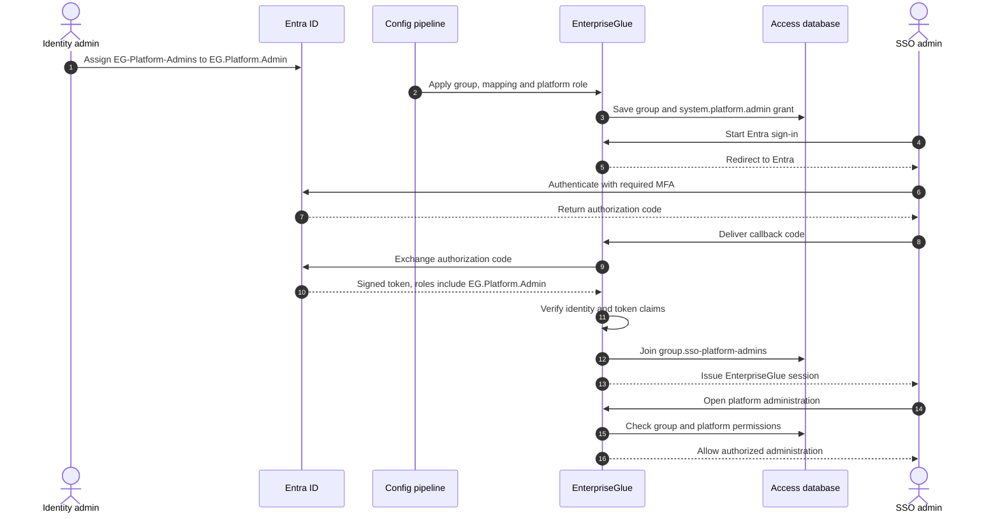
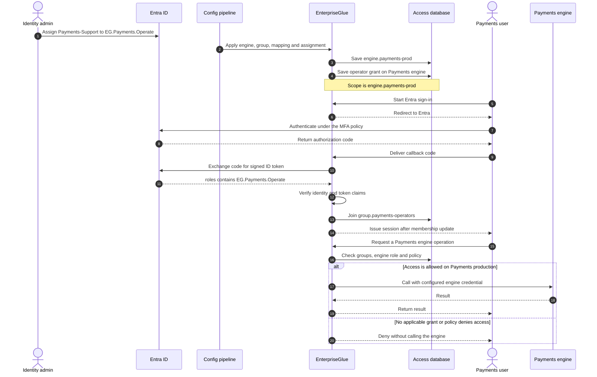
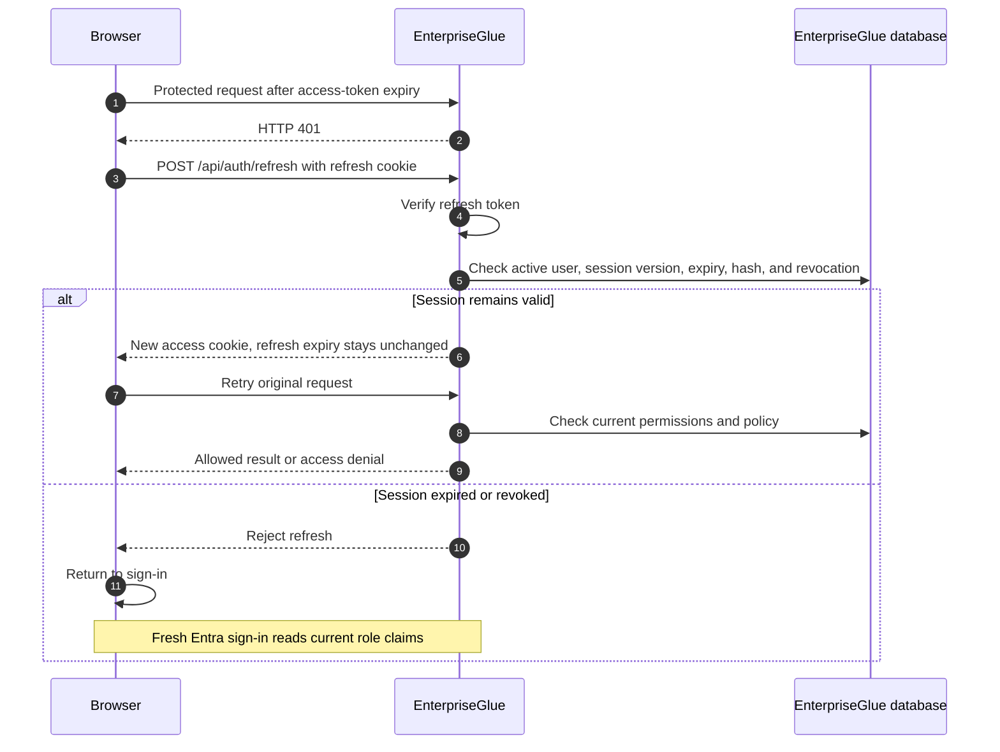

# EnterpriseGlue local setup: SSO, administrators, and engines

Summary: Operator deployment and configuration workflow for a self-hosted single-organization installation using Entra OIDC, scoped authorization, and configuration bundles.

Audience: Platform operators, deployment engineers, identity integrators, and architects.

This guide explains how to run EnterpriseGlue in your own infrastructure, sign in with Microsoft Entra ID and MFA, and give people the right access. It assumes one organization and `EG_TENANCY_MODE=single`.

The example uses a Payments production engine. Replace the example URLs, Entra IDs, workforce groups, and secret references with your own. Check the guide against your installed EnterpriseGlue release before applying it.

## 1. What you will set up

- A local administrator for initial setup and recovery.
- SSO administrator access managed through Entra roles and a headless configuration file.
- A Payments engine connection with separate viewer, operator, and deployer access.
- A configuration API client for later automated updates.
- Optional SCIM provisioning for background account and group changes.

**Entra authenticates the person. EnterpriseGlue decides what that person can do.** Your workforce roles must be connected to EnterpriseGlue roles and the correct platform or engine scope.

## 2. Choose how administrators get access

### 2.1 The available options

| Option | How you set it up | How the person or pipeline signs in |
| --- | --- | --- |
| Local setup/recovery administrator | Set `ADMIN_EMAIL` and `ADMIN_PASSWORD` for initial startup | Local password; use `/admin-recovery` when ordinary local sign-in is disabled |
| SSO platform administrator | Headless configuration maps an Entra app role to a normal EnterpriseGlue group and assigns `system.platform.admin` to that group at platform scope | Entra OIDC with your MFA policy |
| Explicit administrator grant to one person | Set **Platform Role → Platform Admin** in Users, or use the authorized user-management API | The person's existing local or Entra sign-in |
| Configuration automation | Configure an API client with `config:bundle:manage` and configuration-management permissions | API-client token; no browser session |

For normal SSO administration, use the second option. Keep a tested local recovery administrator as well. The configuration API client applies reviewed files; it does not represent a human administrator.

**You do not need to sign in as the first local administrator to configure EnterpriseGlue.** A reviewed startup bundle can configure the Entra connection, SSO administrator role, engines, and access assignments before the first interactive sign-in. Your first ordinary sign-in can therefore use Entra.

The current production runtime still requires `ADMIN_PASSWORD`. Normal first startup also creates the local bootstrap account before applying the bundle. Headless configuration does not disable that step. Provide `ADMIN_EMAIL` explicitly as well so the recovery account has the intended address. These settings can be injected by your deployment or secret manager; a physical `.env` file is optional.

| Deployment approach | What you need |
| --- | --- |
| Configure through the UI | Bootstrap the local account, sign in, and configure the provider and access |
| Configure everything through a startup bundle | Supply the runtime/bootstrap settings and mounted bundle; Entra, SSO admin access, and engines are applied without a local administrator login |
| Update an existing installation through a pipeline | Use the configured API client and reviewed bundle; no human administrator session is needed for the update |
| Use a separately initialized database in `verify` mode | The application skips local account bootstrap and checks the existing database; the configured bundle still runs. This requires an already initialized schema and catalog, and production configuration still requires `ADMIN_PASSWORD`. It is not an empty-database setup shortcut |

For a new self-hosted installation, use **startup-bundle configuration with a retained local recovery account**. This gives you unattended setup and SSO for normal administration, plus a recovery path if Entra is unavailable. The current standalone startup contract has no separate setting to skip only local-administrator bootstrap.

### 2.2 Provide the local bootstrap settings

Provide these backend settings through your protected deployment configuration:

```dotenv
ADMIN_EMAIL=eg-recovery-admin@example.com
ADMIN_PASSWORD=<STRONG_INITIAL_PASSWORD_FROM_YOUR_SECRET_STORE>
```

On an empty installation database with normal database startup mode, startup creates the local account and gives it administrator membership. It then applies the configured startup bundle. You can complete setup without signing in locally and use Entra for your first ordinary sign-in. Test `https://enterpriseglue.example.com/admin-recovery` with the local account before disabling ordinary local login.

For an existing database, these variables do not create arbitrary extra administrators. Startup can reconcile the matching active local bootstrap account. Use SSO role assignments or the Users workflow for additional people.

### 2.3 Give an Entra group administrator access through headless configuration

Use this chain:

```text
Your Entra group: EG-Platform-Admins
  → Entra app-role value: EG.Platform.Admin
  → EnterpriseGlue group: group.sso-platform-admins
  → EnterpriseGlue role: system.platform.admin
  → Scope: platform
```

1. Define the app-role value `EG.Platform.Admin` on the EnterpriseGlue app registration in Entra.
2. Assign your `EG-Platform-Admins` workforce group to that role on the enterprise application.
3. In the configuration file, create `group.sso-platform-admins`.
4. Add an Identity Mapping from the exact `EG.Platform.Admin` role value to that group.
5. Assign the built-in `system.platform.admin` role to the group with `scope.type="platform"`.
6. Apply the file and have a pilot administrator complete a fresh Entra sign-in. Verify the expected permissions in **Effective Access** and test the required administration pages.

The complete file in section 9 includes all three EnterpriseGlue records:

| File | Relevant record |
| --- | --- |
| `./groups.json` | `group.sso-platform-admins` |
| `./identity-mappings.json` | `mapping.sso-platform-admins`, matching `EG.Platform.Admin` |
| `./assignments.json` | `assignment.sso-platform-admins`, granting `system.platform.admin` at platform scope |



**SSO administrator permissions and local recovery are separate.** The reserved **Platform Administrators** system group is used by bootstrap, explicit local grants, and recovery. Identity Mappings and SCIM cannot target that reserved group. The headless SSO option instead uses your normal `group.sso-platform-admins` group with a platform-scoped role assignment. It does not create a local password or recovery membership.

For an SSO administrator, verify **Effective Access** and the allowed administration actions. The Users page's local Platform Role label does not describe every group-derived permission.

Removing `EG.Platform.Admin` in Entra removes the corresponding SSO-owned group membership on the person's next successful sign-in. Local token refresh does not reread Entra roles. For urgent removal, revoke the local granting assignment or use the supported user-deactivation/session-revocation controls. Check for other grants that could keep access active.

### 2.4 Grant administrator access to one existing user

An authorized administrator can open **Admin → Users**, edit the person, set **Platform Role** to **Platform Admin**, and select **Save Changes**. For an Entra user, let the person sign in first so you select their existing account.

The equivalent request is `PUT /api/users/<ENTERPRISEGLUE_USER_ID>` with this body:

<!-- enterpriseglue-config-schema: PlatformUserUpdateRequestSchema -->
```json
{ "role": "admin" }
```

Use an authorized human administrator session and the normal CSRF header for cookie-based requests. This endpoint does not use the configuration API-client token. The user ID comes from EnterpriseGlue, not Entra.

This creates a locally owned administrator grant. Entra role removal does not remove it. To remove that manual grant, send `"role": "user"` and verify that no other administrator source remains; this does not remove a separate bootstrap grant. Removal of the manual administrator membership invalidates the person's existing sessions.

### 2.5 Let a pipeline apply configuration

The example creates `api-client.platform-config` with:

- Purpose scope: `config:bundle:manage`.
- Role: `custom.platform-config-automation`.
- Permissions to preview, apply, export, and read configuration history.

Its token is stored outside the file and referenced by `env://ENTERPRISEGLUE_CONFIG_CLIENT_TOKEN`. Protect this identity: applying configuration can change roles and access. Keep it separate from engine-runtime and deployment identities.

## 3. Set up Entra sign-in and MFA

### 3.1 Register EnterpriseGlue in Entra

1. Create an app registration for **Accounts in this organizational directory only**.
2. Record the Directory (tenant) ID and Application (client) ID.
3. Add this **Web** redirect URI, using your actual EnterpriseGlue address:

   ```text
   https://enterpriseglue.example.com/api/auth/identity/callback
   ```

4. Create a client secret and store it in your secret manager. The example uses `env://ENTRA_OIDC_CLIENT_SECRET` to read it.
5. Use the tenant-specific issuer `https://login.microsoftonline.com/<ENTRA_TENANT_ID>/v2.0` and scopes `openid`, `profile`, and `email`.
6. Make sure the intended users receive an email claim. Use email for contact/display, not role matching.
7. On the enterprise application, enable **Assignment required** and assign your workforce groups to the app roles listed in section 4.
8. Configure `https://enterpriseglue.example.com/login` as the return address when using federated logout.

The user's browser must reach both EnterpriseGlue and Entra. The backend needs outbound HTTPS to Entra's discovery, token, and signing-key endpoints. The OIDC callback arrives through the user's browser, so Entra does not need a direct inbound connection to the private application.

EnterpriseGlue uses authorization code flow with PKCE. It checks the token signature, issuer, audience, nonce, and browser-bound state. **Test connection** checks metadata; a real sign-in is needed to test the secret, redirect URI, claims, and mappings together. See [SSO setup](https://github.com/EnterpriseGlue/enterpriseglue-the-bridge-oss/blob/afa64cc5f78e869f3f989121102d4909927d9d82/docs/how-to/auth-sso.md).

### 3.2 Require MFA

Apply an Entra Conditional Access policy to this enterprise application and the intended users. Require MFA or your approved authentication strength. Test the policy, check Entra sign-in logs, then enforce it. Use Entra sign-in frequency and browser-session controls according to your security policy and available license. See [Microsoft's MFA procedure](https://learn.microsoft.com/en-us/entra/identity/conditional-access/howto-conditional-access-policy-all-users-mfa).

If EnterpriseGlue authorization policies also use `requireMfa`, the verified **ID token** must contain accepted MFA evidence. For v2.0, configure the `amr` optional claim where supported and verify a pilot sign-in returns the intended value. The example accepts `mfa` through `mfaAmrValues`. See [Microsoft's optional claims](https://learn.microsoft.com/en-us/entra/identity-platform/optional-claims-reference).

The reviewed EnterpriseGlue implementation reads `amr` and configured `acr` values; it does not read Entra's separate `acrs` array. Missing accepted evidence causes a `requireMfa` operation to be denied. Requesting an authentication context or assigning a role does not prove MFA. Test the exact protected operation before enabling that policy.

Local session refresh carries the original sign-in assurance forward. It does not trigger new MFA or enforce an MFA-age limit. Session timing is explained in section 6.

## 4. Map your workforce roles to EnterpriseGlue roles

### 4.1 Use an explicit access table

Your business roles or directory groups do not need the same names as EnterpriseGlue roles. Define a small set of **app-role values** in Entra, then map those values to local groups and scoped EnterpriseGlue roles.

| Your workforce group (example) | Entra app-role value | EnterpriseGlue group | EnterpriseGlue role | Applies to |
| --- | --- | --- | --- | --- |
| `EG-Platform-Admins` | `EG.Platform.Admin` | `group.sso-platform-admins` | `system.platform.admin` | Platform administration |
| `Payments-Viewers` | `EG.Payments.View` | `group.payments-viewers` | `system.engine.runtime_viewer` | Payments production only |
| `Payments-Support` | `EG.Payments.Operate` | `group.payments-operators` | `system.engine.operator` | Payments production only |
| `Payments-Release` | `EG.Payments.Deploy` | `group.payments-deployers` | `system.engine.deployer` | Payments production only |

Create the Entra app roles with **Users/Groups** as allowed member types. Assign each workforce group to its app role on the enterprise application. Match the role's exact **value**, not its display label or GUID. Entra emits the assigned values in the verified ID token's `roles` claim. See [Microsoft's app-role setup](https://learn.microsoft.com/en-us/entra/identity-platform/howto-add-app-roles-in-apps).

### 4.2 How the mapping works

The Payments Support example has three distinct names:

- `Payments-Support`: your workforce group in Entra.
- `EG.Payments.Operate`: the app-role value sent to EnterpriseGlue.
- `system.engine.operator`: the EnterpriseGlue permission bundle.

EnterpriseGlue first maps the app-role value to `group.payments-operators`. A separate assignment gives that local group the operator role on `engine.payments-prod`. The mapping chooses **who belongs to the group**; the assignment chooses **what they may do and where**.



### 4.3 Choose the permissions you need

| Built-in engine role | Allows |
| --- | --- |
| `system.engine.runtime_viewer` | Runtime state and variable names/types; no variable values or changes |
| `system.engine.runtime_investigator` | Runtime state and variable values; no changes |
| `system.engine.operator` | Runtime operation and deployment, including start/cancel/modify, retry/delete, and variable-value reading; no variable editing |
| `system.engine.variable_operator` | Variable-value reading and editing |
| `system.engine.deployer` | Deployment and deployment-state access |

Use a custom role if the operator role is broader than the intended operating responsibility. Platform administration does not replace an engine-scoped grant. A project deployment also needs project deploy permission and an approved project-to-engine target.

### 4.4 When role changes take effect

Every successful OIDC sign-in updates mapped memberships before EnterpriseGlue issues a session. With `syncMode="authoritative"`, removal of an Entra role removes that provider's matching membership on the next successful sign-in after Entra has propagated the change. `additive` mappings only add access.

Local token refresh does not fetch new Entra roles. EnterpriseGlue checks its stored permissions on each protected request, so a local assignment or membership revocation affects subsequent requests. Manual and other-source grants can remain; inspect **Effective Access** before declaring access removed.

If you use Entra group claims instead of app roles, map immutable group object IDs with `source.type="group"`. Incomplete or over-limit group claims fail sign-in closed; EnterpriseGlue does not automatically fetch the missing groups from Microsoft Graph.

## 5. Add an engine and give people access without the UI

### 5.1 Prepare the engine and secrets

Deploy the engine service with your infrastructure tooling. EnterpriseGlue's configuration registers a connection to that engine; it does not install the engine software or create its database.

For the example, provide these backend settings:

```dotenv
EG_TENANCY_MODE=single
FRONTEND_URL=https://enterpriseglue.example.com
EG_IDENTITY_PROVIDER_ALLOWED_HOSTS=login.microsoftonline.com
EG_ENGINE_ALLOWED_HOSTS=payments-engine.example.com
EG_ENGINE_ALLOW_PRIVATE_HOSTS=true
EG_CONFIG_SECRET_PROVIDER=env
EG_CONFIG_REQUIRE_SECRET_PREFLIGHT=true
```

Use HTTPS with trusted certificates. Add any additional reviewed Entra discovery hosts to the identity-provider allowlist. A private engine requires the private-host opt-in and an exact engine-host allowlist entry.

Supply these secret values through your deployment tooling, outside the JSON file:

| Secret reference | Used for |
| --- | --- |
| `env://ENTRA_OIDC_CLIENT_SECRET` | Entra authorization-code exchange |
| `env://PAYMENTS_ENGINE_PASSWORD` | Payments engine connection |
| `env://ENTERPRISEGLUE_CONFIG_CLIENT_TOKEN` | Later configuration updates; use a valid `egac_...` API-client token |

You may instead select the supported file or projected-secret resolver. Use references matching that resolver; never put literal credentials in the bundle.

### 5.2 Join the engine and role assignment by key

Save the complete example from section 9 as `enterpriseglue-config.json`. It creates the provider, groups, mappings, engine, assignments, and configuration client together. No prior portal engine registration or database-ID lookup is needed.

The connection record uses this stable key:

<!-- enterpriseglue-config-schema: ConfigEngineSchema -->
```json
{
  "key": "engine.payments-prod",
  "name": "Payments production",
  "type": "operaton",
  "baseUrl": "https://payments-engine.example.com/engine-rest",
  "auth": {
    "type": "basic",
    "username": "enterpriseglue",
    "passwordRef": "env://PAYMENTS_ENGINE_PASSWORD"
  },
  "connectionMode": "direct",
  "runtimeAccessScope": "engine_wide",
  "tenancy": { "mode": "dedicated", "tenantRef": { "type": "default" } },
  "ownershipMode": "config_locked"
}
```

The group receives permissions on that **same key**:

<!-- enterpriseglue-config-schema: ConfigAssignmentSchema -->
```json
{
  "key": "assignment.payments-operators",
  "principal": { "type": "group", "key": "group.payments-operators" },
  "roleKey": "system.engine.operator",
  "scope": { "type": "engine", "engineKey": "engine.payments-prod" },
  "ownershipMode": "config_locked"
}
```

These are the corresponding records already included in the complete file, not separate apply payloads. `scope.engineKey` must exactly match the engine's `key`; its display name and URL do not select the access target. The local group key must also match the Identity Mapping's `targetGroupKey`.

An engine registration creates the connection. The scoped assignment creates the access grant. Both are required. Built-in `system.*` roles already exist; only your custom roles belong in `roles.json`.

### 5.3 Apply the first configuration at startup

Mount the completed file read-only and provide:

```dotenv
EG_CONFIG_BUNDLE_PATH=/etc/enterpriseglue/enterpriseglue-config.json
EG_CONFIG_BOOTSTRAP_MODE=validate
EG_CONFIG_EXPECTED_SHA256=<SHA256_OF_EXACT_MOUNTED_FILE>
EG_CONFIG_EXPECTED_TENANT_SCOPE=platform
EG_CONFIG_REQUIRE_SECRET_PREFLIGHT=true
EG_CONFIG_FAIL_CLOSED=true
```

Compute the exact file's SHA-256 with your release tooling, for example `sha256sum enterpriseglue-config.json` on Linux. Validate the file and secrets in a deployment rehearsal, then change the mode to `apply` for the approved file.

Normal startup initializes the database and local bootstrap account, then applies configuration without an administrator token or login. Repeated startup is idempotent. With fail-closed enabled, a configuration failure prevents readiness. The startup file hash and the API's semantic `canonicalHash` are different; use each in its documented place.

The example keeps ordinary local passwords enabled during the pilot. After testing SSO, MFA, access, and recovery, set `bundle.login.localPassword="disabled"` and apply the reviewed change.

### 5.4 Update the configuration from a pipeline

Give the pipeline these protected environment values:

```dotenv
ENTERPRISEGLUE_API_URL=https://enterpriseglue.example.com
ENTERPRISEGLUE_API_TOKEN=<CONFIGURATION_API_CLIENT_TOKEN>
ENTERPRISEGLUE_CONFIG_EXPECTED_TENANT_SCOPE=platform
ENTERPRISEGLUE_CONFIG_IDEMPOTENCY_KEY=<UNIQUE_REVIEWED_DEPLOYMENT_ID>
```

Run the matching EnterpriseGlue CLI with the supported Node 24 and pnpm versions:

```bash
pnpm authz:config validate ./enterpriseglue-config.json
pnpm authz:config preview ./enterpriseglue-config.json
pnpm authz:config apply ./enterpriseglue-config.json
pnpm authz:config wait <apply-run-id>
pnpm authz:config export platform.local-operations
```

Keep the reviewed file unchanged between approval and apply. The CLI obtains a new preview and uses its hash. For an approval tied explicitly to a saved server preview, or changes requiring acknowledgements, use the REST workflow:

| Step | Endpoint |
| --- | --- |
| Preview and get the hash | `POST /api/authz/config-bundles/preview` |
| Review changes and acknowledgements | `POST /api/authz/config-bundles/diff` |
| Check secrets | `POST /api/authz/config-bundles/validate-secret-refs` |
| Apply the reviewed hash and required acknowledgements | `POST /api/authz/config-bundles/apply` |
| Export this bundle | `GET /api/authz/config-bundles/export?bundleKey=platform.local-operations` |

Use the deployed API contract's preview/preflight correlation fields and target-scope assertion. Retain the previous file and sanitized apply receipt for rollback. See [headless administration](https://github.com/EnterpriseGlue/enterpriseglue-the-bridge-oss/blob/afa64cc5f78e869f3f989121102d4909927d9d82/docs/how-to/configure-platform-headlessly.md).

`config_locked` objects are managed by their file and read-only in ordinary UI/API changes. `config_warn` allows authorized local edits and records drift. An authoritative bundle can remove its own omitted records, so preserve existing records and review removals before apply. `sso_managed` blocks ordinary manual membership/assignment changes but does not erase old grants.

### 5.5 Add a second engine

Extend the **same** complete file rather than replacing it with only the new records:

| Record to add | Orders example |
| --- | --- |
| Entra workforce group and app-role assignment | `Orders-Support` → `EG.Orders.Operate` |
| Engine record | `engine.orders-prod`, Orders REST URL and connection secret |
| Local group | `group.orders-operators` |
| Identity Mapping | Exact role `EG.Orders.Operate` → `group.orders-operators` |
| Scoped assignment | `group.orders-operators` + `system.engine.operator` + engine `engine.orders-prod` |

Copy the corresponding Payments records, change all linked keys, and supply the Orders secret and reviewed engine-host allowlist entry. Keep the Payments records. Preview, check secrets, and apply the whole updated file. Verify the diff creates Orders without retiring Payments.

A person with only the Orders role must not gain Payments access. A person assigned both roles can receive both independent grants. Test both cases after fresh sign-in.

### 5.6 Optional engine groups and other registration methods

For several dedicated engines, an **Engine Set** can collect explicit engine keys. Assign the group role at `scope.type="engine_set"` with its `engineSetKey`, instead of also keeping an unintended duplicate direct grant. Label selectors are supported, but a new matching engine can expand access; review them carefully.

Shared engines need resource-aware access and explicit runtime tenant mappings. A broad engine or Engine Set grant alone does not authorize shared resources. See [engine tenancy](https://github.com/EnterpriseGlue/enterpriseglue-the-bridge-oss/blob/afa64cc5f78e869f3f989121102d4909927d9d82/docs/reference/engine-tenancy-and-provisioning-api.md).

An inventory/CMDB integration can instead register connections with `POST /engines-api/external/engines`, a separate client with `engine:register`, and its registration role. Send explicit `tenancy` on each upsert. Choose one owner per engine; do not overwrite a bundle-locked engine through the other integration. See [external registration](https://github.com/EnterpriseGlue/enterpriseglue-the-bridge-oss/blob/afa64cc5f78e869f3f989121102d4909927d9d82/docs/how-to/provision-engines-externally.md).

For engine calls, EnterpriseGlue checks the user's permissions and uses the configured engine credential. It does not forward the browser's Entra token or automatically recreate every workforce role inside the engine. Restrict the engine endpoint to approved callers.

## 6. Understand sessions and refresh

### 6.1 The timing settings

| Item | Default or behavior |
| --- | --- |
| OIDC sign-in transaction | 10-minute state/correlation window |
| EnterpriseGlue access token | 15 minutes; `JWT_ACCESS_TOKEN_EXPIRES=900` |
| EnterpriseGlue refresh session | Fixed 7 days; `JWT_REFRESH_TOKEN_EXPIRES=604800` |
| Local refresh | Issues a new access token without extending or rotating the refresh session |
| Browser refresh trigger | Standard API client receives HTTP 401, attempts refresh, then retries |
| Entra sign-in and MFA lifetime | Controlled separately in Entra; evaluated when returning to Entra |

The token settings are positive integer seconds. Tokens use HttpOnly cookies, with Secure cookies in production. Use HTTPS and a correctly configured trusted reverse proxy.

For an example fixed eight-hour local refresh window, set:

```dotenv
JWT_ACCESS_TOKEN_EXPIRES=900
JWT_REFRESH_TOKEN_EXPIRES=28800
```

This affects newly issued sessions. It does not rewrite existing tokens or stored expiries; revoke existing sessions when an immediate policy change is required.

Local refresh does not contact Entra, obtain fresh role claims, or trigger new MFA. It uses the EnterpriseGlue refresh token, not an Entra refresh token. Requesting `offline_access` does not change this behavior. There is no sliding idle timeout or MFA-age enforcement in the reviewed refresh path.

### 6.2 What happens when an access token expires



Entra sign-in frequency does not directly expire an EnterpriseGlue session. Align the local refresh window with your reauthentication requirements. A new Entra interaction can reuse an existing acceptable Entra authentication; it does not always produce a new MFA prompt. See [Microsoft's session controls](https://learn.microsoft.com/en-us/entra/identity/conditional-access/concept-session-lifetime).

### 6.3 Logout and urgent removal

Logout revokes EnterpriseGlue sessions first and may then continue to Entra logout. An unavailable identity provider does not restore the local session.

Do not assume that removing an Entra assignment or revoking an Entra session has already ended every EnterpriseGlue session. For urgent offboarding, use EnterpriseGlue's supported deactivation/session-revocation controls or verify that authoritative SCIM deactivation has arrived. For access-only removal, check every granting source in Effective Access. Existing completed engine actions are not undone.

## 7. Optional: keep users up to date with SCIM

### 7.1 When SCIM helps

SCIM brings account creation, disablement, and directory-group changes to EnterpriseGlue while users are not signing in. OIDC and MFA still handle authentication. SCIM does not provision local login passwords or replace scoped role assignments.

Entra needs connectivity to the SCIM endpoint. For a private installation, use and validate Microsoft's on-premises provisioning-agent option rather than assuming Entra can reach a private URL. See [on-premises SCIM setup](https://learn.microsoft.com/en-us/entra/identity/app-provisioning/on-premises-scim-provisioning).

### 7.2 Configure a provisioning directory

Add `./identity-provisioning-directories.json` to the bundle imports and add this file to `files`:

<!-- enterpriseglue-config-schema: ConfigIdentityProvisioningDirectoriesFileSchema -->
```json
{
  "identityProvisioningDirectories": [
    {
      "key": "entra-workforce",
      "displayName": "Entra workforce",
      "identityProviderKey": "identity.entra",
      "enabled": false,
      "authoritative": true,
      "credentialSecretRef": "env://ENTERPRISEGLUE_SCIM_ENTRA_TOKEN",
      "ownershipMode": "config_locked"
    }
  ]
}
```

Generate the initial credential with the matching CLI:

```bash
pnpm admin:provisioning-credential generate ./entra-workforce.scim.secret
```

It writes an `egscim_...` token once to a new mode `0600` file. Move the value into your protected secret stores for EnterpriseGlue and the Entra connector, then remove the staging file securely. Do not commit it or capture it as a build artifact.

In Entra automatic provisioning, use:

- Tenant URL: `https://enterpriseglue.example.com/scim/v2/entra-workforce`.
- Secret token: the directory's generated SCIM credential.
- Stable immutable user `externalId`, a reviewed `userName` matching policy, `active`, and primary email.
- Stable group `externalId` and `displayName`; member references use returned EnterpriseGlue SCIM User IDs.

Apply `enabled=true` once the client and credential are ready. Test one user create/update, disable/reactivate, and group-membership change before expanding the rollout. Delivery timing depends on Entra's schedule and connector health.

### 7.3 Decide what owns group access

For **account lifecycle only**, retain the app-role mappings in section 9. SCIM can deactivate accounts in the background, but app-role changes still need fresh OIDC sign-in.

For **background group-based access**, associate the SCIM directory with `identity.entra` and map the group's immutable `externalId` using an exact `source.type="group"` mapping. Keep the group's EnterpriseGlue role and scope assignment. App-role values are not SCIM group IDs.

OIDC and SCIM membership sources are separate. If both grant the same group, removal from one can leave access from the other. Choose the intended owner for each group and test removal. Unmapped SCIM groups grant nothing; SCIM must not target the reserved recovery-administrator group. Privileged administrator access should remain explicitly reviewed.

SCIM deactivation invalidates local sessions after the update is processed. Existing-account collisions fail closed; do not repair them by editing the database or matching email alone. Provisioning credentials are revealed once. For headless rotation, use a separate client with `identity:provisioning:manage` and `system.api.identity_provisioning_admin`. See [SCIM configuration](https://github.com/EnterpriseGlue/enterpriseglue-the-bridge-oss/blob/afa64cc5f78e869f3f989121102d4909927d9d82/docs/how-to/configure-scim-provisioning.md) and [headless credential management](https://github.com/EnterpriseGlue/enterpriseglue-the-bridge-oss/blob/afa64cc5f78e869f3f989121102d4909927d9d82/docs/development/headless-identity-provisioning.md).

## 8. Test before enforcing SSO

| Test | Expected result |
| --- | --- |
| Local recovery account | Can use the tested recovery route independently of Entra |
| SSO administrator | Gains platform permissions through the configured group and platform role assignment |
| MFA | Entra applies the intended policy; any EnterpriseGlue MFA-protected action accepts only verified evidence |
| Viewer / operator / deployer | Each can perform only the intended Payments actions |
| Another engine's direct URL | Denied when the person has no grant on that engine |
| Entra role removal | Matching SSO grant disappears after fresh sign-in; other sources are checked |
| Access token expires | Local refresh succeeds only while the fixed refresh session remains valid |
| Local deactivation / SCIM deactivation | Existing local requests and refresh are rejected after the change is processed |
| Configuration restart and export | Apply is idempotent; export and preview show the intended state without secrets |
| Missing secret or invalid configuration | Apply fails safely; configured fail-closed startup does not become ready |

After these tests, disable ordinary local passwords if that is your policy. Keep the local recovery account, previous configuration, and sanitized apply receipts.

## 9. Complete headless configuration example

Save the JSON below as `enterpriseglue-config.json` and apply it using section 5. Replace placeholders and secrets first. This file includes **both** SSO platform administration and engine-specific access.

The schema name `enterpriseglue.ai/v1beta1` is the configuration format identifier. All application URLs in the example refer to your own deployment.

<!-- enterpriseglue-config-schema: ConfigBundleRequestSchema -->
```json
{
  "bundle": {
    "apiVersion": "enterpriseglue.ai/v1beta1",
    "kind": "EnterpriseGlueConfigBundle",
    "metadata": {
      "key": "platform.local-operations",
      "owner": "platform-engineering"
    },
    "tenantKey": "default",
    "mode": "authoritative",
    "governance": {
      "engineMembershipAuthority": "sso_managed",
      "projectMembershipAuthority": "manual",
      "engineRegistrationPolicy": "external_only",
      "projectEngineTargetPolicy": "manual_allowed",
      "runtimeAuthorizationAuthority": "enterpriseglue_authoritative",
      "governanceSettingsOwnership": "config_locked"
    },
    "login": {
      "localPassword": "enabled",
      "providerSelection": "chooser"
    },
    "imports": [
      "./roles.json",
      "./groups.json",
      "./identity-providers.json",
      "./identity-mappings.json",
      "./engines.json",
      "./machine-principals.json",
      "./assignments.json"
    ]
  },
  "files": {
    "./roles.json": {
      "roles": [
        {
          "key": "custom.platform-config-automation",
          "name": "Platform configuration automation",
          "scope": "platform",
          "permissions": [
            "platform:config-bundles:view",
            "platform:config-bundles:preview",
            "platform:config-bundles:apply",
            "platform:config-bundles:export"
          ],
          "ownershipMode": "config_locked"
        }
      ]
    },
    "./groups.json": {
      "groups": [
        {
          "key": "group.sso-platform-admins",
          "name": "SSO platform administrators",
          "ownershipMode": "config_locked"
        },
        {
          "key": "group.payments-viewers",
          "name": "Payments viewers",
          "ownershipMode": "config_locked"
        },
        {
          "key": "group.payments-operators",
          "name": "Payments operators",
          "ownershipMode": "config_locked"
        },
        {
          "key": "group.payments-deployers",
          "name": "Payments deployers",
          "ownershipMode": "config_locked"
        }
      ]
    },
    "./identity-providers.json": {
      "identityProviders": [
        {
          "key": "identity.entra",
          "displayName": "Microsoft Entra ID",
          "type": "oidc",
          "enabled": true,
          "authenticationMode": "direct",
          "directoryTenantId": "<ENTRA_TENANT_ID>",
          "allowVerifiedEmailLinking": false,
          "sync": {
            "triggers": [
              "login"
            ],
            "requiredForLogin": true,
            "incompleteEntitlements": "fail_closed",
            "connectorCapability": "claim_only",
            "scheduled": false
          },
          "oidc": {
            "issuerUrl": "https://login.microsoftonline.com/<ENTRA_TENANT_ID>/v2.0",
            "clientId": "<ENTRA_CLIENT_ID>",
            "clientSecretRef": "env://ENTRA_OIDC_CLIENT_SECRET",
            "callbackUrl": "https://enterpriseglue.example.com/api/auth/identity/callback",
            "scopes": [
              "openid",
              "profile",
              "email"
            ],
            "expectedAudience": "<ENTRA_CLIENT_ID>",
            "mfaAmrValues": [
              "mfa"
            ],
            "postLogoutRedirectUrl": "https://enterpriseglue.example.com/login"
          },
          "ownershipMode": "config_locked"
        }
      ]
    },
    "./identity-mappings.json": {
      "identityMappings": [
        {
          "key": "mapping.sso-platform-admins",
          "providerKey": "identity.entra",
          "source": {
            "type": "role",
            "externalId": "EG.Platform.Admin",
            "operator": "exact"
          },
          "targetGroupKey": "group.sso-platform-admins",
          "syncMode": "authoritative",
          "ownershipMode": "config_locked"
        },
        {
          "key": "mapping.payments-viewers",
          "providerKey": "identity.entra",
          "source": {
            "type": "role",
            "externalId": "EG.Payments.View",
            "operator": "exact"
          },
          "targetGroupKey": "group.payments-viewers",
          "syncMode": "authoritative",
          "ownershipMode": "config_locked"
        },
        {
          "key": "mapping.payments-operators",
          "providerKey": "identity.entra",
          "source": {
            "type": "role",
            "externalId": "EG.Payments.Operate",
            "operator": "exact"
          },
          "targetGroupKey": "group.payments-operators",
          "syncMode": "authoritative",
          "ownershipMode": "config_locked"
        },
        {
          "key": "mapping.payments-deployers",
          "providerKey": "identity.entra",
          "source": {
            "type": "role",
            "externalId": "EG.Payments.Deploy",
            "operator": "exact"
          },
          "targetGroupKey": "group.payments-deployers",
          "syncMode": "authoritative",
          "ownershipMode": "config_locked"
        }
      ]
    },
    "./engines.json": {
      "engines": [
        {
          "key": "engine.payments-prod",
          "name": "Payments production",
          "type": "operaton",
          "baseUrl": "https://payments-engine.example.com/engine-rest",
          "auth": {
            "type": "basic",
            "username": "enterpriseglue",
            "passwordRef": "env://PAYMENTS_ENGINE_PASSWORD"
          },
          "connectionMode": "direct",
          "runtimeAccessScope": "engine_wide",
          "tenancy": {
            "mode": "dedicated",
            "tenantRef": {
              "type": "default"
            }
          },
          "deploymentIntegration": "enterpriseglue_proxy",
          "metadataDiscoveryEnabled": true,
          "deploymentDiscoveryEnabled": true,
          "reconciliationIntervalSeconds": 300,
          "pipelineReceiptEnabled": true,
          "ownershipMode": "config_locked"
        }
      ]
    },
    "./machine-principals.json": {
      "machinePrincipals": [
        {
          "kind": "api_client",
          "key": "api-client.platform-config",
          "name": "Local configuration pipeline",
          "tokenRef": "env://ENTERPRISEGLUE_CONFIG_CLIENT_TOKEN",
          "scopes": [
            "config:bundle:manage"
          ],
          "active": true,
          "ownershipMode": "config_locked"
        }
      ]
    },
    "./assignments.json": {
      "assignments": [
        {
          "key": "assignment.sso-platform-admins",
          "principal": {
            "type": "group",
            "key": "group.sso-platform-admins"
          },
          "roleKey": "system.platform.admin",
          "scope": {
            "type": "platform"
          },
          "ownershipMode": "config_locked"
        },
        {
          "key": "assignment.payments-viewers",
          "principal": {
            "type": "group",
            "key": "group.payments-viewers"
          },
          "roleKey": "system.engine.runtime_viewer",
          "scope": {
            "type": "engine",
            "engineKey": "engine.payments-prod"
          },
          "ownershipMode": "config_locked"
        },
        {
          "key": "assignment.payments-operators",
          "principal": {
            "type": "group",
            "key": "group.payments-operators"
          },
          "roleKey": "system.engine.operator",
          "scope": {
            "type": "engine",
            "engineKey": "engine.payments-prod"
          },
          "ownershipMode": "config_locked"
        },
        {
          "key": "assignment.payments-deployers",
          "principal": {
            "type": "group",
            "key": "group.payments-deployers"
          },
          "roleKey": "system.engine.deployer",
          "scope": {
            "type": "engine",
            "engineKey": "engine.payments-prod"
          },
          "ownershipMode": "config_locked"
        },
        {
          "key": "assignment.platform-config",
          "principal": {
            "type": "api_client",
            "key": "api-client.platform-config"
          },
          "roleKey": "custom.platform-config-automation",
          "scope": {
            "type": "platform"
          },
          "ownershipMode": "config_locked"
        }
      ]
    }
  }
}
```

## 10. Reference documents


EnterpriseGlue behavior in this guide was checked against OSS commit `afa64cc5f78e869f3f989121102d4909927d9d82`. These fixed links identify the reference baseline; use the corresponding documentation for your installed release when its contracts differ.

- [Authentication and SSO](https://github.com/EnterpriseGlue/enterpriseglue-the-bridge-oss/blob/afa64cc5f78e869f3f989121102d4909927d9d82/docs/how-to/auth-sso.md)
- [Authorization, identity, and engines](https://github.com/EnterpriseGlue/enterpriseglue-the-bridge-oss/blob/afa64cc5f78e869f3f989121102d4909927d9d82/docs/how-to/configure-authorization-and-engines.md)
- [Authorization and access-control architecture](https://github.com/EnterpriseGlue/enterpriseglue-the-bridge-oss/blob/afa64cc5f78e869f3f989121102d4909927d9d82/docs/architecture/09-oss-authorization-access-control-model.md)
- [Headless platform administration](https://github.com/EnterpriseGlue/enterpriseglue-the-bridge-oss/blob/afa64cc5f78e869f3f989121102d4909927d9d82/docs/how-to/configure-platform-headlessly.md)
- [Deploy authorization configuration](https://github.com/EnterpriseGlue/enterpriseglue-the-bridge-oss/blob/afa64cc5f78e869f3f989121102d4909927d9d82/docs/how-to/deploy-authorization-config.md)
- [Provision engines externally](https://github.com/EnterpriseGlue/enterpriseglue-the-bridge-oss/blob/afa64cc5f78e869f3f989121102d4909927d9d82/docs/how-to/provision-engines-externally.md)
- [SCIM and user-lifecycle API](https://github.com/EnterpriseGlue/enterpriseglue-the-bridge-oss/blob/afa64cc5f78e869f3f989121102d4909927d9d82/docs/reference/scim-and-user-lifecycle-api.md)
- [Platform role definitions](https://github.com/EnterpriseGlue/enterpriseglue-the-bridge-oss/blob/afa64cc5f78e869f3f989121102d4909927d9d82/packages/shared/src/services/platform-admin/permissions.ts)
- [Administrator bootstrap](https://github.com/EnterpriseGlue/enterpriseglue-the-bridge-oss/blob/afa64cc5f78e869f3f989121102d4909927d9d82/packages/shared/src/db/bootstrap.ts)
- [Startup order and headless configuration](https://github.com/EnterpriseGlue/enterpriseglue-the-bridge-oss/blob/afa64cc5f78e869f3f989121102d4909927d9d82/packages/backend-host/src/databaseStartupBootstrap.ts)
- [User-management administrator-grant contract](https://github.com/EnterpriseGlue/enterpriseglue-the-bridge-oss/blob/afa64cc5f78e869f3f989121102d4909927d9d82/packages/backend-host/src/modules/users/routes/users.ts)
- [Authentication and authoritative provisioning](https://github.com/EnterpriseGlue/enterpriseglue-the-bridge-oss/blob/afa64cc5f78e869f3f989121102d4909927d9d82/docs/concepts/authentication-and-authoritative-provisioning.md)
- [Session lifetime defaults](https://github.com/EnterpriseGlue/enterpriseglue-the-bridge-oss/blob/afa64cc5f78e869f3f989121102d4909927d9d82/packages/shared/src/config/index.ts)
- [Local token refresh behavior](https://github.com/EnterpriseGlue/enterpriseglue-the-bridge-oss/blob/afa64cc5f78e869f3f989121102d4909927d9d82/packages/backend-host/src/modules/auth/routes/refresh.ts)
- [Microsoft Entra app roles](https://learn.microsoft.com/en-us/entra/identity-platform/howto-add-app-roles-in-apps)
- [Microsoft Entra optional claims](https://learn.microsoft.com/en-us/entra/identity-platform/optional-claims-reference)
- [Microsoft Entra Conditional Access session controls](https://learn.microsoft.com/en-us/entra/identity/conditional-access/concept-session-lifetime)
- [Microsoft Entra on-premises SCIM provisioning](https://learn.microsoft.com/en-us/entra/identity/app-provisioning/on-premises-scim-provisioning)
