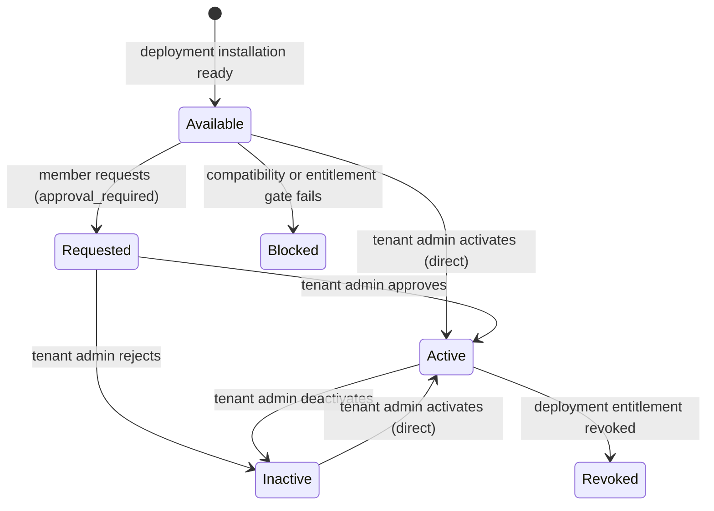

# Tenant Application Marketplace

Summary: Technical contracts for exposing deployment-installed plugins to one tenant at a time.

Audience: Plugin authors, host developers, operators, and security reviewers.

## Ownership boundary

The plugin manager and platform operator own acquisition, signature verification, installation,
upgrade, rollback, emergency disablement, and deployment-wide audit. A tenant never supplies an
OCI reference, registry credential, deployment target, entitlement document, or infrastructure
location.

The tenant marketplace owns only the current tenant's request and activation state. Every route
derives `tenantId` from authenticated tenant context. Request bodies contain no tenant selector,
and the persistence key is `(plugin_id, tenant_ref)`. A platform installation can therefore be
activated for tenant A while remaining inactive for tenant B.

## Permissions

| Action | Permission | Default tenant roles | Purpose |
| --- | --- | --- | --- |
| `tenant.apps.read` | `tenant:apps:view` | administrator, operator, viewer | Read the current tenant's safe catalogue, configuration link, and audit. |
| `tenant.apps.request` | `tenant:apps:request` | administrator, operator, viewer | Request activation when approval policy is enabled. |
| `tenant.apps.manage` | `tenant:apps:manage` | administrator | Activate, deactivate, approve, or reject for the current tenant. |
| `tenant.apps.use` | `tenant:apps:use` | administrator, operator, viewer | Use active plugin contributions. Runtime admission remains the enforcement point. |

Platform installation routes continue to require `platform.settings.read` or
`platform.settings.manage`. Installing a plugin does not make the platform operator a tenant
administrator.

## Safe catalogue

`GET /api/t/{tenantSlug}/apps` returns installed plugins whose signed manifest declares
`scope.enablement: tenant`. Each item contains only product identity, version, publisher, safe
health/compatibility/entitlement state, tenant activation state, optimistic revision, request
timestamps, and the plugin-owned configuration projection.

The projection deliberately excludes prices, commercial entitlements, registry and workload
credentials, image references, bundle paths, deployment topology, raw manifests, sibling-tenant
state, and raw entitlement documents.

A tenant settings contribution may declare `configurationSchema` as a bundle-relative path and
SHA-256 digest. The browser receives only that digest and the signed plugin-owned tenant route;
the host never treats marketplace metadata as configuration authority.

## Lifecycle

The safe statuses are `requested`, `entitled`, `install-pending`, `available`, `active`,
`inactive`, `blocked`, and `revoked`.

With the default `direct` policy, a tenant administrator activates or deactivates an available
application. With `approval_required`, a tenant member first creates a revision-protected request
and a tenant administrator approves or rejects it. Approval activates the application in the
same transaction. Every mutation requires a bounded idempotency key and `expectedRevision`.

Activation immediately controls frontend bootstrap, navigation, backend gateway calls, events,
and schedules through the existing tenant enablement gate. The marketplace does not load or
execute plugin code itself.

## Configuration

Set `ENTERPRISEGLUE_TENANT_APP_ACTIVATION_POLICY` to:

- `direct` (default): tenant administrators activate and deactivate directly;
- `approval_required`: members request, then tenant administrators approve or reject.

Unknown values fail startup. The default preserves existing single-tenant and self-hosted plugin
behavior. The canonical enablement endpoint is
`/api/t/{tenantSlug}/plugin-platform/v1/plugins/{pluginId}/enablement`; the existing
`/t/{tenantSlug}/api/plugin-platform/v1/plugins/{pluginId}/enablement` endpoint remains an alias.

## Upgrade and rollback

Run database migration `1700000000128-add-tenant-application-marketplace` before enabling the
routes. It adds request metadata and an idempotent operation receipt table without changing
deployment enablement defaults. Before rollback, deactivate tenant applications and allow in-flight
operations to settle. The migration down path removes only marketplace metadata; deployment plugin
records remain intact.
